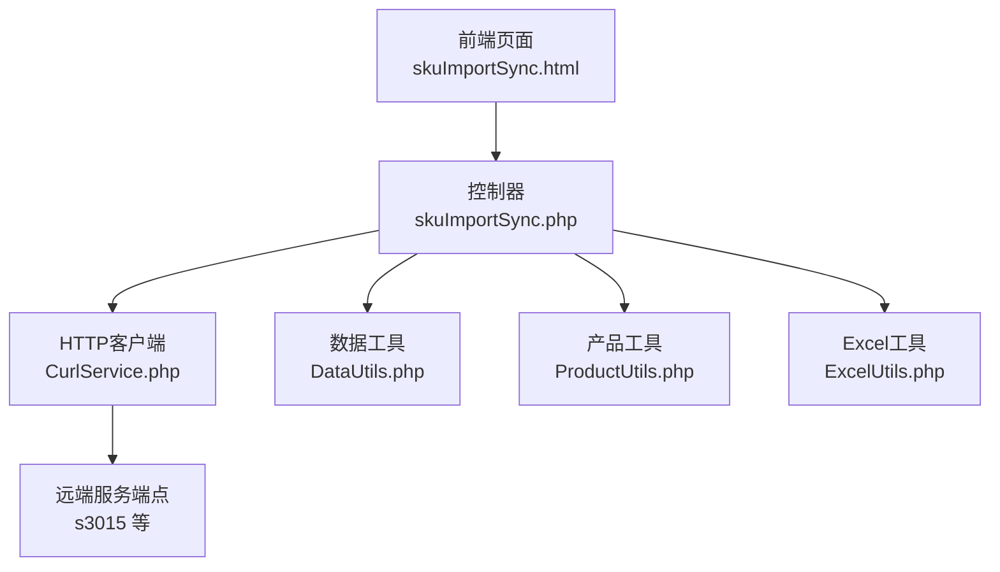
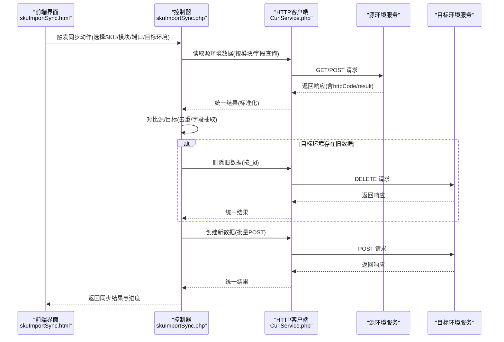
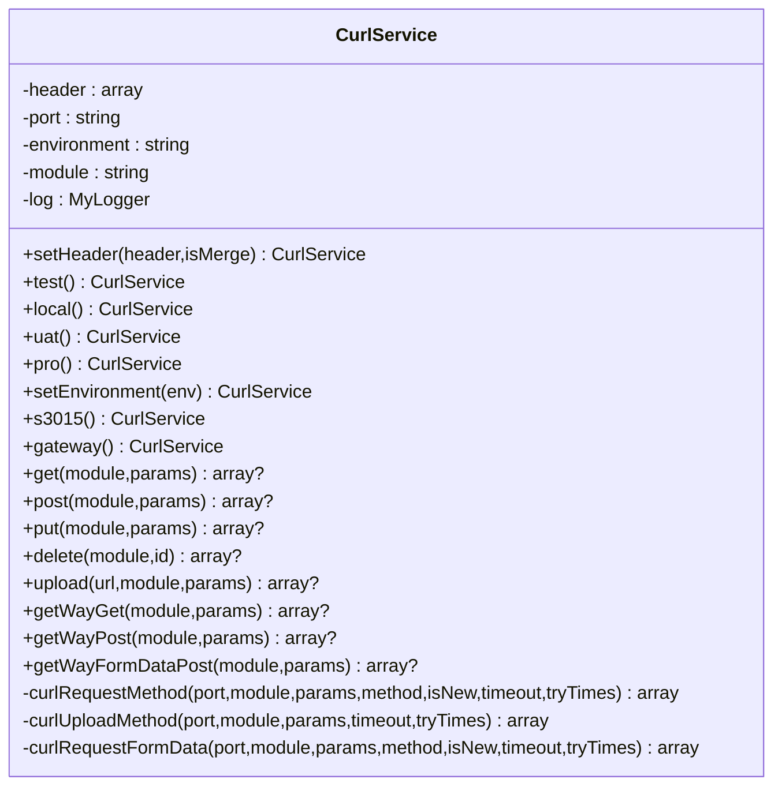
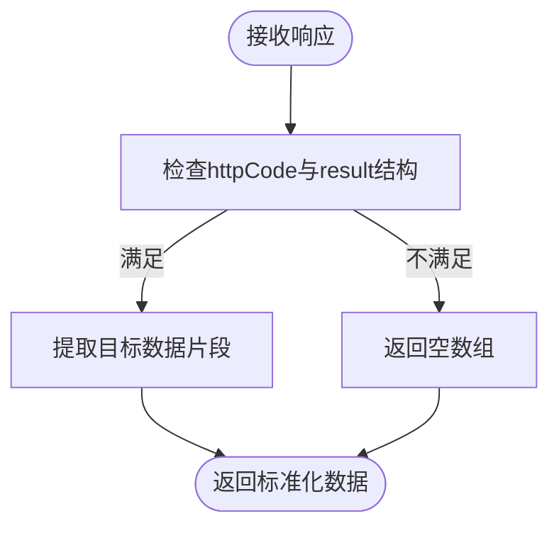
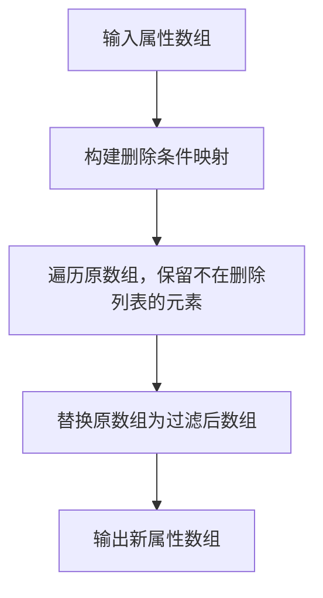
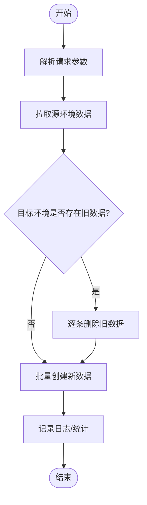
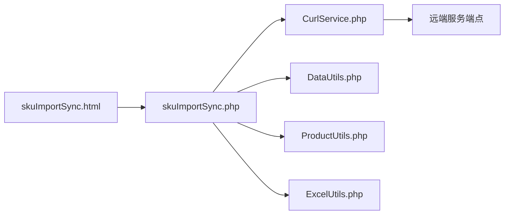

# 数据同步算法

<cite>
**本文引用的文件**
- [CurlService.php](file://php/curl/CurlService.php)
- [DataUtils.php](file://php/utils/DataUtils.php)
- [ProductUtils.php](file://php/utils/ProductUtils.php)
- [ExcelUtils.php](file://php/utils/ExcelUtils.php)
- [skuImportSync.php](file://php/controller/skuImportSync.php)
- [skuImportSync.html](file://template/fix/skuImportSync.html)
</cite>

## 目录
1. [简介](#简介)
2. [项目结构](#项目结构)
3. [核心组件](#核心组件)
4. [架构总览](#架构总览)
5. [详细组件分析](#详细组件分析)
6. [依赖关系分析](#依赖关系分析)
7. [性能考量](#性能考量)
8. [故障排查指南](#故障排查指南)
9. [结论](#结论)
10. [附录](#附录)

## 简介
本文面向PaSystem跨环境数据同步场景，系统化阐述数据同步算法与实现，重点覆盖：
- 跨环境数据对比策略与增量同步机制
- 冲突检测与解决思路
- SyncProductSku与Sync类的职责边界与调用关系（基于现有代码可见的控制器与工具类）
- CurlService在HTTP请求中的作用与优化策略
- 同步性能监控与错误重试机制
- 数据一致性与事务处理策略
- 算法扩展性与自定义配置
- 实际同步场景与故障排查

## 项目结构
围绕数据同步的关键代码主要分布在以下模块：
- HTTP请求层：CurlService（统一HTTP客户端、环境切换、重试与日志）
- 数据处理层：DataUtils（响应数据标准化）、ProductUtils（产品属性批量更新/删除）、ExcelUtils（导入导出）
- 控制器层：skuImportSync.php（前端触发的同步控制器，负责拉取源数据、对比、删除旧数据、创建新数据）
- 前端界面：skuImportSync.html（可视化同步任务编排与进度展示）

图表来源
- [skuImportSync.html](file://template/fix/skuImportSync.html#L273-L548)
- [skuImportSync.php](file://php/controller/skuImportSync.php#L351-L374)
- [CurlService.php](file://php/curl/CurlService.php#L441-L651)
- [DataUtils.php](file://php/utils/DataUtils.php#L18-L29)
- [ProductUtils.php](file://php/utils/ProductUtils.php#L23-L63)
- [ExcelUtils.php](file://php/utils/ExcelUtils.php#L46-L138)

章节来源
- [skuImportSync.html](file://template/fix/skuImportSync.html#L273-L548)
- [skuImportSync.php](file://php/controller/skuImportSync.php#L351-L374)
- [CurlService.php](file://php/curl/CurlService.php#L441-L651)

## 核心组件
- CurlService：封装HTTP请求、环境配置、请求头、重试与日志，支持多种服务端点（s3015、gateway等），提供GET/POST/PUT/DELETE及表单上传等方法。
- DataUtils：对不同后端返回格式进行统一解析，提供分页、查询、新架构返回体等解析方法，并提供数组去重、字段抽取等通用能力。
- ProductUtils：针对产品-属性结构进行批量编辑/删除，支持按label/channel定位并更新或移除。
- ExcelUtils：提供Excel/XLS导出与CSV/XLSX读取能力，保障数据导入导出一致性。
- skuImportSync.php：前端触发的同步控制器，负责从源环境拉取数据、对比、删除目标环境旧数据、创建新数据。

章节来源
- [CurlService.php](file://php/curl/CurlService.php#L40-L143)
- [DataUtils.php](file://php/utils/DataUtils.php#L18-L29)
- [ProductUtils.php](file://php/utils/ProductUtils.php#L23-L63)
- [ExcelUtils.php](file://php/utils/ExcelUtils.php#L46-L138)
- [skuImportSync.php](file://php/controller/skuImportSync.php#L351-L374)

## 架构总览
跨环境同步的典型流程如下：

图表来源
- [skuImportSync.html](file://template/fix/skuImportSync.html#L510-L548)
- [skuImportSync.php](file://php/controller/skuImportSync.php#L351-L374)
- [CurlService.php](file://php/curl/CurlService.php#L294-L433)

## 详细组件分析

### CurlService：HTTP请求与环境适配
- 环境配置：支持local/test/uat/pro四套基地址，按端口映射到具体服务（如s3015、gateway等）。
- 请求方法：提供get/post/put/delete/upload及新架构的getWay/post方式；支持表单上传与multipart/form-data。
- 请求头：默认注入trace-id、Content-Type、User-Agent、Referer等；支持Authorization注入（gateway鉴权）。
- 重试与超时：curlRequestMethod支持超时与重试次数配置，默认最多重试n次，间隔固定等待。
- 日志：统一记录请求URL、参数与响应，便于问题定位。

图表来源
- [CurlService.php](file://php/curl/CurlService.php#L4-L933)

章节来源
- [CurlService.php](file://php/curl/CurlService.php#L441-L651)
- [CurlService.php](file://php/curl/CurlService.php#L664-L740)
- [CurlService.php](file://php/curl/CurlService.php#L751-L802)
- [CurlService.php](file://php/curl/CurlService.php#L824-L927)

### DataUtils：响应数据标准化
- 统一解析：getResultData/getPageList/getQueryList/getNewResultData等，屏蔽不同后端返回差异。
- 分页与查询：支持分页docs/data/data[data]等多形态解析。
- 辅助工具：数组去重、字段抽取、首条数据提取、条件查找等，支撑对比与清洗。

图表来源
- [DataUtils.php](file://php/utils/DataUtils.php#L18-L29)
- [DataUtils.php](file://php/utils/DataUtils.php#L36-L47)
- [DataUtils.php](file://php/utils/DataUtils.php#L54-L65)

章节来源
- [DataUtils.php](file://php/utils/DataUtils.php#L18-L29)
- [DataUtils.php](file://php/utils/DataUtils.php#L36-L47)
- [DataUtils.php](file://php/utils/DataUtils.php#L260-L271)
- [DataUtils.php](file://php/utils/DataUtils.php#L283-L296)

### ProductUtils：产品属性批量更新/删除
- 批量编辑：按label/channel定位属性并更新value，不存在则新增。
- 批量删除：构建条件映射，一次性过滤保留，降低数组操作成本。
- 适配多场景：与DataUtils配合进行字段抽取与合并。

图表来源
- [ProductUtils.php](file://php/utils/ProductUtils.php#L71-L96)
- [ProductUtils.php](file://php/utils/ProductUtils.php#L100-L125)

章节来源
- [ProductUtils.php](file://php/utils/ProductUtils.php#L23-L63)
- [ProductUtils.php](file://php/utils/ProductUtils.php#L71-L96)
- [ProductUtils.php](file://php/utils/ProductUtils.php#L100-L125)

### ExcelUtils：导入导出与长数字处理
- 导出：支持xlsx/xls下载，动态写入表头与数据。
- 读取：支持xlsx/xls/csv读取，处理富文本与长数字不转科学计数。
- 适配同步：为导入模板与结果导出提供基础能力。

章节来源
- [ExcelUtils.php](file://php/utils/ExcelUtils.php#L46-L138)
- [ExcelUtils.php](file://php/utils/ExcelUtils.php#L190-L208)
- [ExcelUtils.php](file://php/utils/ExcelUtils.php#L246-L311)
- [ExcelUtils.php](file://php/utils/ExcelUtils.php#L315-L394)

### 控制器：skuImportSync.php（同步主流程）
- 触发入口：前端传入action=sync、skuId、module、port、field、targetEnv等参数。
- 拉取源数据：按module/port/field查询源环境数据。
- 对比与清理：若目标环境存在旧数据，先删除；再批量创建新数据。
- 错误处理：删除失败记录日志并继续，不影响整体流程。

图表来源
- [skuImportSync.php](file://php/controller/skuImportSync.php#L351-L374)

章节来源
- [skuImportSync.php](file://php/controller/skuImportSync.php#L351-L374)

### 前端：skuImportSync.html（可视化编排与进度）
- 任务编排：为每个SKU与模块组合生成同步任务，支持目标环境选择。
- 进度展示：总体进度、状态统计、详细列表滚动查看。
- 请求驱动：逐个发送同步请求，更新状态与消息。

章节来源
- [skuImportSync.html](file://template/fix/skuImportSync.html#L484-L508)
- [skuImportSync.html](file://template/fix/skuImportSync.html#L510-L548)

## 依赖关系分析
- 控制器依赖HTTP客户端与数据工具，形成清晰的分层：界面层 -> 控制器层 -> 传输层 -> 服务端。
- CurlService内部通过环境配置与端口映射解耦具体服务，便于扩展新的服务端点。
- DataUtils与ProductUtils提供通用数据处理能力，降低控制器复杂度。

图表来源
- [skuImportSync.html](file://template/fix/skuImportSync.html#L273-L548)
- [skuImportSync.php](file://php/controller/skuImportSync.php#L351-L374)
- [CurlService.php](file://php/curl/CurlService.php#L441-L651)
- [DataUtils.php](file://php/utils/DataUtils.php#L18-L29)
- [ProductUtils.php](file://php/utils/ProductUtils.php#L23-L63)
- [ExcelUtils.php](file://php/utils/ExcelUtils.php#L46-L138)

## 性能考量
- HTTP请求优化
  - 固定User-Agent与Referer，减少服务端差异化处理带来的额外开销。
  - 统一Content-Type与请求头，避免不必要的协商。
  - 重试策略：固定等待与最大重试次数，避免雪崩效应。
- 数据处理优化
  - DataUtils提供数组去重与字段抽取，减少后续对比与推送的数据量。
  - ProductUtils采用一次性过滤与映射，降低多次数组操作成本。
- 导入导出优化
  - ExcelUtils对长数字与富文本进行显式处理，避免数据失真导致的重复或失败重试。

章节来源
- [CurlService.php](file://php/curl/CurlService.php#L696-L713)
- [DataUtils.php](file://php/utils/DataUtils.php#L283-L296)
- [ProductUtils.php](file://php/utils/ProductUtils.php#L78-L95)
- [ExcelUtils.php](file://php/utils/ExcelUtils.php#L375-L394)

## 故障排查指南
- HTTP请求失败
  - 检查环境配置是否正确（local/test/uat/pro），确认端口映射与网关地址。
  - 查看日志中请求URL与参数，核对Authorization与请求头。
  - 关注httpCode与异常抛出位置，结合重试策略判断是否为瞬时错误。
- 数据对比与删除异常
  - 确认源/目标数据结构一致，字段映射正确（module/port/field）。
  - 删除旧数据失败不影响创建新数据，但需关注日志定位失败原因。
- 前端进度与状态
  - 通过前端进度条与状态徽章定位失败任务，结合后端日志复现问题。

章节来源
- [CurlService.php](file://php/curl/CurlService.php#L664-L740)
- [CurlService.php](file://php/curl/CurlService.php#L751-L802)
- [skuImportSync.php](file://php/controller/skuImportSync.php#L351-L374)
- [skuImportSync.html](file://template/fix/skuImportSync.html#L273-L548)

## 结论
PaSystem的数据同步以CurlService为核心传输层，结合DataUtils与ProductUtils实现数据标准化与属性处理，由skuImportSync.php完成跨环境的拉取、对比、删除与创建流程。通过环境配置、统一请求头、重试与日志，系统具备良好的可维护性与可观测性。建议在后续迭代中进一步完善事务语义与冲突仲裁策略，以提升大规模同步场景下的数据一致性与稳定性。

## 附录
- 扩展性建议
  - 新增服务端点：在CurlService中增加端口映射与环境基地址配置。
  - 新增数据格式：在DataUtils中补充解析方法，保持控制器层稳定。
  - 冲突仲裁：引入版本号/时间戳字段，实现幂等与回滚策略。
- 自定义配置
  - 环境切换：通过setEnvironment/test/local/uat/pro灵活切换。
  - 重试与超时：在CurlService中调整超时与重试次数参数。
  - 请求头定制：通过setHeader注入业务所需的头部信息。