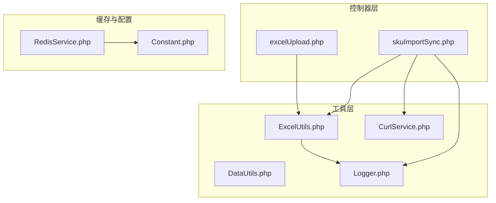
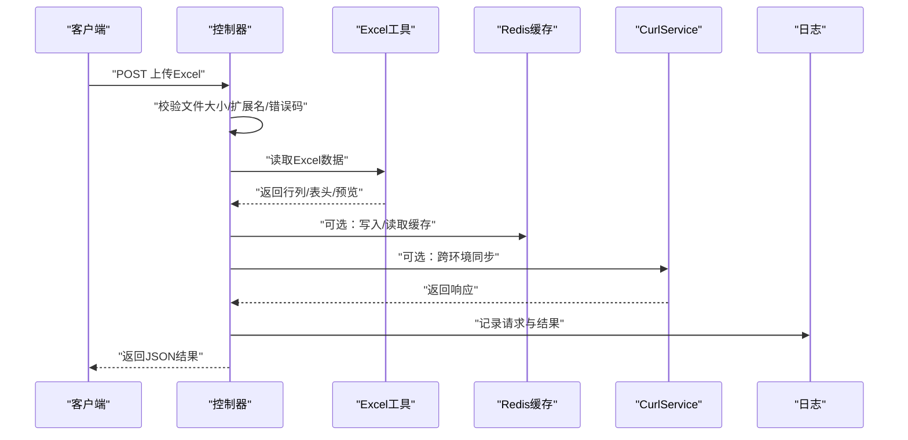
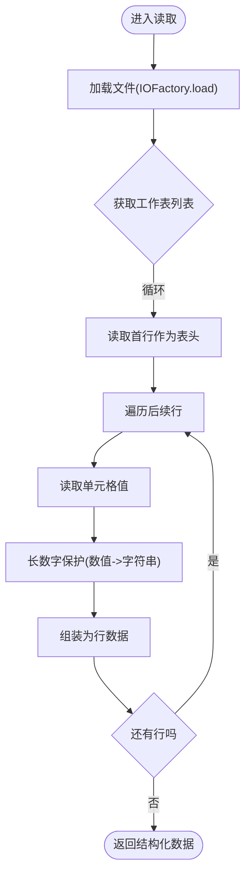
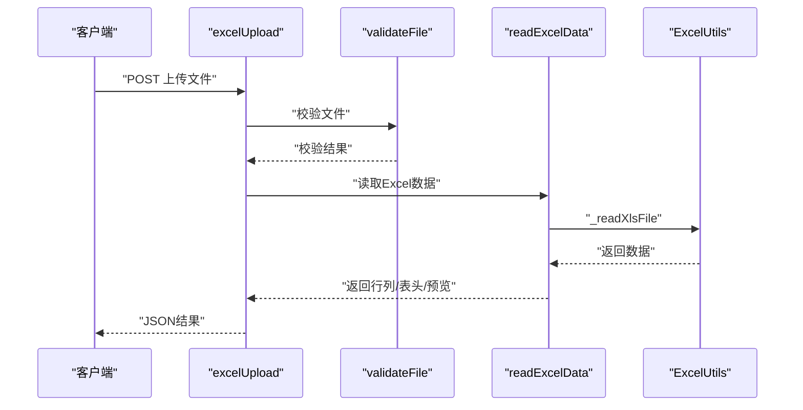
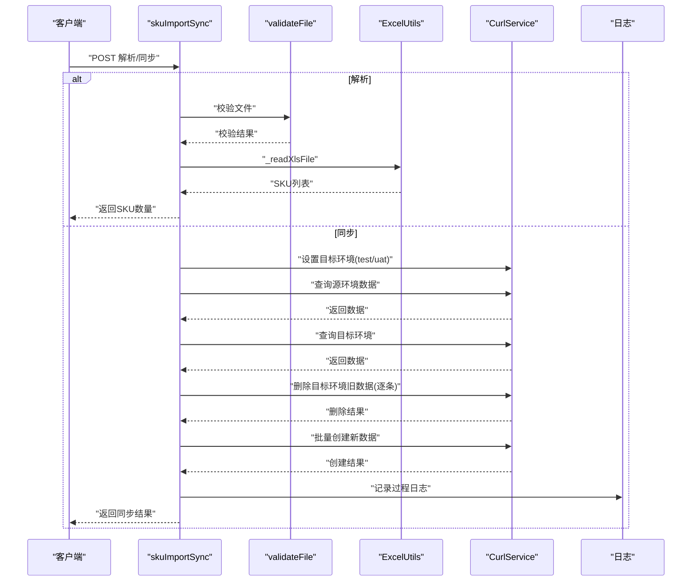
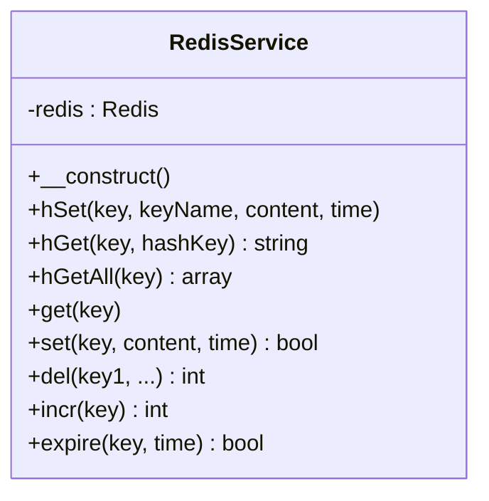
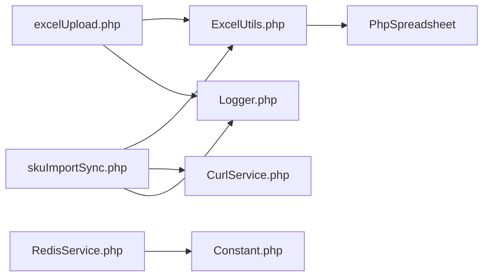

# 数据处理系统

<cite>
**本文引用的文件**
- [composer.json](file://composer.json)
- [common.php](file://php/common.php)
- [Constant.php](file://php/constant/Constant.php)
- [RedisService.php](file://php/redis/RedisService.php)
- [Logger.php](file://php/class/Logger.php)
- [ExcelUtils.php](file://php/utils/ExcelUtils.php)
- [excelUpload.php](file://php/controller/excelUpload.php)
- [skuImportSync.php](file://php/controller/skuImportSync.php)
- [CurlService.php](file://php/curl/CurlService.php)
- [DataUtils.php](file://php/utils/DataUtils.php)
- [SyncProductSku.php](file://php/shell/SyncProductSku.php)
- [TestController.php](file://php/shell/TestController.php)
</cite>

## 目录
1. [简介](#简介)
2. [项目结构](#项目结构)
3. [核心组件](#核心组件)
4. [架构总览](#架构总览)
5. [详细组件分析](#详细组件分析)
6. [依赖关系分析](#依赖关系分析)
7. [性能考虑](#性能考虑)
8. [故障排查指南](#故障排查指南)
9. [结论](#结论)
10. [附录](#附录)

## 简介
本文件面向PaSystem数据处理系统，围绕Excel文件处理能力（xlsx/xls格式支持、数据解析、格式转换）、数据验证与错误处理、缓存与存储方案（Redis与文件系统）、数据同步与冲突解决、迁移与备份策略、性能优化与大数据处理、日志与监控机制，以及最佳实践与常见问题进行系统化说明。文档同时提供代码级架构图与流程图，帮助不同技术背景的读者快速理解与落地。

## 项目结构
系统采用分层与职责分离的设计：
- 控制器层：负责HTTP请求接入与参数校验，如Excel上传与SKU导入同步。
- 工具层：封装Excel读写、数据清洗、响应格式化、日志与网络请求等通用能力。
- 缓存与常量：集中管理Redis连接与键空间命名，统一常量定义。
- Shell脚本：提供命令行或定时任务场景下的同步与处理入口。

图表来源
- [excelUpload.php](file://php/controller/excelUpload.php#L1-L372)
- [skuImportSync.php](file://php/controller/skuImportSync.php#L1-L512)
- [ExcelUtils.php](file://php/utils/ExcelUtils.php#L1-L398)
- [DataUtils.php](file://php/utils/DataUtils.php#L1-L802)
- [CurlService.php](file://php/curl/CurlService.php#L1-L996)
- [RedisService.php](file://php/redis/RedisService.php#L1-L77)
- [Constant.php](file://php/constant/Constant.php#L1-L26)

章节来源
- [composer.json](file://composer.json#L1-L11)
- [common.php](file://php/common.php#L1-L9)

## 核心组件
- Excel处理工具：基于PhpSpreadsheet实现xlsx/xls读取、CSV读取、长数字保护、单元格值规范化、导出为xls/xlsx。
- 控制器：提供Excel上传与解析、SKU导入模板下载与解析、跨环境数据同步。
- 缓存服务：基于Redis封装常用操作（hash/get/set/del/incr/expire）。
- 日志服务：提供基础文件日志能力，便于追踪请求与错误。
- 网络请求：封装多环境（test/uat/pro/local）与多种协议（REST/FormData）的HTTP调用。
- 数据工具：统一响应体解析、分页/查询列表提取、数组去重与字段抽取等。

章节来源
- [ExcelUtils.php](file://php/utils/ExcelUtils.php#L1-L398)
- [excelUpload.php](file://php/controller/excelUpload.php#L1-L372)
- [skuImportSync.php](file://php/controller/skuImportSync.php#L1-L512)
- [RedisService.php](file://php/redis/RedisService.php#L1-L77)
- [Logger.php](file://php/class/Logger.php#L1-L55)
- [CurlService.php](file://php/curl/CurlService.php#L1-L996)
- [DataUtils.php](file://php/utils/DataUtils.php#L1-L802)

## 架构总览
系统通过控制器接收请求，调用Excel工具解析文件，必要时通过CurlService访问后端服务，使用Redis进行缓存，最后通过日志记录关键事件。下图展示典型流程：

图表来源
- [excelUpload.php](file://php/controller/excelUpload.php#L35-L95)
- [ExcelUtils.php](file://php/utils/ExcelUtils.php#L147-L181)
- [RedisService.php](file://php/redis/RedisService.php#L29-L65)
- [CurlService.php](file://php/curl/CurlService.php#L664-L740)
- [Logger.php](file://php/class/Logger.php#L22-L25)

## 详细组件分析

### Excel文件处理与解析
- 支持格式：xlsx、xls、csv（通过PhpSpreadsheet Reader）。
- 读取策略：逐工作表扫描，首行为表头，其余为数据行；支持多工作表返回结构化数组。
- 长数字保护：针对数值型单元格，当格式为常规且长度超阈值时强制转为字符串，避免科学计数法丢失精度。
- 导出能力：支持导出为xls与xlsx，自动设置表头与数据行。
- 错误处理：捕获异常并返回结构化错误消息，避免进程崩溃。

图表来源
- [ExcelUtils.php](file://php/utils/ExcelUtils.php#L315-L359)
- [ExcelUtils.php](file://php/utils/ExcelUtils.php#L366-L394)

章节来源
- [ExcelUtils.php](file://php/utils/ExcelUtils.php#L147-L181)
- [ExcelUtils.php](file://php/utils/ExcelUtils.php#L190-L208)
- [ExcelUtils.php](file://php/utils/ExcelUtils.php#L246-L311)
- [ExcelUtils.php](file://php/utils/ExcelUtils.php#L315-L359)
- [ExcelUtils.php](file://php/utils/ExcelUtils.php#L366-L394)

### Excel上传与批量处理
- 单文件上传：校验上传错误码、文件大小、扩展名，移动至目标目录，调用Excel工具解析并返回预览与统计。
- 多文件上传：重构文件数组，逐个处理并汇总结果与统计。
- 删除与列举：提供删除上传文件与列出目录内文件的能力。

图表来源
- [excelUpload.php](file://php/controller/excelUpload.php#L35-L95)
- [excelUpload.php](file://php/controller/excelUpload.php#L102-L140)
- [excelUpload.php](file://php/controller/excelUpload.php#L148-L238)
- [ExcelUtils.php](file://php/utils/ExcelUtils.php#L147-L181)

章节来源
- [excelUpload.php](file://php/controller/excelUpload.php#L1-L372)

### SKU导入与跨环境同步
- 模板下载：首次访问时动态生成模板文件并返回下载。
- 解析Excel：提取第一列作为SKU集合，去重并返回数量。
- 同步流程：根据目标环境选择CurlService实例，先查询源环境数据，再查询目标环境是否存在，存在则删除旧数据，最后批量创建新数据。
- 冲突处理：通过“先删后增”的方式消除目标环境冗余；对删除失败仅记录日志，不影响整体流程。
- 错误处理：捕获异常并返回结构化错误，记录详细日志与堆栈。

图表来源
- [skuImportSync.php](file://php/controller/skuImportSync.php#L83-L110)
- [skuImportSync.php](file://php/controller/skuImportSync.php#L164-L271)
- [skuImportSync.php](file://php/controller/skuImportSync.php#L278-L426)
- [CurlService.php](file://php/curl/CurlService.php#L98-L132)
- [CurlService.php](file://php/curl/CurlService.php#L664-L740)

章节来源
- [skuImportSync.php](file://php/controller/skuImportSync.php#L1-L512)
- [CurlService.php](file://php/curl/CurlService.php#L1-L996)

### Redis缓存与键空间
- 连接与认证：构造Redis实例，连接指定主机、端口与密码。
- 常用操作：hash写入/读取、普通键读写、删除、自增、过期设置。
- 键空间：集中定义业务相关键名（如用户名、品类、SKU初始化配置、材料等），便于统一管理与清理。

图表来源
- [RedisService.php](file://php/redis/RedisService.php#L1-L77)
- [Constant.php](file://php/constant/Constant.php#L1-L26)

章节来源
- [RedisService.php](file://php/redis/RedisService.php#L1-L77)
- [Constant.php](file://php/constant/Constant.php#L1-L26)

### 日志与监控
- 文件日志：MyLogger提供基础文件写入与error_log输出，默认按日期分文件。
- CurlService日志：记录请求URL、方法与参数，便于定位网络问题。
- 控制器日志：SKU导入同步控制器记录请求参数、操作类型、查询与创建过程，便于审计与排障。

章节来源
- [Logger.php](file://php/class/Logger.php#L1-L55)
- [CurlService.php](file://php/curl/CurlService.php#L36-L36)
- [skuImportSync.php](file://php/controller/skuImportSync.php#L46-L49)

### 数据验证与错误处理
- 上传校验：检查上传错误码、文件大小上限、扩展名白名单。
- Excel解析：空文件、空工作表、空行等情况均返回结构化错误，避免异常传播。
- 网络请求：对HTTP状态码进行判断，非期望范围抛出异常并重试（可配置）。
- 同步流程：删除失败仅记录错误，继续执行创建，保证幂等性与一致性。

章节来源
- [excelUpload.php](file://php/controller/excelUpload.php#L102-L140)
- [excelUpload.php](file://php/controller/excelUpload.php#L148-L238)
- [CurlService.php](file://php/curl/CurlService.php#L725-L729)

### 数据同步算法与冲突解决
- 同步步骤：查询源环境 -> 查询目标环境 -> 删除旧数据 -> 批量创建新数据。
- 冲突解决：通过“先删后增”消除冗余；删除失败不影响创建，最终以目标环境为准。
- 环境切换：通过反射设置CurlService目标环境（test/uat），确保一致性。

章节来源
- [skuImportSync.php](file://php/controller/skuImportSync.php#L278-L426)
- [CurlService.php](file://php/curl/CurlService.php#L98-L132)

### 数据迁移与备份策略
- 文件系统备份：上传目录与导出目录定期归档，建议结合crontab与压缩归档。
- Redis备份：使用RDB快照或AOF持久化策略，定期复制备份文件至安全位置。
- 建议：对关键业务键设置过期策略与定期巡检，避免缓存膨胀。

[本节为通用策略说明，无需特定文件引用]

### 性能优化与大数据处理
- 内存管理：使用PhpSpreadsheet替代旧版库，具备更好的内存管理能力；建议在高并发场景下限制单次处理行数或分批处理。
- 缓存命中：合理设计键空间与过期策略，减少重复计算与网络请求。
- I/O优化：批量写入与延迟落盘，避免频繁磁盘抖动。
- 并发控制：上传与解析流程建议加队列与限流，防止资源争抢。

[本节为通用指导，无需特定文件引用]

## 依赖关系分析
- 组件耦合：控制器依赖工具层；工具层依赖第三方库（PhpSpreadsheet、Monolog等）；缓存与日志为横切关注点。
- 外部依赖：Redis、后端服务（通过CurlService配置多环境）。
- 潜在风险：上传目录权限不足、网络请求超时、Redis连接失败等，均通过错误处理与日志记录进行隔离。

图表来源
- [composer.json](file://composer.json#L2-L9)
- [excelUpload.php](file://php/controller/excelUpload.php#L1-L10)
- [skuImportSync.php](file://php/controller/skuImportSync.php#L1-L10)
- [ExcelUtils.php](file://php/utils/ExcelUtils.php#L2-L15)
- [RedisService.php](file://php/redis/RedisService.php#L1-L10)
- [Logger.php](file://php/class/Logger.php#L1-L10)

章节来源
- [composer.json](file://composer.json#L1-L11)

## 性能考虑
- Excel解析：建议对大文件启用分页读取或分片处理，避免一次性加载全部行。
- Redis：批量操作（如mget/mset）可降低RT；合理设置过期时间，避免热键。
- 网络请求：对后端接口设置超时与重试，避免阻塞；对幂等接口支持重试。
- 日志：异步写入或限流，避免I/O成为瓶颈。

[本节为通用指导，无需特定文件引用]

## 故障排查指南
- 上传失败：检查上传错误码映射、文件大小与扩展名校验、目标目录权限。
- Excel解析异常：确认文件格式兼容性、表头与数据行边界、长数字保护是否生效。
- 同步失败：查看日志中查询与删除/创建阶段的错误信息；核对目标环境配置与CurlService令牌。
- Redis连接失败：检查主机、端口、密码配置与网络连通性。

章节来源
- [excelUpload.php](file://php/controller/excelUpload.php#L102-L140)
- [excelUpload.php](file://php/controller/excelUpload.php#L227-L238)
- [skuImportSync.php](file://php/controller/skuImportSync.php#L414-L426)
- [RedisService.php](file://php/redis/RedisService.php#L15-L19)

## 结论
PaSystem数据处理系统以清晰的分层架构与完善的工具链支撑Excel文件处理、数据验证与错误处理、缓存与存储、跨环境同步与冲突解决、日志与监控。通过合理的性能优化与运维策略，可在保证稳定性的同时提升吞吐与可用性。建议持续完善自动化测试与监控告警，保障系统长期可靠运行。

[本节为总结性内容，无需特定文件引用]

## 附录
- 常用键空间参考：用户名、品类、SKU初始化配置、材料、材料重复、材料重复修正等，详见常量定义。
- Shell入口：提供TestController与SyncProductSku等脚本入口，便于离线或定时任务场景使用。

章节来源
- [Constant.php](file://php/constant/Constant.php#L8-L26)
- [TestController.php](file://php/shell/TestController.php)
- [SyncProductSku.php](file://php/shell/SyncProductSku.php)