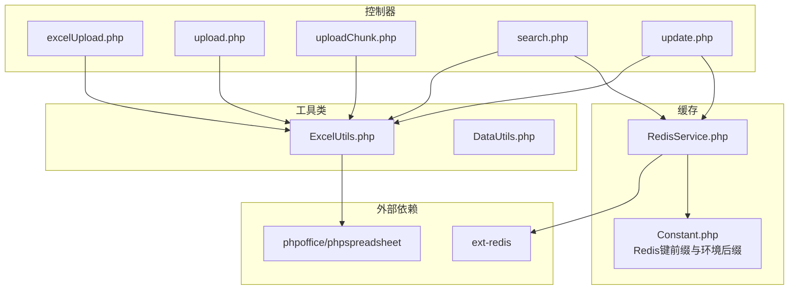
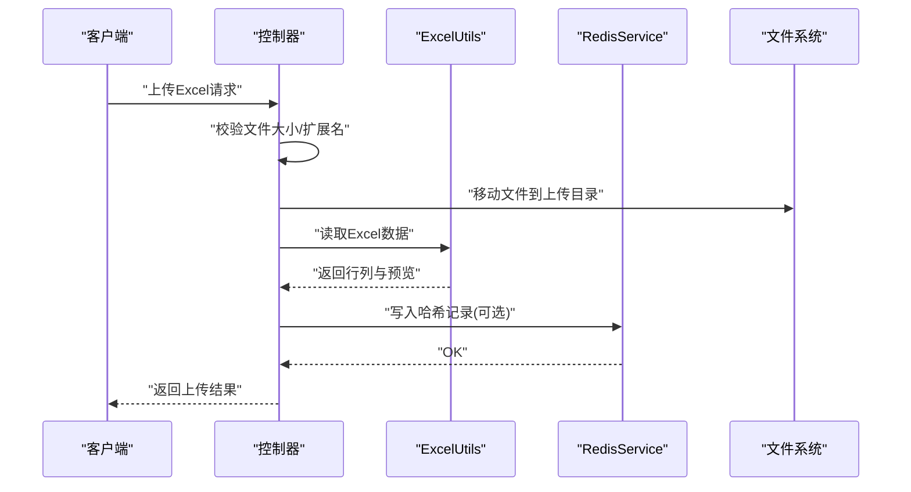
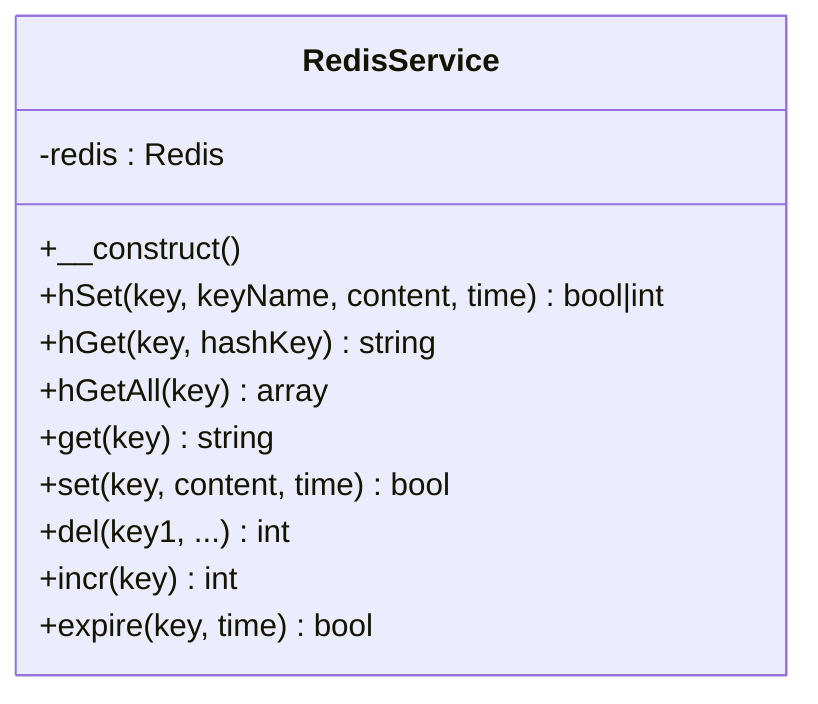
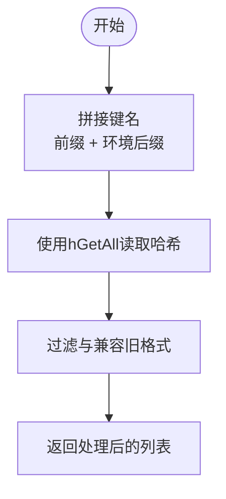
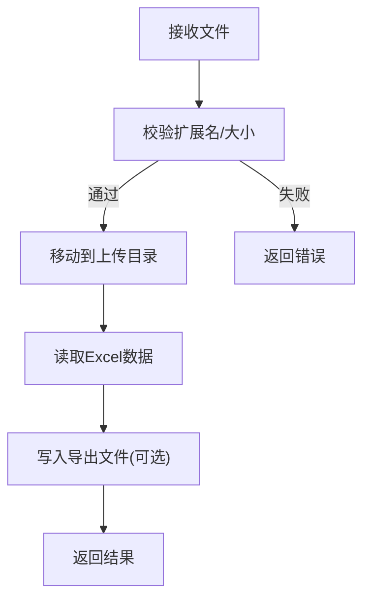
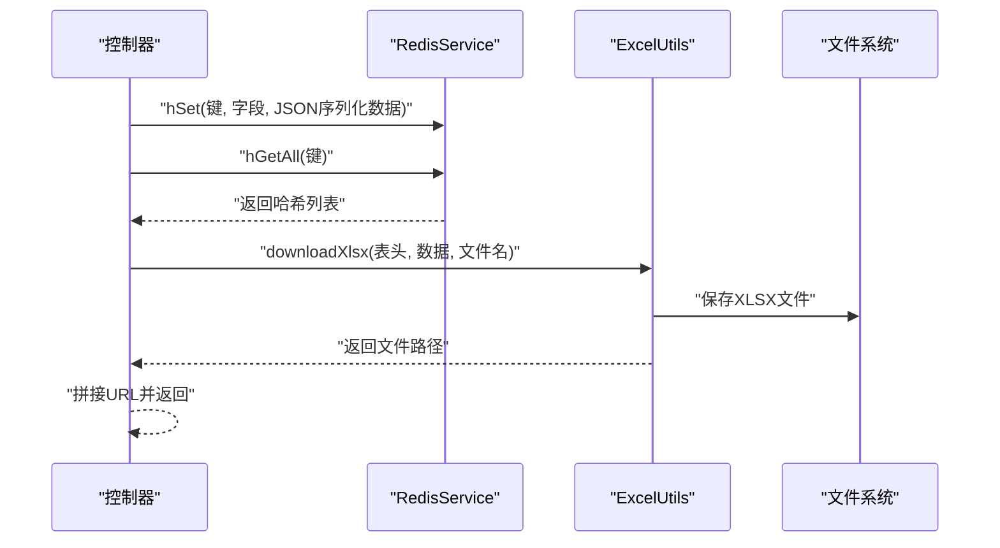
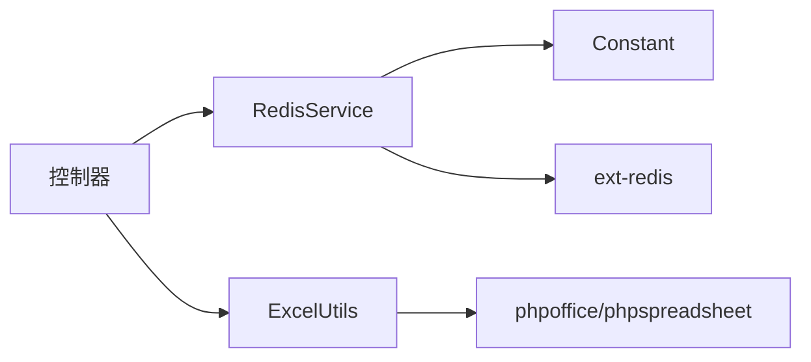

# 数据缓存与存储

<cite>
**本文引用的文件**
- [RedisService.php](file://php/redis/RedisService.php)
- [Constant.php](file://php/constant/Constant.php)
- [ExcelUtils.php](file://php/utils/ExcelUtils.php)
- [excelUpload.php](file://php/controller/excelUpload.php)
- [upload.php](file://php/controller/upload.php)
- [uploadChunk.php](file://php/controller/uploadChunk.php)
- [search.php](file://php/controller/search.php)
- [update.php](file://php/controller/update.php)
- [composer.json](file://composer.json)
</cite>

## 目录
1. [简介](#简介)
2. [项目结构](#项目结构)
3. [核心组件](#核心组件)
4. [架构总览](#架构总览)
5. [详细组件分析](#详细组件分析)
6. [依赖关系分析](#依赖关系分析)
7. [性能考虑](#性能考虑)
8. [故障排查指南](#故障排查指南)
9. [结论](#结论)
10. [附录](#附录)

## 简介
本文件面向PaSystem的数据缓存与存储系统，聚焦以下目标：
- Redis缓存策略与实现：键设计、过期时间、序列化方式、哈希结构与过期控制。
- 文件系统存储方案：Excel导出路径管理、临时文件处理、存储空间优化。
- 缓存与持久化的协调机制：缓存更新策略、数据一致性保障。
- 性能优化与容量规划建议、故障处理与数据恢复策略。
- 实际使用场景与最佳实践。

## 项目结构
系统围绕“控制器-工具类-常量-缓存服务”的分层组织：
- 控制器负责业务流程编排与接口交互（如Excel上传、OSS文件登记、访问统计等）。
- 工具类提供通用能力（Excel读写、数据处理、UUID生成等）。
- 常量集中定义Redis键前缀与环境后缀，统一命名规范。
- RedisService封装Redis连接与常用操作，提供哈希写入、过期设置等。

图表来源
- [excelUpload.php](file://php/controller/excelUpload.php#L1-L372)
- [upload.php](file://php/controller/upload.php#L1-L138)
- [uploadChunk.php](file://php/controller/uploadChunk.php#L1-L86)
- [search.php](file://php/controller/search.php#L200-L399)
- [update.php](file://php/controller/update.php#L520-L719)
- [ExcelUtils.php](file://php/utils/ExcelUtils.php#L1-L398)
- [RedisService.php](file://php/redis/RedisService.php#L1-L77)
- [Constant.php](file://php/constant/Constant.php#L1-L26)
- [composer.json](file://composer.json#L1-L11)

章节来源
- [excelUpload.php](file://php/controller/excelUpload.php#L1-L372)
- [upload.php](file://php/controller/upload.php#L1-L138)
- [uploadChunk.php](file://php/controller/uploadChunk.php#L1-L86)
- [search.php](file://php/controller/search.php#L200-L399)
- [update.php](file://php/controller/update.php#L520-L719)
- [ExcelUtils.php](file://php/utils/ExcelUtils.php#L1-L398)
- [RedisService.php](file://php/redis/RedisService.php#L1-L77)
- [Constant.php](file://php/constant/Constant.php#L1-L26)
- [composer.json](file://composer.json#L1-L11)

## 核心组件
- RedisService：封装Redis连接、哈希写入、过期设置、字符串读写、自增、删除等基础能力。
- ExcelUtils：基于PhpSpreadsheet实现Excel/XLS/CVS读写、导出路径管理、长数字处理、单元格格式兼容。
- 常量定义：集中定义Redis键前缀（如用户名/IP、材料、OSS文件等）与环境后缀，便于多环境隔离与键空间管理。
- 控制器：负责业务编排，结合Redis与ExcelUtils完成上传、导出、访问统计、OSS文件登记等。

章节来源
- [RedisService.php](file://php/redis/RedisService.php#L1-L77)
- [ExcelUtils.php](file://php/utils/ExcelUtils.php#L1-L398)
- [Constant.php](file://php/constant/Constant.php#L1-L26)

## 架构总览
系统采用“控制器-工具类-缓存服务”的分层架构，数据流主要分为两条主线：
- 缓存主线：控制器通过RedisService写入/读取哈希数据，键名由常量定义并附加环境后缀，实现多环境隔离与快速检索。
- 存储主线：ExcelUtils负责将数据写入文件系统，导出路径位于php/export目录下；上传控制器负责接收文件、校验、移动至目标目录，并在必要时进行分片合并与清理。

图表来源
- [excelUpload.php](file://php/controller/excelUpload.php#L35-L95)
- [ExcelUtils.php](file://php/utils/ExcelUtils.php#L147-L181)
- [RedisService.php](file://php/redis/RedisService.php#L29-L35)

章节来源
- [excelUpload.php](file://php/controller/excelUpload.php#L35-L95)
- [ExcelUtils.php](file://php/utils/ExcelUtils.php#L147-L181)
- [RedisService.php](file://php/redis/RedisService.php#L29-L35)

## 详细组件分析

### Redis缓存策略与实现
- 连接与认证：构造函数中建立连接并执行密码认证，确保安全访问。
- 哈希写入与过期：hSet支持为哈希字段赋值，并在time参数存在时为整个key设置过期时间，实现“键过期+字段持久化”的灵活策略。
- 字符串读写：get/set支持简单键值存储，便于缓存序列化后的完整对象。
- 其他操作：hGet、hGetAll、del、incr、expire等，满足统计、清理、原子递增等场景。

图表来源
- [RedisService.php](file://php/redis/RedisService.php#L7-L77)

章节来源
- [RedisService.php](file://php/redis/RedisService.php#L15-L77)

### 键设计与命名规范
- 环境后缀：通过常量定义环境后缀（如“_dev”、“_prod”），在控制器中拼接到键名，实现多环境隔离。
- 前缀统一：常量集中定义键前缀（如用户名/IP、材料、OSS文件、SKU初始化等），避免散乱命名导致的维护成本。
- 哈希键结构：控制器中使用hGetAll一次性拉取全部记录，再进行过滤与兼容处理，提升读取效率。

图表来源
- [Constant.php](file://php/constant/Constant.php#L8-L18)
- [search.php](file://php/controller/search.php#L205-L230)
- [search.php](file://php/controller/search.php#L248-L351)

章节来源
- [Constant.php](file://php/constant/Constant.php#L8-L18)
- [search.php](file://php/controller/search.php#L205-L230)
- [search.php](file://php/controller/search.php#L248-L351)

### 过期时间设置与序列化
- 过期策略：hSet在time参数存在时为整个key设置过期时间，适合短期缓存（如访问统计、临时登记）。
- 序列化：控制器中对数组使用JSON序列化后写入Redis，读取时反序列化，保证复杂结构的持久化与传输。
- 一致性：读取时对旧格式进行兼容处理，避免迁移过程中的数据不一致。

章节来源
- [RedisService.php](file://php/redis/RedisService.php#L29-L35)
- [search.php](file://php/controller/search.php#L315-L337)
- [search.php](file://php/controller/search.php#L250-L280)

### 文件系统存储方案
- 导出路径管理：ExcelUtils在构造时确定导出根目录，默认位于php/export下，支持子目录隔离（如default、excel、oss、sku等）。
- 上传目录：控制器在php/export/uploads下创建子目录（excel、oss、sku），用于存放上传文件。
- 临时文件处理：分片上传控制器在临时目录生成.part文件，完成后合并并删除临时片段与目录，避免磁盘碎片与残留。
- 存储空间优化：导出文件采用XLSX格式，结合分片上传减少单次IO压力；上传完成后可按需清理临时文件。

图表来源
- [excelUpload.php](file://php/controller/excelUpload.php#L35-L95)
- [ExcelUtils.php](file://php/utils/ExcelUtils.php#L24-L28)
- [uploadChunk.php](file://php/controller/uploadChunk.php#L15-L78)

章节来源
- [ExcelUtils.php](file://php/utils/ExcelUtils.php#L24-L28)
- [excelUpload.php](file://php/controller/excelUpload.php#L17-L27)
- [uploadChunk.php](file://php/controller/uploadChunk.php#L15-L78)

### 缓存与持久化的协调机制
- 写入路径：控制器在完成文件上传或业务处理后，将关键信息写入Redis哈希，键名包含环境后缀，便于后续查询与导出。
- 读取路径：通过hGetAll一次性拉取全部记录，再进行过滤与兼容处理，减少多次网络往返。
- 导出路径：当需要导出时，控制器调用ExcelUtils生成Excel文件，路径指向php/export/default，便于前端访问。
- 一致性保障：对旧格式数据进行补齐字段与兼容处理，避免因格式差异导致的读取异常。

图表来源
- [search.php](file://php/controller/search.php#L205-L230)
- [update.php](file://php/controller/update.php#L527-L542)
- [ExcelUtils.php](file://php/utils/ExcelUtils.php#L98-L138)

章节来源
- [search.php](file://php/controller/search.php#L205-L230)
- [update.php](file://php/controller/update.php#L527-L542)
- [ExcelUtils.php](file://php/utils/ExcelUtils.php#L98-L138)

### 实际使用场景与最佳实践
- Excel上传与预览：控制器对文件进行严格校验，生成唯一文件名，读取Excel数据并返回预览，适合批量数据导入前的校验。
- 分片上传：针对大文件，控制器将文件切分为若干片段，完成后合并并清理临时文件，降低内存占用与失败重试成本。
- 访问统计与登记：通过Redis哈希记录用户访问信息，支持按IP与用户名维度查询与统计，便于审计与分析。
- OSS文件登记：上传完成后将文件信息写入Redis，便于后续导出与溯源。

章节来源
- [excelUpload.php](file://php/controller/excelUpload.php#L35-L95)
- [uploadChunk.php](file://php/controller/uploadChunk.php#L15-L78)
- [search.php](file://php/controller/search.php#L244-L351)
- [update.php](file://php/controller/update.php#L527-L542)

## 依赖关系分析
- Redis扩展：composer.json声明ext-redis，确保RedisService可用。
- Excel处理：composer.json声明phpoffice/phpspreadsheet，ExcelUtils基于其进行读写。
- 组件耦合：控制器依赖RedisService与ExcelUtils；RedisService依赖常量定义的键前缀；导出路径依赖ExcelUtils的目录策略。

图表来源
- [composer.json](file://composer.json#L1-L11)
- [RedisService.php](file://php/redis/RedisService.php#L1-L77)
- [ExcelUtils.php](file://php/utils/ExcelUtils.php#L1-L398)
- [Constant.php](file://php/constant/Constant.php#L1-L26)

章节来源
- [composer.json](file://composer.json#L1-L11)
- [RedisService.php](file://php/redis/RedisService.php#L1-L77)
- [ExcelUtils.php](file://php/utils/ExcelUtils.php#L1-L398)
- [Constant.php](file://php/constant/Constant.php#L1-L26)

## 性能考虑
- Redis键设计：使用环境后缀隔离数据，避免跨环境干扰；哈希结构适合多字段聚合读写。
- 过期策略：对短期数据设置合理过期时间，避免长期占用内存；对热点数据可考虑不设置过期或延长。
- Excel处理：优先使用XLSX格式以获得更好的压缩与兼容性；对超大数据集建议分批处理与分片上传。
- 文件系统：导出目录与上传目录分离，避免IO竞争；定期清理临时文件与过期导出文件，释放磁盘空间。
- 并发与锁：在高并发场景下，建议对关键写入操作增加分布式锁或幂等设计，防止脏写。

## 故障排查指南
- Redis连接失败：检查RedisService构造函数中的主机、端口与密码配置，确认ext-redis扩展已启用。
- Excel读取异常：检查文件编码、分隔符与长数字格式，必要时调整读取策略或使用文本格式读取。
- 上传失败：检查上传目录权限与磁盘空间，确认临时目录可写且有足够空间。
- 导出路径不可访问：确认导出目录存在且可被Web服务器访问，检查文件名与路径拼接逻辑。
- 数据不一致：核对Redis键前缀与环境后缀是否一致，检查旧格式兼容逻辑是否生效。

章节来源
- [RedisService.php](file://php/redis/RedisService.php#L15-L19)
- [ExcelUtils.php](file://php/utils/ExcelUtils.php#L246-L311)
- [excelUpload.php](file://php/controller/excelUpload.php#L102-L140)
- [uploadChunk.php](file://php/controller/uploadChunk.php#L22-L58)

## 结论
PaSystem通过Redis与文件系统的协同，实现了高效的数据缓存与持久化能力。Redis用于短期与结构化数据的快速存取，ExcelUtils负责数据的读写与导出，控制器承担业务编排与一致性保障。通过统一的键前缀与环境后缀、合理的过期策略与临时文件处理，系统在性能与可维护性之间取得了良好平衡。建议在生产环境中进一步完善监控、告警与备份策略，确保数据安全与系统稳定。

## 附录
- 常量与键前缀：集中定义于常量文件，便于统一管理与多环境部署。
- 导出路径：默认位于php/export，支持子目录隔离与URL拼接。
- 依赖声明：composer.json明确声明Redis扩展与Excel处理库，确保运行时可用。

章节来源
- [Constant.php](file://php/constant/Constant.php#L1-L26)
- [ExcelUtils.php](file://php/utils/ExcelUtils.php#L24-L28)
- [composer.json](file://composer.json#L1-L11)