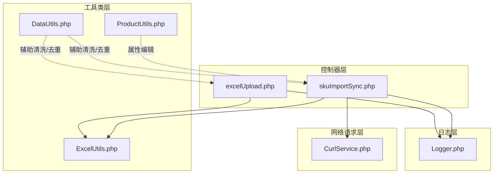
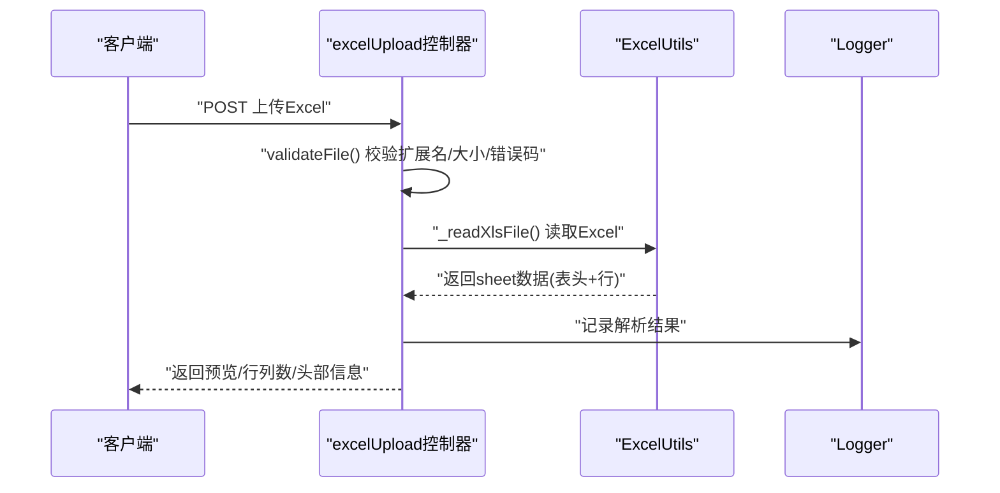
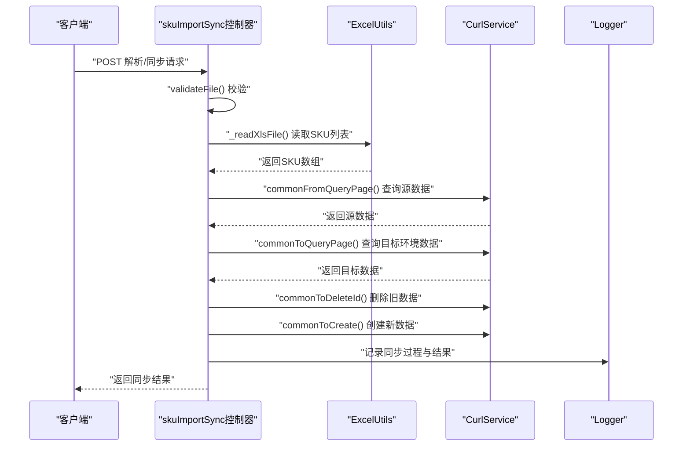
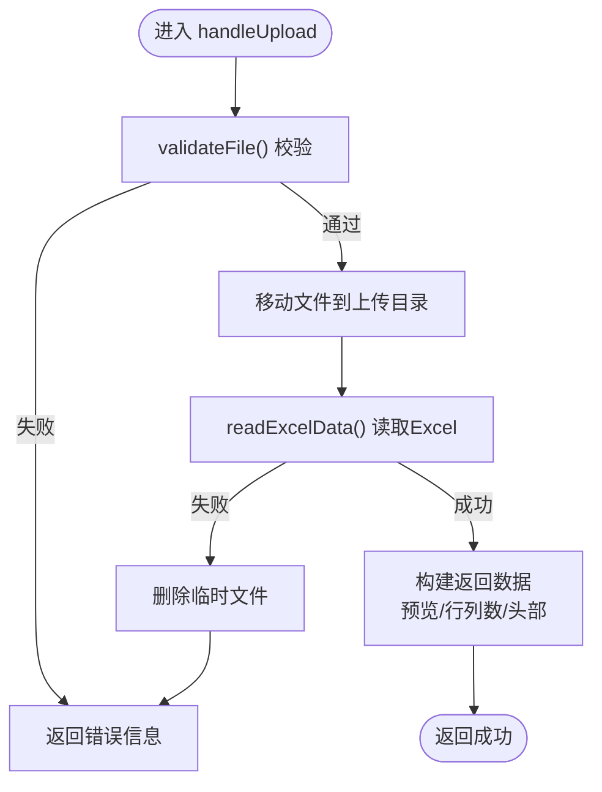
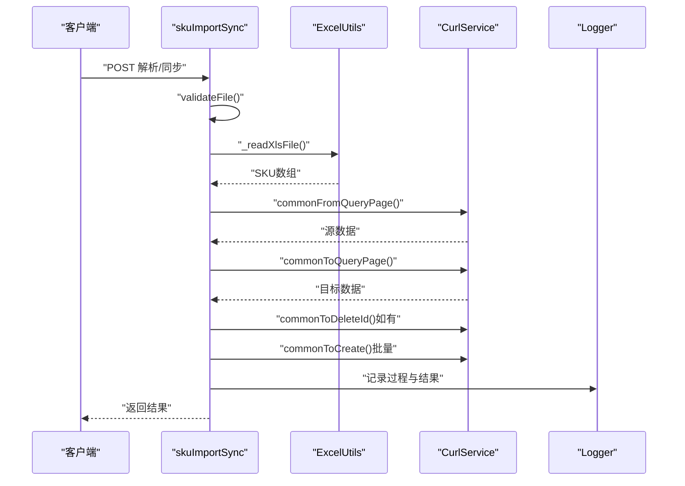
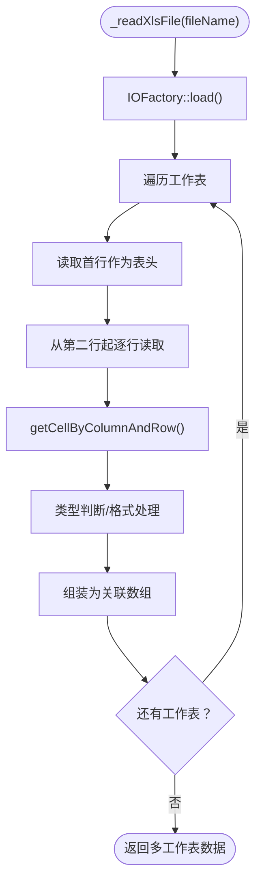
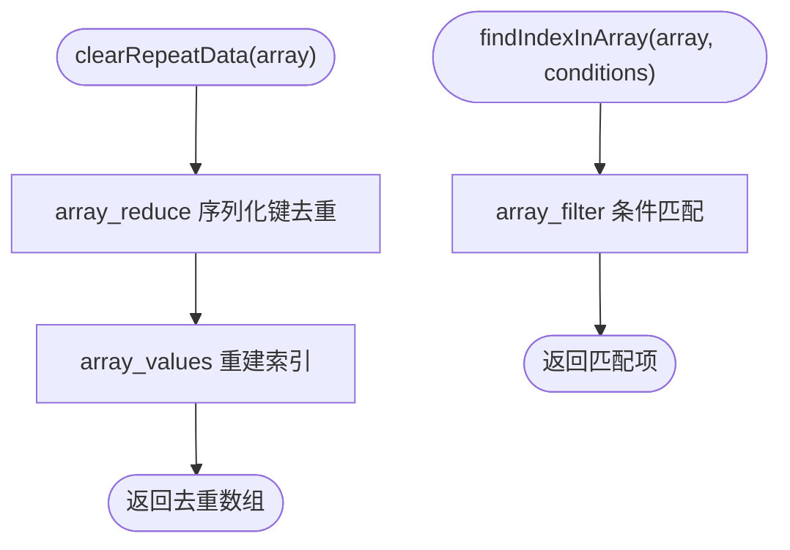
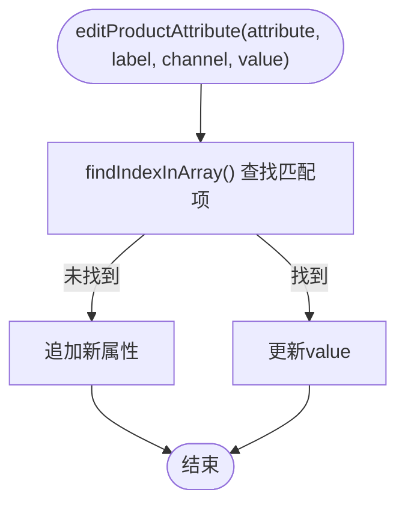
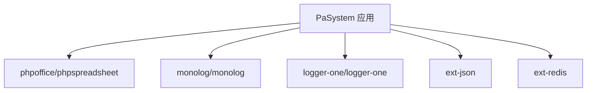

# 数据验证与清洗

<cite>
**本文引用的文件**
- [excelUpload.php](file://php/controller/excelUpload.php)
- [skuImportSync.php](file://php/controller/skuImportSync.php)
- [ExcelUtils.php](file://php/utils/ExcelUtils.php)
- [DataUtils.php](file://php/utils/DataUtils.php)
- [ProductUtils.php](file://php/utils/ProductUtils.php)
- [CurlService.php](file://php/curl/CurlService.php)
- [Logger.php](file://php/class/Logger.php)
- [composer.json](file://composer.json)
- [Constant.php](file://php/constant/Constant.php)
</cite>

## 目录
1. [简介](#简介)
2. [项目结构](#项目结构)
3. [核心组件](#核心组件)
4. [架构总览](#架构总览)
5. [详细组件分析](#详细组件分析)
6. [依赖关系分析](#依赖关系分析)
7. [性能考虑](#性能考虑)
8. [故障排查指南](#故障排查指南)
9. [结论](#结论)
10. [附录](#附录)

## 简介
本文件面向PaSystem的数据验证与清洗系统，聚焦以下目标：
- 数据验证规则与算法：涵盖SKU数据格式验证、产品信息完整性检查、平台兼容性验证等。
- 数据清洗流程：重复数据检测、异常值处理、格式标准化等。
- 数据质量评估指标与监控机制：如何量化与持续观测数据质量。
- 错误处理策略与用户反馈机制：如何在上传、解析、同步过程中给出明确反馈。
- 实际验证规则示例与自定义扩展方法：提供可落地的规则与扩展点。
- 数据清洗最佳实践与性能优化技巧：在大规模数据场景下的稳健与高效。

## 项目结构
PaSystem围绕“控制器-工具类-日志-网络请求”四层组织，其中与数据验证与清洗直接相关的核心文件如下：
- 控制器层：负责接收请求、校验文件、解析Excel、触发同步与返回结果。
- 工具类层：封装Excel读取、数据去重、数组过滤、属性编辑等通用能力。
- 日志层：统一记录请求、解析、同步过程的关键事件，便于排障与审计。
- 网络请求层：封装跨环境调用，支持多模块、多端口、多环境切换。

图表来源
- [excelUpload.php](file://php/controller/excelUpload.php#L1-L372)
- [skuImportSync.php](file://php/controller/skuImportSync.php#L1-L512)
- [ExcelUtils.php](file://php/utils/ExcelUtils.php#L1-L398)
- [DataUtils.php](file://php/utils/DataUtils.php#L1-L802)
- [ProductUtils.php](file://php/utils/ProductUtils.php#L1-L127)
- [Logger.php](file://php/class/Logger.php#L1-L55)
- [CurlService.php](file://php/curl/CurlService.php#L1-L996)

章节来源
- [excelUpload.php](file://php/controller/excelUpload.php#L1-L372)
- [skuImportSync.php](file://php/controller/skuImportSync.php#L1-L512)
- [ExcelUtils.php](file://php/utils/ExcelUtils.php#L1-L398)
- [DataUtils.php](file://php/utils/DataUtils.php#L1-L802)
- [ProductUtils.php](file://php/utils/ProductUtils.php#L1-L127)
- [Logger.php](file://php/class/Logger.php#L1-L55)
- [composer.json](file://composer.json#L1-L11)

## 核心组件
- 文件上传与Excel解析控制器
  - excelUpload：支持单/多文件上传、文件类型与大小校验、Excel读取与预览、批量处理与清理。
  - skuImportSync：支持模板下载、Excel解析（提取SKU列表）、目标环境同步（删除旧数据并创建新数据）。
- Excel工具类
  - ExcelUtils：封装xlsx/xls/csv读取、长数字处理、单元格值标准化等。
- 数据工具类
  - DataUtils：封装响应数据提取、数组去重、数组过滤、日志解析等。
- 产品属性工具类
  - ProductUtils：针对产品-属性结构进行增删改。
- 日志类
  - Logger：统一写日志，便于排障与审计。
- 网络请求服务
  - CurlService：多环境（test/uat/pro/local）与多模块端口配置，封装HTTP请求与重试。

章节来源
- [excelUpload.php](file://php/controller/excelUpload.php#L1-L372)
- [skuImportSync.php](file://php/controller/skuImportSync.php#L1-L512)
- [ExcelUtils.php](file://php/utils/ExcelUtils.php#L1-L398)
- [DataUtils.php](file://php/utils/DataUtils.php#L1-L802)
- [ProductUtils.php](file://php/utils/ProductUtils.php#L1-L127)
- [Logger.php](file://php/class/Logger.php#L1-L55)
- [CurlService.php](file://php/curl/CurlService.php#L1-L996)

## 架构总览
下图展示了“上传-解析-验证-清洗-同步”的端到端流程，以及各组件之间的交互关系。

图表来源
- [excelUpload.php](file://php/controller/excelUpload.php#L35-L95)
- [excelUpload.php](file://php/controller/excelUpload.php#L148-L238)
- [ExcelUtils.php](file://php/utils/ExcelUtils.php#L147-L181)
- [Logger.php](file://php/class/Logger.php#L22-L25)

图表来源
- [skuImportSync.php](file://php/controller/skuImportSync.php#L164-L271)
- [skuImportSync.php](file://php/controller/skuImportSync.php#L278-L426)
- [ExcelUtils.php](file://php/utils/ExcelUtils.php#L147-L181)
- [CurlService.php](file://php/curl/CurlService.php#L664-L740)
- [Logger.php](file://php/class/Logger.php#L22-L25)

## 详细组件分析

### 组件A：Excel上传与解析（excelUpload）
职责与流程
- 文件校验：扩展名限制（xlsx/xls）、大小限制、上传错误码映射。
- 文件移动与命名：生成唯一文件名，移动至上传目录。
- Excel读取：使用ExcelUtils读取首个工作表，提取表头与数据行，支持预览。
- 批量处理：支持多文件上传，汇总结果与统计。
- 错误处理：捕获异常并返回结构化错误信息，必要时删除临时文件。

图表来源
- [excelUpload.php](file://php/controller/excelUpload.php#L35-L95)
- [excelUpload.php](file://php/controller/excelUpload.php#L102-L140)
- [excelUpload.php](file://php/controller/excelUpload.php#L148-L238)

章节来源
- [excelUpload.php](file://php/controller/excelUpload.php#L1-L372)
- [ExcelUtils.php](file://php/utils/ExcelUtils.php#L147-L181)

### 组件B：SKU导入与同步（skuImportSync）
职责与流程
- 模板下载：动态生成并下载SKU导入模板。
- Excel解析：读取Excel，提取第一列作为SKU，去重并返回数量。
- 同步流程：根据目标环境（test/uat）选择CurlService端口，先查询源数据，再查询目标环境数据，如存在则删除旧数据，最后批量创建新数据。
- 日志记录：全程记录请求、参数、查询结果、删除与创建过程，便于审计与排障。

图表来源
- [skuImportSync.php](file://php/controller/skuImportSync.php#L164-L271)
- [skuImportSync.php](file://php/controller/skuImportSync.php#L278-L426)
- [CurlService.php](file://php/curl/CurlService.php#L664-L740)
- [Logger.php](file://php/class/Logger.php#L22-L25)

章节来源
- [skuImportSync.php](file://php/controller/skuImportSync.php#L1-L512)
- [ExcelUtils.php](file://php/utils/ExcelUtils.php#L147-L181)
- [CurlService.php](file://php/curl/CurlService.php#L1-L996)
- [Logger.php](file://php/class/Logger.php#L1-L55)

### 组件C：Excel工具类（ExcelUtils）
职责与流程
- 读取Excel：支持xlsx/xls，逐工作表读取，首行作为表头，后续行作为数据。
- 长数字处理：识别数值型且长度超阈值的单元格，强制转为字符串，避免科学计数法丢失精度。
- 文本格式读取：对指定列强制以文本方式读取，保证长数字不被截断。
- 导出：提供xlsx导出能力（下载）。

图表来源
- [ExcelUtils.php](file://php/utils/ExcelUtils.php#L147-L181)
- [ExcelUtils.php](file://php/utils/ExcelUtils.php#L315-L394)

章节来源
- [ExcelUtils.php](file://php/utils/ExcelUtils.php#L1-L398)

### 组件D：数据工具类（DataUtils）
职责与流程
- 响应数据提取：根据约定的响应结构，提取result/data等字段。
- 数组去重：基于序列化后的键进行去重，返回唯一数组。
- 数组过滤：按多条件过滤数组，返回匹配项。
- 日志解析：解析特定格式日志，抽取字段变更与动作。

图表来源
- [DataUtils.php](file://php/utils/DataUtils.php#L283-L296)
- [DataUtils.php](file://php/utils/DataUtils.php#L183-L197)

章节来源
- [DataUtils.php](file://php/utils/DataUtils.php#L1-L802)

### 组件E：产品属性工具类（ProductUtils）
职责与流程
- 属性编辑：按label/channel定位属性，不存在则新增，存在则更新。
- 批量编辑/删除：支持批量更新与批量删除属性集合。

图表来源
- [ProductUtils.php](file://php/utils/ProductUtils.php#L23-L35)
- [DataUtils.php](file://php/utils/DataUtils.php#L183-L197)

章节来源
- [ProductUtils.php](file://php/utils/ProductUtils.php#L1-L127)
- [DataUtils.php](file://php/utils/DataUtils.php#L1-L802)

### 组件F：日志类（Logger）
职责与流程
- 统一日志写入：按日期生成日志文件，追加写入并同时写入error_log。
- 支持多种写入方式：基础写入与可选的第三方库集成（注释态）。

章节来源
- [Logger.php](file://php/class/Logger.php#L1-L55)

### 组件G：网络请求服务（CurlService）
职责与流程
- 环境配置：支持test/uat/pro/local，按环境设置不同端点。
- 模块路由：通过port标识（如s3015/s3047等）路由到对应模块。
- 请求封装：GET/POST/PUT/DELETE/UPLOAD，统一Header、超时、重试与日志记录。
- 网关鉴权：根据环境设置Authorization，支持自定义token。

章节来源
- [CurlService.php](file://php/curl/CurlService.php#L1-L996)

## 依赖关系分析
- Composer依赖
  - phpoffice/phpspreadsheet：Excel读写核心库。
  - monolog/monolog、psr/log、logger-one/logger-one：日志相关依赖。
  - ext-json、ext-redis：运行时扩展依赖。

图表来源
- [composer.json](file://composer.json#L1-L11)

章节来源
- [composer.json](file://composer.json#L1-L11)

## 性能考虑
- Excel读取
  - 使用PhpSpreadsheet逐工作表读取，避免一次性加载全部工作表导致内存峰值过高。
  - 长数字处理：在读取阶段即转为字符串，避免后续计算或导出时的精度丢失。
- 批量同步
  - 先查询源数据，再查询目标环境，存在则删除旧数据，最后批量创建，减少中间状态。
  - 删除与创建采用循环逐条处理，便于记录日志与容错。
- 日志与错误
  - 统一日志落盘，便于快速定位问题；异常捕获后返回结构化错误，避免服务崩溃。
- 缓存与Redis键空间
  - 项目中定义了大量Redis键常量，可用于缓存与状态标记，建议在数据清洗与同步流程中结合使用，降低重复计算与网络请求。

章节来源
- [ExcelUtils.php](file://php/utils/ExcelUtils.php#L147-L181)
- [skuImportSync.php](file://php/controller/skuImportSync.php#L278-L426)
- [Logger.php](file://php/class/Logger.php#L22-L25)
- [Constant.php](file://php/constant/Constant.php#L1-L26)

## 故障排查指南
- 上传失败
  - 检查上传错误码映射与文件大小限制，确认扩展名是否为xlsx/xls。
  - 若移动失败，检查上传目录权限与临时文件有效性。
- Excel读取异常
  - 确认文件是否为空或无数据，检查表头与数据行是否正确读取。
  - 长数字被截断：确认是否启用文本格式读取或强制字符串处理。
- 同步失败
  - 查看日志中“查询源数据/目标数据/删除旧数据/创建新数据”的记录，定位具体步骤。
  - 确认目标环境（test/uat）与模块端口配置正确。
- 错误返回
  - 控制器层统一返回success/message/data结构，优先查看message中的提示信息。

章节来源
- [excelUpload.php](file://php/controller/excelUpload.php#L102-L140)
- [skuImportSync.php](file://php/controller/skuImportSync.php#L164-L271)
- [skuImportSync.php](file://php/controller/skuImportSync.php#L278-L426)
- [ExcelUtils.php](file://php/utils/ExcelUtils.php#L246-L311)
- [Logger.php](file://php/class/Logger.php#L22-L25)

## 结论
PaSystem的数据验证与清洗体系以“控制器-工具类-日志-网络请求”为核心，实现了：
- 文件级验证（扩展名、大小、错误码）与Excel解析（长数字保护、文本格式读取）。
- 数据清洗（去重、过滤、属性编辑）与平台兼容（多环境/多模块路由）。
- 完整的错误处理与日志记录，便于问题定位与持续改进。
建议在现有基础上进一步引入数据质量指标（如缺失率、重复率、格式合规率）与自动化监控，以实现闭环的质量保障。

## 附录

### 数据验证规则与算法
- SKU数据格式验证
  - 规则：第一列为SKU，要求非空且为字符串；建议统一去除首尾空白。
  - 算法：读取Excel首列，trim后去重，返回唯一SKU列表。
- 产品信息完整性检查
  - 规则：必填字段（如SKU ID、备注等）不能为空；字段类型与长度约束。
  - 算法：读取表头与数据行，逐行校验必填字段；对数值型字段进行类型判断与范围校验。
- 平台兼容性验证
  - 规则：仅允许xlsx/xls格式；文件大小不超过限制；上传错误码映射。
  - 算法：扩展名白名单、大小阈值、错误码映射表。

章节来源
- [excelUpload.php](file://php/controller/excelUpload.php#L102-L140)
- [skuImportSync.php](file://php/controller/skuImportSync.php#L433-L471)
- [ExcelUtils.php](file://php/utils/ExcelUtils.php#L147-L181)

### 数据清洗流程
- 重复数据检测
  - 方法：基于序列化键的去重（DataUtils::clearRepeatData）。
  - 场景：SKU列表去重、对象数组去重。
- 异常值处理
  - 方法：长数字强制字符串处理（ExcelUtils::_getCellValueV2），避免科学计数法。
  - 场景：CSV长数字读取、Excel数值型单元格处理。
- 格式标准化
  - 方法：统一trim、统一字符串化、统一文本格式读取。
  - 场景：SKU、品牌、分类等字段的标准化。

章节来源
- [DataUtils.php](file://php/utils/DataUtils.php#L283-L296)
- [ExcelUtils.php](file://php/utils/ExcelUtils.php#L246-L311)
- [ExcelUtils.php](file://php/utils/ExcelUtils.php#L366-L394)

### 数据质量评估指标与监控机制
- 指标建议
  - 完整性：必填字段缺失率。
  - 唯一性：重复SKU/重复记录率。
  - 准确性：格式合规率（如SKU格式、数值范围）。
  - 一致性：跨环境数据一致性比率。
- 监控机制
  - 日志埋点：在关键节点（解析、去重、同步）记录指标。
  - 报警阈值：对异常指标设置阈值报警。
  - 报表可视化：结合日志与指标生成报表，定期巡检。

章节来源
- [Logger.php](file://php/class/Logger.php#L22-L25)
- [skuImportSync.php](file://php/controller/skuImportSync.php#L304-L426)

### 错误处理策略与用户反馈机制
- 策略
  - 上传阶段：扩展名/大小/错误码校验，失败立即返回。
  - 解析阶段：空文件/无数据/读取异常，删除临时文件并返回错误。
  - 同步阶段：查询/删除/创建失败分别记录日志并抛出异常，返回结构化错误。
- 用户反馈
  - 统一返回结构：success/message/data，message提供明确提示。

章节来源
- [excelUpload.php](file://php/controller/excelUpload.php#L35-L95)
- [skuImportSync.php](file://php/controller/skuImportSync.php#L164-L271)
- [skuImportSync.php](file://php/controller/skuImportSync.php#L278-L426)

### 实际验证规则示例与自定义扩展方法
- 示例
  - SKU格式：以字母开头、长度固定、不含特殊字符。
  - 价格字段：数值型且大于等于0。
  - 日期字段：符合YYYY-MM-DD格式。
- 扩展方法
  - 在Excel解析后增加自定义校验函数，对每行数据进行规则校验。
  - 将校验结果写入日志并汇总到返回数据中，供前端展示。

章节来源
- [ExcelUtils.php](file://php/utils/ExcelUtils.php#L147-L181)
- [DataUtils.php](file://php/utils/DataUtils.php#L1-L802)

### 数据清洗最佳实践与性能优化技巧
- 最佳实践
  - 读取阶段即进行长数字保护与文本格式处理。
  - 使用去重与过滤工具类，避免重复计算。
  - 分批处理大批量数据，记录批次进度与异常。
- 性能优化
  - 选择合适的内存缓存策略，避免一次性加载过多数据。
  - 合理设置超时与重试次数，提升网络请求稳定性。
  - 利用Redis键空间缓存中间结果，减少重复查询。

章节来源
- [ExcelUtils.php](file://php/utils/ExcelUtils.php#L147-L181)
- [CurlService.php](file://php/curl/CurlService.php#L664-L740)
- [Constant.php](file://php/constant/Constant.php#L1-L26)