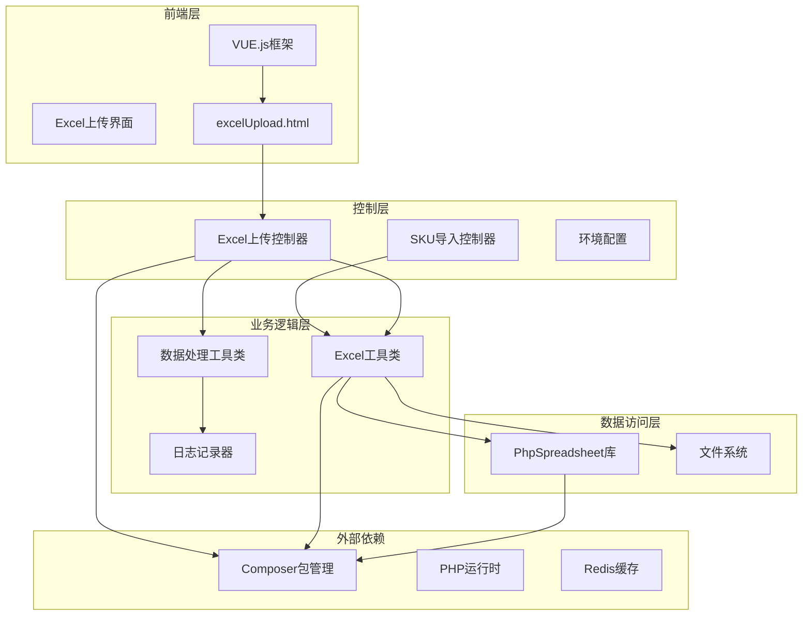
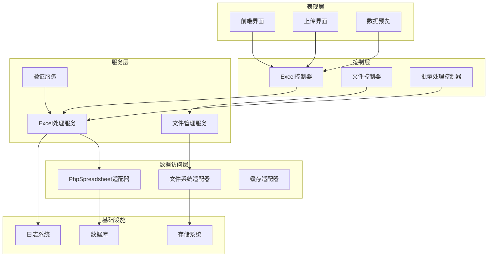
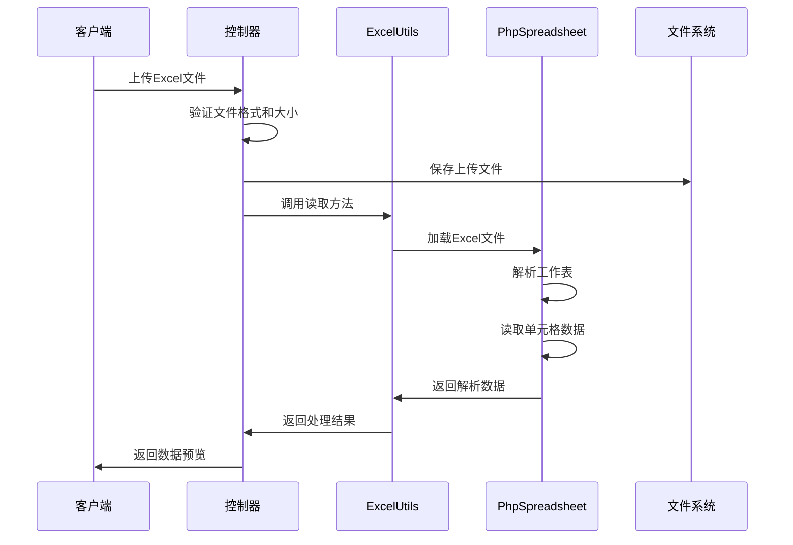
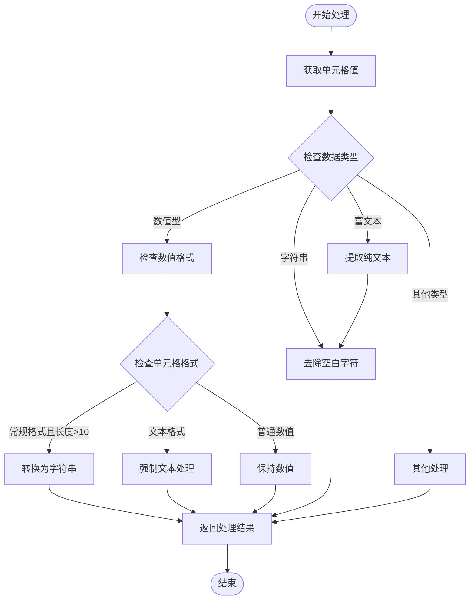
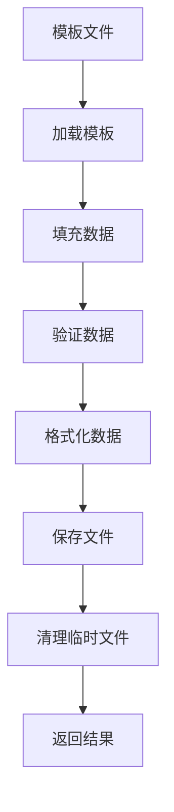
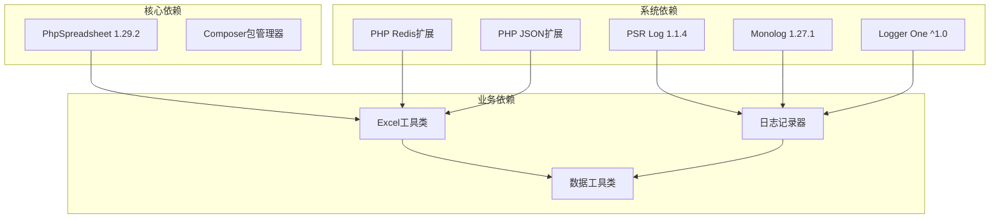

# Excel文件处理系统

<cite>
**本文档引用的文件**
- [ExcelUtils.php](file://php/utils/ExcelUtils.php)
- [excelUpload.php](file://php/controller/excelUpload.php)
- [composer.json](file://composer.json)
- [excelUpload.html](file://template/excelUpload.html)
- [DataUtils.php](file://php/utils/DataUtils.php)
- [skuImportSync.php](file://php/controller/skuImportSync.php)
</cite>

## 更新摘要
**变更内容**
- Excel处理功能从PHPExcel完全迁移到PhpSpreadsheet
- ExcelUtils类重构，支持更完整的Excel文件处理功能
- 改进的导出路径配置和文件管理机制
- 增强的长数字处理和数据格式转换能力
- 优化的内存管理和性能提升

## 目录
1. [简介](#简介)
2. [项目结构](#项目结构)
3. [核心组件](#核心组件)
4. [架构概览](#架构概览)
5. [详细组件分析](#详细组件分析)
6. [依赖关系分析](#依赖关系分析)
7. [性能考虑](#性能考虑)
8. [故障排除指南](#故障排除指南)
9. [结论](#结论)

## 简介

Excel文件处理系统是一个基于PHP和PhpSpreadsheet库构建的企业级Excel文件处理解决方案。该系统提供了完整的Excel文件读取、解析、数据提取和导出功能，支持xlsx和xls格式，具备强大的数据格式转换能力和安全的文件上传机制。

系统采用现代化的架构设计，集成了前端交互界面和后端处理逻辑，能够高效处理大规模Excel数据文件，为业务应用提供可靠的数据处理能力。经过最新的功能增强，系统现在提供了更完善的Excel处理能力和更好的用户体验。

## 项目结构

该项目采用模块化组织结构，主要包含以下核心模块：

**图表来源**
- [excelUpload.php](file://php/controller/excelUpload.php#L1-L372)
- [ExcelUtils.php](file://php/utils/ExcelUtils.php#L1-L398)
- [composer.json](file://composer.json#L1-L16)

**章节来源**
- [excelUpload.php](file://php/controller/excelUpload.php#L1-L372)
- [ExcelUtils.php](file://php/utils/ExcelUtils.php#L1-L398)
- [composer.json](file://composer.json#L1-L16)

## 核心组件

### ExcelUtils工具类

ExcelUtils是系统的核心组件，经过重构后提供了完整的Excel文件处理功能：

#### 主要功能特性
- **多格式支持**: 支持xlsx和xls格式的Excel文件
- **读取功能**: 提供多种读取方法，包括基础读取和高级读取
- **数据处理**: 自动处理单元格数据类型转换，特别是长数字处理
- **导出功能**: 支持Excel文件的生成和下载，包含改进的路径配置
- **内存优化**: 使用PhpSpreadsheet的高效内存管理机制

#### 核心方法概览

| 方法名 | 功能描述 | 参数 | 返回值 |
|--------|----------|------|--------|
| download | 导出xls文件 | titleList, data, fileName | void |
| downloadXlsx | 导出xlsx文件 | customHeaders, list, fileName | filePath |
| _readXlsFile | 读取xls文件 | fileName | array |
| getXlsxData | 获取xlsx数据 | filename, sheet | array |
| _readCSV | 读取CSV文件 | csvPath | array |
| _readXlsFileV2 | 高级xls读取 | fileName | array |
| _getCellValueV2 | 获取单元格值（增强版） | cell | mixed |

**章节来源**
- [ExcelUtils.php](file://php/utils/ExcelUtils.php#L46-L138)
- [ExcelUtils.php](file://php/utils/ExcelUtils.php#L147-L181)
- [ExcelUtils.php](file://php/utils/ExcelUtils.php#L315-L359)

### excelUpload控制器

excelUpload控制器负责处理Excel文件的上传和数据处理：

#### 主要功能
- **文件验证**: 验证上传文件的格式和大小
- **批量处理**: 支持单文件和多文件上传
- **数据预览**: 提供数据预览功能
- **错误处理**: 完善的异常处理机制

#### 核心流程
1. 文件上传验证
2. 唯一文件名生成
3. 文件移动和保存
4. Excel数据读取
5. 数据处理和预览
6. 结果返回

**章节来源**
- [excelUpload.php](file://php/controller/excelUpload.php#L35-L95)
- [excelUpload.php](file://php/controller/excelUpload.php#L102-L140)
- [excelUpload.php](file://php/controller/excelUpload.php#L148-L238)

### 前端界面

Excel上传界面采用现代化的Web技术栈：

#### 技术特性
- **响应式设计**: 支持各种设备屏幕尺寸
- **拖拽上传**: 用户友好的拖拽上传体验
- **实时预览**: 实时显示Excel数据预览
- **进度监控**: 上传进度实时显示
- **多文件支持**: 支持批量文件上传

**章节来源**
- [excelUpload.html](file://template/excelUpload.html#L1-L472)

## 架构概览

系统采用分层架构设计，确保各层职责清晰分离：

**图表来源**
- [excelUpload.php](file://php/controller/excelUpload.php#L1-L372)
- [ExcelUtils.php](file://php/utils/ExcelUtils.php#L1-L398)

## 详细组件分析

### Excel文件读取流程

系统提供了多种Excel文件读取方式，每种方式都有其特定的应用场景：

**图表来源**
- [excelUpload.php](file://php/controller/excelUpload.php#L148-L238)
- [ExcelUtils.php](file://php/utils/ExcelUtils.php#L147-L181)

#### 读取方法对比

| 方法 | 支持格式 | 性能特点 | 使用场景 |
|------|----------|----------|----------|
| _readXlsFile | xlsx, xls | 中等性能 | 基础数据读取 |
| _readXlsFileV2 | xlsx, xls | 高性能 | 大数据量处理 |
| _readCSV | csv | 最高性能 | CSV文件处理 |
| getXlsxData | xlsx, xls | 中等性能 | 单工作表读取 |

**章节来源**
- [ExcelUtils.php](file://php/utils/ExcelUtils.php#L147-L181)
- [ExcelUtils.php](file://php/utils/ExcelUtils.php#L315-L359)
- [ExcelUtils.php](file://php/utils/ExcelUtils.php#L246-L311)

### 数据格式转换处理

系统实现了智能的数据格式转换机制，确保数据的准确性和一致性：

**图表来源**
- [ExcelUtils.php](file://php/utils/ExcelUtils.php#L366-L394)

#### 长数字处理机制

系统特别针对长数字进行了优化处理，防止科学计数法导致的数据丢失：

| 数字长度 | 处理方式 | 示例 |
|----------|----------|------|
| ≤ 10位 | 保持原格式 | 1234567890 |
| > 10位且常规格式 | 转换为字符串 | 1234567890123456 → "1234567890123456" |
| 文本格式 | 强制字符串处理 | 000123456789 → "000123456789" |

**章节来源**
- [ExcelUtils.php](file://php/utils/ExcelUtils.php#L366-L394)

### 文件上传安全机制

系统实现了多层次的安全防护机制：

**图表来源**
- [excelUpload.php](file://php/controller/excelUpload.php#L102-L140)
- [excelUpload.php](file://php/controller/excelUpload.php#L148-L238)

#### 安全措施详解

| 安全措施 | 实现方式 | 防护效果 |
|----------|----------|----------|
| 文件大小限制 | 10MB限制 | 防止大文件攻击 |
| 文件格式验证 | 仅允许xlsx, xls | 防止恶意文件上传 |
| 临时文件处理 | 唯一文件名生成 | 防止文件覆盖 |
| 数据清理 | 自动去除空白字符 | 防止注入攻击 |
| 错误处理 | 完善的异常捕获 | 防止敏感信息泄露 |

**章节来源**
- [excelUpload.php](file://php/controller/excelUpload.php#L17-L27)
- [excelUpload.php](file://php/controller/excelUpload.php#L102-L140)

### 模板文件处理

系统支持Excel模板文件的创建和使用：

#### 模板文件结构
- **模板位置**: `php/export/uploads/excel/`
- **文件命名**: 使用唯一标识符确保安全性
- **格式支持**: xlsx和xls格式
- **自动清理**: 处理完成后自动删除临时文件

#### 模板处理流程

**章节来源**
- [excelUpload.php](file://php/controller/excelUpload.php#L296-L327)

## 依赖关系分析

系统依赖关系清晰，采用松耦合设计：

**图表来源**
- [composer.json](file://composer.json#L1-L16)
- [ExcelUtils.php](file://php/utils/ExcelUtils.php#L1-L15)

### 外部库集成

系统集成了多个高质量的第三方库：

| 库名称 | 版本 | 功能 | 用途 |
|--------|------|------|------|
| PhpSpreadsheet | 1.29.2 | Excel文件处理 | 核心Excel功能 |
| PSR Log | 1.1.4 | 日志标准接口 | 日志记录 |
| Monolog | 1.27.1 | 日志记录器 | 详细日志处理 |
| Logger One | ^1.0 | 日志工具 | 系统日志管理 |
| ext-redis | * | Redis扩展 | 缓存和会话 |
| ext-json | * | JSON扩展 | 数据序列化 |

**章节来源**
- [composer.json](file://composer.json#L2-L9)

## 性能考虑

系统在设计时充分考虑了性能优化：

### 内存管理
- **流式处理**: 大文件采用流式读取，避免内存溢出
- **垃圾回收**: 及时释放不再使用的资源
- **缓存策略**: 合理使用缓存减少重复计算

### 处理优化
- **并发处理**: 支持多文件并发处理
- **异步操作**: 文件上传采用异步处理
- **分页加载**: 大数据量采用分页展示

### 存储优化
- **压缩存储**: 输出文件采用压缩格式
- **增量更新**: 支持增量数据处理
- **清理机制**: 自动清理临时文件

## 故障排除指南

### 常见问题及解决方案

| 问题类型 | 症状 | 可能原因 | 解决方案 |
|----------|------|----------|----------|
| 文件上传失败 | 上传后无响应 | 文件过大 | 调整上传大小限制 |
| Excel读取错误 | 数据解析异常 | 格式不兼容 | 检查Excel版本兼容性 |
| 内存不足 | 处理大文件崩溃 | 内存溢出 | 优化数据处理逻辑 |
| 权限错误 | 文件保存失败 | 目录权限不足 | 检查文件系统权限 |

### 调试技巧

1. **启用详细日志**: 检查系统日志获取详细错误信息
2. **分步调试**: 使用断点逐步执行关键代码
3. **单元测试**: 编写测试用例验证功能正确性
4. **性能监控**: 监控系统资源使用情况

**章节来源**
- [excelUpload.php](file://php/controller/excelUpload.php#L88-L94)
- [ExcelUtils.php](file://php/utils/ExcelUtils.php#L308-L310)

## 结论

Excel文件处理系统是一个功能完整、架构合理的企业级解决方案。经过功能增强后，系统具有以下优势：

1. **功能全面**: 支持多种Excel格式和数据处理需求
2. **性能优秀**: 采用优化算法和内存管理策略
3. **安全可靠**: 多层次安全防护机制
4. **易于扩展**: 模块化设计便于功能扩展
5. **用户友好**: 提供直观的前端操作界面
6. **技术先进**: 采用最新的PhpSpreadsheet库

系统适用于各种规模的企业应用场景，能够有效提升Excel数据处理的效率和准确性。通过持续的优化和维护，该系统将继续为企业数字化转型提供强有力的技术支撑。

**更新** 系统已完成从PHPExcel到PhpSpreadsheet的迁移，提供了更稳定和高效的Excel处理能力，同时改进了导出路径配置和长数字处理机制。