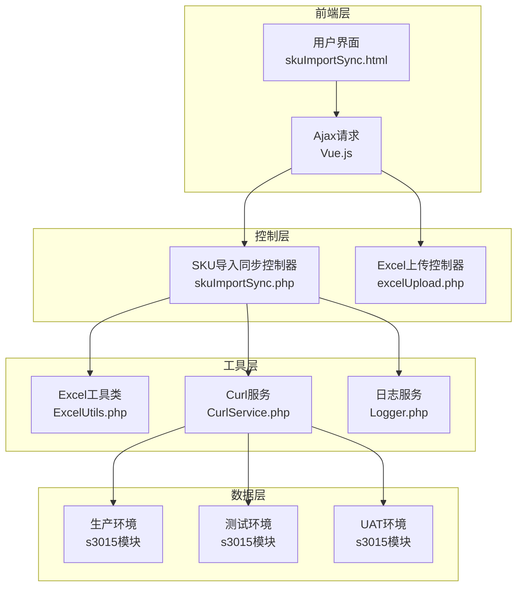
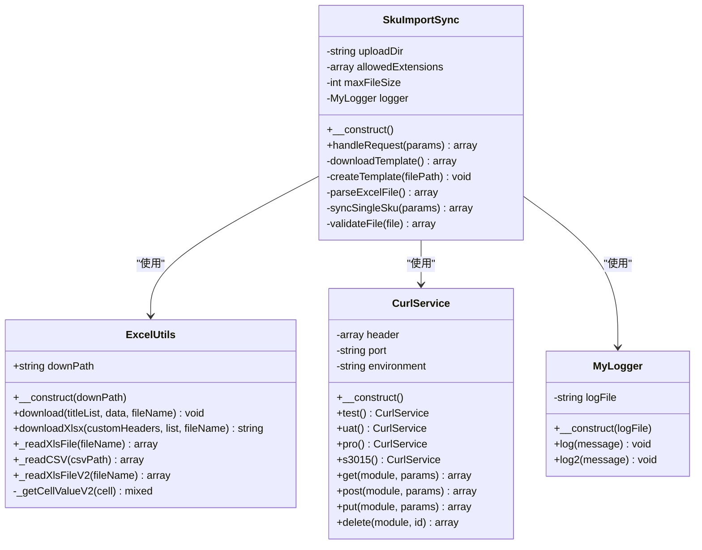
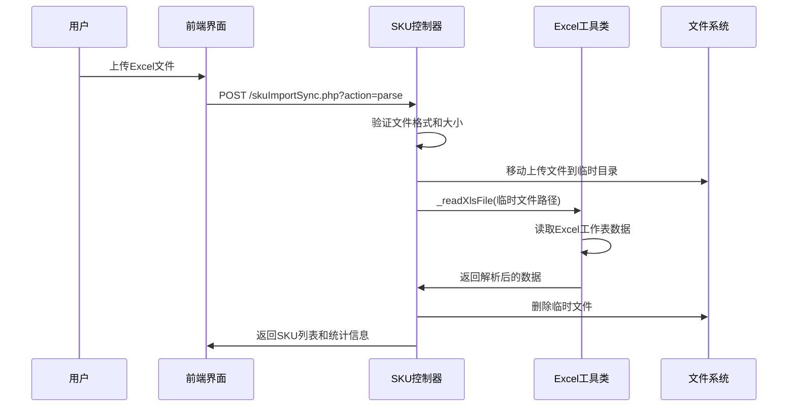
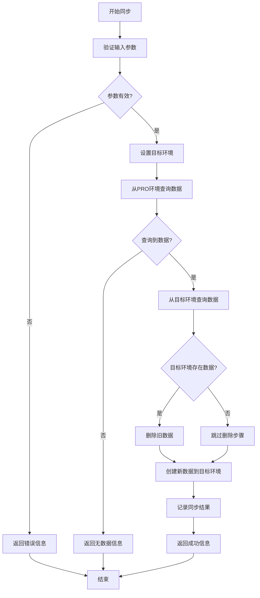
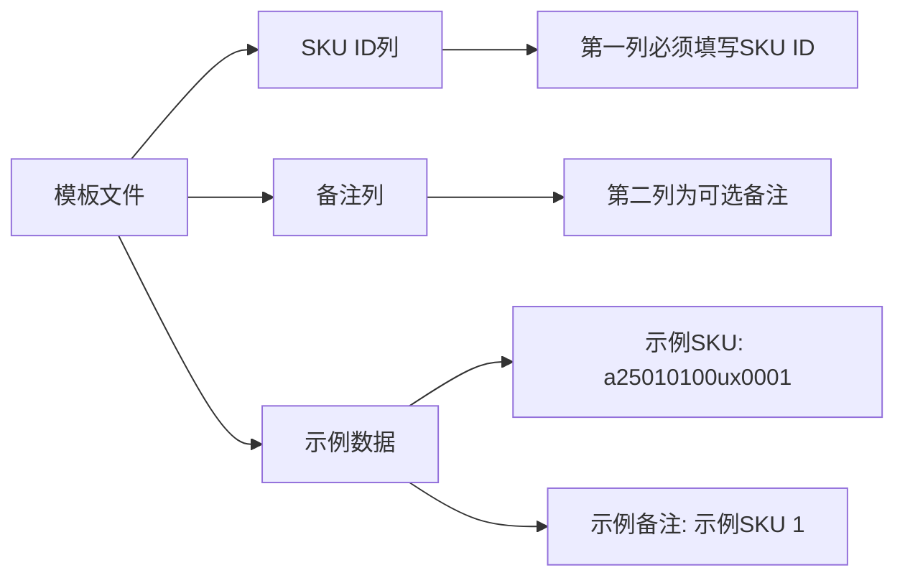
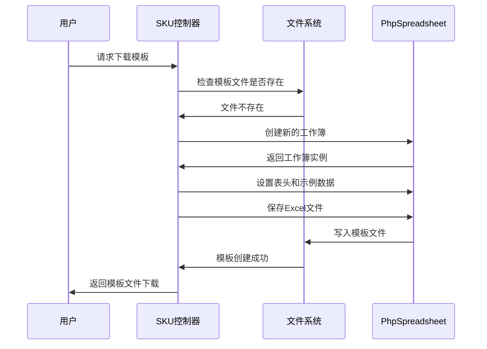
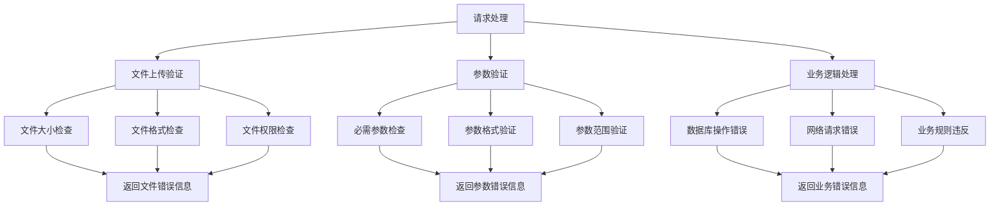

# SKU数据同步系统

<cite>
**本文档引用的文件**
- [skuImportSync.php](file://php/controller/skuImportSync.php)
- [excelUpload.php](file://php/controller/excelUpload.php)
- [ExcelUtils.php](file://php/utils/ExcelUtils.php)
- [CurlService.php](file://php/curl/CurlService.php)
- [Logger.php](file://php/class/Logger.php)
- [skuImportSync.html](file://template/fix/skuImportSync.html)
</cite>

## 目录
1. [项目概述](#项目概述)
2. [系统架构](#系统架构)
3. [核心组件](#核心组件)
4. [工作流程详解](#工作流程详解)
5. [API接口说明](#api接口说明)
6. [模板文件使用](#模板文件使用)
7. [环境配置](#环境配置)
8. [错误处理机制](#错误处理机制)
9. [性能优化建议](#性能优化建议)
10. [使用示例](#使用示例)
11. [故障排除指南](#故障排除指南)
12. [总结](#总结)

## 项目概述

SKU数据同步系统是一个基于PHP的Web应用程序，专门用于从Excel文件导入SKU数据并将其同步到不同的业务环境中。该系统支持跨环境数据同步，包括从生产环境(Pro)查询数据并同步到测试(Test)或UAT环境。

系统采用MVC架构设计，包含前端界面、后端控制器、工具类和数据访问层。通过直观的Web界面，用户可以轻松上传Excel文件、查看同步进度并监控数据一致性。

## 系统架构



**图表来源**
- [skuImportSync.php](file://php/controller/skuImportSync.php#L12-L512)
- [excelUpload.php](file://php/controller/excelUpload.php#L11-L372)
- [ExcelUtils.php](file://php/utils/ExcelUtils.php#L20-L398)
- [CurlService.php](file://php/curl/CurlService.php#L4-L996)

## 核心组件

### SKU导入同步控制器

SKU导入同步控制器是系统的核心组件，负责处理所有SKU数据同步相关的业务逻辑。



**图表来源**
- [skuImportSync.php](file://php/controller/skuImportSync.php#L12-L512)
- [ExcelUtils.php](file://php/utils/ExcelUtils.php#L20-L398)
- [CurlService.php](file://php/curl/CurlService.php#L4-L996)
- [Logger.php](file://php/class/Logger.php#L14-L55)

**章节来源**
- [skuImportSync.php](file://php/controller/skuImportSync.php#L12-L512)
- [ExcelUtils.php](file://php/utils/ExcelUtils.php#L20-L398)
- [CurlService.php](file://php/curl/CurlService.php#L4-L996)
- [Logger.php](file://php/class/Logger.php#L14-L55)

## 工作流程详解

### Excel文件解析流程



**图表来源**
- [skuImportSync.php](file://php/controller/skuImportSync.php#L164-L271)
- [ExcelUtils.php](file://php/utils/ExcelUtils.php#L147-L181)

### SKU同步流程



**图表来源**
- [skuImportSync.php](file://php/controller/skuImportSync.php#L278-L426)

**章节来源**
- [skuImportSync.php](file://php/controller/skuImportSync.php#L164-L426)

## API接口说明

### 主要接口

| 接口名称 | 方法 | URL | 功能描述 | 请求参数 | 响应格式 |
|---------|------|-----|----------|----------|----------|
| 下载模板 | GET | `/php/controller/skuImportSync.php?action=downloadTemplate` | 下载SKU导入模板文件 | 无 | Excel文件流 |
| 解析Excel | POST | `/php/controller/skuImportSync.php?action=parse` | 解析上传的Excel文件 | `excelFile`(文件) | JSON |
| 同步SKU | POST | `/php/controller/skuImportSync.php?action=sync` | 同步单个SKU数据 | `skuId`, `module`, `port`, `field`, `targetEnv` | JSON |

### 请求参数详细说明

#### 同步SKU接口参数

| 参数名 | 类型 | 必需 | 描述 | 示例值 |
|--------|------|------|------|--------|
| action | string | 是 | 操作类型，固定为"sync" | "sync" |
| skuId | string | 是 | SKU标识符 | "a25010100ux0001" |
| module | string | 是 | 目标模块名称 | "amazon_asins" |
| port | string | 是 | 端口号 | "s3015" |
| field | string | 是 | 查询字段 | "skuId" |
| targetEnv | string | 否 | 目标环境(test或uat，默认test) | "test" |

#### 响应格式

```json
{
  "success": true,
  "message": "SKU同步成功信息",
  "data": {
    "skuId": "a25010100ux0001",
    "module": "amazon_asins",
    "targetEnv": "test",
    "sourceCount": 1,
    "targetCount": 0
  }
}
```

**章节来源**
- [skuImportSync.php](file://php/controller/skuImportSync.php#L474-L512)

## 模板文件使用

### 模板文件结构

系统提供了完整的Excel模板文件，用于标准化SKU数据的导入格式。



**图表来源**
- [skuImportSync.php](file://php/controller/skuImportSync.php#L116-L158)

### 模板创建流程



**图表来源**
- [skuImportSync.php](file://php/controller/skuImportSync.php#L83-L158)

**章节来源**
- [skuImportSync.php](file://php/controller/skuImportSync.php#L83-L158)

## 环境配置

### 支持的环境

系统支持四种运行环境，每种环境都有对应的配置：

| 环境类型 | 端点配置 | 用途 | 认证方式 |
|----------|----------|------|----------|
| Local | 本地IP:30000 | 开发调试 | 本地配置 |
| Test | 172.16.10.62:30015 | 测试验证 | Bearer Token |
| UAT | 172.16.11.221:30015 | 用户验收测试 | Bearer Token |
| Production | master环境 | 生产部署 | Bearer Token |

### 环境切换机制

```mermaid
flowchart TD
A[设置环境] --> B{选择环境}
B --> |test| C[调用test()方法]
B --> |uat| D[调用uat()方法]
B --> |pro| E[调用pro()方法]
B --> |local| F[调用local()方法]
C --> G[设置Test环境端点]
D --> H[设置UAT环境端点]
E --> I[设置Production端点]
F --> J[设置Local环境端点]
G --> K[返回CurlService实例]
H --> K
I --> K
J --> K
```

**图表来源**
- [CurlService.php](file://php/curl/CurlService.php#L98-L143)

**章节来源**
- [CurlService.php](file://php/curl/CurlService.php#L98-L143)

## 错误处理机制

### 错误分类与处理

系统实现了多层次的错误处理机制：



**图表来源**
- [skuImportSync.php](file://php/controller/skuImportSync.php#L433-L471)
- [excelUpload.php](file://php/controller/excelUpload.php#L102-L140)

### 错误日志记录

系统使用统一的日志记录机制，确保所有错误都能被追踪和分析：

| 日志级别 | 用途 | 记录内容 |
|----------|------|----------|
| 信息日志 | 系统运行状态 | 请求处理、操作执行 |
| 错误日志 | 错误信息 | 异常捕获、错误详情 |
| 调试日志 | 开发调试 | 详细执行流程、变量状态 |

**章节来源**
- [Logger.php](file://php/class/Logger.php#L22-L37)
- [skuImportSync.php](file://php/controller/skuImportSync.php#L414-L425)

## 性能优化建议

### 内存管理

1. **大文件处理**: 系统使用PhpSpreadsheet进行Excel文件读取，具有良好的内存管理能力
2. **临时文件清理**: 自动清理上传的临时文件，避免磁盘空间占用
3. **批量操作**: 支持批量SKU同步，减少网络请求次数

### 缓存策略

1. **模板缓存**: 模板文件在首次使用后会缓存到本地
2. **环境配置**: CurlService实例可以复用，避免重复初始化
3. **日志文件**: 按日期分割日志文件，便于管理和清理

### 并发处理

1. **异步处理**: 前端使用异步请求，避免页面阻塞
2. **进度反馈**: 实时显示同步进度，提升用户体验
3. **错误隔离**: 单个SKU同步失败不影响其他SKU的处理

## 使用示例

### 基本使用流程

1. **下载模板文件**
   ```bash
   curl -O http://localhost/php/controller/skuImportSync.php?action=downloadTemplate
   ```

2. **填写Excel数据**
   - 第一列：SKU ID
   - 第二列：可选备注
   - 支持批量导入，每行一个SKU

3. **上传并解析文件**
   ```bash
   curl -X POST -F "excelFile=@sku_data.xlsx" \
        -F "action=parse" \
        http://localhost/php/controller/skuImportSync.php
   ```

4. **开始同步**
   ```bash
   curl -X POST -H "Content-Type: application/json" \
        -d '{
            "action": "sync",
            "skuId": "a25010100ux0001",
            "module": "amazon_asins",
            "port": "s3015",
            "field": "skuId",
            "targetEnv": "test"
        }' \
        http://localhost/php/controller/skuImportSync.php
   ```

### 批量同步示例

```javascript
// 前端JavaScript示例
const skuList = ['SKU001', 'SKU002', 'SKU003'];
const syncModules = [
    { module: "amazon_asins", port: "s3015", field: "skuId" },
    { module: "product-skus", port: "s3015", field: "productId" }
];

skuList.forEach(skuId => {
    syncModules.forEach(moduleInfo => {
        fetch('/php/controller/skuImportSync.php', {
            method: 'POST',
            headers: { 'Content-Type': 'application/json' },
            body: JSON.stringify({
                action: 'sync',
                skuId: skuId,
                module: moduleInfo.module,
                port: moduleInfo.port,
                field: moduleInfo.field,
                targetEnv: 'test'
            })
        });
    });
});
```

**章节来源**
- [skuImportSync.html](file://template/fix/skuImportSync.html#L458-L560)

## 故障排除指南

### 常见问题及解决方案

#### 文件上传问题

| 问题症状 | 可能原因 | 解决方案 |
|----------|----------|----------|
| 文件上传失败 | 文件大小超过限制 | 减少文件大小或调整服务器配置 |
| 文件格式不支持 | 非Excel格式 | 确保使用.xlsx或.xls格式 |
| 权限错误 | 目录权限不足 | 检查上传目录权限 |
| 解析失败 | Excel格式损坏 | 重新创建Excel文件 |

#### 同步失败问题

| 问题症状 | 可能原因 | 解决方案 |
|----------|----------|----------|
| 查询无数据 | SKU不存在 | 检查SKU ID是否正确 |
| 删除失败 | 权限不足 | 检查目标环境权限 |
| 创建失败 | 数据冲突 | 检查目标环境数据状态 |
| 网络超时 | 服务器连接问题 | 检查网络连接和服务器状态 |

#### 日志分析

系统会在以下位置记录日志：
- `php/log/default/` - 默认日志文件
- `php/log/sku_import_sync_YYYYMMDD.log` - SKU同步专用日志
- `php/log/curl/request_YYYYMMDD.log` - API请求日志

**章节来源**
- [skuImportSync.php](file://php/controller/skuImportSync.php#L414-L425)
- [Logger.php](file://php/class/Logger.php#L17-L25)

## 总结

SKU数据同步系统是一个功能完整、架构清晰的企业级应用。系统的主要特点包括：

1. **完整的功能覆盖**: 从Excel文件解析到数据同步的全流程支持
2. **多环境支持**: 支持Test、UAT、Production等多种环境
3. **用户友好**: 提供直观的Web界面和实时进度反馈
4. **健壮性**: 完善的错误处理和日志记录机制
5. **可扩展性**: 模块化设计，易于功能扩展和维护

系统适用于需要批量同步SKU数据到不同业务环境的场景，能够显著提高数据同步效率和准确性。通过合理的配置和使用，可以满足大多数SKU数据管理需求。