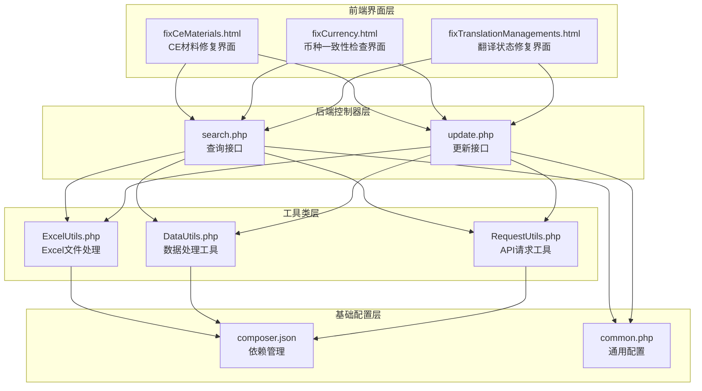
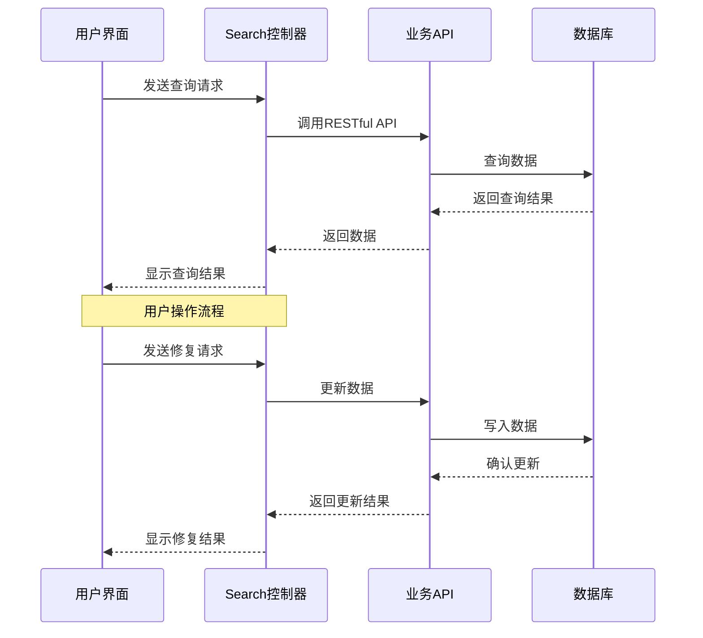
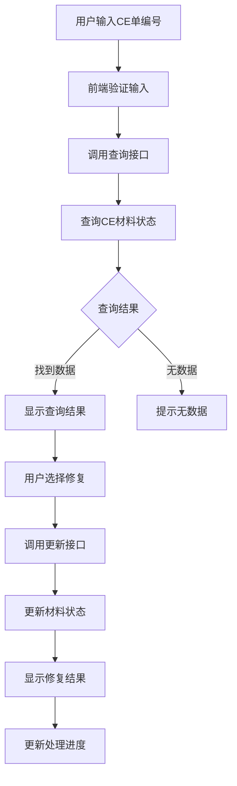
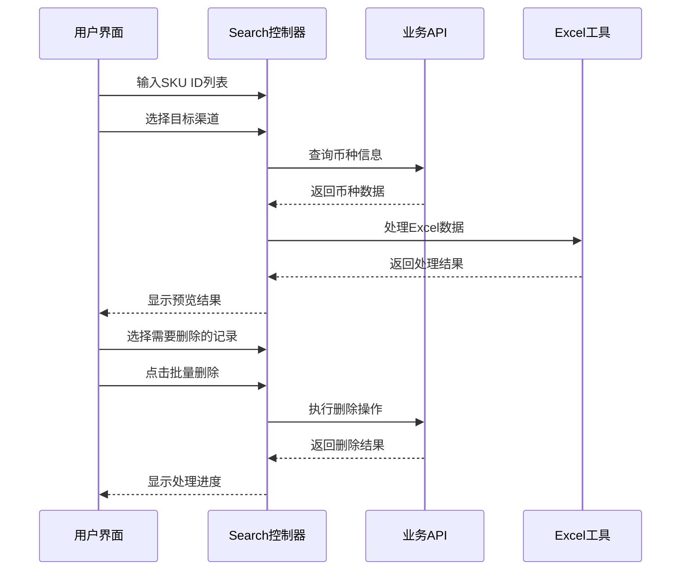
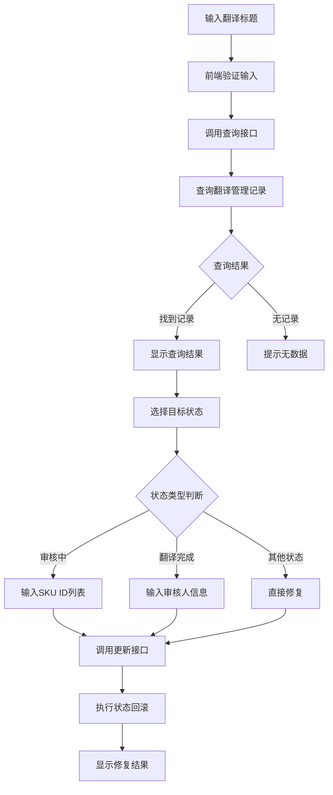
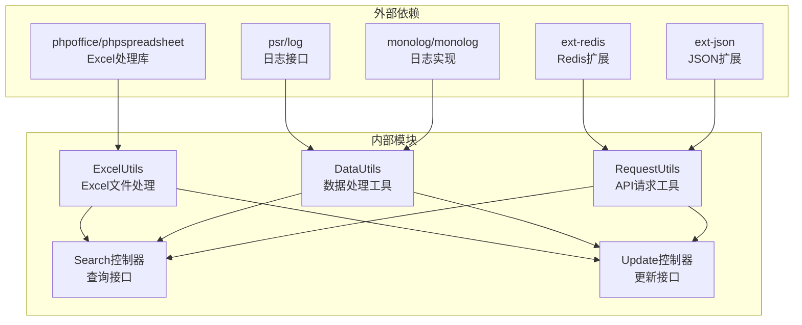

# 数据修复工具集

<cite>
**本文档引用的文件**
- [search.php](file://php/controller/search.php)
- [update.php](file://php/controller/update.php)
- [fixCeMaterials.html](file://template/fix/fixCeMaterials.html)
- [fixCurrency.html](file://template/fix/fixCurrency.html)
- [fixTranslationManagements.html](file://template/fix/fixTranslationManagements.html)
- [ExcelUtils.php](file://php/utils/ExcelUtils.php)
- [DataUtils.php](file://php/utils/DataUtils.php)
- [RequestUtils.php](file://php/utils/RequestUtils.php)
- [composer.json](file://composer.json)
- [common.php](file://php/common.php)
</cite>

## 目录
1. [简介](#简介)
2. [项目结构](#项目结构)
3. [核心组件](#核心组件)
4. [架构概览](#架构概览)
5. [详细组件分析](#详细组件分析)
6. [依赖关系分析](#依赖关系分析)
7. [性能考虑](#性能考虑)
8. [故障排除指南](#故障排除指南)
9. [结论](#结论)

## 简介

数据修复工具集是一个基于PHP的综合性数据修复平台，专门用于解决业务系统中的数据不一致问题。该工具集提供了多种数据修复功能，包括CE材料修复、币种一致性检查、翻译状态修复等核心工具。

该系统采用前后端分离架构，前端使用Vue.js框架构建用户界面，后端通过PHP控制器处理业务逻辑，底层依赖RESTful API与业务系统进行数据交互。系统支持多环境部署（测试、开发、UAT、生产），具备完善的日志记录和错误处理机制。

## 项目结构

**图表来源**
- [search.php](file://php/controller/search.php#L1-L719)
- [update.php](file://php/controller/update.php#L1-L1017)
- [fixCeMaterials.html](file://template/fix/fixCeMaterials.html#L1-L348)
- [fixCurrency.html](file://template/fix/fixCurrency.html#L1-L645)
- [fixTranslationManagements.html](file://template/fix/fixTranslationManagements.html#L1-L451)

**章节来源**
- [search.php](file://php/controller/search.php#L1-L719)
- [update.php](file://php/controller/update.php#L1-L1017)
- [composer.json](file://composer.json#L1-L11)

## 核心组件

### 1. 查询接口模块 (search.php)

查询接口模块负责处理所有数据查询请求，支持多种数据修复场景：

- **翻译管理查询**：支持按标题查询翻译管理记录
- **CE材料查询**：支持按CE单编号查询材料状态
- **币种信息查询**：支持批量查询SKU币种信息
- **产品线查询**：支持查询产品操作线信息
- **库存配置查询**：支持查询FBA渠道库存配置

### 2. 更新接口模块 (update.php)

更新接口模块负责执行数据修复操作：

- **翻译状态回滚**：支持将翻译状态回滚到指定状态
- **CE材料状态修复**：支持将CE材料状态修复为已发布
- **产品线修复**：支持为SKU补充产品线信息
- **留样状态更新**：支持更新样品留样状态

### 3. 前端界面模块

前端界面模块提供直观的用户操作界面：

- **CE材料修复界面**：提供CE单查询和状态修复功能
- **币种一致性检查界面**：提供币种信息预览和批量删除功能
- **翻译状态修复界面**：提供翻译状态回滚和批量处理功能

**章节来源**
- [search.php](file://php/controller/search.php#L27-L719)
- [update.php](file://php/controller/update.php#L13-L1017)
- [fixCeMaterials.html](file://template/fix/fixCeMaterials.html#L184-L348)

## 架构概览

**图表来源**
- [search.php](file://php/controller/search.php#L657-L719)
- [update.php](file://php/controller/update.php#L657-L1017)

系统采用分层架构设计，确保了良好的可维护性和扩展性。每层职责明确，便于单独测试和部署。

## 详细组件分析

### CE材料修复工具

#### 功能概述
CE材料修复工具用于将CE材料状态从非发布状态修复为已发布状态，支持批量处理和状态跟踪。

#### 使用流程

**图表来源**
- [fixCeMaterials.html](file://template/fix/fixCeMaterials.html#L259-L343)
- [search.php](file://php/controller/search.php#L57-L76)
- [update.php](file://php/controller/update.php#L138-L165)

#### 配置选项
- **查询参数**：CE单编号（支持批量查询）
- **状态映射**：支持的状态包括新建、开发完成、销售完成、资料发布、作废
- **批量处理**：支持多条记录同时修复

#### 执行参数
- `_id`：CE材料记录ID
- `status`：目标状态（materialComplete）

#### 安全注意事项
- 环境隔离：支持多环境部署，避免误操作影响生产数据
- 权限控制：通过环境变量控制不同环境的操作权限
- 日志记录：所有修复操作都会记录详细的日志信息

**章节来源**
- [fixCeMaterials.html](file://template/fix/fixCeMaterials.html#L184-L348)
- [search.php](file://php/controller/search.php#L57-L76)
- [update.php](file://php/controller/update.php#L138-L165)

### 币种一致性检查工具

#### 功能概述
币种一致性检查工具用于检测和修复SKU在不同渠道的币种不一致问题，提供预览和批量删除功能。

#### 使用流程

**图表来源**
- [fixCurrency.html](file://template/fix/fixCurrency.html#L413-L607)
- [search.php](file://php/controller/search.php#L555-L652)

#### 配置选项
- **SKU ID限制**：单次最多查询500个SKU
- **渠道选择**：支持Amazon各站点渠道选择
- **自定义渠道**：支持输入自定义渠道名称
- **批量处理**：支持按SKU分组批量处理

#### 执行参数
- `skuIdList`：SKU ID数组
- `channels`：目标渠道数组
- `skuId`：单个SKU ID
- `channelData`：渠道数据映射

#### 安全注意事项
- **数据验证**：对输入的SKU ID进行去重和格式验证
- **批量限制**：限制单次处理的数据量，避免系统过载
- **进度跟踪**：实时显示处理进度，便于监控操作状态

**章节来源**
- [fixCurrency.html](file://template/fix/fixCurrency.html#L312-L642)
- [search.php](file://php/controller/search.php#L555-L652)
- [ExcelUtils.php](file://php/utils/ExcelUtils.php#L1-L398)

### 翻译状态修复工具

#### 功能概述
翻译状态修复工具用于将翻译管理记录回滚到指定状态，支持按标题精确查询和批量处理。

#### 使用流程

**图表来源**
- [fixTranslationManagements.html](file://template/fix/fixTranslationManagements.html#L301-L438)
- [search.php](file://php/controller/search.php#L32-L48)
- [update.php](file://php/controller/update.php#L32-L131)

#### 配置选项
- **状态选择**：支持已选品、审核中、翻译完成、已作废状态
- **SKU ID过滤**：审核中状态支持按SKU ID精确处理
- **审核信息**：翻译完成状态需要审核人和审核时间
- **批量处理**：支持整条记录和指定SKU的批量处理

#### 执行参数
- `title`：翻译标题
- `status`：目标状态
- `applyName`：审核人姓名
- `applyTime`：审核时间
- `skuIdList`：SKU ID列表

#### 安全注意事项
- **状态验证**：检查目标状态的合法性
- **数据完整性**：确保主表和子表状态的一致性
- **权限控制**：不同状态的修复需要相应的权限验证

**章节来源**
- [fixTranslationManagements.html](file://template/fix/fixTranslationManagements.html#L224-L448)
- [search.php](file://php/controller/search.php#L32-L48)
- [update.php](file://php/controller/update.php#L32-L131)

## 依赖关系分析

**图表来源**
- [composer.json](file://composer.json#L1-L11)
- [ExcelUtils.php](file://php/utils/ExcelUtils.php#L1-L15)
- [DataUtils.php](file://php/utils/DataUtils.php#L1-L10)

### 核心依赖说明

#### PHPExcel迁移
系统已从PHPExcel迁移到PhpSpreadsheet，提供更好的性能和兼容性。新的Excel处理工具支持更丰富的数据类型和格式。

#### 日志系统
采用Monolog日志系统，支持多种日志级别和输出格式，便于问题追踪和调试。

#### Redis集成
通过Redis服务实现数据缓存和会话管理，提高系统响应速度和并发处理能力。

**章节来源**
- [composer.json](file://composer.json#L1-L11)
- [ExcelUtils.php](file://php/utils/ExcelUtils.php#L1-L15)
- [DataUtils.php](file://php/utils/DataUtils.php#L1-L10)

## 性能考虑

### 1. 批量处理优化
- **分块处理**：所有批量操作都采用分块处理策略，避免内存溢出
- **并发控制**：合理控制并发请求数量，避免系统过载
- **进度反馈**：实时显示处理进度，提升用户体验

### 2. 缓存策略
- **Redis缓存**：敏感数据通过Redis缓存提高访问速度
- **Excel缓存**：大文件处理时采用流式读取减少内存占用
- **API缓存**：对频繁查询的API结果进行缓存

### 3. 错误处理
- **异常捕获**：完善的异常处理机制，确保系统稳定性
- **重试机制**：网络异常时自动重试，提高成功率
- **降级策略**：服务不可用时提供降级方案

## 故障排除指南

### 常见问题及解决方案

#### 1. 查询无结果
**问题描述**：输入正确的查询条件但无返回结果  
**可能原因**：
- 查询条件不匹配
- 数据尚未同步
- 权限不足

**解决方案**：
- 检查查询条件的准确性
- 确认数据同步状态
- 验证用户权限

#### 2. 修复操作失败
**问题描述**：修复操作执行后状态未改变  
**可能原因**：
- 目标状态不合法
- 数据已被锁定
- 系统异常

**解决方案**：
- 检查目标状态的合法性
- 确认数据状态未被其他进程修改
- 查看系统日志了解具体错误

#### 3. Excel处理异常
**问题描述**：Excel文件处理时报错  
**可能原因**：
- 文件格式不支持
- 文件损坏
- 内存不足

**解决方案**：
- 确认文件格式为xlsx或xls
- 检查文件完整性
- 减少单次处理的数据量

### 调试工具

#### 日志分析
系统提供详细的日志记录功能，包括：
- 请求日志：记录所有API请求的详细信息
- 错误日志：记录系统异常和错误信息
- 性能日志：记录操作耗时和性能指标

#### 环境诊断
- **环境检测**：自动检测当前运行环境
- **依赖检查**：检查系统依赖是否正常
- **权限验证**：验证用户操作权限

**章节来源**
- [search.php](file://php/controller/search.php#L21-L24)
- [update.php](file://php/controller/update.php#L22-L25)

## 结论

数据修复工具集是一个功能完善、架构清晰的数据修复平台。通过模块化设计和分层架构，系统实现了高可用性和易维护性。

### 主要优势
1. **功能全面**：涵盖CE材料、币种检查、翻译状态等多个修复场景
2. **操作简便**：提供直观的Web界面，降低使用门槛
3. **安全可靠**：完善的权限控制和日志记录机制
4. **性能优秀**：采用分块处理和缓存策略，保证系统性能
5. **易于扩展**：模块化设计便于功能扩展和维护

### 应用建议
1. **定期维护**：建立定期的数据质量检查机制
2. **权限管理**：严格控制修复操作的权限范围
3. **备份策略**：重要修复操作前做好数据备份
4. **监控告警**：建立系统监控和异常告警机制

该工具集为业务系统的数据治理提供了强有力的技术支撑，有助于提升数据质量和系统稳定性。