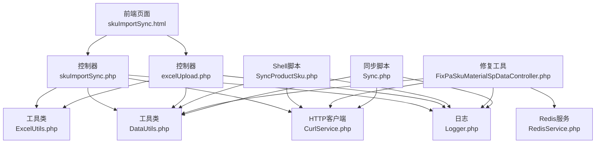
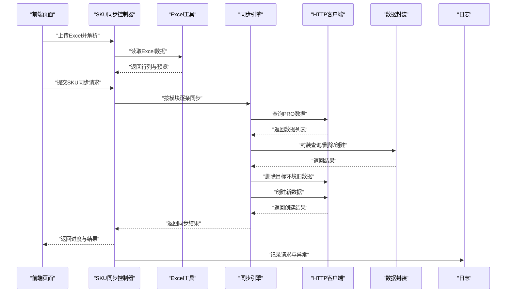
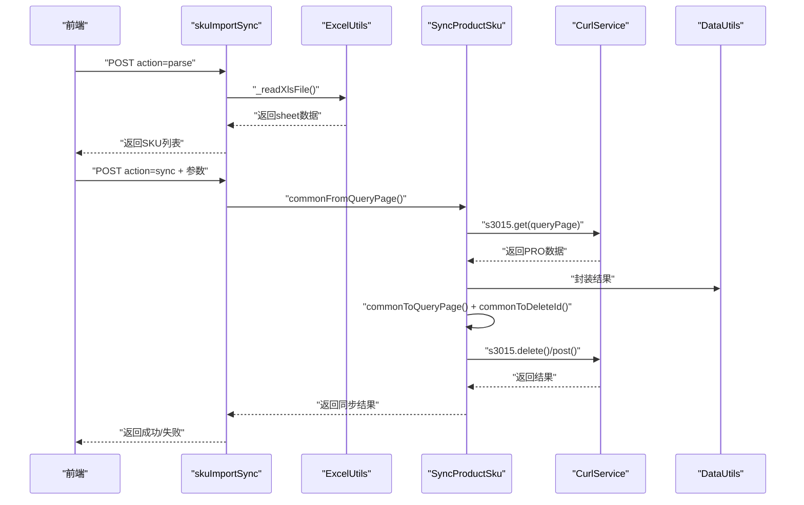
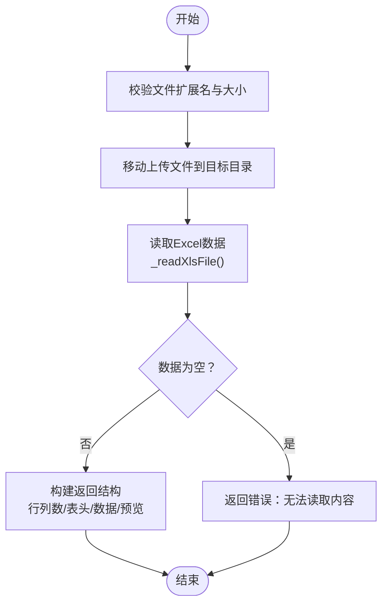
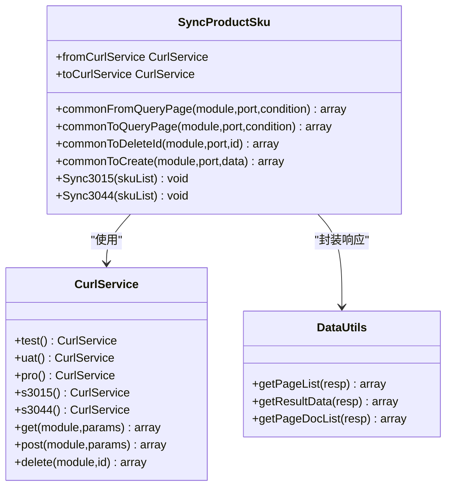
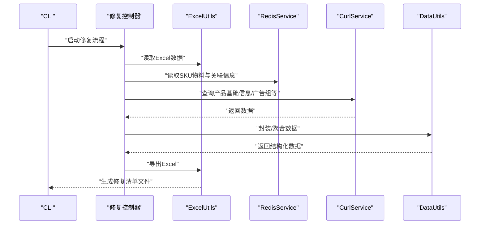
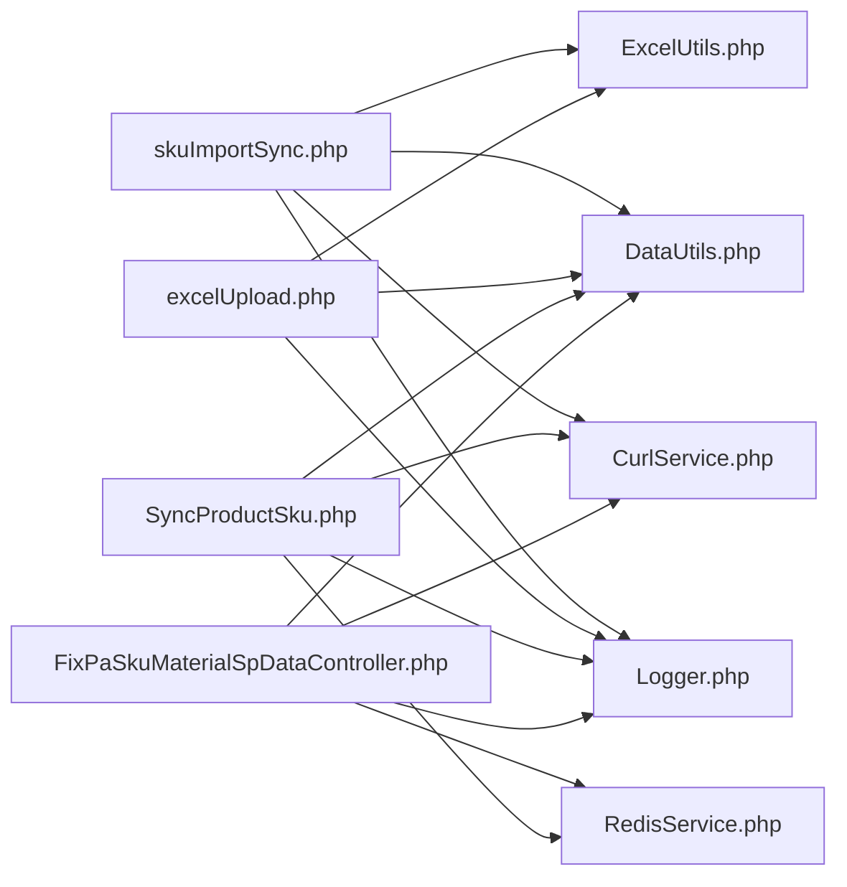

# 核心功能模块

<cite>
**本文引用的文件**
- [php/controller/skuImportSync.php](file://php/controller/skuImportSync.php)
- [template/fix/skuImportSync.html](file://template/fix/skuImportSync.html)
- [php/controller/excelUpload.php](file://php/controller/excelUpload.php)
- [php/utils/ExcelUtils.php](file://php/utils/ExcelUtils.php)
- [php/shell/SyncProductSku.php](file://php/shell/SyncProductSku.php)
- [php/curl/CurlService.php](file://php/curl/CurlService.php)
- [php/utils/DataUtils.php](file://php/utils/DataUtils.php)
- [php/utils/RequestUtils.php](file://php/utils/RequestUtils.php)
- [php/redis/RedisService.php](file://php/redis/RedisService.php)
- [php/class/Logger.php](file://php/class/Logger.php)
- [php/shell/Sync.php](file://php/shell/Sync.php)
- [php/shell/FixPaSkuMaterialSpDataController.php](file://php/shell/FixPaSkuMaterialSpDataController.php)
</cite>

## 目录
1. [简介](#简介)
2. [项目结构](#项目结构)
3. [核心组件](#核心组件)
4. [架构总览](#架构总览)
5. [详细组件分析](#详细组件分析)
6. [依赖分析](#依赖分析)
7. [性能考虑](#性能考虑)
8. [故障排查指南](#故障排查指南)
9. [结论](#结论)
10. [附录](#附录)

## 简介
本文件面向PaSystem核心功能模块，系统性梳理以下四大模块：
- SKU数据同步系统：支持Excel导入、SKU列表解析、跨环境（PRO↔TEST/UAT）同步。
- Excel文件处理系统：统一的Excel读取、写入、预览与批量上传能力。
- 跨环境数据同步：基于统一的HTTP客户端封装，实现模块级数据迁移与校验。
- 数据修复工具集：针对特定业务数据（如资呈广告数据）的修复与导出工具。

模块间通过统一的HTTP客户端、数据工具类与日志/Redis服务协同，形成清晰的职责边界与数据流。

## 项目结构
PaSystem采用“控制器-工具类-Shell脚本-前端页面”的分层组织方式：
- 控制器层：php/controller/ 提供Web API入口，负责请求解析、参数校验与结果返回。
- 工具类层：php/utils/ 与 php/curl/ 提供Excel读写、HTTP请求、数据封装与环境切换。
- Shell脚本层：php/shell/ 提供命令行批量同步与修复工具。
- 前端页面层：template/fix/ 提供可视化界面，驱动SKU同步与Excel处理流程。
- 日志与缓存：php/class/Logger.php 与 php/redis/RedisService.php 提供日志与Redis访问。

图表来源
- [template/fix/skuImportSync.html](file://template/fix/skuImportSync.html#L1-L585)
- [php/controller/skuImportSync.php](file://php/controller/skuImportSync.php#L1-L512)
- [php/controller/excelUpload.php](file://php/controller/excelUpload.php#L1-L372)
- [php/utils/ExcelUtils.php](file://php/utils/ExcelUtils.php#L1-L398)
- [php/utils/DataUtils.php](file://php/utils/DataUtils.php#L1-L802)
- [php/curl/CurlService.php](file://php/curl/CurlService.php#L1-L996)
- [php/shell/SyncProductSku.php](file://php/shell/SyncProductSku.php#L1-L213)
- [php/shell/FixPaSkuMaterialSpDataController.php](file://php/shell/FixPaSkuMaterialSpDataController.php#L1-L593)
- [php/shell/Sync.php](file://php/shell/Sync.php#L1-L80)
- [php/redis/RedisService.php](file://php/redis/RedisService.php#L1-L77)
- [php/class/Logger.php](file://php/class/Logger.php#L1-L55)

章节来源
- [php/controller/skuImportSync.php](file://php/controller/skuImportSync.php#L1-L512)
- [php/controller/excelUpload.php](file://php/controller/excelUpload.php#L1-L372)
- [php/utils/ExcelUtils.php](file://php/utils/ExcelUtils.php#L1-L398)
- [php/shell/SyncProductSku.php](file://php/shell/SyncProductSku.php#L1-L213)
- [php/shell/FixPaSkuMaterialSpDataController.php](file://php/shell/FixPaSkuMaterialSpDataController.php#L1-L593)
- [php/shell/Sync.php](file://php/shell/Sync.php#L1-L80)
- [php/redis/RedisService.php](file://php/redis/RedisService.php#L1-L77)
- [php/class/Logger.php](file://php/class/Logger.php#L1-L55)

## 核心组件
- SKU数据同步系统
  - 职责：接收Excel文件，解析SKU列表，按模块与字段从PRO查询数据并同步至TEST/UAT环境。
  - 关键类：skuImportSync.php（控制器）、SyncProductSku.php（同步引擎）、CurlService.php（HTTP封装）、DataUtils.php（响应封装）。
- Excel文件处理系统
  - 职责：统一读取Excel（xlsx/xls/csv），生成预览，支持单/多文件上传与批量处理。
  - 关键类：excelUpload.php（控制器）、ExcelUtils.php（读写封装）。
- 跨环境数据同步
  - 职责：提供通用的查询/删除/创建接口，支持按模块批量同步。
  - 关键类：SyncProductSku.php、CurlService.php、DataUtils.php。
- 数据修复工具集
  - 职责：基于Redis聚合与查询，修复特定业务数据并导出报表。
  - 关键类：FixPaSkuMaterialSpDataController.php、RedisService.php、CurlService.php、DataUtils.php。

章节来源
- [php/controller/skuImportSync.php](file://php/controller/skuImportSync.php#L1-L512)
- [php/shell/SyncProductSku.php](file://php/shell/SyncProductSku.php#L1-L213)
- [php/utils/ExcelUtils.php](file://php/utils/ExcelUtils.php#L1-L398)
- [php/controller/excelUpload.php](file://php/controller/excelUpload.php#L1-L372)
- [php/shell/FixPaSkuMaterialSpDataController.php](file://php/shell/FixPaSkuMaterialSpDataController.php#L1-L593)

## 架构总览
系统围绕“控制器-工具类-HTTP客户端-数据封装-日志/缓存”构建，前端通过AJAX调用控制器，控制器再委托工具类与HTTP客户端完成数据读取与跨环境同步。

图表来源
- [template/fix/skuImportSync.html](file://template/fix/skuImportSync.html#L352-L585)
- [php/controller/skuImportSync.php](file://php/controller/skuImportSync.php#L40-L426)
- [php/utils/ExcelUtils.php](file://php/utils/ExcelUtils.php#L147-L181)
- [php/shell/SyncProductSku.php](file://php/shell/SyncProductSku.php#L45-L64)
- [php/curl/CurlService.php](file://php/curl/CurlService.php#L295-L433)
- [php/utils/DataUtils.php](file://php/utils/DataUtils.php#L18-L84)
- [php/class/Logger.php](file://php/class/Logger.php#L22-L37)

## 详细组件分析

### SKU数据同步系统
- 功能概述
  - Excel模板下载与生成：支持动态创建模板并下载。
  - Excel解析：读取xlsx/xls，提取第一列SKU，去重并返回统计。
  - 跨环境同步：按模块与字段从PRO查询，删除目标环境旧数据，创建新数据。
  - 环境选择：支持TEST/UAT目标环境切换。
- 关键流程
  - 模板下载：downloadTemplate() 生成并输出模板文件。
  - 文件解析：parseExcelFile() 校验文件、移动到上传目录、读取数据、提取SKU。
  - 同步执行：syncSingleSku() 构造查询条件，按模块循环同步。
- 参数与配置
  - 上传限制：最大2MB，扩展名xlsx/xls。
  - 目标环境：仅支持test、uat。
  - 模块映射：内置s3015模块与字段映射清单。
- API接口
  - GET /skuImportSync.php?action=downloadTemplate：下载模板。
  - POST /skuImportSync.php：上传Excel或JSON参数触发解析/同步。
- 使用模式
  - 前端拖拽/点击上传Excel，解析后展示SKU数量，选择目标环境后逐模块同步。
- 扩展点
  - 新增模块：在SyncProductSku.php中添加模块与字段映射。
  - 自定义字段：在skuImportSync.php中调整字段校验与条件构造。
  - 环境扩展：在CurlService.php中增加环境配置。

图表来源
- [php/controller/skuImportSync.php](file://php/controller/skuImportSync.php#L83-L271)
- [php/controller/skuImportSync.php](file://php/controller/skuImportSync.php#L278-L426)
- [php/utils/ExcelUtils.php](file://php/utils/ExcelUtils.php#L147-L181)
- [php/shell/SyncProductSku.php](file://php/shell/SyncProductSku.php#L45-L64)
- [php/curl/CurlService.php](file://php/curl/CurlService.php#L295-L433)
- [php/utils/DataUtils.php](file://php/utils/DataUtils.php#L18-L84)

章节来源
- [php/controller/skuImportSync.php](file://php/controller/skuImportSync.php#L1-L512)
- [template/fix/skuImportSync.html](file://template/fix/skuImportSync.html#L352-L585)
- [php/shell/SyncProductSku.php](file://php/shell/SyncProductSku.php#L82-L200)

### Excel文件处理系统
- 功能概述
  - 统一读取：支持xlsx/xls/csv，读取首行作为表头，后续行作为数据。
  - 预览与统计：返回行列数、表头、预览行。
  - 批量处理：支持单文件与多文件上传，汇总结果与统计。
- 关键流程
  - 文件校验：扩展名与大小限制。
  - 读取数据：_readXlsFile() 遍历工作表，按行读取并组装数组。
  - 返回结构：包含成功标志、行列数、表头、数据与预览。
- API接口
  - POST /excelUpload.php：上传excelFile或excelFiles，支持hasHeader与previewRows参数。
- 使用模式
  - 前端上传Excel后，后端返回预览与统计，便于确认字段映射。

图表来源
- [php/controller/excelUpload.php](file://php/controller/excelUpload.php#L35-L95)
- [php/controller/excelUpload.php](file://php/controller/excelUpload.php#L148-L238)
- [php/utils/ExcelUtils.php](file://php/utils/ExcelUtils.php#L147-L181)

章节来源
- [php/controller/excelUpload.php](file://php/controller/excelUpload.php#L1-L372)
- [php/utils/ExcelUtils.php](file://php/utils/ExcelUtils.php#L1-L398)

### 跨环境数据同步
- 功能概述
  - 通用查询/删除/创建：提供commonFromQueryPage/commonToQueryPage/commonToDeleteId/commonToCreate。
  - 模块批量同步：按模块清单循环，先清理目标环境，再创建新数据。
  - 环境切换：通过CurlService的test()/uat()/pro()切换基础URL。
- 关键流程
  - 查询源环境：commonFromQueryPage()，limit默认999。
  - 查询目标环境：commonToQueryPage()，存在则逐条删除。
  - 创建数据：commonToCreate()，逐条写入目标环境。
- 使用模式
  - 通过CLI传参skuIdList，或在Web端逐SKU触发同步。

图表来源
- [php/shell/SyncProductSku.php](file://php/shell/SyncProductSku.php#L1-L213)
- [php/curl/CurlService.php](file://php/curl/CurlService.php#L1-L996)
- [php/utils/DataUtils.php](file://php/utils/DataUtils.php#L1-L802)

章节来源
- [php/shell/SyncProductSku.php](file://php/shell/SyncProductSku.php#L1-L213)
- [php/curl/CurlService.php](file://php/curl/CurlService.php#L1-L996)
- [php/utils/DataUtils.php](file://php/utils/DataUtils.php#L1-L802)

### 数据修复工具集
- 功能概述
  - 资呈广告数据修复：基于Redis聚合的SKU物料与广告信息，导出修复清单。
  - 数据来源：Redis键空间存储的SKU物料、FBA/Non-FBA、广告组等信息。
  - 输出：通过ExcelUtils导出标准化报表。
- 关键流程
  - 读取Excel：读取findSkuMaterial.xlsx中的SKU列表。
  - 读取Redis：读取SKU物料、产品基础信息、FBA/Non-FBA、广告组等。
  - 组装导出：拼装字段并导出为Excel文件。
- 使用模式
  - CLI运行FixPaSkuMaterialSpDataController.php，自动导出修复清单。

图表来源
- [php/shell/FixPaSkuMaterialSpDataController.php](file://php/shell/FixPaSkuMaterialSpDataController.php#L39-L273)
- [php/redis/RedisService.php](file://php/redis/RedisService.php#L1-L77)
- [php/utils/ExcelUtils.php](file://php/utils/ExcelUtils.php#L98-L138)
- [php/utils/DataUtils.php](file://php/utils/DataUtils.php#L18-L84)
- [php/curl/CurlService.php](file://php/curl/CurlService.php#L295-L433)

章节来源
- [php/shell/FixPaSkuMaterialSpDataController.php](file://php/shell/FixPaSkuMaterialSpDataController.php#L1-L593)
- [php/redis/RedisService.php](file://php/redis/RedisService.php#L1-L77)
- [php/utils/ExcelUtils.php](file://php/utils/ExcelUtils.php#L1-L398)

## 依赖分析
- 组件耦合
  - 控制器依赖工具类与HTTP客户端，低耦合高内聚。
  - Shell脚本与控制器共享CurlService与DataUtils，便于复用。
  - 修复工具依赖RedisService与CurlService，形成独立数据域。
- 外部依赖
  - PHPExcel（现为PhpSpreadsheet）：Excel读写。
  - cURL：HTTP请求。
  - Redis：缓存与中间态数据存储。
- 潜在环路
  - 控制器→工具类→HTTP客户端，无循环依赖。
  - Shell与控制器通过工具类间接依赖HTTP客户端，无直接环路。

图表来源
- [php/controller/skuImportSync.php](file://php/controller/skuImportSync.php#L1-L512)
- [php/controller/excelUpload.php](file://php/controller/excelUpload.php#L1-L372)
- [php/shell/SyncProductSku.php](file://php/shell/SyncProductSku.php#L1-L213)
- [php/shell/FixPaSkuMaterialSpDataController.php](file://php/shell/FixPaSkuMaterialSpDataController.php#L1-L593)
- [php/utils/ExcelUtils.php](file://php/utils/ExcelUtils.php#L1-L398)
- [php/utils/DataUtils.php](file://php/utils/DataUtils.php#L1-L802)
- [php/curl/CurlService.php](file://php/curl/CurlService.php#L1-L996)
- [php/redis/RedisService.php](file://php/redis/RedisService.php#L1-L77)
- [php/class/Logger.php](file://php/class/Logger.php#L1-L55)

章节来源
- [php/controller/skuImportSync.php](file://php/controller/skuImportSync.php#L1-L512)
- [php/controller/excelUpload.php](file://php/controller/excelUpload.php#L1-L372)
- [php/shell/SyncProductSku.php](file://php/shell/SyncProductSku.php#L1-L213)
- [php/shell/FixPaSkuMaterialSpDataController.php](file://php/shell/FixPaSkuMaterialSpDataController.php#L1-L593)

## 性能考虑
- Excel读取
  - 使用PhpSpreadsheet，具备更好的内存管理，建议控制单文件行数与并发。
- HTTP请求
  - CurlService封装统一超时与重试策略，建议在批量同步时增加节流与并发上限。
- Redis访问
  - 修复工具大量hGetAll与多次查询，建议分批处理与合理设置过期时间。
- 日志与磁盘
  - 控制器与Shell均写日志，建议按天切割并限制单文件大小。

## 故障排查指南
- Excel上传失败
  - 检查扩展名与大小限制，确认上传目录可写。
  - 查看控制器返回的错误消息与日志文件。
- 同步失败
  - 核对目标环境（test/uat）与模块字段映射。
  - 检查CurlService的环境配置与授权头。
  - 查看日志定位具体失败步骤（查询/删除/创建）。
- 修复工具异常
  - 确认Redis键空间是否存在所需数据。
  - 检查CurlService的s3015/s3044端口与网关授权。
- 常用日志位置
  - 控制器日志：php/log/default/ 与 php/log/sku_import_sync_*。
  - Shell日志：php/log/pa_biz_application_*、php/log/fix_pa_sku_material_sp_data/*。

章节来源
- [php/controller/skuImportSync.php](file://php/controller/skuImportSync.php#L414-L426)
- [php/class/Logger.php](file://php/class/Logger.php#L22-L37)
- [php/shell/FixPaSkuMaterialSpDataController.php](file://php/shell/FixPaSkuMaterialSpDataController.php#L104-L110)

## 结论
PaSystem通过清晰的分层设计与统一的工具类封装，实现了从Excel处理到跨环境同步再到专项修复的完整链路。模块职责明确、扩展性强，适合在多环境与多业务场景下持续演进。

## 附录

### API接口一览（摘要）
- SKU数据同步
  - GET /skuImportSync.php?action=downloadTemplate：下载模板。
  - POST /skuImportSync.php：上传Excel或JSON参数触发解析/同步。
- Excel文件处理
  - POST /excelUpload.php：上传excelFile或excelFiles，支持hasHeader与previewRows参数。

章节来源
- [template/fix/skuImportSync.html](file://template/fix/skuImportSync.html#L352-L585)
- [php/controller/skuImportSync.php](file://php/controller/skuImportSync.php#L474-L512)
- [php/controller/excelUpload.php](file://php/controller/excelUpload.php#L330-L372)