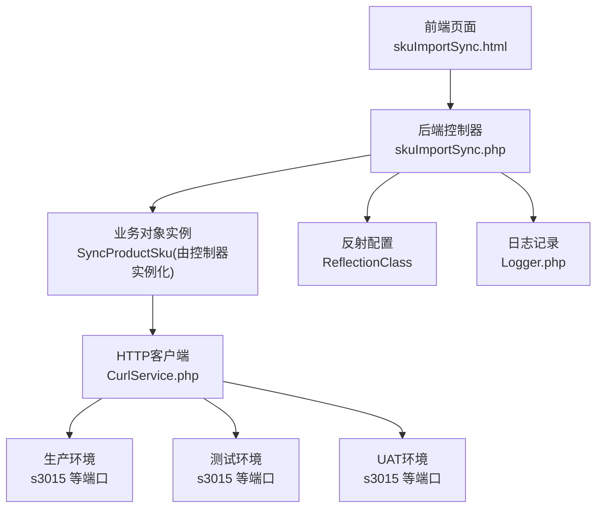
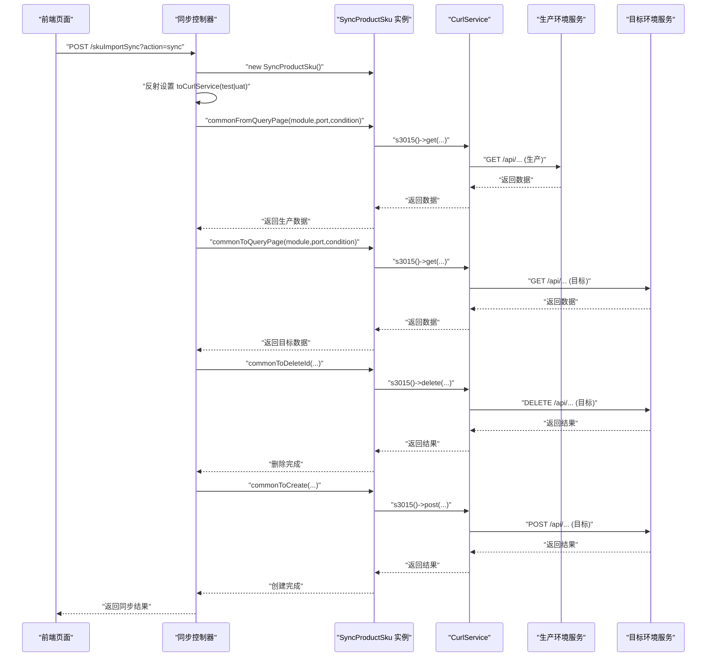
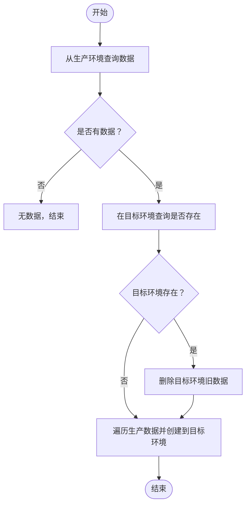
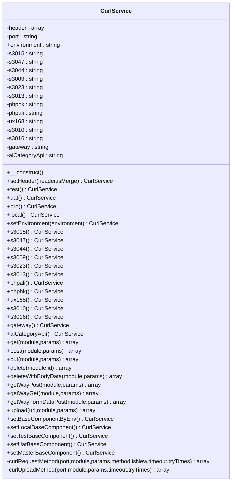
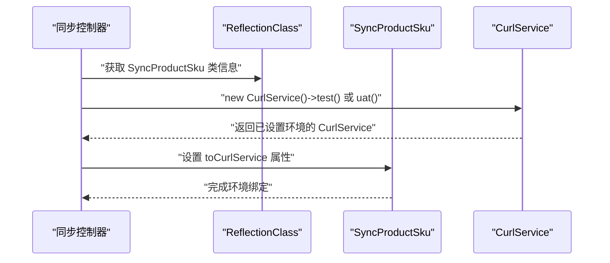
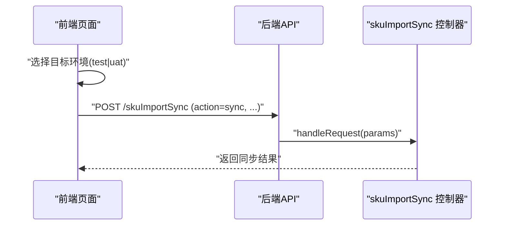
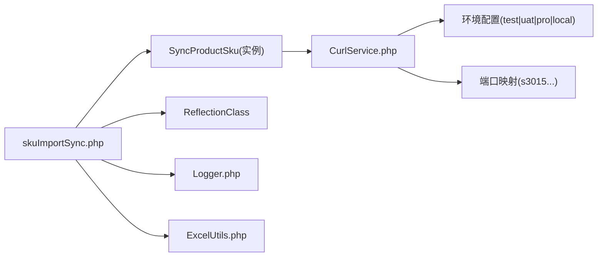

# 跨环境数据同步

<cite>
**本文引用的文件**
- [php/controller/skuImportSync.php](file://php/controller/skuImportSync.php)
- [php/curl/CurlService.php](file://php/curl/CurlService.php)
- [template/fix/skuImportSync.html](file://template/fix/skuImportSync.html)
- [php/class/Logger.php](file://php/class/Logger.php)
- [php/utils/ExcelUtils.php](file://php/utils/ExcelUtils.php)
</cite>

## 目录
1. [简介](#简介)
2. [项目结构](#项目结构)
3. [核心组件](#核心组件)
4. [架构总览](#架构总览)
5. [详细组件分析](#详细组件分析)
6. [依赖关系分析](#依赖关系分析)
7. [性能考虑](#性能考虑)
8. [故障排查指南](#故障排查指南)
9. [结论](#结论)
10. [附录](#附录)

## 简介
本技术文档围绕跨环境数据同步展开，重点解释以下内容：
- SyncProductSku 类的实现机制与职责边界（通过控制器对其实例化与调用）
- 不同环境（production、test、uat）之间的数据同步策略
- CurlService 在环境切换中的作用与端口映射
- 通过反射机制动态配置不同环境连接的方式
- 同步流程的完整说明：数据查询、对比验证、删除旧数据、创建新数据
- 环境配置最佳实践：连接参数、超时与重试、鉴权头
- 异常处理与数据冲突应对策略
- 性能优化建议与监控指标

## 项目结构
该功能由前端页面触发，后端控制器接收请求并协调同步逻辑，底层通过 CurlService 发起跨环境 HTTP 请求。

图表来源
- [php/controller/skuImportSync.php](file://php/controller/skuImportSync.php#L278-L426)
- [php/curl/CurlService.php](file://php/curl/CurlService.php#L441-L458)
- [template/fix/skuImportSync.html](file://template/fix/skuImportSync.html#L510-L548)

章节来源
- [php/controller/skuImportSync.php](file://php/controller/skuImportSync.php#L1-L512)
- [php/curl/CurlService.php](file://php/curl/CurlService.php#L1-L996)
- [template/fix/skuImportSync.html](file://template/fix/skuImportSync.html#L249-L548)

## 核心组件
- 同步控制器：负责接收请求、参数校验、日志记录、调用业务对象、执行同步流程
- SyncProductSku：业务对象，封装“从生产查询、到目标环境查询、删除旧数据、创建新数据”的流程
- CurlService：HTTP 客户端，负责环境切换、端口映射、请求头、鉴权、超时与重试
- 前端页面：提供用户界面，选择目标环境并发起同步请求

章节来源
- [php/controller/skuImportSync.php](file://php/controller/skuImportSync.php#L12-L77)
- [php/curl/CurlService.php](file://php/curl/CurlService.php#L4-L38)

## 架构总览
下图展示一次 SKU 同步请求在系统内的调用链路与环境切换：

图表来源
- [php/controller/skuImportSync.php](file://php/controller/skuImportSync.php#L311-L386)
- [php/curl/CurlService.php](file://php/curl/CurlService.php#L296-L418)

章节来源
- [php/controller/skuImportSync.php](file://php/controller/skuImportSync.php#L278-L426)
- [php/curl/CurlService.php](file://php/curl/CurlService.php#L296-L418)

## 详细组件分析

### SyncProductSku 类与同步流程
- 控制器通过实例化 SyncProductSku 来驱动同步，调用其通用方法完成查询、删除、创建
- 同步流程要点：
  - 从生产环境按条件查询数据
  - 在目标环境按相同条件查询是否存在
  - 若存在则删除目标环境旧数据
  - 将生产环境数据逐条创建到目标环境
- 反射配置：控制器使用反射设置 SyncProductSku 的目标环境连接对象（toCurlService），从而在不修改业务代码的情况下切换目标环境

图表来源
- [php/controller/skuImportSync.php](file://php/controller/skuImportSync.php#L330-L386)

章节来源
- [php/controller/skuImportSync.php](file://php/controller/skuImportSync.php#L311-L386)

### CurlService 在环境切换中的作用
- 环境枚举与切换：提供 test、uat、pro、local 等环境设置方法，并通过统一入口 setBaseComponentByEnv() 应用到具体端口
- 端口映射：针对 s3015、s3047、s3044、s3009、s3023、s3013、phphk、phpali、ux168、s3010、s3016、gateway、aiCategoryApi 等端口分别设置不同环境下的基地址
- 鉴权头：gateway() 方法根据当前环境设置 Authorization 头；也可通过 getUcToken() 注入自定义令牌
- 请求头与超时：默认设置 Content-Type、请求追踪头等；curlRequestMethod() 支持超时与重试参数
- 日志：内置日志记录，便于定位请求 URL、参数与响应

图表来源
- [php/curl/CurlService.php](file://php/curl/CurlService.php#L4-L996)

章节来源
- [php/curl/CurlService.php](file://php/curl/CurlService.php#L98-L143)
- [php/curl/CurlService.php](file://php/curl/CurlService.php#L441-L458)
- [php/curl/CurlService.php](file://php/curl/CurlService.php#L511-L598)
- [php/curl/CurlService.php](file://php/curl/CurlService.php#L664-L740)
- [php/curl/CurlService.php](file://php/curl/CurlService.php#L751-L800)

### 反射机制动态配置环境连接
- 控制器在运行时通过 ReflectionClass 获取 SyncProductSku 的类信息，并为其 toCurlService 属性注入不同环境的 CurlService 实例
- 优点：无需硬编码环境分支，降低耦合度，便于扩展新环境

图表来源
- [php/controller/skuImportSync.php](file://php/controller/skuImportSync.php#L314-L322)

章节来源
- [php/controller/skuImportSync.php](file://php/controller/skuImportSync.php#L314-L322)

### 前端交互与同步编排
- 前端页面提供目标环境选择（test、uat），并为每个 SKU 与模块组合生成同步任务
- 逐个发送请求到后端控制器，携带 action=sync、skuId、module、port、field、targetEnv 等参数
- 前端根据后端返回更新任务状态与进度

图表来源
- [template/fix/skuImportSync.html](file://template/fix/skuImportSync.html#L249-L269)
- [template/fix/skuImportSync.html](file://template/fix/skuImportSync.html#L510-L548)
- [php/controller/skuImportSync.php](file://php/controller/skuImportSync.php#L474-L512)

章节来源
- [template/fix/skuImportSync.html](file://template/fix/skuImportSync.html#L249-L269)
- [template/fix/skuImportSync.html](file://template/fix/skuImportSync.html#L484-L508)
- [template/fix/skuImportSync.html](file://template/fix/skuImportSync.html#L510-L548)
- [php/controller/skuImportSync.php](file://php/controller/skuImportSync.php#L474-L512)

## 依赖关系分析
- 控制器依赖：
  - SyncProductSku：业务对象（实例化并调用其通用方法）
  - ReflectionClass：运行时设置目标环境连接
  - Logger：记录同步全流程日志
  - ExcelUtils：解析上传的 Excel 文件（非本次同步流程，但与入口相关）
- CurlService 依赖：
  - 环境配置：test、uat、pro、local
  - 端口映射：s3015、s3047、s3044、s3009、s3023、s3013、phphk、phpali、ux168、s3010、s3016、gateway、aiCategoryApi
  - 日志：curl/request 日志

图表来源
- [php/controller/skuImportSync.php](file://php/controller/skuImportSync.php#L1-L77)
- [php/curl/CurlService.php](file://php/curl/CurlService.php#L441-L458)

章节来源
- [php/controller/skuImportSync.php](file://php/controller/skuImportSync.php#L1-L77)
- [php/curl/CurlService.php](file://php/curl/CurlService.php#L441-L458)

## 性能考虑
- 批量查询与分片：
  - 对于大批量 SKU，建议在上游（如前端或调度层）进行分片处理，避免单次请求过大
- 端口与网络：
  - 生产环境与目标环境端口不同，需确保网络连通性与 DNS 解析稳定
- 超时与重试：
  - CurlService 的请求方法支持超时与重试参数，建议在高延迟或不稳定网络环境下适当增大超时与重试次数
- 日志与可观测性：
  - 建议开启 curl/request 与 sku_import_sync 两类日志，便于定位慢请求与失败原因
- 并发与限流：
  - 控制器侧未见显式并发控制，建议在外部网关或任务队列层做限流与背压

## 故障排查指南
- 常见错误与定位
  - 缺少必要参数：检查请求体是否包含 action、skuId、module、port、field、targetEnv
  - 目标环境非法：仅支持 test、uat
  - 生产环境无数据：确认查询条件与字段是否正确
  - 目标环境删除失败：删除接口可能返回非 2xx，控制器会记录错误但不阻断后续流程
  - 创建失败：创建接口异常会被捕获并抛出，同时记录详细错误
- 日志定位
  - 控制器日志：sku_import_sync，包含请求参数、查询结果、删除与创建步骤
  - Curl 日志：curl/request，包含请求 URL、参数与响应体
- 建议排查步骤
  - 确认目标环境选择与端口映射是否正确
  - 检查网络连通性与证书设置（当前实现关闭了 SSL 验证）
  - 查看 HTTP 状态码与响应体，定位具体接口问题
  - 如需自定义鉴权，可通过 CurlService 的 getUcToken() 注入令牌

章节来源
- [php/controller/skuImportSync.php](file://php/controller/skuImportSync.php#L284-L301)
- [php/controller/skuImportSync.php](file://php/controller/skuImportSync.php#L356-L386)
- [php/curl/CurlService.php](file://php/curl/CurlService.php#L664-L740)
- [php/curl/CurlService.php](file://php/curl/CurlService.php#L751-L800)

## 结论
本文档梳理了跨环境数据同步的整体架构与实现细节，明确了：
- SyncProductSku 作为业务对象，通过统一的查询、删除、创建方法完成跨环境数据迁移
- CurlService 通过环境切换与端口映射，支撑多环境请求
- 控制器利用反射机制动态绑定目标环境连接，提升灵活性
- 前端页面提供可视化编排，支持批量任务与进度反馈
- 建议在实际部署中完善并发控制、鉴权策略与监控告警，以保障稳定性与可观测性

## 附录
- 环境配置最佳实践
  - 连接参数：优先使用 HTTPS 端点，避免关闭 SSL 验证；如确需本地联调，仅在受控环境启用
  - 超时与重试：根据网络状况调整超时时间与重试次数，避免长时间阻塞
  - 鉴权头：优先使用 gateway() 内置的环境令牌；如需自定义，使用 getUcToken() 注入
  - 日志：开启 curl/request 与业务日志，定期轮转与归档
- 监控指标建议
  - 请求成功率、平均响应时间、错误分布（HTTP 码、异常类型）
  - 同步任务吞吐量与排队时延
  - 网络连通性与端口可用性探测