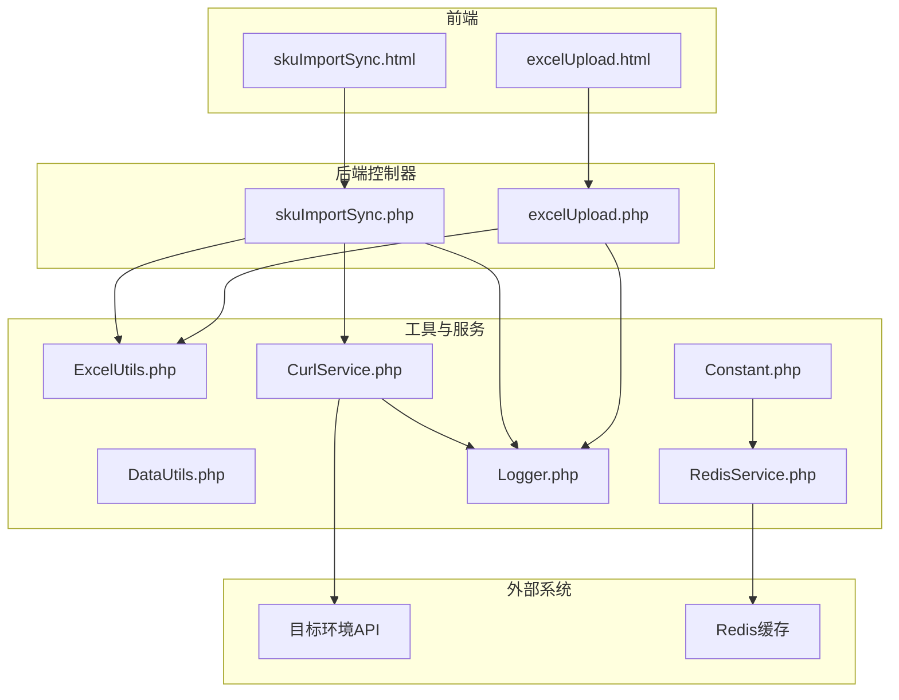
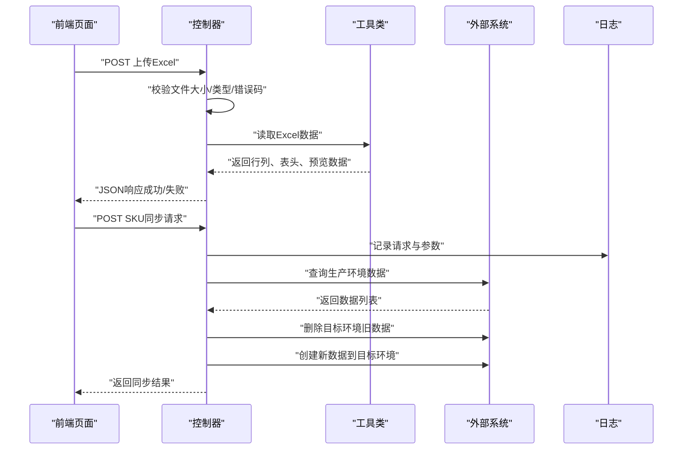
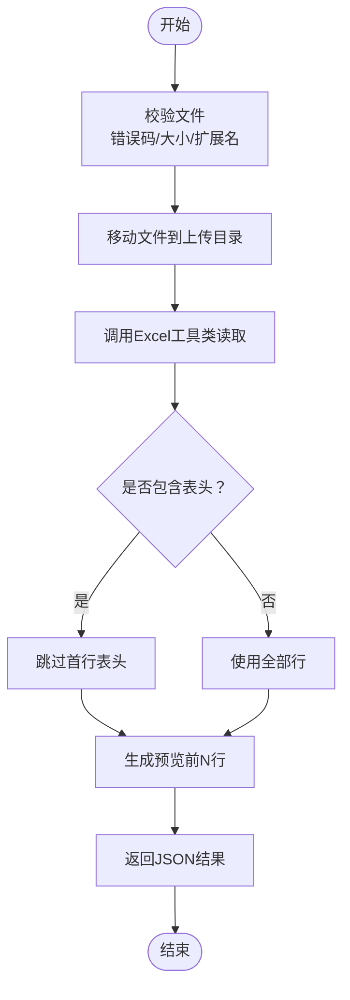
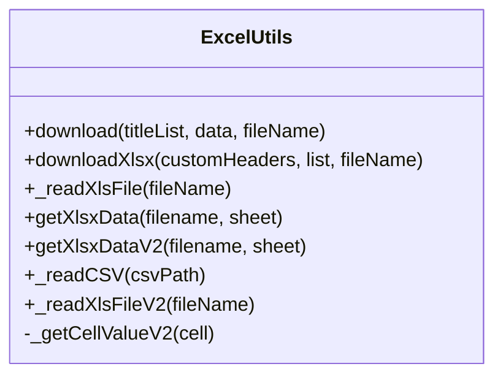
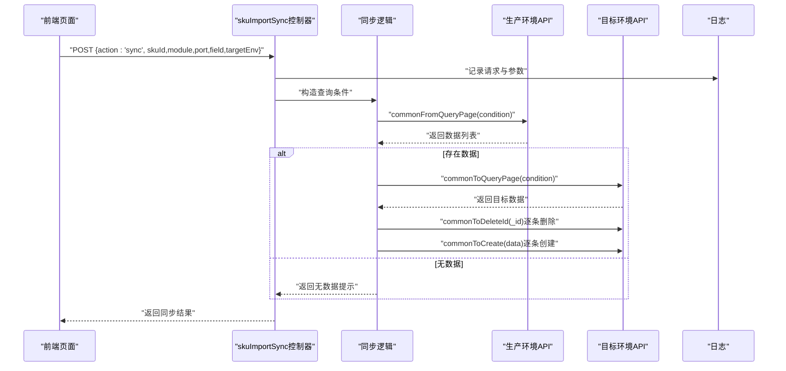
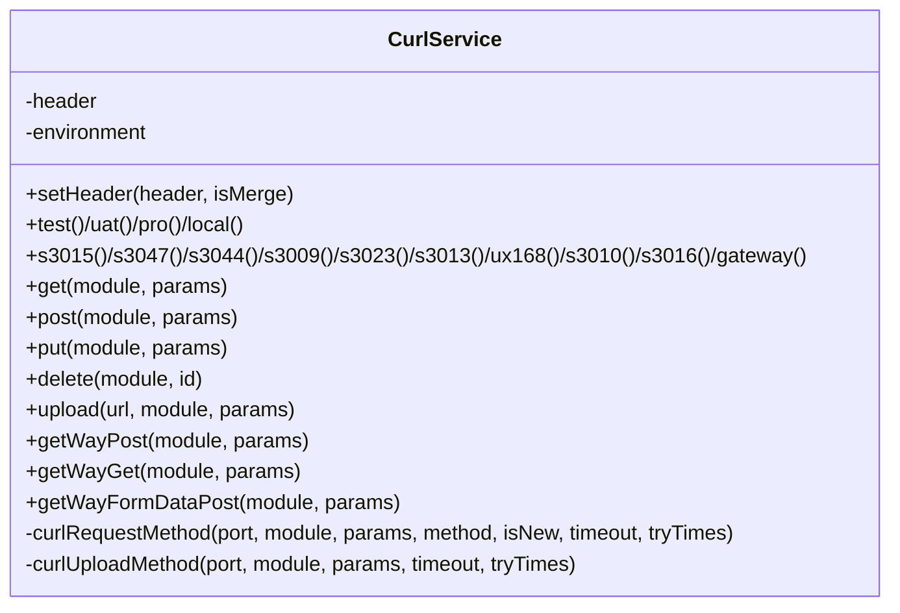
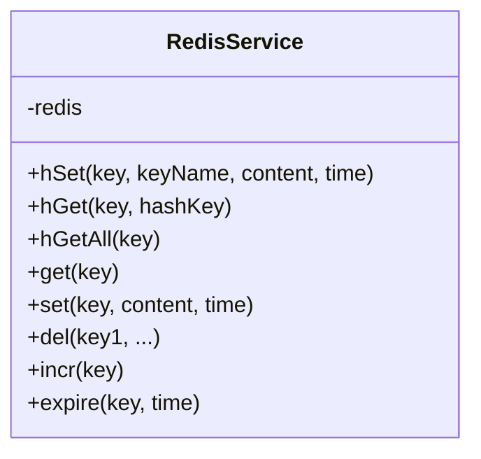
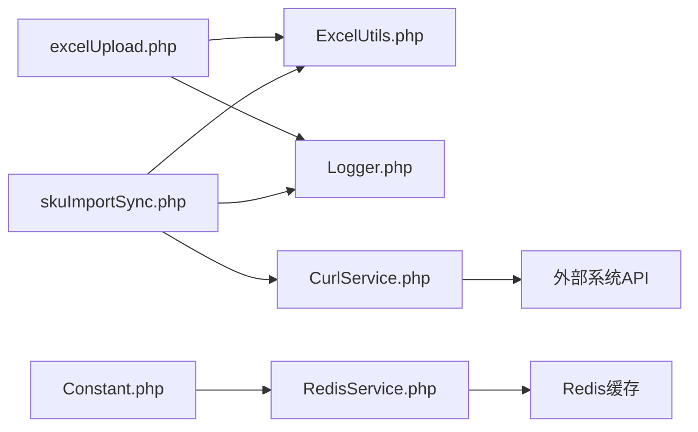

# 数据流设计

<cite>
**本文档引用的文件**
- [excelUpload.php](file://php/controller/excelUpload.php)
- [ExcelUtils.php](file://php/utils/ExcelUtils.php)
- [DataUtils.php](file://php/utils/DataUtils.php)
- [RedisService.php](file://php/redis/RedisService.php)
- [CurlService.php](file://php/curl/CurlService.php)
- [skuImportSync.php](file://php/controller/skuImportSync.php)
- [Constant.php](file://php/constant/Constant.php)
- [Logger.php](file://php/class/Logger.php)
- [excelUpload.html](file://template/excelUpload.html)
- [skuImportSync.html](file://template/fix/skuImportSync.html)
- [composer.json](file://composer.json)
</cite>

## 目录
1. [简介](#简介)
2. [项目结构](#项目结构)
3. [核心组件](#核心组件)
4. [架构总览](#架构总览)
5. [详细组件分析](#详细组件分析)
6. [依赖关系分析](#依赖关系分析)
7. [性能考虑](#性能考虑)
8. [故障排查指南](#故障排查指南)
9. [结论](#结论)

## 简介
本文件面向PaSystem系统，围绕“Excel文件上传处理、数据验证、跨环境同步、缓存管理”等关键环节，提供完整的数据流设计文档。文档从用户输入到系统响应的全流程出发，解释数据在不同组件间的传递方式与转换过程，描述缓存策略与性能优化措施，并给出数据流图与时序图，说明数据一致性保障与错误处理机制。

## 项目结构
PaSystem采用典型的PHP Web应用结构，前端通过HTML页面与Vue.js交互，后端控制器负责业务编排，工具类负责数据处理与第三方集成，常量与日志组件提供基础设施支撑。

**图表来源**
- [excelUpload.php](file://php/controller/excelUpload.php#L1-L372)
- [skuImportSync.php](file://php/controller/skuImportSync.php#L1-L512)
- [ExcelUtils.php](file://php/utils/ExcelUtils.php#L1-L398)
- [CurlService.php](file://php/curl/CurlService.php#L1-L996)
- [RedisService.php](file://php/redis/RedisService.php#L1-L77)
- [Logger.php](file://php/class/Logger.php#L1-L55)
- [Constant.php](file://php/constant/Constant.php#L1-L26)

**章节来源**
- [excelUpload.php](file://php/controller/excelUpload.php#L1-L372)
- [skuImportSync.php](file://php/controller/skuImportSync.php#L1-L512)
- [excelUpload.html](file://template/excelUpload.html#L1-L472)
- [skuImportSync.html](file://template/fix/skuImportSync.html#L1-L600)

## 核心组件
- Excel文件上传与解析控制器：负责接收Excel文件、校验、移动至上传目录、读取数据并返回预览与统计信息。
- Excel工具类：基于PhpSpreadsheet读取Excel/XLS/CVS等格式，处理长数字与格式，提供统一的数据读取接口。
- 数据处理工具类：封装各类接口响应数据的提取与转换，便于后续业务处理。
- 跨环境同步控制器：提供SKU数据从生产环境到测试/UAT环境的查询、删除旧数据、创建新数据的同步流程。
- HTTP客户端服务：封装多环境（local/test/uat/pro）的REST调用，统一请求头、超时与重试策略。
- 缓存服务：基于Redis的键值与哈希存储，提供过期控制与批量操作。
- 日志与常量：统一日志落盘与Redis连接常量配置。

**章节来源**
- [excelUpload.php](file://php/controller/excelUpload.php#L11-L328)
- [ExcelUtils.php](file://php/utils/ExcelUtils.php#L20-L398)
- [DataUtils.php](file://php/utils/DataUtils.php#L7-L800)
- [skuImportSync.php](file://php/controller/skuImportSync.php#L12-L472)
- [CurlService.php](file://php/curl/CurlService.php#L4-L996)
- [RedisService.php](file://php/redis/RedisService.php#L7-L77)
- [Logger.php](file://php/class/Logger.php#L14-L55)
- [Constant.php](file://php/constant/Constant.php#L4-L26)

## 架构总览
系统数据流分为两条主线：
- Excel上传与解析：前端拖拽/选择文件 -> 控制器校验 -> 工具类读取 -> 返回预览与统计。
- 跨环境同步：前端提交SKU与目标环境 -> 控制器查询生产数据 -> 删除目标环境旧数据 -> 创建新数据 -> 返回同步结果。

**图表来源**
- [excelUpload.php](file://php/controller/excelUpload.php#L35-L95)
- [ExcelUtils.php](file://php/utils/ExcelUtils.php#L147-L181)
- [skuImportSync.php](file://php/controller/skuImportSync.php#L278-L426)
- [CurlService.php](file://php/curl/CurlService.php#L664-L740)
- [Logger.php](file://php/class/Logger.php#L22-L25)

## 详细组件分析

### Excel上传与解析组件
- 输入：HTTP multipart/form-data（单文件或多文件）、hasHeader、previewRows等参数。
- 处理：校验文件错误码、大小、扩展名；移动上传文件；调用Excel工具类读取；按参数决定是否跳过表头；生成预览数据。
- 输出：统一JSON结构，包含文件元信息、行列数、表头、预览行与完整行数据。

**图表来源**
- [excelUpload.php](file://php/controller/excelUpload.php#L102-L140)
- [excelUpload.php](file://php/controller/excelUpload.php#L148-L238)
- [ExcelUtils.php](file://php/utils/ExcelUtils.php#L147-L181)

**章节来源**
- [excelUpload.php](file://php/controller/excelUpload.php#L35-L95)
- [excelUpload.php](file://php/controller/excelUpload.php#L102-L140)
- [excelUpload.php](file://php/controller/excelUpload.php#L148-L238)
- [ExcelUtils.php](file://php/utils/ExcelUtils.php#L147-L181)

### Excel工具类（数据读取与格式处理）
- 功能：读取XLS/XLSX/CSV，处理长数字不转科学计数法，统一返回结构化数组。
- 性能：基于PhpSpreadsheet，具备较好的内存管理能力；针对CSV提供文本格式列的特殊处理。

**图表来源**
- [ExcelUtils.php](file://php/utils/ExcelUtils.php#L20-L398)

**章节来源**
- [ExcelUtils.php](file://php/utils/ExcelUtils.php#L147-L181)
- [ExcelUtils.php](file://php/utils/ExcelUtils.php#L246-L311)
- [ExcelUtils.php](file://php/utils/ExcelUtils.php#L315-L394)

### 跨环境同步组件
- 输入：action=sync，携带skuId、module、port、field、targetEnv。
- 流程：固定从生产环境查询数据 -> 目标环境查询并删除旧数据 -> 逐条创建新数据 -> 返回结果。
- 错误处理：删除失败不影响整体流程；创建失败抛出异常并记录日志。

**图表来源**
- [skuImportSync.php](file://php/controller/skuImportSync.php#L278-L426)
- [CurlService.php](file://php/curl/CurlService.php#L664-L740)

**章节来源**
- [skuImportSync.php](file://php/controller/skuImportSync.php#L40-L77)
- [skuImportSync.php](file://php/controller/skuImportSync.php#L278-L426)

### HTTP客户端与环境切换
- CurlService提供多环境配置（local/test/uat/pro），统一请求头、超时与重试策略，支持新老两种架构的GET/POST/DELETE/UPLOAD。
- 支持设置Authorization头（网关场景），并记录请求日志。

**图表来源**
- [CurlService.php](file://php/curl/CurlService.php#L4-L996)

**章节来源**
- [CurlService.php](file://php/curl/CurlService.php#L74-L92)
- [CurlService.php](file://php/curl/CurlService.php#L441-L458)
- [CurlService.php](file://php/curl/CurlService.php#L664-L740)

### 缓存与一致性
- RedisService提供基础KV与Hash操作，支持设置过期时间，适用于配置缓存与临时状态存储。
- 常量集中定义Redis主机、端口、密码及常用键名，便于统一管理。

**图表来源**
- [RedisService.php](file://php/redis/RedisService.php#L7-L77)
- [Constant.php](file://php/constant/Constant.php#L4-L26)

**章节来源**
- [RedisService.php](file://php/redis/RedisService.php#L29-L35)
- [RedisService.php](file://php/redis/RedisService.php#L53-L65)
- [Constant.php](file://php/constant/Constant.php#L4-L26)

### 日志与错误处理
- 统一日志类：将消息写入文件并同时输出到error_log，便于排查。
- 控制器层：对文件上传、Excel读取、跨环境同步均进行try-catch与错误码映射，返回标准化JSON。

**章节来源**
- [Logger.php](file://php/class/Logger.php#L22-L25)
- [excelUpload.php](file://php/controller/excelUpload.php#L88-L94)
- [skuImportSync.php](file://php/controller/skuImportSync.php#L70-L76)

## 依赖关系分析
- Composer依赖：引入Monolog、LoggerOne、PhpSpreadsheet与Redis扩展，为日志、Excel处理与缓存提供基础能力。
- 组件耦合：控制器依赖工具类与服务类；工具类依赖第三方库；服务类依赖外部系统与Redis；日志贯穿所有组件。

**图表来源**
- [composer.json](file://composer.json#L2-L10)
- [excelUpload.php](file://php/controller/excelUpload.php#L1-L6)
- [skuImportSync.php](file://php/controller/skuImportSync.php#L1-L7)
- [CurlService.php](file://php/curl/CurlService.php#L1-L3)
- [RedisService.php](file://php/redis/RedisService.php#L1-L3)
- [Constant.php](file://php/constant/Constant.php#L1-L3)

**章节来源**
- [composer.json](file://composer.json#L2-L10)

## 性能考虑
- Excel读取：使用PhpSpreadsheet，具备良好的内存管理；建议大文件分批处理或限制预览行数。
- 网络调用：CurlService内置超时与重试机制，建议结合熔断与限流策略。
- 缓存：RedisService支持过期控制，适合热点配置与临时状态；注意键命名规范与过期时间设置。
- 日志：统一落盘与标准输出，避免频繁I/O；建议按天切割日志文件。

[本节为通用指导，无需具体文件分析]

## 故障排查指南
- 上传失败：检查文件错误码映射、目录权限与磁盘空间；查看控制器返回的错误消息。
- Excel读取异常：确认文件格式与编码；关注长数字处理逻辑；检查工作表名称与行列范围。
- 跨环境同步失败：核对目标环境参数与Authorization；查看删除与创建阶段的异常日志；确认生产环境数据存在性。
- Redis连接失败：核对常量配置与网络连通性；检查密码与防火墙设置。

**章节来源**
- [excelUpload.php](file://php/controller/excelUpload.php#L104-L140)
- [ExcelUtils.php](file://php/utils/ExcelUtils.php#L246-L311)
- [skuImportSync.php](file://php/controller/skuImportSync.php#L314-L322)
- [RedisService.php](file://php/redis/RedisService.php#L15-L19)
- [Logger.php](file://php/class/Logger.php#L22-L25)

## 结论
PaSystem通过清晰的控制器-工具-服务分层，实现了从Excel上传解析到跨环境数据同步的完整数据流。借助PhpSpreadsheet、CurlService与RedisService，系统在数据处理、网络通信与缓存方面具备良好可维护性与扩展性。建议在生产环境中进一步完善超时与重试策略、日志分级与监控告警，以提升稳定性与可观测性。