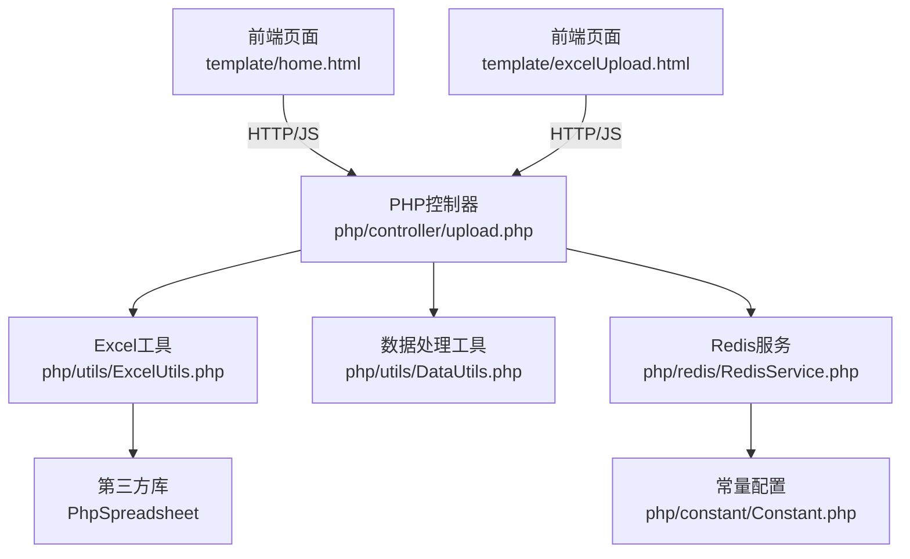
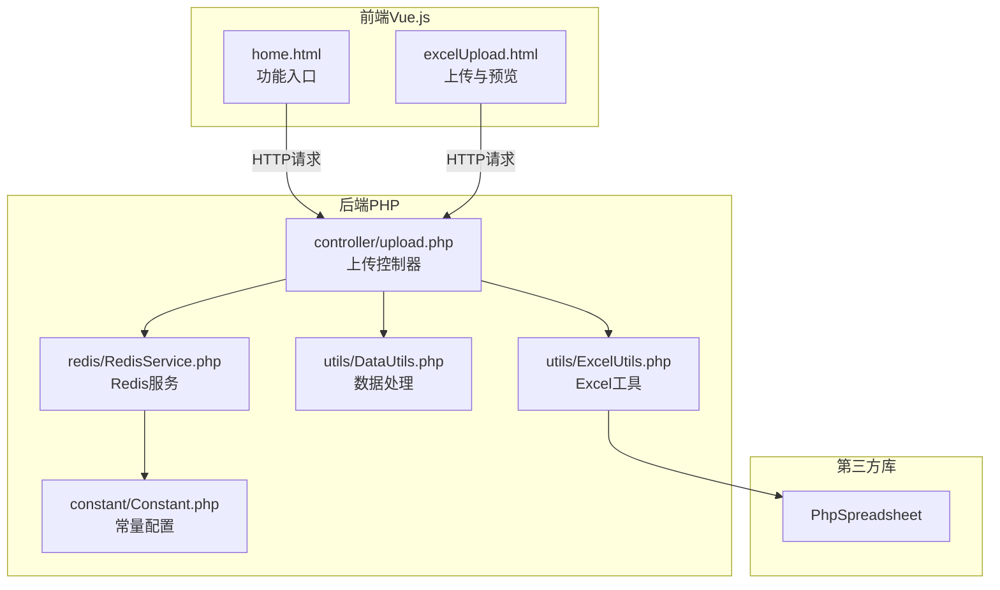
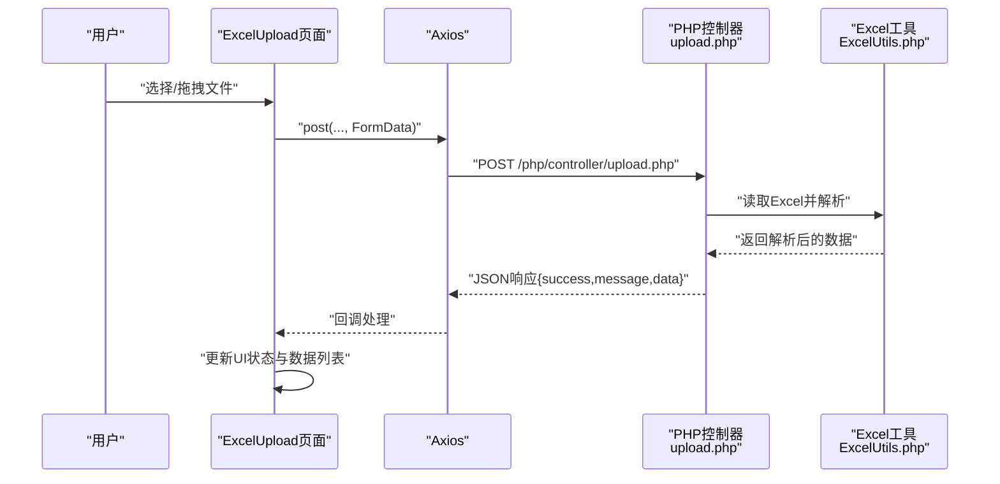
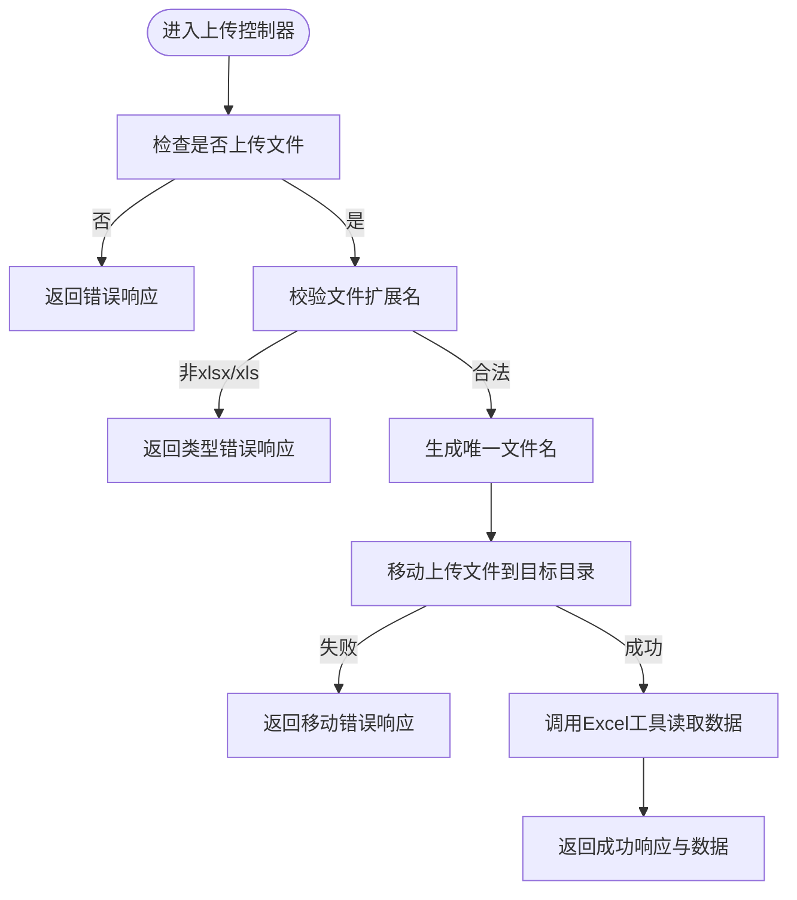
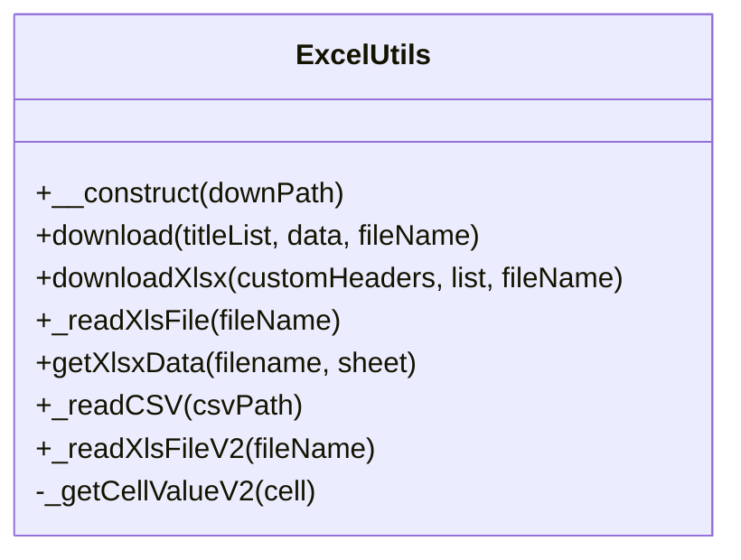
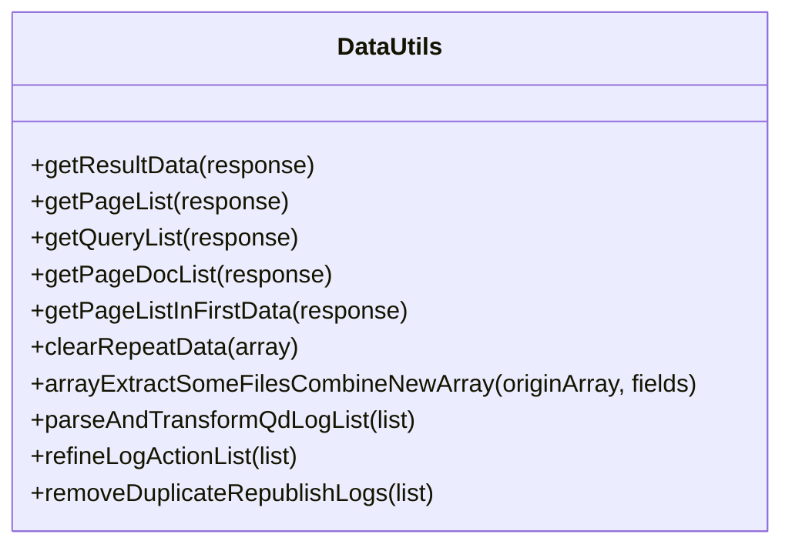
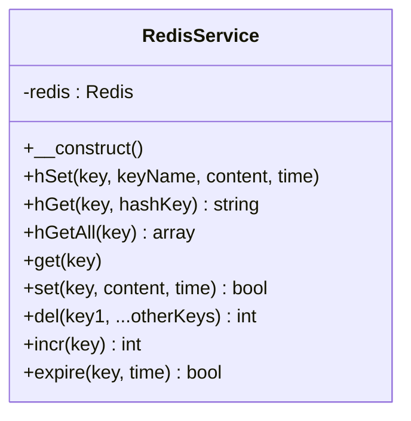
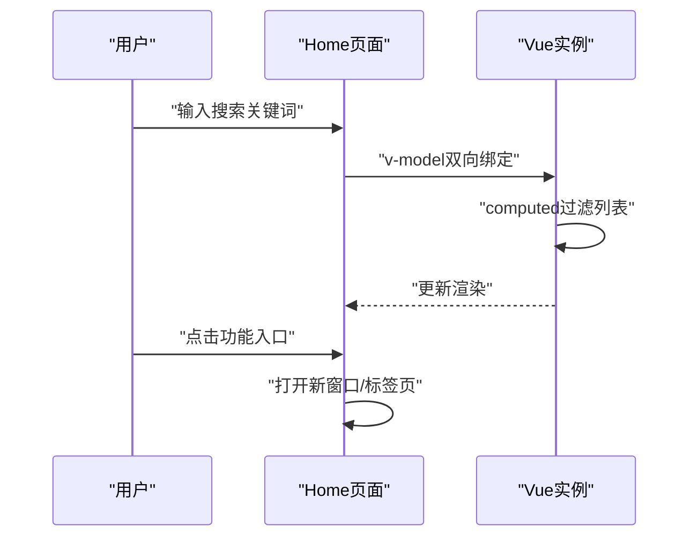
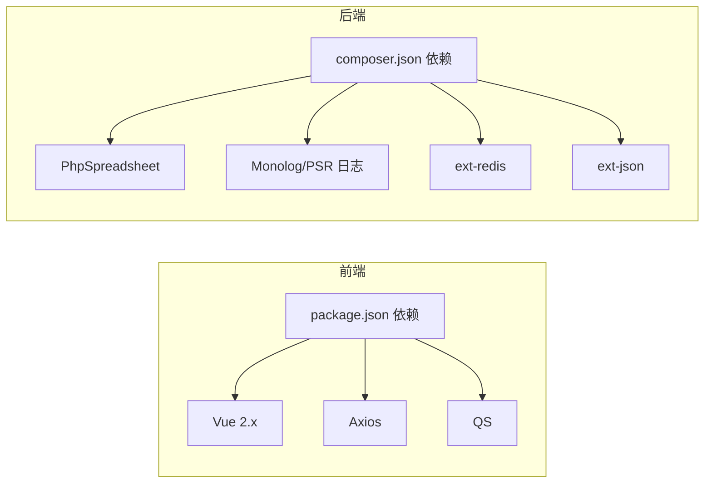

# 整体架构设计

<cite>
**本文引用的文件**
- [composer.json](file://composer.json)
- [common.php](file://php/common.php)
- [home.html](file://template/home.html)
- [excelUpload.html](file://template/excelUpload.html)
- [upload.php](file://php/controller/upload.php)
- [ExcelUtils.php](file://php/utils/ExcelUtils.php)
- [DataUtils.php](file://php/utils/DataUtils.php)
- [Constant.php](file://php/constant/Constant.php)
- [RedisService.php](file://php/redis/RedisService.php)
- [requiredChorm.php](file://php/requiredfile/requiredChorm.php)
- [config_1.json](file://template/config/config_1.json)
- [package.json](file://template/package.json)
</cite>

## 目录
1. [简介](#简介)
2. [项目结构](#项目结构)
3. [核心组件](#核心组件)
4. [架构总览](#架构总览)
5. [详细组件分析](#详细组件分析)
6. [依赖分析](#依赖分析)
7. [性能考虑](#性能考虑)
8. [故障排查指南](#故障排查指南)
9. [结论](#结论)

## 简介
本文件面向PaSystem项目，系统采用前后端分离架构，前端使用Vue.js构建多页面功能入口与Excel上传预览，后端以PHP控制器为核心，结合工具类与第三方库（如PhpSpreadsheet）完成文件读写、数据处理与外部服务对接，并通过Redis提供缓存能力。系统通过明确的分层职责（界面层、控制器层、业务逻辑层、数据访问层）实现模块化与可扩展性。

## 项目结构
- 前端模板与静态资源位于 template/ 目录，包含首页入口、Excel上传页面、样式与脚本等。
- 后端PHP代码位于 php/ 目录，包含控制器、工具类、常量、Redis服务、curl服务等。
- composer.json 管理PHP依赖，包括日志、Redis扩展与 PhpSpreadsheet。
- package.json 管理前端依赖（Vue 2.x、Axios、QS）及构建工具。

图表来源
- [home.html](file://template/home.html#L1-L761)
- [excelUpload.html](file://template/excelUpload.html#L1-L472)
- [upload.php](file://php/controller/upload.php#L1-L138)
- [ExcelUtils.php](file://php/utils/ExcelUtils.php#L1-L398)
- [DataUtils.php](file://php/utils/DataUtils.php#L1-L802)
- [RedisService.php](file://php/redis/RedisService.php#L1-L77)
- [Constant.php](file://php/constant/Constant.php#L1-L26)

章节来源
- [composer.json](file://composer.json#L1-L11)
- [package.json](file://template/package.json#L1-L15)

## 核心组件
- 前端界面层
  - 首页入口：提供功能导航与环境指示，基于Vue 3实现。
  - Excel上传页面：支持拖拽/选择上传、进度反馈、数据预览与导出占位。
- 控制器层（PHP）
  - 文件上传控制器：负责接收上传文件、校验类型、移动至目标目录、调用Excel工具读取数据并返回结果。
- 业务逻辑层（PHP工具类）
  - Excel工具：封装PhpSpreadsheet，支持xlsx/xls/csv读取与xlsx导出，处理长数字与文本格式。
  - 数据处理工具：统一解析不同接口返回结构，提取列表、首条数据、分页数据等。
- 数据访问层（PHP）
  - Redis服务：提供哈希、字符串、自增等常用操作，配合常量配置连接信息。
- 外部集成
  - 通过CurlService与后端Node/微服务组件通信（由常量与CurlService方法体现）。
- 配置与常量
  - JSON配置映射字段，便于不同业务场景的数据转换。
  - Redis常量集中管理连接参数与键空间命名。

章节来源
- [home.html](file://template/home.html#L595-L758)
- [excelUpload.html](file://template/excelUpload.html#L295-L468)
- [upload.php](file://php/controller/upload.php#L1-L138)
- [ExcelUtils.php](file://php/utils/ExcelUtils.php#L1-L398)
- [DataUtils.php](file://php/utils/DataUtils.php#L1-L802)
- [RedisService.php](file://php/redis/RedisService.php#L1-L77)
- [Constant.php](file://php/constant/Constant.php#L1-L26)
- [config_1.json](file://template/config/config_1.json#L1-L166)

## 架构总览
系统采用经典的MVC分层思想在前后端分别落地：
- 前端（MVC中的视图与控制器）：Vue组件负责渲染与用户交互，Axios发起HTTP请求，页面逻辑处理数据展示与流程控制。
- 后端（MVC中的控制器与模型）：PHP控制器接收请求、编排工具类与缓存服务，返回标准化JSON响应。
- 数据访问：Redis提供高性能缓存，Excel工具通过PhpSpreadsheet读写文件。

图表来源
- [home.html](file://template/home.html#L1-L761)
- [excelUpload.html](file://template/excelUpload.html#L1-L472)
- [upload.php](file://php/controller/upload.php#L1-L138)
- [ExcelUtils.php](file://php/utils/ExcelUtils.php#L1-L398)
- [DataUtils.php](file://php/utils/DataUtils.php#L1-L802)
- [RedisService.php](file://php/redis/RedisService.php#L1-L77)
- [Constant.php](file://php/constant/Constant.php#L1-L26)

## 详细组件分析

### 组件A：Excel上传与预览（前端）
- 职责
  - 提供拖拽/选择上传入口，展示上传进度，调用后端接口返回的Excel数据进行表格预览。
- 关键流程
  - 用户选择文件或拖拽文件，构造FormData并调用后端上传接口。
  - 根据返回的success/message/data更新UI状态与数据列表。
  - 支持查看完整数据与导出占位（后续可扩展）。

图表来源
- [excelUpload.html](file://template/excelUpload.html#L314-L397)
- [upload.php](file://php/controller/upload.php#L15-L60)
- [ExcelUtils.php](file://php/utils/ExcelUtils.php#L147-L181)

章节来源
- [excelUpload.html](file://template/excelUpload.html#L295-L468)
- [upload.php](file://php/controller/upload.php#L1-L138)
- [ExcelUtils.php](file://php/utils/ExcelUtils.php#L147-L181)

### 组件B：文件上传控制器（后端）
- 职责
  - 接收上传文件，校验类型（仅xlsx/xls），生成唯一文件名，移动到目标目录。
  - 调用Excel工具读取Excel内容，返回标准化结果。
- 错误处理
  - 对上传错误、类型不符、移动失败等情况返回统一结构的错误信息。

图表来源
- [upload.php](file://php/controller/upload.php#L15-L60)

章节来源
- [upload.php](file://php/controller/upload.php#L1-L138)

### 组件C：Excel工具类（数据访问与处理）
- 职责
  - 基于PhpSpreadsheet读取xlsx/xls/csv，支持多工作表与长数字文本格式处理。
  - 提供xlsx导出能力，支持自定义表头与数据写入。
- 性能与兼容性
  - 使用IOFactory加载文件，避免手动设置缓存，降低内存压力。
  - 针对长数字与文本格式进行特殊处理，保证数据准确性。

图表来源
- [ExcelUtils.php](file://php/utils/ExcelUtils.php#L20-L398)

章节来源
- [ExcelUtils.php](file://php/utils/ExcelUtils.php#L1-L398)

### 组件D：数据处理工具类（业务逻辑）
- 职责
  - 统一解析不同接口返回结构，提取列表、分页数据、首条数据等。
  - 提供数组去重、字段抽取、日志解析与二次整理等通用能力。
- 应用场景
  - 适配多后端返回格式，减少控制器层样板代码。

图表来源
- [DataUtils.php](file://php/utils/DataUtils.php#L7-L802)

章节来源
- [DataUtils.php](file://php/utils/DataUtils.php#L1-L802)

### 组件E：Redis服务（数据访问）
- 职责
  - 提供Redis连接、哈希读写、字符串读写、自增与过期设置等基础能力。
- 配置
  - 通过常量集中管理主机、端口、密码与键空间命名。

图表来源
- [RedisService.php](file://php/redis/RedisService.php#L7-L77)
- [Constant.php](file://php/constant/Constant.php#L4-L17)

章节来源
- [RedisService.php](file://php/redis/RedisService.php#L1-L77)
- [Constant.php](file://php/constant/Constant.php#L1-L26)

### 组件F：前端首页与功能导航（界面层）
- 职责
  - 提供功能入口卡片，支持搜索过滤、环境检测与动态按钮状态。
- 交互
  - 通过Vue响应式数据绑定与计算属性实现列表筛选与图标/徽章动态生成。

图表来源
- [home.html](file://template/home.html#L656-L666)
- [home.html](file://template/home.html#L675-L757)

章节来源
- [home.html](file://template/home.html#L595-L758)

## 依赖分析
- 前端依赖
  - Vue 2.x：组件化与响应式数据。
  - Axios：HTTP客户端，用于与后端交互。
  - QS：URL参数序列化。
  - Webpack/Babel：构建与转译（开发依赖）。
- 后端依赖
  - PhpSpreadsheet：Excel读写。
  - Monolog/PSR日志：日志记录。
  - Redis扩展：缓存访问。
  - Composer自动加载：统一引入第三方库与工具类。

图表来源
- [package.json](file://template/package.json#L1-L15)
- [composer.json](file://composer.json#L1-L11)

章节来源
- [package.json](file://template/package.json#L1-L15)
- [composer.json](file://composer.json#L1-L11)

## 性能考虑
- Excel处理
  - 使用PhpSpreadsheet的IOFactory加载，避免手动设置缓存，降低内存占用。
  - 针对长数字与文本格式进行显式处理，避免科学计数法导致的数据失真。
- 上传与I/O
  - 上传时生成唯一文件名，避免冲突；读取完成后可按需清理临时文件。
- 缓存
  - Redis提供高并发读写能力，建议为热点键设置合理TTL，避免无限增长。
- 前端交互
  - 使用进度条与空状态提示，提升用户体验；对大文件上传建议分片或服务端断点续传（当前页面为占位）。

## 故障排查指南
- CORS与编码
  - 后端统一设置跨域头与字符集，确保前端跨域请求与中文显示正常。
- 上传失败
  - 检查文件类型是否为xlsx/xls，确认目标目录权限与磁盘空间。
  - 查看控制器返回的错误码与消息，定位具体失败环节。
- Excel解析异常
  - 确认Excel文件未损坏，检查表头与数据行是否符合预期。
  - 如遇长数字丢失，确认工具类的文本格式处理逻辑是否生效。
- Redis连接问题
  - 核对常量中的主机、端口与密码，确认Redis服务可用性。

章节来源
- [common.php](file://php/common.php#L3-L8)
- [upload.php](file://php/controller/upload.php#L15-L60)
- [ExcelUtils.php](file://php/utils/ExcelUtils.php#L366-L394)
- [RedisService.php](file://php/redis/RedisService.php#L15-L19)
- [Constant.php](file://php/constant/Constant.php#L4-L6)

## 结论
PaSystem通过前后端分离与清晰的分层架构实现了模块化与可扩展性：前端以Vue提供良好交互体验，后端以控制器编排工具类与缓存服务，形成稳定的业务处理链路。借助PhpSpreadsheet与Redis等成熟组件，系统在Excel处理与缓存方面具备良好性能与可靠性。后续可在上传、导出与日志解析等方面进一步增强，以支撑更大规模的数据治理需求。