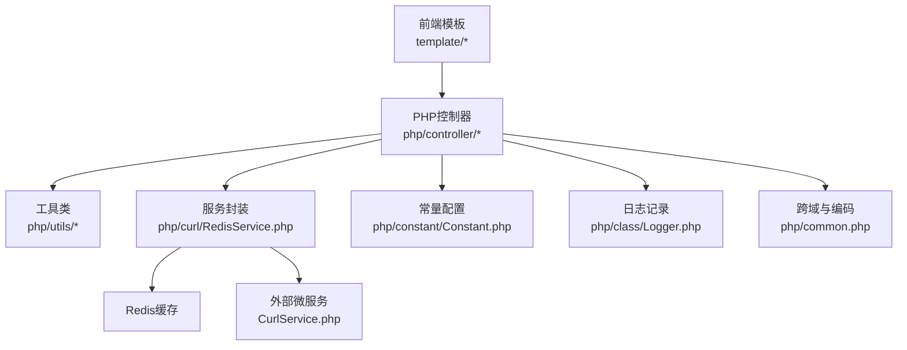
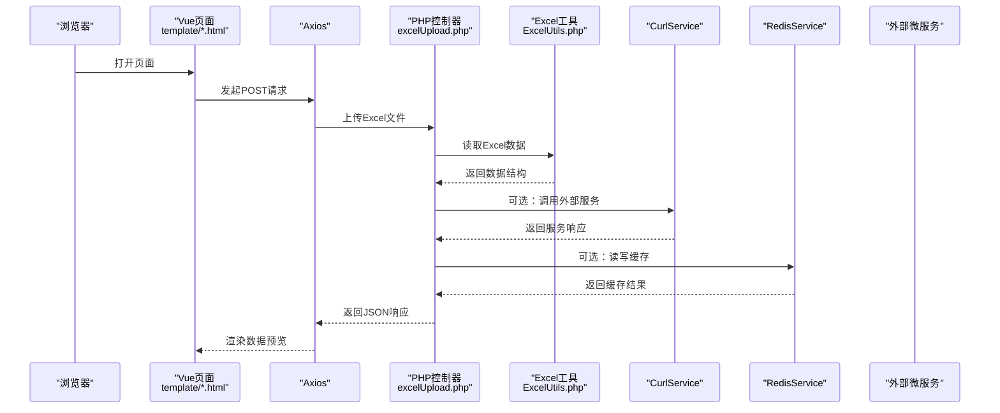
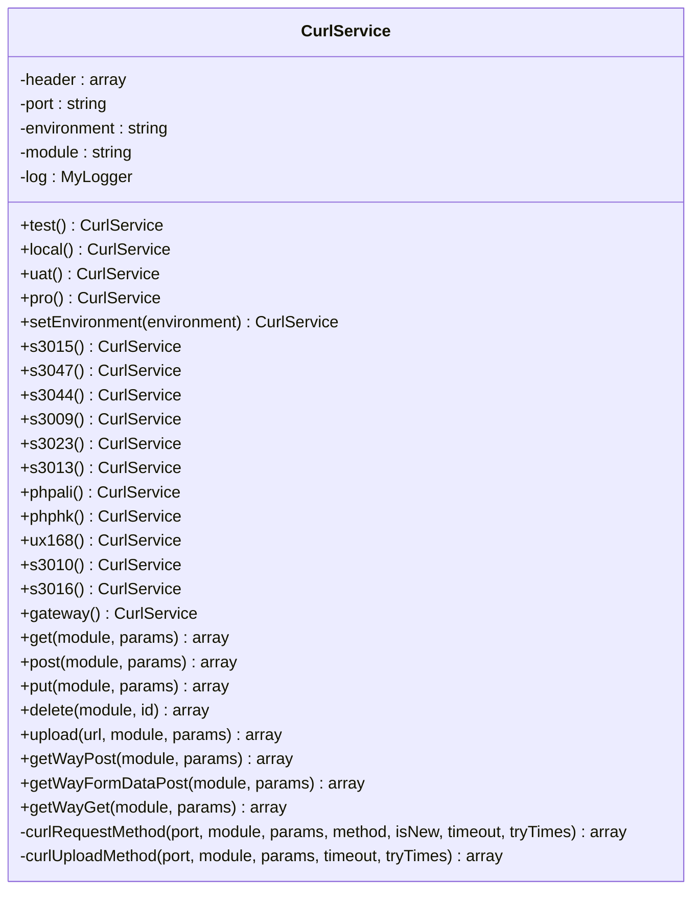
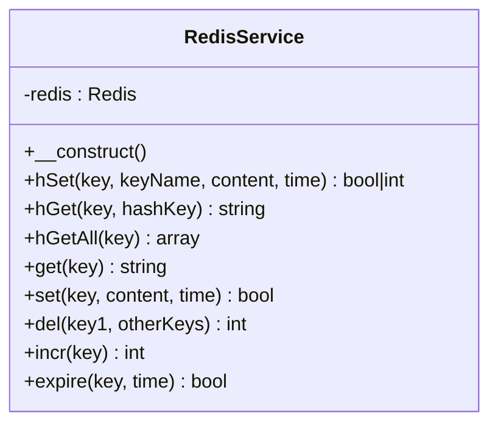
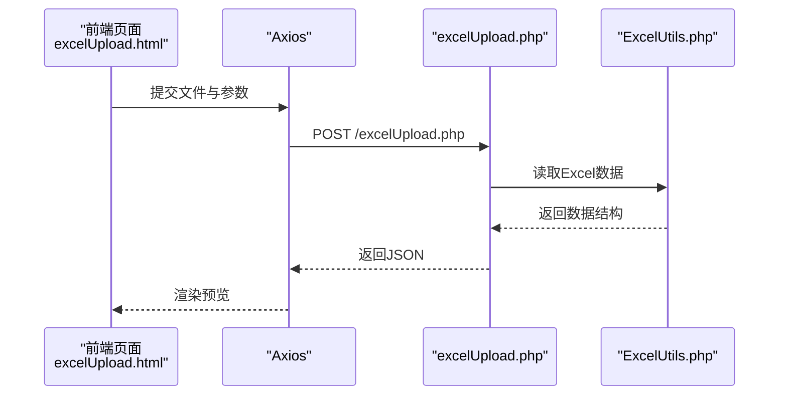
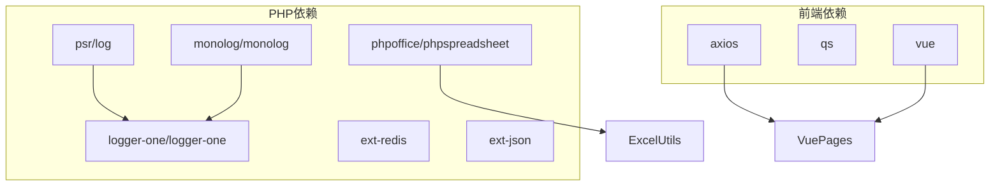

# 系统架构

<cite>
**本文引用的文件**
- [CurlService.php](file://php/curl/CurlService.php)
- [RedisService.php](file://php/redis/RedisService.php)
- [Constant.php](file://php/constant/Constant.php)
- [Logger.php](file://php/class/Logger.php)
- [common.php](file://php/common.php)
- [composer.json](file://composer.json)
- [package.json](file://template/package.json)
- [home.html](file://template/home.html)
- [excelUpload.html](file://template/excelUpload.html)
- [excelUpload.php](file://php/controller/excelUpload.php)
- [ExcelUtils.php](file://php/utils/ExcelUtils.php)
- [Logger.php](file://php/class/Logger.php)
</cite>

## 目录
1. [简介](#简介)
2. [项目结构](#项目结构)
3. [核心组件](#核心组件)
4. [架构总览](#架构总览)
5. [详细组件分析](#详细组件分析)
6. [依赖分析](#依赖分析)
7. [性能考量](#性能考量)
8. [故障排查指南](#故障排查指南)
9. [结论](#结论)
10. [附录](#附录)

## 简介
本系统采用前后端分离的MVC架构设计：
- 前端：基于Vue.js的静态页面模板，通过Axios发起HTTP请求
- 后端：PHP控制器层负责接收请求、校验参数、调用业务工具类、与外部服务通信，并返回标准化响应
- 业务逻辑层：以工具类和封装服务为主，如Excel读写、HTTP请求封装、缓存服务等
- 数据访问层：通过CurlService与多套后端微服务进行HTTP交互；通过RedisService进行缓存读写

系统通过常量配置统一管理Redis连接参数，通过日志类记录请求与错误信息，通过Composer与npm分别管理PHP与前端依赖，形成清晰的分层与职责边界。

## 项目结构
系统主要由以下模块构成：
- 前端模板与资源：位于template目录，包含Vue页面、Bootstrap样式、Axios与Vue脚本
- PHP后端：位于php目录，包含控制器、工具类、服务封装、常量与日志
- 依赖管理：composer.json用于PHP依赖，template/package.json用于前端依赖

图表来源
- [home.html](file://template/home.html#L1-L761)
- [excelUpload.html](file://template/excelUpload.html#L1-L472)
- [excelUpload.php](file://php/controller/excelUpload.php#L1-L372)
- [ExcelUtils.php](file://php/utils/ExcelUtils.php#L1-L398)
- [CurlService.php](file://php/curl/CurlService.php#L1-L996)
- [RedisService.php](file://php/redis/RedisService.php#L1-L77)
- [Constant.php](file://php/constant/Constant.php#L1-L26)
- [Logger.php](file://php/class/Logger.php#L1-L55)
- [common.php](file://php/common.php#L1-L9)

章节来源
- [home.html](file://template/home.html#L1-L761)
- [excelUpload.html](file://template/excelUpload.html#L1-L472)
- [excelUpload.php](file://php/controller/excelUpload.php#L1-L372)
- [ExcelUtils.php](file://php/utils/ExcelUtils.php#L1-L398)
- [CurlService.php](file://php/curl/CurlService.php#L1-L996)
- [RedisService.php](file://php/redis/RedisService.php#L1-L77)
- [Constant.php](file://php/constant/Constant.php#L1-L26)
- [Logger.php](file://php/class/Logger.php#L1-L55)
- [common.php](file://php/common.php#L1-L9)

## 核心组件
- CurlService：HTTP请求封装，支持多种后端微服务端口映射、环境切换、请求头设置、重试机制与日志记录
- RedisService：Redis缓存封装，提供键值与哈希类型的读写、过期时间控制、自增等常用操作
- Excel工具：ExcelUtils封装Excel与CSV读取、导出与长数字处理，配合控制器实现文件上传与数据预览
- 控制器：excelUpload.php负责文件上传、校验、读取与返回前端所需数据结构
- 常量与日志：Constant.php集中定义Redis连接参数；Logger.php提供基础日志能力；common.php设置跨域与字符集

章节来源
- [CurlService.php](file://php/curl/CurlService.php#L1-L996)
- [RedisService.php](file://php/redis/RedisService.php#L1-L77)
- [ExcelUtils.php](file://php/utils/ExcelUtils.php#L1-L398)
- [excelUpload.php](file://php/controller/excelUpload.php#L1-L372)
- [Constant.php](file://php/constant/Constant.php#L1-L26)
- [Logger.php](file://php/class/Logger.php#L1-L55)
- [common.php](file://php/common.php#L1-L9)

## 架构总览
系统采用前后端分离的MVC模式：
- 前端Vue页面通过Axios向PHP控制器发送HTTP请求
- 控制器负责参数校验、调用Excel工具读取数据、与外部服务通信（通过CurlService）或读写缓存（通过RedisService）
- 响应以JSON格式返回，前端渲染数据预览与交互

图表来源
- [excelUpload.html](file://template/excelUpload.html#L310-L396)
- [excelUpload.php](file://php/controller/excelUpload.php#L331-L372)
- [ExcelUtils.php](file://php/utils/ExcelUtils.php#L147-L238)
- [CurlService.php](file://php/curl/CurlService.php#L294-L433)
- [RedisService.php](file://php/redis/RedisService.php#L1-L77)

## 详细组件分析

### 组件A：CurlService（HTTP请求封装）
- 设计要点
  - 环境切换：支持local/test/uat/pro四档环境，按端口映射生成基础URL
  - 端口路由：内置多个后端微服务端口（如s3015、s3047、gateway等），通过链式方法选择
  - 请求方法：封装GET/POST/PUT/DELETE/UPLOAD及新架构的getWay*系列方法
  - 请求头与鉴权：统一设置Content-Type、Referer、User-Agent，并支持Authorization头
  - 重试与日志：内置超时与重试机制，统一记录请求与响应日志
- 数据流
  - 前端通过Axios调用后端控制器，控制器可调用CurlService执行跨服务请求
  - CurlService根据环境与端口构造URL，设置请求头，执行curl请求，解析响应并返回结构化结果
- 性能与可靠性
  - 超时与重试参数可调，避免瞬时网络波动导致失败
  - 统一日志便于追踪请求链路与错误定位

图表来源
- [CurlService.php](file://php/curl/CurlService.php#L1-L996)
- [Logger.php](file://php/class/Logger.php#L1-L55)

章节来源
- [CurlService.php](file://php/curl/CurlService.php#L1-L996)
- [Logger.php](file://php/class/Logger.php#L1-L55)

### 组件B：RedisService（缓存策略）
- 设计要点
  - 连接与认证：通过Constant.php中的REDIS_HOST/PORT/PWD建立连接
  - 常用操作：提供字符串与哈希类型的set/get/hSet/hGet/hGetAll/del/incr/expire等
  - 生命周期：支持为键设置过期时间，实现短期缓存与热点数据快速读取
- 数据流
  - 控制器在读取Excel数据后，可选择将中间结果或配置信息写入Redis，供后续请求复用
  - 读取时先查缓存，命中则直接返回，未命中再回源计算或请求外部服务
- 性能与可靠性
  - 缓存命中可显著降低数据库与外部服务压力
  - 结合过期策略避免脏数据长期占用内存

图表来源
- [RedisService.php](file://php/redis/RedisService.php#L1-L77)
- [Constant.php](file://php/constant/Constant.php#L1-L26)

章节来源
- [RedisService.php](file://php/redis/RedisService.php#L1-L77)
- [Constant.php](file://php/constant/Constant.php#L1-L26)

### 组件C：Excel工具与控制器（文件上传与数据预览）
- 设计要点
  - Excel工具：支持xlsx/xls读取、CSV读取、长数字处理、导出等
  - 控制器：负责文件校验、移动上传文件、调用Excel工具读取数据、返回前端所需结构
  - 前端页面：通过Axios提交文件与参数，接收并渲染数据预览
- 数据流
  - 前端拖拽/选择文件，Axios以multipart/form-data提交
  - 控制器接收文件与参数，调用Excel工具读取数据，返回包含行列数、表头、预览行等信息
  - 前端渲染表格预览与操作按钮

图表来源
- [excelUpload.html](file://template/excelUpload.html#L342-L396)
- [excelUpload.php](file://php/controller/excelUpload.php#L331-L372)
- [ExcelUtils.php](file://php/utils/ExcelUtils.php#L147-L238)

章节来源
- [excelUpload.html](file://template/excelUpload.html#L1-L472)
- [excelUpload.php](file://php/controller/excelUpload.php#L1-L372)
- [ExcelUtils.php](file://php/utils/ExcelUtils.php#L1-L398)

### 组件D：日志与跨域配置
- 设计要点
  - 日志：MyLogger提供基础文件日志能力，记录请求与错误信息
  - 跨域：common.php设置Access-Control-Allow-Origin与常用响应头，保证前端跨域访问
- 影响范围
  - 所有控制器与服务均可通过日志类记录运行状态
  - 前端Axios请求可无障碍访问后端接口

章节来源
- [Logger.php](file://php/class/Logger.php#L1-L55)
- [common.php](file://php/common.php#L1-L9)

## 依赖分析
- PHP依赖
  - psr/log、monolog/monolog、logger-one/logger-one：日志抽象与实现
  - ext-redis、ext-json：Redis扩展与JSON处理
  - phpoffice/phpspreadsheet：Excel/CSV读写
- 前端依赖
  - axios：HTTP客户端
  - qs：查询字符串处理
  - vue：视图框架

图表来源
- [composer.json](file://composer.json#L1-L11)
- [package.json](file://template/package.json#L1-L15)

章节来源
- [composer.json](file://composer.json#L1-L11)
- [package.json](file://template/package.json#L1-L15)

## 性能考量
- HTTP请求优化
  - CurlService内置超时与重试，减少瞬时失败影响
  - 统一User-Agent与Referer，提升外部服务识别与缓存命中率
- 缓存策略
  - RedisService支持过期时间，结合热点数据可显著降低后端压力
  - 建议对高频读取的配置与中间结果进行缓存
- Excel处理
  - PhpSpreadsheet具备较好的内存管理，建议在大数据量场景下分批处理或限制预览行数
- 前后端分离
  - 前端静态资源可由CDN加速，后端专注于数据处理与服务编排

[本节为通用指导，无需特定文件引用]

## 故障排查指南
- 日志定位
  - CurlService与Logger配合记录请求URL、参数与响应体，便于定位接口异常
  - 建议在控制器与工具类中增加必要的日志埋点
- 常见问题
  - Excel读取失败：检查文件格式、表头与数据是否为空、长数字处理是否正确
  - Redis连接失败：核对Constant.php中的主机、端口与密码
  - 跨域问题：确认common.php中跨域头设置是否生效
- 排错流程
  - 前端：确认Axios请求URL与参数
  - 控制器：检查文件上传与参数传递
  - 工具类：验证Excel读取与数据结构
  - 服务封装：检查CurlService环境与端口映射
  - 缓存：确认Redis连接与键空间

章节来源
- [Logger.php](file://php/class/Logger.php#L1-L55)
- [CurlService.php](file://php/curl/CurlService.php#L664-L740)
- [RedisService.php](file://php/redis/RedisService.php#L1-L77)
- [excelUpload.php](file://php/controller/excelUpload.php#L331-L372)
- [ExcelUtils.php](file://php/utils/ExcelUtils.php#L147-L238)
- [common.php](file://php/common.php#L1-L9)

## 结论
该系统通过清晰的MVC分层与前后端分离架构，实现了Excel上传与数据预览的核心功能。CurlService与RedisService提供了稳定的外部服务访问与缓存能力，Excel工具保障了数据读写的可靠性。建议在后续迭代中进一步完善日志体系、引入更细粒度的缓存策略与限流保护，并持续优化Excel处理性能与错误恢复能力。

[本节为总结性内容，无需特定文件引用]

## 附录
- 技术决策与权衡
  - 前后端分离：提升开发效率与用户体验，前端静态化利于CDN加速
  - PHP控制器+工具类：简化业务逻辑与外部服务交互，便于维护与扩展
  - CurlService：统一HTTP请求封装，便于多环境与多服务管理
  - RedisService：提供轻量级缓存，降低后端压力
- 扩展性设计
  - CurlService支持新增端口与环境，便于接入更多微服务
  - RedisService可扩展更多键空间与数据结构，满足不同业务场景
  - 控制器可按功能拆分，遵循单一职责原则
- 性能优化策略
  - 缓存热点数据与中间结果
  - 分批处理大文件，限制预览行数
  - 合理设置超时与重试，避免阻塞请求队列

[本节为通用指导，无需特定文件引用]