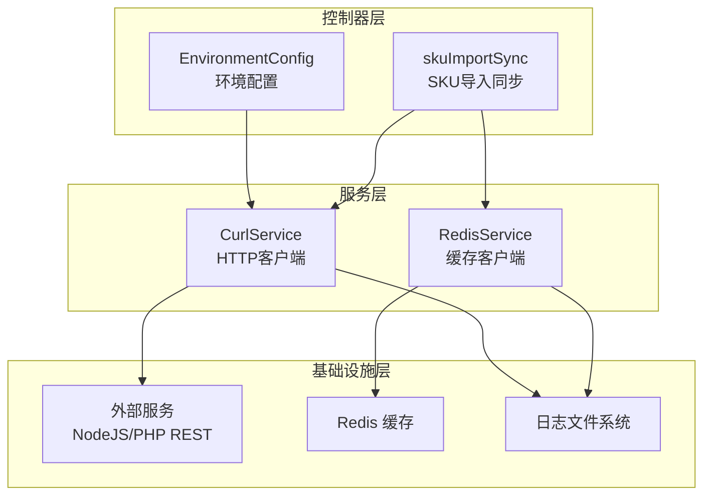
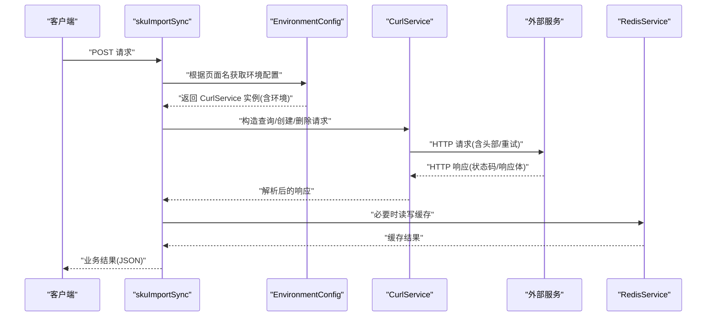
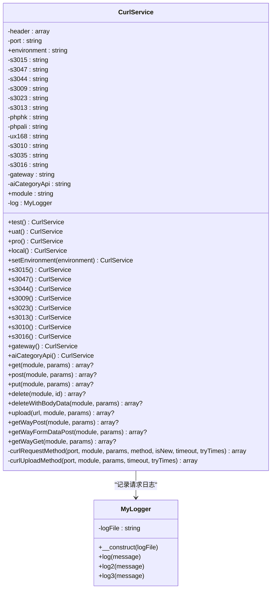
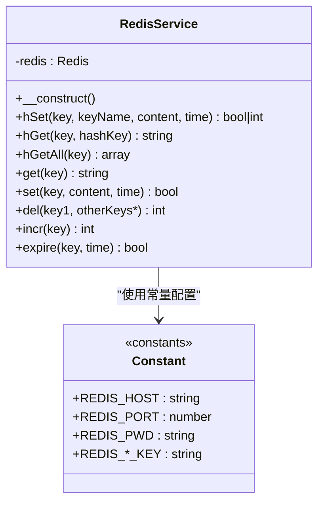
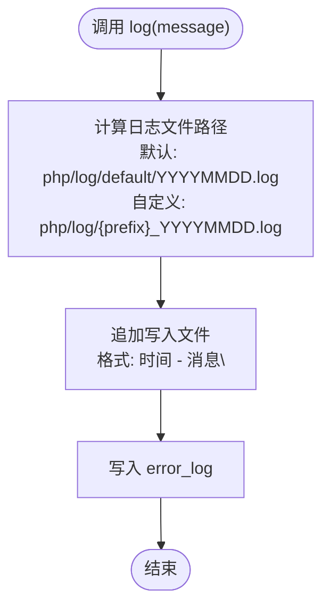
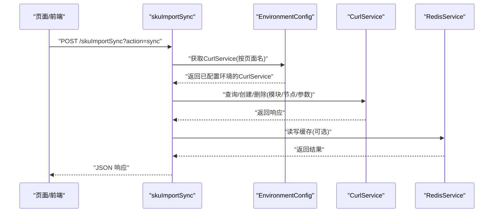
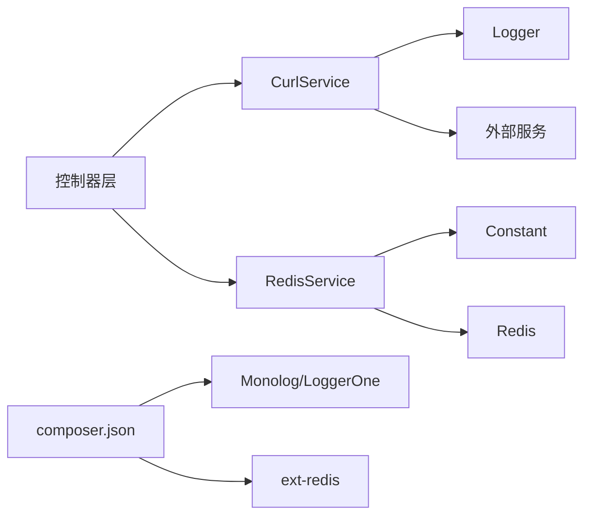

# 组件交互关系

<cite>
**本文引用的文件**
- [CurlService.php](file://php/curl/CurlService.php)
- [RedisService.php](file://php/redis/RedisService.php)
- [Logger.php](file://php/class/Logger.php)
- [Constant.php](file://php/constant/Constant.php)
- [skuImportSync.php](file://php/controller/skuImportSync.php)
- [EnvironmentConfig.php](file://php/controller/EnvironmentConfig.php)
- [composer.json](file://composer.json)
- [common.php](file://php/common.php)
</cite>

## 目录
1. [简介](#简介)
2. [项目结构](#项目结构)
3. [核心组件](#核心组件)
4. [架构总览](#架构总览)
5. [详细组件分析](#详细组件分析)
6. [依赖关系分析](#依赖关系分析)
7. [性能考量](#性能考量)
8. [故障排查指南](#故障排查指南)
9. [结论](#结论)

## 简介
本文件聚焦PaSystem中组件交互关系，围绕以下目标展开：
- CurlService与外部服务的HTTP通信机制
- RedisService的缓存交互与键空间设计
- Logger的日志记录机制与落盘策略
- 组件间依赖关系与数据流向
- 事件驱动与异步处理的实现方式
- 组件解耦的设计原则与接口抽象策略

## 项目结构
PaSystem采用“控制器-服务-工具-基础设施”的分层组织方式：
- 控制器层：处理HTTP请求与业务入口，如SKU导入同步控制器
- 服务层：封装跨模块的业务能力，如CurlService、RedisService
- 工具层：通用数据处理与工具类，如日志、常量、通用数据工具
- 基础设施层：连接外部系统与持久化，如Redis、外部HTTP服务

图表来源
- [CurlService.php](file://php/curl/CurlService.php#L1-L996)
- [RedisService.php](file://php/redis/RedisService.php#L1-L77)
- [Logger.php](file://php/class/Logger.php#L1-L55)
- [EnvironmentConfig.php](file://php/controller/EnvironmentConfig.php#L1-L62)
- [skuImportSync.php](file://php/controller/skuImportSync.php#L1-L512)

章节来源
- [CurlService.php](file://php/curl/CurlService.php#L1-L996)
- [RedisService.php](file://php/redis/RedisService.php#L1-L77)
- [Logger.php](file://php/class/Logger.php#L1-L55)
- [EnvironmentConfig.php](file://php/controller/EnvironmentConfig.php#L1-L62)
- [skuImportSync.php](file://php/controller/skuImportSync.php#L1-L512)

## 核心组件
- CurlService：统一管理HTTP请求，支持多环境、多后端节点切换，内置重试与日志记录。
- RedisService：提供Redis连接、哈希与字符串操作，支持过期时间控制。
- Logger：提供基础文件落盘日志能力，默认写入日期分片日志文件，并回退至error_log。

章节来源
- [CurlService.php](file://php/curl/CurlService.php#L1-L996)
- [RedisService.php](file://php/redis/RedisService.php#L1-L77)
- [Logger.php](file://php/class/Logger.php#L1-L55)

## 架构总览
组件交互遵循“控制器-服务-外部系统/缓存”的分层模式：
- 控制器接收请求，选择目标环境与后端节点，调用CurlService发起HTTP请求
- CurlService负责构造URL、请求头、参数与重试策略，并通过Logger记录请求详情
- RedisService用于读写缓存，键空间由常量定义，支持哈希与字符串两类键
- 外部系统返回响应后，CurlService解析状态码与响应体，返回给控制器

图表来源
- [skuImportSync.php](file://php/controller/skuImportSync.php#L1-L512)
- [EnvironmentConfig.php](file://php/controller/EnvironmentConfig.php#L1-L62)
- [CurlService.php](file://php/curl/CurlService.php#L1-L996)
- [RedisService.php](file://php/redis/RedisService.php#L1-L77)

## 详细组件分析

### CurlService 组件
职责与特性
- 环境与节点管理：支持local/test/uat/pro四环境，映射到不同后端节点（如s3015、s3047、gateway等）
- 请求构建：统一设置请求头、Content-Type、User-Agent、Referer等；支持GET/POST/PUT/DELETE及上传
- 重试与容错：基于HTTP状态码判断，异常时按配置重试，记录日志
- 日志集成：通过MyLogger记录请求URL、参数与响应摘要

关键方法与行为
- 环境切换：test()/uat()/pro()/local()与setEnvironment()
- 节点选择：s3015()/s3047()/s3044()/s3009()/s3023()/s3013()/s3010()/s3016()/gateway()/aiCategoryApi()
- 请求方法：get()/post()/put()/delete()/deleteWithBodyData()/upload()/getWayPost()/getWayFormDataPost()/getWayGet()
- 底层实现：curlRequestMethod()/curlUploadMethod()负责cURL配置、发送与解析

图表来源
- [CurlService.php](file://php/curl/CurlService.php#L1-L996)
- [Logger.php](file://php/class/Logger.php#L1-L55)

章节来源
- [CurlService.php](file://php/curl/CurlService.php#L1-L996)
- [Logger.php](file://php/class/Logger.php#L1-L55)

### RedisService 组件
职责与特性
- 连接管理：通过常量配置Redis主机、端口与密码，建立连接并认证
- 数据操作：提供字符串与哈希两类KV操作，支持过期时间设置
- 键空间：键名由常量定义，便于统一管理与迁移

关键方法与行为
- 连接：__construct()内完成连接与认证
- 字符串：get()/set()/del()/incr()/expire()
- 哈希：hGet()/hSet()/hGetAll()

图表来源
- [RedisService.php](file://php/redis/RedisService.php#L1-L77)
- [Constant.php](file://php/constant/Constant.php#L1-L26)

章节来源
- [RedisService.php](file://php/redis/RedisService.php#L1-L77)
- [Constant.php](file://php/constant/Constant.php#L1-L26)

### Logger 组件
职责与特性
- 文件落盘：默认写入日期分片日志文件，支持自定义日志文件名
- 多落点：同时写入文件与error_log，便于统一采集
- 简化实现：当前版本以基础文件写入为主，保留扩展为Monolog/LoggerOne的注释

图表来源
- [Logger.php](file://php/class/Logger.php#L1-L55)

章节来源
- [Logger.php](file://php/class/Logger.php#L1-L55)

### 控制器与组件交互
- EnvironmentConfig：根据页面名选择目标环境（test/pro等），并将CurlService注入到具体页面
- skuImportSync：作为业务入口，负责解析请求、调用CurlService与RedisService、组装响应

图表来源
- [skuImportSync.php](file://php/controller/skuImportSync.php#L1-L512)
- [EnvironmentConfig.php](file://php/controller/EnvironmentConfig.php#L1-L62)
- [RedisService.php](file://php/redis/RedisService.php#L1-L77)
- [CurlService.php](file://php/curl/CurlService.php#L1-L996)

章节来源
- [skuImportSync.php](file://php/controller/skuImportSync.php#L1-L512)
- [EnvironmentConfig.php](file://php/controller/EnvironmentConfig.php#L1-L62)

## 依赖关系分析
- CurlService依赖Logger进行请求日志记录
- RedisService依赖Constant中的Redis连接参数
- 控制器层依赖CurlService与RedisService完成业务编排
- composer.json声明了日志库与Redis扩展的运行时依赖

图表来源
- [composer.json](file://composer.json#L1-L11)
- [CurlService.php](file://php/curl/CurlService.php#L1-L996)
- [RedisService.php](file://php/redis/RedisService.php#L1-L77)
- [Logger.php](file://php/class/Logger.php#L1-L55)
- [Constant.php](file://php/constant/Constant.php#L1-L26)

章节来源
- [composer.json](file://composer.json#L1-L11)
- [CurlService.php](file://php/curl/CurlService.php#L1-L996)
- [RedisService.php](file://php/redis/RedisService.php#L1-L77)
- [Logger.php](file://php/class/Logger.php#L1-L55)
- [Constant.php](file://php/constant/Constant.php#L1-L26)

## 性能考量
- HTTP请求
  - 重试策略：基于HTTP状态码判断，异常时按配置重试，建议结合指数退避降低外部压力
  - 超时设置：cURL超时可配置，建议根据外部服务SLA调整
  - 头部与UA：统一User-Agent与Referer，有助于外部服务识别与限流策略
- 缓存
  - 过期时间：支持为键设置TTL，建议结合业务生命周期合理设置
  - 键命名：通过常量集中管理，避免散乱键名导致维护困难
- 日志
  - 文件落盘：建议配合日志切割与归档策略，避免单文件过大
  - 异步：当前为同步落盘，高并发场景可考虑异步写入或缓冲队列

## 故障排查指南
- HTTP请求失败
  - 检查环境配置与节点映射是否正确
  - 查看CurlService日志，定位URL、参数与状态码
  - 关注cURL异常与重试次数，必要时提升超时或减少并发
- 缓存异常
  - 核对Redis连接参数与认证信息
  - 检查键空间与TTL设置，确认读写路径
- 日志问题
  - 确认日志文件路径与权限
  - 检查error_log输出位置，确保日志采集链路可用

章节来源
- [CurlService.php](file://php/curl/CurlService.php#L664-L740)
- [RedisService.php](file://php/redis/RedisService.php#L15-L19)
- [Logger.php](file://php/class/Logger.php#L17-L25)

## 结论
- CurlService提供了统一的HTTP客户端能力，通过环境与节点抽象屏蔽外部差异
- RedisService以常量驱动的键空间设计，简化了缓存策略的统一管理
- Logger以最小实现提供可靠落盘与采集通道
- 控制器层通过EnvironmentConfig与CurlService/RedisService协作，形成清晰的业务编排
- 建议在高并发场景引入指数退避重试、异步日志与更细粒度的监控埋点，持续优化稳定性与可观测性