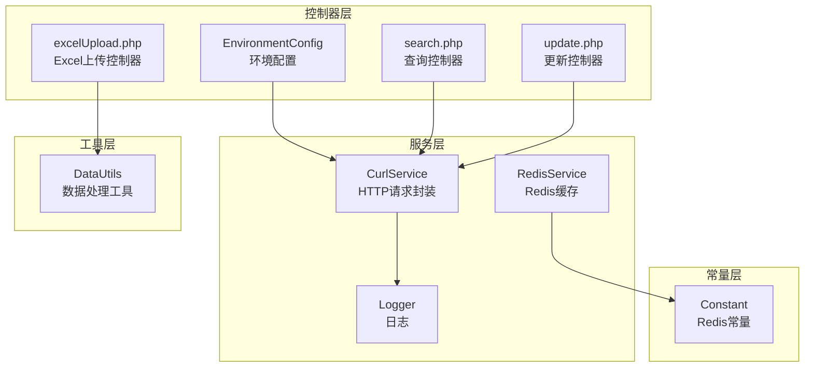
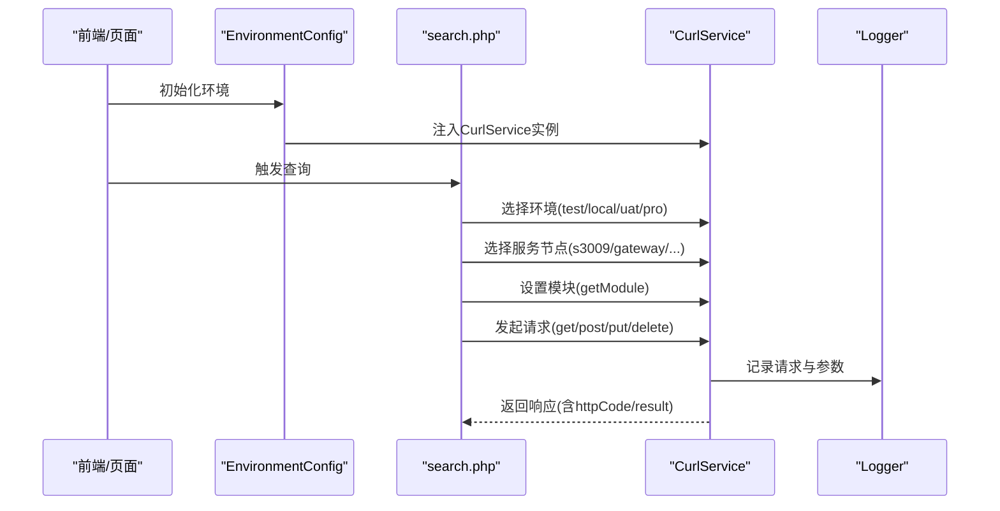
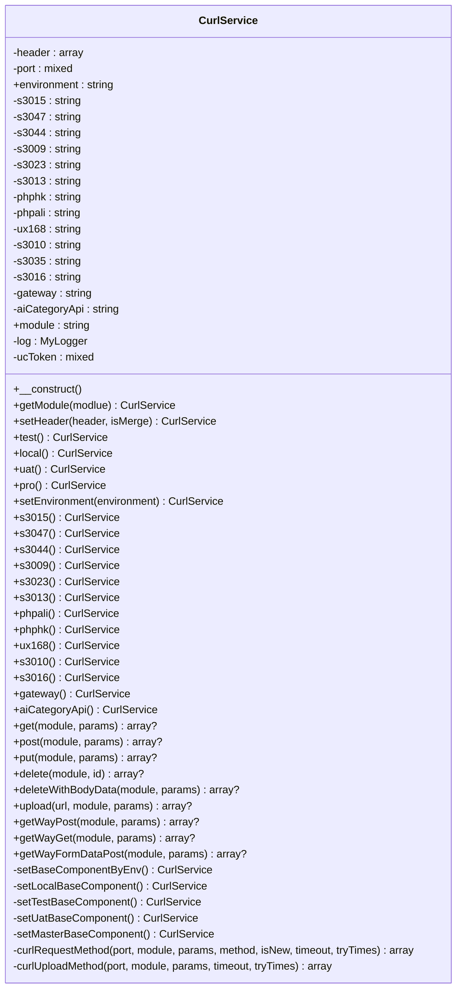
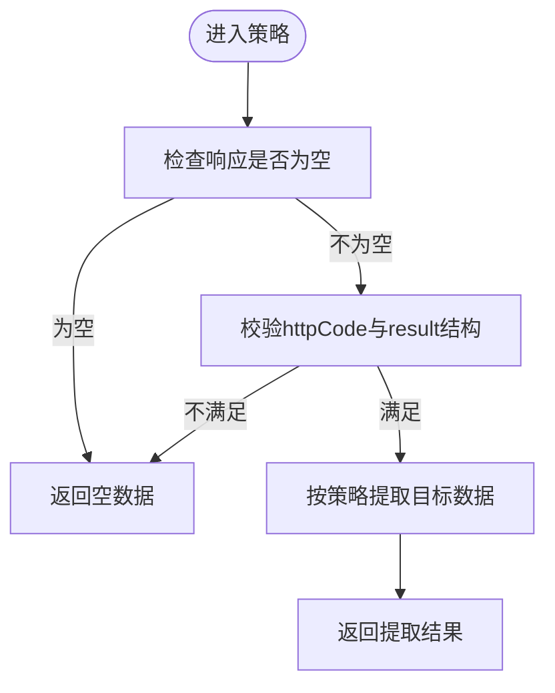
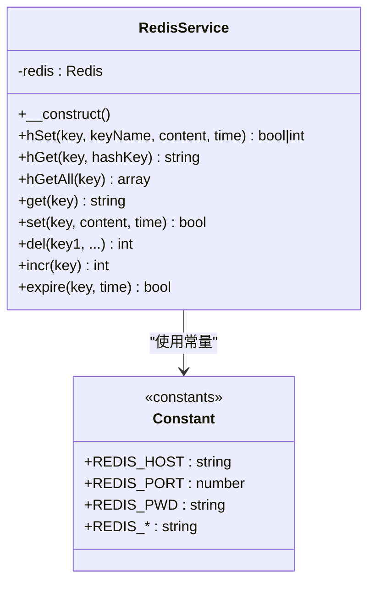
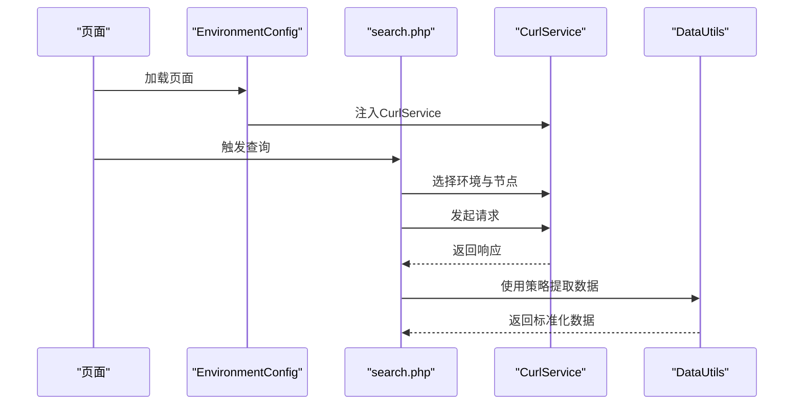
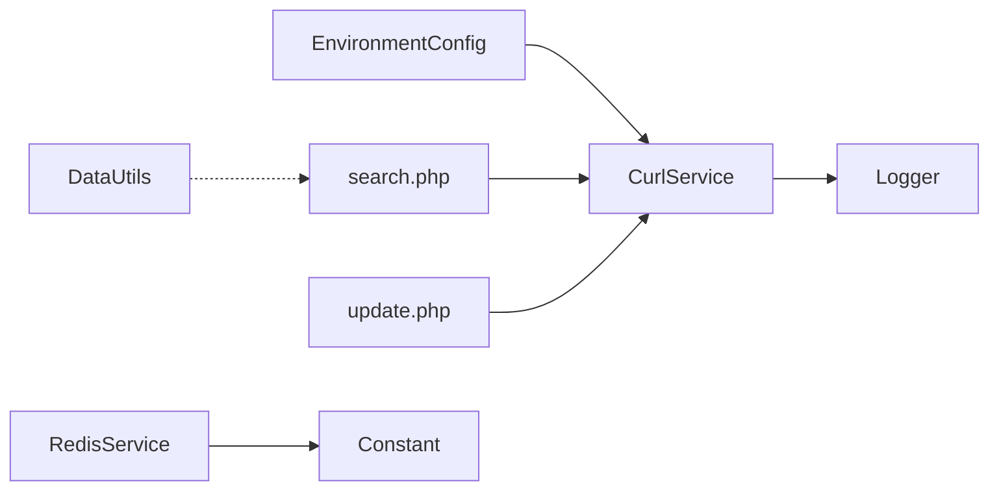

# 设计模式应用

<cite>
**本文引用的文件**
- [CurlService.php](file://php/curl/CurlService.php)
- [EnvironmentConfig.php](file://php/controller/EnvironmentConfig.php)
- [search.php](file://php/controller/search.php)
- [update.php](file://php/controller/update.php)
- [DataUtils.php](file://php/utils/DataUtils.php)
- [RedisService.php](file://php/redis/RedisService.php)
- [Constant.php](file://php/constant/Constant.php)
- [Logger.php](file://php/class/Logger.php)
- [excelUpload.php](file://php/controller/excelUpload.php)
</cite>

## 目录
1. [简介](#简介)
2. [项目结构](#项目结构)
3. [核心组件](#核心组件)
4. [架构总览](#架构总览)
5. [详细组件分析](#详细组件分析)
6. [依赖关系分析](#依赖关系分析)
7. [性能考量](#性能考量)
8. [故障排查指南](#故障排查指南)
9. [结论](#结论)
10. [附录](#附录)

## 简介
本文件聚焦于PaSystem中设计模式的应用实践，重点覆盖以下方面：
- CurlService中的工厂模式：用于环境配置与HTTP请求封装，统一管理不同环境与服务节点的访问地址与请求头。
- 策略模式：通过DataUtils对不同接口返回数据格式进行适配与提取，形成可替换的数据处理策略。
- 单例模式：通过常量与静态方法实现服务实例的集中管理与复用。

这些设计模式提升了系统的可维护性与可扩展性，便于在多环境、多服务节点与多样化数据格式下保持清晰的职责边界与稳定的调用接口。

## 项目结构
PaSystem采用分层与功能域结合的组织方式：
- 控制器层：负责业务入口与参数编排，如EnvironmentConfig、search、update等。
- 服务层：封装底层能力，如CurlService（HTTP请求）、RedisService（缓存）、Logger（日志）。
- 工具层：提供通用数据处理与转换能力，如DataUtils。
- 常量层：集中管理Redis连接参数等配置。

**图表来源**
- [EnvironmentConfig.php](file://php/controller/EnvironmentConfig.php#L1-L17)
- [search.php](file://php/controller/search.php#L158-L198)
- [update.php](file://php/controller/update.php#L351-L370)
- [excelUpload.php](file://php/controller/excelUpload.php#L1-L372)
- [CurlService.php](file://php/curl/CurlService.php#L1-L996)
- [RedisService.php](file://php/redis/RedisService.php#L1-L77)
- [DataUtils.php](file://php/utils/DataUtils.php#L1-L802)
- [Constant.php](file://php/constant/Constant.php#L1-L26)
- [Logger.php](file://php/class/Logger.php#L1-L55)

**章节来源**
- [EnvironmentConfig.php](file://php/controller/EnvironmentConfig.php#L1-L17)
- [excelUpload.php](file://php/controller/excelUpload.php#L1-L372)

## 核心组件
- CurlService：统一管理HTTP请求，支持多环境（local/test/uat/pro）与多服务节点（s3015/s3047/.../gateway/aiCategoryApi），内置链式配置与日志记录。
- DataUtils：提供多种数据提取与转换策略，屏蔽不同接口返回格式差异，便于上层稳定调用。
- RedisService：封装Redis常用操作，集中配置连接参数，提供哈希与字符串读写能力。
- Logger：提供基础日志写入能力，便于调试与问题定位。
- EnvironmentConfig：在页面加载时注入CurlService，统一环境配置入口。

**章节来源**
- [CurlService.php](file://php/curl/CurlService.php#L1-L996)
- [DataUtils.php](file://php/utils/DataUtils.php#L1-L802)
- [RedisService.php](file://php/redis/RedisService.php#L1-L77)
- [Logger.php](file://php/class/Logger.php#L1-L55)
- [EnvironmentConfig.php](file://php/controller/EnvironmentConfig.php#L1-L17)

## 架构总览
CurlService贯穿请求生命周期：环境选择 -> 服务节点选择 -> 请求头设置 -> 发起HTTP请求 -> 结果解析与日志记录。通过链式调用与分支切换，实现“一次配置，多次使用”的可复用请求通道。

**图表来源**
- [EnvironmentConfig.php](file://php/controller/EnvironmentConfig.php#L1-L17)
- [search.php](file://php/controller/search.php#L158-L198)
- [CurlService.php](file://php/curl/CurlService.php#L98-L143)
- [CurlService.php](file://php/curl/CurlService.php#L149-L290)
- [CurlService.php](file://php/curl/CurlService.php#L294-L433)
- [Logger.php](file://php/class/Logger.php#L22-L25)

## 详细组件分析

### CurlService：工厂模式与链式配置
- 环境工厂：通过环境方法（test/local/uat/pro/setEnvironment）与节点方法（s3015/s3047/.../gateway/aiCategoryApi）组合，形成“环境+节点”的工厂式配置。
- 请求封装：统一处理URL拼接、请求头、超时与重试、日志记录与响应解析。
- 链式调用：每个配置方法返回自身实例，便于连续调用，降低调用方心智负担。

**图表来源**
- [CurlService.php](file://php/curl/CurlService.php#L1-L996)

**应用场景与实现要点**
- 环境配置工厂：通过环境选择方法与节点选择方法的组合，形成“环境+节点”的工厂式配置，避免在调用处分散配置。
- 请求封装：统一处理URL、请求头、超时与重试、日志记录与响应解析，减少重复代码。
- 链式调用：每个配置方法返回自身实例，便于连续调用，降低调用方心智负担。

**设计模式选择原则与权衡**
- 选择原则：将“环境+节点”与“请求行为”解耦，通过链式配置降低耦合度；将HTTP细节封装在服务内，便于统一治理。
- 权衡考虑：链式配置虽然易用，但过度链化可能导致调试困难；建议在关键节点添加日志与断言，确保可追踪性。

**章节来源**
- [CurlService.php](file://php/curl/CurlService.php#L98-L143)
- [CurlService.php](file://php/curl/CurlService.php#L149-L290)
- [CurlService.php](file://php/curl/CurlService.php#L441-L458)
- [CurlService.php](file://php/curl/CurlService.php#L465-L505)
- [CurlService.php](file://php/curl/CurlService.php#L511-L553)
- [CurlService.php](file://php/curl/CurlService.php#L559-L599)
- [CurlService.php](file://php/curl/CurlService.php#L605-L651)
- [CurlService.php](file://php/curl/CurlService.php#L664-L740)
- [CurlService.php](file://php/curl/CurlService.php#L751-L802)

### DataUtils：策略模式的数据处理
- 多策略提取：针对不同接口返回格式，提供getResultData、getPageList、getQueryList、getNewResultData等策略方法，屏蔽差异。
- 稳定契约：上层调用仅依赖统一的策略方法签名，无需关心具体字段与层级差异。
- 可扩展性：新增策略时，遵循现有签名与命名规范，不影响既有调用。

**图表来源**
- [DataUtils.php](file://php/utils/DataUtils.php#L18-L29)
- [DataUtils.php](file://php/utils/DataUtils.php#L36-L47)
- [DataUtils.php](file://php/utils/DataUtils.php#L54-L65)
- [DataUtils.php](file://php/utils/DataUtils.php#L260-L271)

**应用场景与实现要点**
- 统一数据提取：通过策略方法屏蔽不同接口返回格式差异，保证上层调用一致性。
- 可替换性：当接口返回格式变化时，仅需调整对应策略方法，不影响调用方。

**设计模式选择原则与权衡**
- 选择原则：以策略方法抽象不同数据格式的提取逻辑，保持调用方稳定。
- 权衡考虑：策略数量过多可能导致维护成本上升，建议按接口域分组与命名规范统一。

**章节来源**
- [DataUtils.php](file://php/utils/DataUtils.php#L18-L29)
- [DataUtils.php](file://php/utils/DataUtils.php#L36-L47)
- [DataUtils.php](file://php/utils/DataUtils.php#L54-L65)
- [DataUtils.php](file://php/utils/DataUtils.php#L260-L271)

### RedisService：单例模式的服务实例管理
- 实例化：构造函数中完成Redis连接与认证，集中管理连接参数。
- 单点访问：通过静态方法或全局实例提供统一访问入口，避免重复连接与配置漂移。
- 配置集中：连接参数通过Constant集中定义，便于统一维护与切换。

**图表来源**
- [RedisService.php](file://php/redis/RedisService.php#L1-L77)
- [Constant.php](file://php/constant/Constant.php#L1-L26)

**应用场景与实现要点**
- 连接复用：通过单例避免重复建立连接，降低资源消耗。
- 配置集中：连接参数集中定义，便于在多环境间切换。

**设计模式选择原则与权衡**
- 选择原则：以单例模式管理Redis连接，确保资源可控与配置统一。
- 权衡考虑：单例模式在并发与测试隔离方面可能存在挑战，建议在单元测试中提供Mock或替换机制。

**章节来源**
- [RedisService.php](file://php/redis/RedisService.php#L15-L19)
- [Constant.php](file://php/constant/Constant.php#L4-L6)

### 环境配置与控制器集成
- EnvironmentConfig：在页面加载时注入CurlService，统一环境配置入口。
- 控制器：search与update等控制器通过CurlService发起请求，并使用DataUtils进行数据提取与转换。

**图表来源**
- [EnvironmentConfig.php](file://php/controller/EnvironmentConfig.php#L1-L17)
- [search.php](file://php/controller/search.php#L158-L198)
- [CurlService.php](file://php/curl/CurlService.php#L294-L433)
- [DataUtils.php](file://php/utils/DataUtils.php#L18-L29)

**章节来源**
- [EnvironmentConfig.php](file://php/controller/EnvironmentConfig.php#L1-L17)
- [search.php](file://php/controller/search.php#L158-L198)
- [update.php](file://php/controller/update.php#L351-L370)

## 依赖关系分析
- CurlService依赖Logger进行请求日志记录，依赖EnvironmentConfig注入实例。
- 控制器层依赖CurlService与DataUtils，形成清晰的调用链。
- RedisService依赖Constant进行连接参数配置。

**图表来源**
- [EnvironmentConfig.php](file://php/controller/EnvironmentConfig.php#L1-L17)
- [search.php](file://php/controller/search.php#L158-L198)
- [update.php](file://php/controller/update.php#L351-L370)
- [CurlService.php](file://php/curl/CurlService.php#L1-L996)
- [Logger.php](file://php/class/Logger.php#L1-L55)
- [DataUtils.php](file://php/utils/DataUtils.php#L1-L802)
- [RedisService.php](file://php/redis/RedisService.php#L1-L77)
- [Constant.php](file://php/constant/Constant.php#L1-L26)

**章节来源**
- [CurlService.php](file://php/curl/CurlService.php#L1-L996)
- [DataUtils.php](file://php/utils/DataUtils.php#L1-L802)
- [RedisService.php](file://php/redis/RedisService.php#L1-L77)
- [Constant.php](file://php/constant/Constant.php#L1-L26)
- [Logger.php](file://php/class/Logger.php#L1-L55)
- [EnvironmentConfig.php](file://php/controller/EnvironmentConfig.php#L1-L17)
- [search.php](file://php/controller/search.php#L158-L198)
- [update.php](file://php/controller/update.php#L351-L370)

## 性能考量
- 请求重试与超时：CurlService在请求失败时支持有限次重试与超时控制，平衡稳定性与响应时间。
- 数据提取策略：DataUtils通过策略方法快速提取所需数据，减少不必要的数据拷贝与转换。
- 连接复用：RedisService单例模式避免重复连接，降低网络与CPU开销。
- 日志粒度：Logger提供基础日志能力，建议在高并发场景下控制日志级别与频率，避免I/O瓶颈。

[本节为通用指导，无需列出具体文件来源]

## 故障排查指南
- 环境与节点配置：确认环境选择与节点映射是否正确，检查setBaseComponentByEnv与各环境分支。
- 请求头与鉴权：核对Authorization与模块设置，确保请求头符合目标服务要求。
- 响应状态码：关注httpCode与异常抛出逻辑，结合日志定位问题。
- 数据提取：当接口返回格式变化时，优先检查对应策略方法的判断条件与字段路径。
- Redis连接：确认常量配置与连接参数，检查认证与网络连通性。

**章节来源**
- [CurlService.php](file://php/curl/CurlService.php#L441-L458)
- [CurlService.php](file://php/curl/CurlService.php#L664-L740)
- [DataUtils.php](file://php/utils/DataUtils.php#L18-L29)
- [RedisService.php](file://php/redis/RedisService.php#L15-L19)
- [Constant.php](file://php/constant/Constant.php#L4-L6)
- [Logger.php](file://php/class/Logger.php#L22-L25)

## 结论
PaSystem通过CurlService的工厂模式、DataUtils的策略模式与RedisService的单例模式，实现了环境与节点的统一配置、数据格式的稳定提取与服务实例的集中管理。这些设计模式提升了系统的可维护性与可扩展性，便于在多环境、多服务节点与多样化数据格式下保持清晰的职责边界与稳定的调用接口。

[本节为总结性内容，无需列出具体文件来源]

## 附录
- Excel上传控制器：提供文件校验、读取与批量处理能力，便于后续数据导入与处理流程集成。

**章节来源**
- [excelUpload.php](file://php/controller/excelUpload.php#L1-L372)