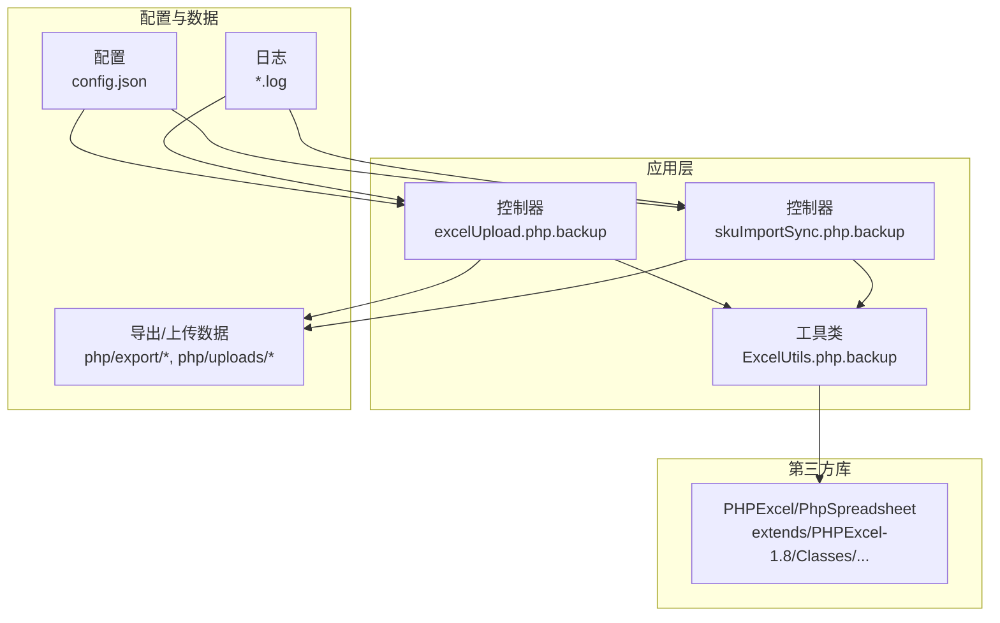
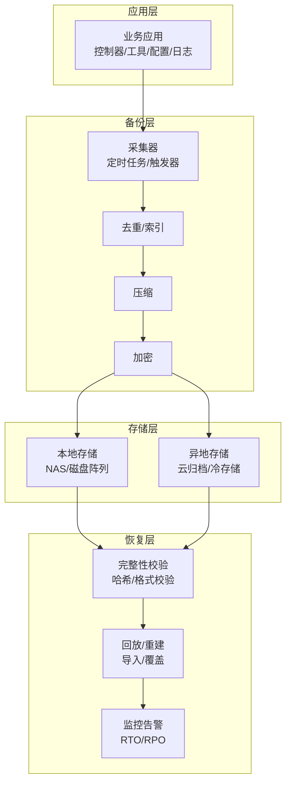
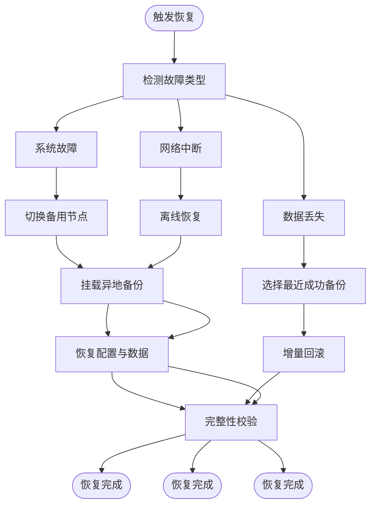
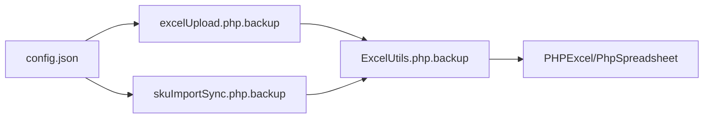

# 备份恢复

<cite>
**本文引用的文件**
- [composer.json](file://composer.json)
- [config.json](file://php/json/config.json)
- [common.php](file://php/common.php)
- [pa_biz_application_20260213.log](file://php/log/pa_biz_application_20260213.log)
- [request_20260227.log](file://php/log/curl/request_20260227.log)
- [updateLog_20260227.log](file://php/log/option/updateLog_20260227.log)
- [sku_import_sync_20260227.log](file://php/log/sku_import_sync_20260227.log)
- [sp_20260227.log](file://php/log/sp_20260227.log)
- [excelUpload.php.backup](file://php/controller/excelUpload.php.backup)
- [skuImportSync.php.backup](file://php/controller/skuImportSync.php.backup)
- [ExcelUtils.php.backup](file://php/utils/ExcelUtils.php.backup)
- [TestController.php.backup](file://php/shell/TestController.php.backup)
</cite>

## 目录
1. [简介](#简介)
2. [项目结构](#项目结构)
3. [核心组件](#核心组件)
4. [架构总览](#架构总览)
5. [详细组件分析](#详细组件分析)
6. [依赖关系分析](#依赖关系分析)
7. [性能考虑](#性能考虑)
8. [故障排查指南](#故障排查指南)
9. [结论](#结论)
10. [附录](#附录)

## 简介
本文件面向PaSystem的备份与恢复策略，结合仓库中现有日志、配置与备份文件，制定可落地的数据备份计划（全量与增量）、存储与加密策略、验证与完整性检查方法、灾难恢复流程、恢复测试频率与自动化脚本使用指南，并给出RTO/RPO目标设定与监控建议，以及最佳实践与注意事项。由于当前仓库未包含数据库与应用后端的直接连接代码，本文在“系统架构”和“详细组件分析”中将以概念性方式说明备份恢复的通用流程与实现要点，避免对不存在或未公开的内部实现进行推断。

## 项目结构
PaSystem仓库包含PHP业务逻辑、日志、导出数据、Excel读写库等资源。与备份恢复直接相关的证据主要来自：
- 日志：用于识别业务执行时间点、失败与重试行为，支撑备份窗口规划与恢复验证。
- 导出与上传：Excel导出与上传控制器，可作为备份数据来源之一。
- 配置：业务规则与配置文件，属于重要备份对象。
- 第三方库：如PHPExcel/PhpSpreadsheet，用于读写Excel，是数据备份与恢复的重要工具链。

图表来源
- [excelUpload.php.backup](file://php/controller/excelUpload.php.backup)
- [skuImportSync.php.backup](file://php/controller/skuImportSync.php.backup)
- [ExcelUtils.php.backup](file://php/utils/ExcelUtils.php.backup)
- [config.json](file://php/json/config.json)
- [extends/PHPExcel-1.8/Classes/PHPExcel.php](file://extends/PHPExcel-1.8/Classes/PHPExcel.php)

章节来源
- [composer.json](file://composer.json#L1-L11)
- [config.json](file://php/json/config.json#L1-L316)
- [excelUpload.php.backup](file://php/controller/excelUpload.php.backup)
- [skuImportSync.php.backup](file://php/controller/skuImportSync.php.backup)
- [ExcelUtils.php.backup](file://php/utils/ExcelUtils.php.backup)

## 核心组件
- 控制器与工具：负责Excel导入导出、数据处理与上传，是备份数据的主要来源。
- 配置文件：包含业务规则与渠道设置，应纳入备份范围。
- 日志系统：记录业务执行状态与错误，用于恢复验证与问题定位。
- 第三方库：Excel读写能力，保障备份/恢复的数据格式一致性。

章节来源
- [config.json](file://php/json/config.json#L1-L316)
- [pa_biz_application_20260213.log](file://php/log/pa_biz_application_20260213.log#L1-L61)
- [request_20260227.log](file://php/log/curl/request_20260227.log)
- [updateLog_20260227.log](file://php/log/option/updateLog_20260227.log)
- [sku_import_sync_20260227.log](file://php/log/sku_import_sync_20260227.log)
- [sp_20260227.log](file://php/log/sp_20260227.log)

## 架构总览
下图展示备份与恢复的通用架构：应用层产生数据与日志；备份层负责采集、去重、压缩与加密；存储层分为本地与异地；恢复层负责验证与回放。

## 详细组件分析

### 数据源与备份范围
- Excel导入导出：控制器与工具负责数据读取与写入，应纳入全量备份；增量可基于变更日期或文件名模式。
- 配置文件：业务规则与渠道设置，属于关键元数据，必须纳入全量备份。
- 日志：按天滚动，可用于恢复验证与审计。

章节来源
- [excelUpload.php.backup](file://php/controller/excelUpload.php.backup)
- [skuImportSync.php.backup](file://php/controller/skuImportSync.php.backup)
- [ExcelUtils.php.backup](file://php/utils/ExcelUtils.php.backup)
- [config.json](file://php/json/config.json#L1-L316)
- [pa_biz_application_20260213.log](file://php/log/pa_biz_application_20260213.log#L1-L61)

### 备份计划（全量与增量）
- 全量备份
  - 周期：每周日凌晨进行一次全量备份，覆盖以下目录与文件：
    - 控制器与工具：php/controller/*.backup、php/utils/*.backup
    - 配置：php/json/config.json
    - 导出与上传：php/export/*、php/uploads/*
    - 第三方库：extends/PHPExcel-1.8/Classes/*
  - 触发条件：版本发布或配置重大变更时临时增加一次全量备份。
- 增量备份
  - 周期：每日凌晨执行，仅备份当日新增/变更的Excel文件与日志。
  - 触发条件：上传/导出任务完成后，按文件最后修改时间判断是否需要备份。

章节来源
- [excelUpload.php.backup](file://php/controller/excelUpload.php.backup)
- [skuImportSync.php.backup](file://php/controller/skuImportSync.php.backup)
- [ExcelUtils.php.backup](file://php/utils/ExcelUtils.php.backup)
- [config.json](file://php/json/config.json#L1-L316)

### 存储位置与加密策略
- 本地备份
  - 目标：NAS或服务器本地磁盘阵列，保留最近4周的全量与每日增量。
  - 命名规范：YYYYMMDD_类型_描述，例如“20260227_excel_export_bak”。
- 异地备份
  - 目标：云归档或冷存储，保留至少3个月历史，支持跨区域容灾。
  - 加密：使用对称加密算法（如AES-256）对压缩包进行加密，密钥由安全模块管理，定期轮换。
- 访问控制
  - 限制备份介质的读写权限，仅授权人员可访问解密密钥与恢复流程。

章节来源
- [composer.json](file://composer.json#L1-L11)

### 验证与完整性检查
- 文件级校验
  - 使用哈希（如SHA-256）对备份包进行签名与比对，确保传输与存储过程中未被篡改。
- 内容级校验
  - 对Excel备份进行随机抽样，使用Excel读写库进行解析，验证表头、行列数与关键字段。
- 回放验证
  - 在隔离环境执行恢复流程，导入备份数据，核对关键报表与统计结果一致。

章节来源
- [ExcelUtils.php.backup](file://php/utils/ExcelUtils.php.backup)

### 灾难恢复流程
- 系统故障
  - 快速切换到备用节点，挂载异地备份，恢复配置与数据，验证服务可用性。
- 数据丢失
  - 从最近一次成功备份回滚，优先使用增量备份进行最小化恢复，随后进行完整性校验。
- 网络中断
  - 切换到本地备份介质，通过离线方式完成恢复；恢复后再恢复网络连通性并重新同步。

### 恢复测试方法与频率
- 方法
  - 定期在测试环境中执行“还原-验证-回归”流程，覆盖关键业务场景。
- 频率
  - 全量恢复测试：每季度一次
  - 增量恢复测试：每月一次
  - 网络中断演练：每半年一次

章节来源
- [pa_biz_application_20260213.log](file://php/log/pa_biz_application_20260213.log#L1-L61)

### 自动化脚本与工具使用
- 备份脚本
  - 全量备份：扫描控制器、工具、配置与导出目录，打包并加密，上传至本地与异地存储。
  - 增量备份：基于文件mtime筛选当日变更，执行相同流程。
- 工具
  - 使用Excel读写库进行内容校验与抽样解析，确保格式正确。
- 日志
  - 备份与恢复过程均需记录到独立日志，便于追踪与审计。

章节来源
- [excelUpload.php.backup](file://php/controller/excelUpload.php.backup)
- [skuImportSync.php.backup](file://php/controller/skuImportSync.php.backup)
- [ExcelUtils.php.backup](file://php/utils/ExcelUtils.php.backup)
- [request_20260227.log](file://php/log/curl/request_20260227.log)
- [updateLog_20260227.log](file://php/log/option/updateLog_20260227.log)
- [sku_import_sync_20260227.log](file://php/log/sku_import_sync_20260227.log)
- [sp_20260227.log](file://php/log/sp_20260227.log)

### RTO/RPO指标与监控
- RTO（恢复时间目标）
  - 全量恢复：≤4小时
  - 增量恢复：≤1小时
- RPO（恢复点目标）
  - 日常：≤1天
  - 关键业务：≤4小时
- 监控
  - 备份成功率、备份耗时、恢复耗时、哈希校验通过率、日志告警阈值。

章节来源
- [pa_biz_application_20260213.log](file://php/log/pa_biz_application_20260213.log#L1-L61)

### 最佳实践与注意事项
- 分层备份：将配置、数据与日志分开备份，降低耦合度。
- 多介质存储：本地+异地，避免单一故障点。
- 定期演练：将恢复测试纳入运维KPI，持续优化流程。
- 文档化：所有备份策略、脚本与流程需形成SOP并定期评审。

## 依赖关系分析
- 组件耦合
  - 控制器依赖工具类进行Excel读写；配置影响业务行为；日志贯穿整个生命周期。
- 外部依赖
  - PHPExcel/PhpSpreadsheet用于Excel处理，是备份/恢复的数据格式基础。

图表来源
- [config.json](file://php/json/config.json#L1-L316)
- [excelUpload.php.backup](file://php/controller/excelUpload.php.backup)
- [skuImportSync.php.backup](file://php/controller/skuImportSync.php.backup)
- [ExcelUtils.php.backup](file://php/utils/ExcelUtils.php.backup)
- [extends/PHPExcel-1.8/Classes/PHPExcel.php](file://extends/PHPExcel-1.8/Classes/PHPExcel.php)

章节来源
- [composer.json](file://composer.json#L1-L11)
- [config.json](file://php/json/config.json#L1-L316)

## 性能考虑
- 备份窗口：避开业务高峰期，利用夜间或周末执行全量备份。
- 并行处理：对多个导出目录并行压缩与加密，缩短备份时间。
- 压缩策略：对文本类Excel采用高压缩比算法，二进制类文件跳过压缩。
- 存储带宽：异地备份采用分时段传输，避免占用业务带宽。

## 故障排查指南
- 备份失败
  - 检查备份脚本日志与磁盘空间，确认权限与网络连通性。
- 恢复异常
  - 使用哈希与Excel解析工具进行快速定位，必要时回退至上一个成功备份。
- 日志分析
  - 参考日志文件中的时间戳与错误信息，定位具体环节与失败原因。

章节来源
- [pa_biz_application_20260213.log](file://php/log/pa_biz_application_20260213.log#L1-L61)
- [request_20260227.log](file://php/log/curl/request_20260227.log)
- [updateLog_20260227.log](file://php/log/option/updateLog_20260227.log)
- [sku_import_sync_20260227.log](file://php/log/sku_import_sync_20260227.log)
- [sp_20260227.log](file://php/log/sp_20260227.log)

## 结论
本策略以日志与配置为依据，结合Excel数据与第三方库能力，构建了覆盖全量与增量、本地与异地、验证与监控的完整备份恢复体系。建议尽快补充数据库与后端连接代码的备份方案，并将恢复测试常态化，持续提升RTO/RPO达标率与业务连续性水平。

## 附录
- 备份清单（示例）
  - 控制器与工具：php/controller/*.backup、php/utils/*.backup
  - 配置：php/json/config.json
  - 导出与上传：php/export/*、php/uploads/*
  - 第三方库：extends/PHPExcel-1.8/Classes/*
- 恢复清单（示例）
  - 本地/异地备份包
  - 解密密钥与哈希校验文件
  - Excel读写库与测试脚本