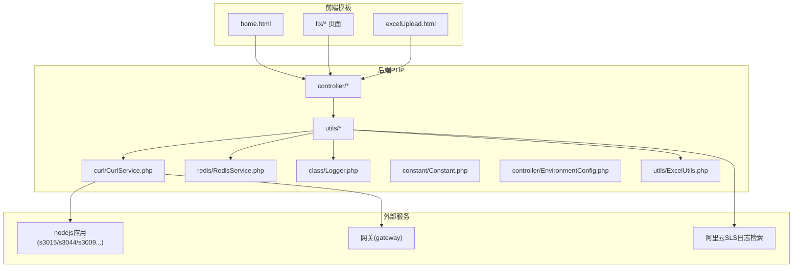
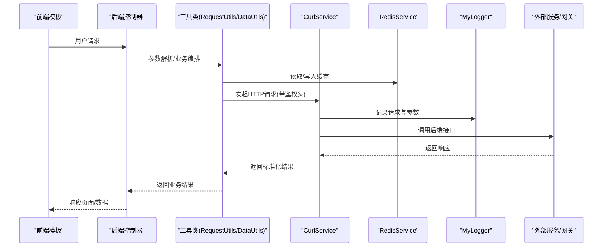
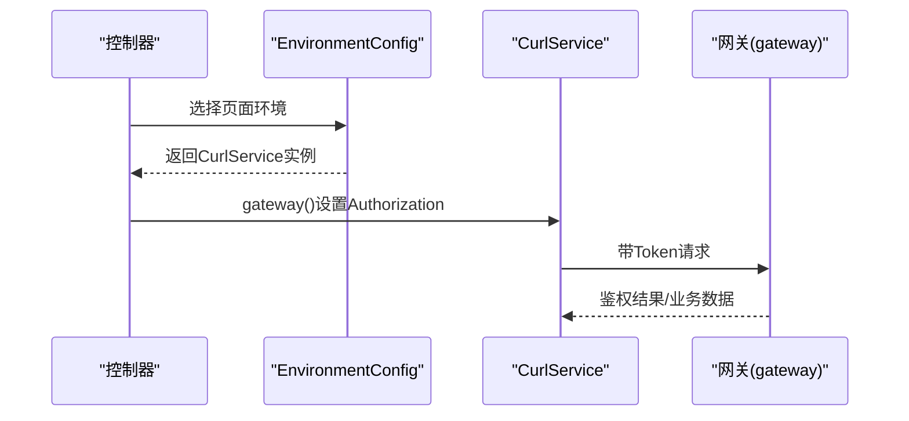
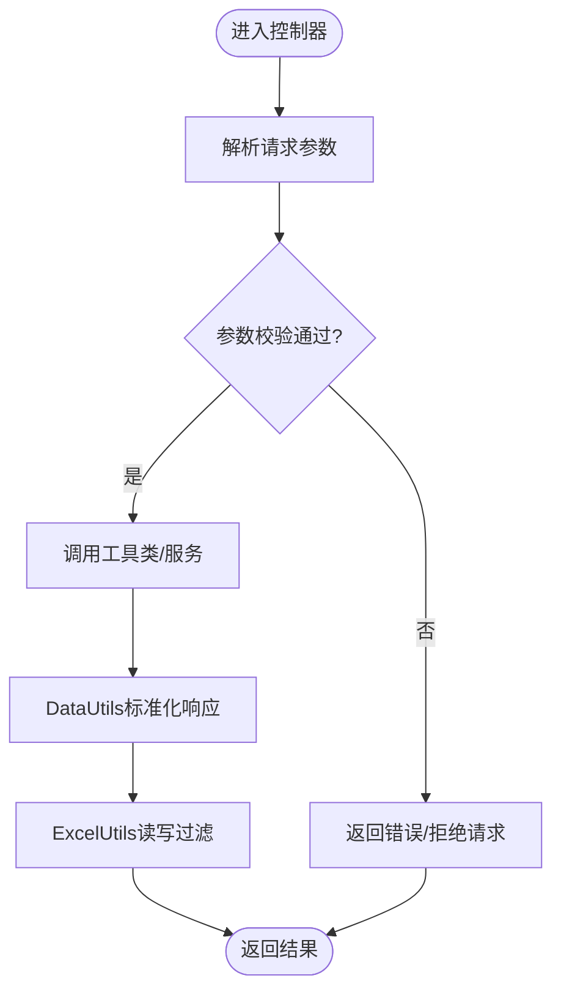
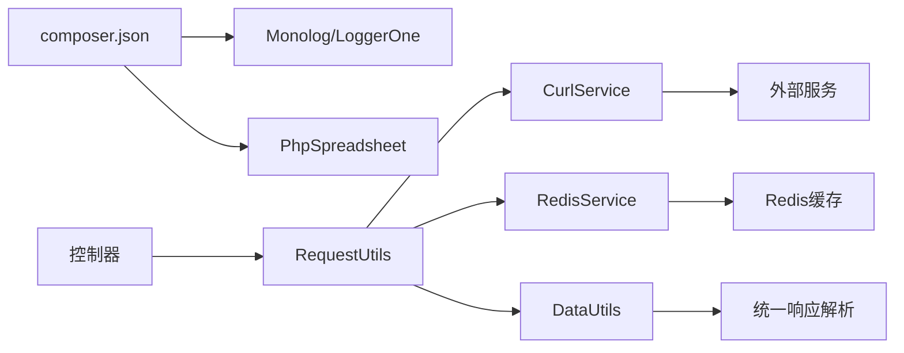

# 安全加固

<cite>
**本文引用的文件**
- [composer.json](file://composer.json)
- [common.php](file://php/common.php)
- [Logger.php](file://php/class/Logger.php)
- [Constant.php](file://php/constant/Constant.php)
- [EnvironmentConfig.php](file://php/controller/EnvironmentConfig.php)
- [DataUtils.php](file://php/utils/DataUtils.php)
- [RequestUtils.php](file://php/utils/RequestUtils.php)
- [CurlService.php](file://php/curl/CurlService.php)
- [RedisService.php](file://php/redis/RedisService.php)
- [ExcelUtils.php](file://php/utils/ExcelUtils.php)
- [config.json](file://php/json/config.json)
</cite>

## 目录
1. [简介](#简介)
2. [项目结构](#项目结构)
3. [核心组件](#核心组件)
4. [架构总览](#架构总览)
5. [详细组件分析](#详细组件分析)
6. [依赖关系分析](#依赖关系分析)
7. [性能考量](#性能考量)
8. [故障排查指南](#故障排查指南)
9. [结论](#结论)
10. [附录](#附录)

## 简介
本文件面向PaSystem系统的安全加固，围绕身份认证与授权、输入验证与数据过滤、HTTPS与证书管理、防火墙与网络安全、敏感数据加密与传输保护、安全审计与日志、安全扫描与漏洞评估、应急响应预案与合规审计等方面，结合代码库现状进行系统化梳理与改进建议。目标是在不改变现有业务流程的前提下，提升整体安全性与可维护性。

## 项目结构
PaSystem采用PHP后端与前端模板分离的结构，后端主要由控制器、工具类、服务封装与第三方库组成；前端模板位于template目录，提供若干功能页面入口。后端通过CurlService统一发起跨服务HTTP请求，RedisService负责缓存与用户会话相关数据，日志通过自定义Logger集中记录。

图表来源
- [common.php](file://php/common.php#L1-L9)
- [CurlService.php](file://php/curl/CurlService.php#L1-L120)
- [RedisService.php](file://php/redis/RedisService.php#L1-L77)
- [Logger.php](file://php/class/Logger.php#L1-L55)
- [ExcelUtils.php](file://php/utils/ExcelUtils.php#L1-L60)

章节来源
- [common.php](file://php/common.php#L1-L9)
- [composer.json](file://composer.json#L1-L11)

## 核心组件
- 身份认证与授权
  - 网关层Authorization头传递：CurlService在gateway模式下设置Authorization头，用于跨服务鉴权。
  - 环境切换与凭证：EnvironmentConfig根据页面名称选择不同CurlService实例，间接影响请求环境与凭证。
- 输入验证与数据过滤
  - 统一响应解析：DataUtils对多类接口返回进行标准化处理，减少脏数据进入后续流程。
  - Excel导入导出：ExcelUtils基于PhpSpreadsheet读写，具备基础的列名校验与长数字处理能力。
- HTTPS与证书管理
  - 生产环境使用HTTPS域名映射；测试/UAT环境通过HTTP或HTTPS域名映射，但存在禁用SSL校验的请求行为，需重点整改。
- 日志与审计
  - 自定义Logger集中记录请求与参数；RequestUtils封装调用链路日志；RedisService用于用户访问记录缓存。
- 缓存与会话
  - RedisService封装常用哈希与键操作，用于用户信息与分类信息缓存。
- 外部集成
  - CurlService统一调用多套后端服务；RequestUtils封装系统管理、产品、SKU等业务接口；EnvironmentConfig负责环境选择。

章节来源
- [CurlService.php](file://php/curl/CurlService.php#L264-L290)
- [EnvironmentConfig.php](file://php/controller/EnvironmentConfig.php#L1-L62)
- [DataUtils.php](file://php/utils/DataUtils.php#L18-L136)
- [ExcelUtils.php](file://php/utils/ExcelUtils.php#L1-L60)
- [RedisService.php](file://php/redis/RedisService.php#L1-L77)
- [Logger.php](file://php/class/Logger.php#L14-L55)

## 架构总览
下图展示从前端到后端控制器、工具类、服务封装与外部服务的整体交互，以及安全相关的关键节点（鉴权头、日志、缓存、证书校验）。

图表来源
- [RequestUtils.php](file://php/utils/RequestUtils.php#L1-L60)
- [CurlService.php](file://php/curl/CurlService.php#L664-L740)
- [RedisService.php](file://php/redis/RedisService.php#L1-L77)
- [Logger.php](file://php/class/Logger.php#L22-L37)

## 详细组件分析

### 身份认证与授权机制
- 网关鉴权
  - CurlService在gateway模式下设置Authorization头，使用环境相关的Bearer Token，用于跨服务鉴权。
- 环境配置
  - EnvironmentConfig根据页面名称选择不同CurlService实例，间接影响请求环境与凭证来源。
- 建议
  - 明确鉴权策略：统一在CurlService中注入Authorization，避免在控制器中分散处理。
  - 引入中间件或拦截器，在进入控制器前校验Token有效性与权限范围。
  - 对不同页面/功能模块划分最小权限集，避免过度授权。

图表来源
- [EnvironmentConfig.php](file://php/controller/EnvironmentConfig.php#L19-L57)
- [CurlService.php](file://php/curl/CurlService.php#L270-L290)

章节来源
- [EnvironmentConfig.php](file://php/controller/EnvironmentConfig.php#L1-L62)
- [CurlService.php](file://php/curl/CurlService.php#L264-L290)

### 输入验证与数据过滤
- 统一响应解析
  - DataUtils对多类接口返回进行标准化处理，包含httpCode与result字段校验，避免异常响应污染业务逻辑。
- Excel导入导出
  - ExcelUtils基于PhpSpreadsheet读写，具备基础的列名校验与长数字处理能力，避免科学计数法导致的数据失真。
- 建议
  - 在控制器层增加参数白名单与必填校验，结合DataUtils的校验逻辑形成双重保障。
  - 对用户上传的Excel文件增加扩展名与MIME类型校验，限制文件大小与行数。
  - 对外部接口返回进行严格Schema校验，必要时引入JSON Schema或对象映射校验库。

图表来源
- [DataUtils.php](file://php/utils/DataUtils.php#L18-L136)
- [ExcelUtils.php](file://php/utils/ExcelUtils.php#L147-L181)

章节来源
- [DataUtils.php](file://php/utils/DataUtils.php#L18-L136)
- [ExcelUtils.php](file://php/utils/ExcelUtils.php#L147-L181)

### HTTPS配置与SSL证书管理
- 现状
  - 生产环境通过HTTPS域名映射；测试/UAT环境通过HTTP或HTTPS域名映射。
  - CurlService在请求时显式禁用SSL证书校验（SSL_VERIFYPEER与SSL_VERIFYHOST），存在安全风险。
- 建议
  - 禁用SSL校验仅限本地调试，生产与UAT必须启用证书校验。
  - 使用系统CA证书或自签证书的可信链，避免跳过证书校验。
  - 定期更新证书与TLS版本，关闭不安全协议与密码套件。
  - 在反向代理层统一终止TLS，后端服务间通信可使用内网HTTP或受控隧道。

章节来源
- [CurlService.php](file://php/curl/CurlService.php#L683-L684)
- [CurlService.php](file://php/curl/CurlService.php#L767-L768)

### 防火墙与网络安全配置
- 建议
  - 仅开放必需端口（如网关对外端口），内网服务通过内网地址访问。
  - 在反向代理层配置访问控制与速率限制，阻断常见攻击特征。
  - 对外暴露的API接口增加IP白名单与来源校验。
  - 使用WAF（Web应用防火墙）拦截SQL注入、XSS、命令注入等攻击。

### 敏感数据的加密存储与传输保护
- 存储
  - Redis连接使用密码认证，建议配合网络隔离与只读权限控制。
- 传输
  - 生产环境必须启用HTTPS；禁用SSL校验的行为必须移除。
  - 对外部日志检索接口（如阿里云SLS）使用受控凭据与Cookie管理，避免硬编码。

章节来源
- [RedisService.php](file://php/redis/RedisService.php#L15-L19)
- [CurlService.php](file://php/curl/CurlService.php#L505-L549)

### 安全审计日志与分析
- 现状
  - 自定义Logger集中记录请求与参数；RequestUtils封装调用链路日志。
- 建议
  - 统一日志格式与字段（trace-id、用户、IP、时间、URI、方法、耗时、状态码）。
  - 将日志输出到集中式日志平台（如ELK/SLS），并建立告警规则。
  - 对敏感操作（用户变更、SKU修改、品牌调整）增加审计日志与回溯能力。

章节来源
- [Logger.php](file://php/class/Logger.php#L22-L37)
- [RequestUtils.php](file://php/utils/RequestUtils.php#L503-L573)

### 安全扫描与漏洞评估
- 建议
  - 使用自动化工具（如OWASP ZAP、Nessus、SonarQube）定期扫描代码与配置。
  - 对上传接口与外部日志检索接口进行专项渗透测试。
  - 建立漏洞修复与复测流程，形成闭环。

### 应急响应预案与安全事件处理
- 建议
  - 明确事件分级与处置流程（中断、降级、隔离、恢复）。
  - 建立快速回滚机制与备份恢复方案。
  - 对高危操作增加二次确认与审批流程。

### 安全合规性检查与审计
- 建议
  - 建立安全基线（密码复杂度、证书有效期、访问控制策略）。
  - 定期进行合规性自检与第三方审计，留存审计记录。

## 依赖关系分析
- Composer依赖
  - 使用Monolog、LoggerOne进行日志记录；使用phpoffice/phpspreadsheet进行Excel读写。
- 内部依赖
  - 控制器依赖工具类与服务封装；工具类依赖CurlService与RedisService；日志依赖自定义Logger。

图表来源
- [composer.json](file://composer.json#L1-L11)
- [RequestUtils.php](file://php/utils/RequestUtils.php#L1-L20)
- [CurlService.php](file://php/curl/CurlService.php#L1-L40)
- [RedisService.php](file://php/redis/RedisService.php#L1-L20)
- [DataUtils.php](file://php/utils/DataUtils.php#L1-L20)

章节来源
- [composer.json](file://composer.json#L1-L11)
- [RequestUtils.php](file://php/utils/RequestUtils.php#L1-L20)
- [CurlService.php](file://php/curl/CurlService.php#L1-L40)
- [RedisService.php](file://php/redis/RedisService.php#L1-L20)
- [DataUtils.php](file://php/utils/DataUtils.php#L1-L20)

## 性能考量
- 缓存优化
  - RedisService提供哈希与键操作，建议合理设置TTL与键命名规范，避免缓存雪崩与击穿。
- 请求优化
  - DataUtils对分页与列表进行统一处理，建议在工具层增加分页参数校验与最大限制。
- 日志性能
  - 自定义Logger采用文件追加，建议引入异步日志或批量写入，降低I/O开销。

## 故障排查指南
- 常见问题
  - 请求失败：检查CurlService的httpCode与header，定位外部服务异常。
  - 缓存异常：检查RedisService连接与认证，确认键空间与TTL。
  - 日志缺失：确认Logger路径与权限，检查日志文件是否被清理。
- 建议
  - 在RequestUtils中增加统一异常捕获与重试机制。
  - 对外部日志检索接口增加超时与重试策略。

章节来源
- [CurlService.php](file://php/curl/CurlService.php#L714-L740)
- [RedisService.php](file://php/redis/RedisService.php#L15-L19)
- [Logger.php](file://php/class/Logger.php#L22-L25)

## 结论
PaSystem在架构上已具备较为清晰的服务边界与日志记录能力，但在HTTPS证书校验、鉴权策略统一、输入验证与数据过滤、缓存与传输安全等方面仍有改进空间。建议优先完成证书校验与鉴权统一，再逐步完善输入校验、日志审计与合规流程，最终形成可持续的安全运营体系。

## 附录
- 前端模板
  - 模板目录包含若干功能页面，建议在前端侧增加CSRF防护与XSS防护策略，统一在入口处注入安全头。
- 配置示例
  - config.json为业务规则配置文件，建议将其纳入版本控制与变更审批流程。

章节来源
- [config.json](file://php/json/config.json#L1-L316)