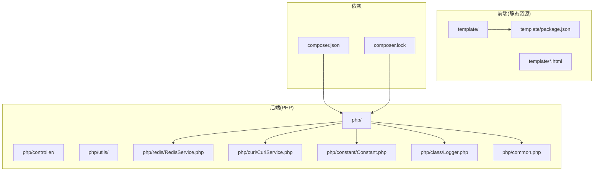
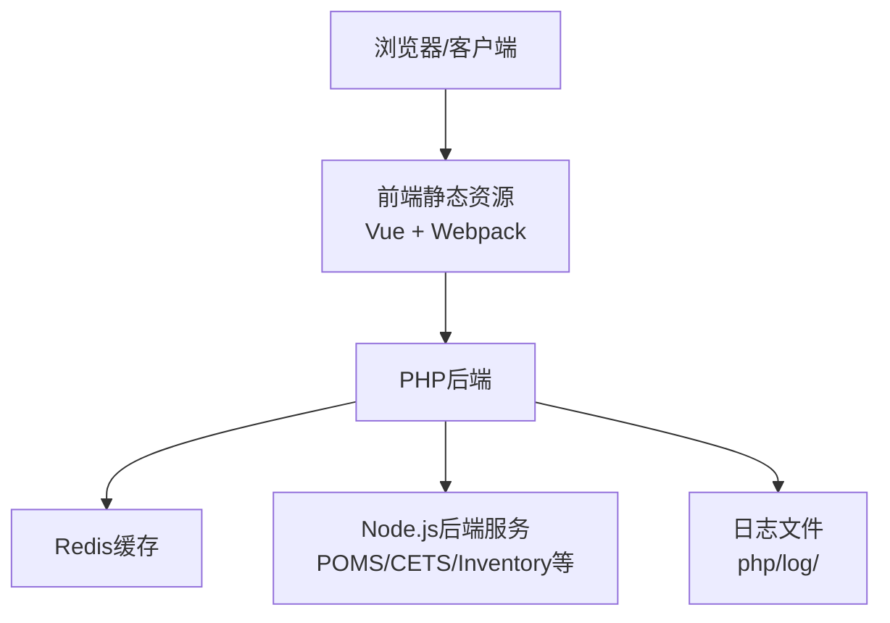
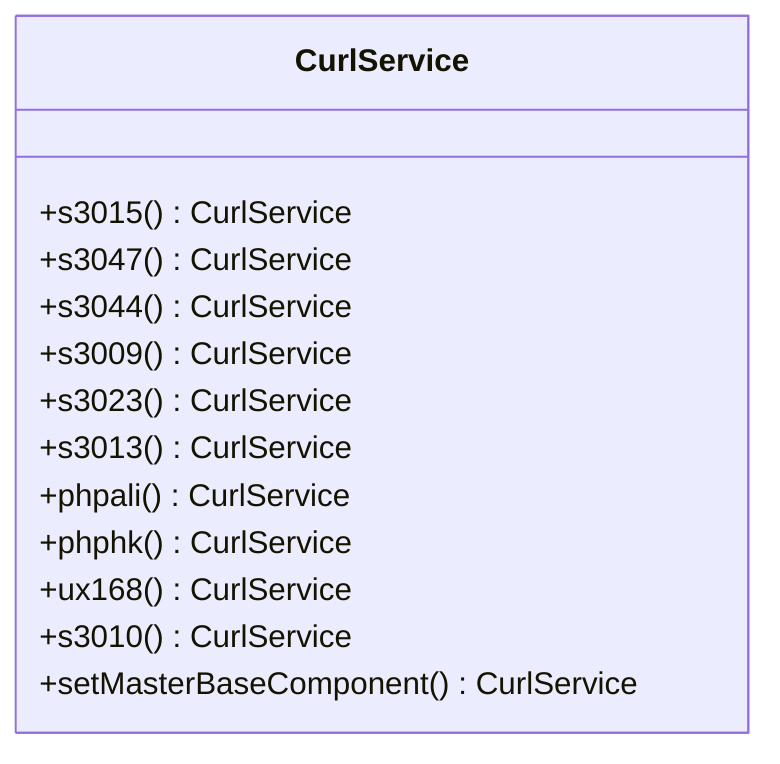
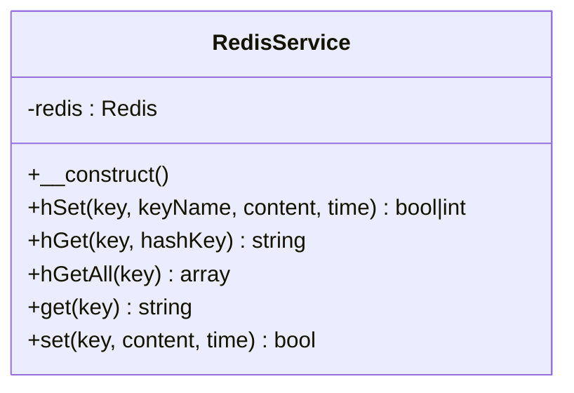
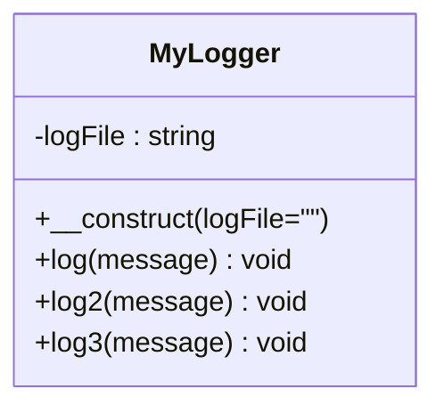
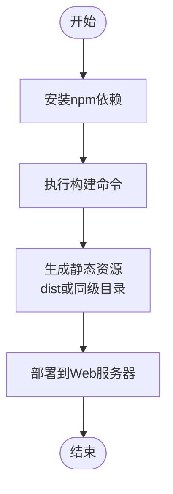
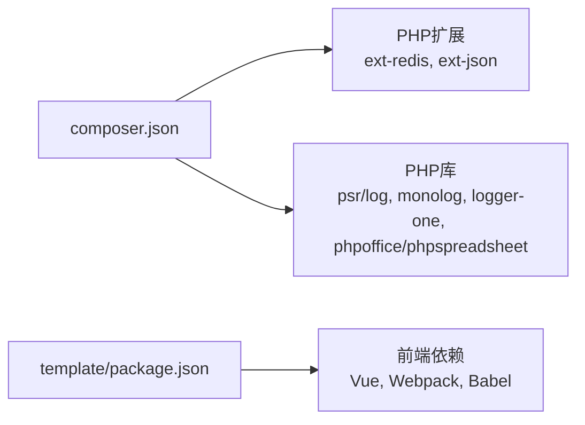

# 环境部署

<cite>
**本文引用的文件**
- [composer.json](file://composer.json)
- [composer.lock](file://composer.lock)
- [php/constant/Constant.php](file://php/constant/Constant.php)
- [php/redis/RedisService.php](file://php/redis/RedisService.php)
- [php/curl/CurlService.php](file://php/curl/CurlService.php)
- [php/json/config.json](file://php/json/config.json)
- [php/json/dev_bak.js](file://php/json/dev_bak.js)
- [template/package.json](file://template/package.json)
- [php/common.php](file://php/common.php)
- [php/class/Logger.php](file://php/class/Logger.php)
- [php/controller/EnvironmentConfig.php](file://php/controller/EnvironmentConfig.php)
- [php/phpinfo.php](file://php/phpinfo.php)
</cite>

## 目录
1. [简介](#简介)
2. [项目结构](#项目结构)
3. [核心组件](#核心组件)
4. [架构总览](#架构总览)
5. [详细组件分析](#详细组件分析)
6. [依赖关系分析](#依赖关系分析)
7. [性能考虑](#性能考虑)
8. [故障排查指南](#故障排查指南)
9. [结论](#结论)
10. [附录](#附录)

## 简介
本文件面向PaSystem项目的生产环境部署，提供从服务器硬件与操作系统要求、PHP与扩展兼容性、依赖安装步骤（Composer、Node.js）、环境变量与系统配置、到Docker容器化与多环境策略（local/test/uat/pro）的完整说明，并补充网络与域名绑定、防火墙设置以及部署前检查清单与验证方法。

## 项目结构
PaSystem采用PHP后端与前端静态资源分离的结构：后端逻辑位于php目录，前端静态资源与构建脚本位于template目录；依赖通过Composer与npm管理；Redis用于缓存；日志通过自定义日志类输出至php/log目录；curl封装了对多个Node.js后端服务的调用。

**图表来源**
- [php/redis/RedisService.php](file://php/redis/RedisService.php#L1-L60)
- [php/curl/CurlService.php](file://php/curl/CurlService.php#L145-L270)
- [php/constant/Constant.php](file://php/constant/Constant.php#L1-L26)
- [php/class/Logger.php](file://php/class/Logger.php#L1-L55)
- [php/common.php](file://php/common.php#L1-L9)
- [template/package.json](file://template/package.json#L1-L15)
- [composer.json](file://composer.json#L1-L11)
- [composer.lock](file://composer.lock#L306-L363)

**章节来源**
- [composer.json](file://composer.json#L1-L11)
- [template/package.json](file://template/package.json#L1-L15)

## 核心组件
- Redis缓存服务：通过常量配置主机、端口与密码，RedisService提供常用操作封装。
- CurlService：集中管理对多个Node.js后端服务的访问，支持按环境选择不同基础地址。
- 日志系统：MyLogger提供基于文件的日志写入能力，便于问题定位。
- 前端依赖：template/package.json声明Vue、Webpack等依赖，用于前端构建与打包。
- 环境配置：EnvironmentConfig控制器加载自动加载与环境页面初始化；phpinfo.php用于查看运行时信息。

**章节来源**
- [php/redis/RedisService.php](file://php/redis/RedisService.php#L1-L60)
- [php/curl/CurlService.php](file://php/curl/CurlService.php#L145-L270)
- [php/class/Logger.php](file://php/class/Logger.php#L1-L55)
- [template/package.json](file://template/package.json#L1-L15)
- [php/controller/EnvironmentConfig.php](file://php/controller/EnvironmentConfig.php#L1-L17)
- [php/phpinfo.php](file://php/phpinfo.php#L1-L2)

## 架构总览
PaSystem后端通过CurlService统一访问多个Node.js应用（如POMS、CETS、Inventory等），Redis作为缓存层，前端通过Vue与Webpack构建，依赖通过npm管理。Composer负责PHP扩展与库的安装。

**图表来源**
- [php/curl/CurlService.php](file://php/curl/CurlService.php#L145-L270)
- [php/redis/RedisService.php](file://php/redis/RedisService.php#L1-L60)
- [php/class/Logger.php](file://php/class/Logger.php#L1-L55)
- [template/package.json](file://template/package.json#L1-L15)

## 详细组件分析

### 组件A：CurlService（后端服务调用）
- 功能要点
  - 提供多种后端服务入口（如s3015、s3047、s3044、s3009、s3023、s3013、phphk、phpali、ux168、s3010等）。
  - 支持根据端口映射设置生产环境的基础地址。
  - 提供链式调用与环境切换能力。
- 数据流
  - 通过port字段选择目标服务，setMasterBaseComponent根据port分支设置对应URL。
- 错误处理
  - 未在该文件中显式抛出异常，建议在调用处增加超时与重试策略。

**图表来源**
- [php/curl/CurlService.php](file://php/curl/CurlService.php#L145-L270)
- [php/curl/CurlService.php](file://php/curl/CurlService.php#L601-L638)

**章节来源**
- [php/curl/CurlService.php](file://php/curl/CurlService.php#L145-L270)
- [php/curl/CurlService.php](file://php/curl/CurlService.php#L601-L638)

### 组件B：RedisService（缓存）
- 功能要点
  - 连接Redis，提供hSet/hGet/hGetAll/set/get等常用操作。
  - 使用常量配置连接参数。
- 性能与可靠性
  - 建议在高并发场景下启用连接池或持久化连接。
  - 对过期时间参数time进行边界校验。

**图表来源**
- [php/redis/RedisService.php](file://php/redis/RedisService.php#L1-L60)
- [php/constant/Constant.php](file://php/constant/Constant.php#L1-L26)

**章节来源**
- [php/redis/RedisService.php](file://php/redis/RedisService.php#L1-L60)
- [php/constant/Constant.php](file://php/constant/Constant.php#L1-L26)

### 组件C：日志系统（MyLogger）
- 功能要点
  - 默认写入php/log/default/日期.log，支持自定义日志文件名。
  - 提供三种写入方式（文件、error_log、LoggerOne）。
- 建议
  - 在生产环境启用LoggerOne并配置滚动策略，避免单文件过大。

**图表来源**
- [php/class/Logger.php](file://php/class/Logger.php#L1-L55)

**章节来源**
- [php/class/Logger.php](file://php/class/Logger.php#L1-L55)

### 组件D：前端依赖与构建
- 依赖说明
  - 生产依赖：axios、qs、vue。
  - 开发依赖：@babel/core、@babel/preset-env、babel-loader、webpack、webpack-cli。
- 构建流程
  - 使用Webpack进行打包，Vue用于界面交互。

**图表来源**
- [template/package.json](file://template/package.json#L1-L15)

**章节来源**
- [template/package.json](file://template/package.json#L1-L15)

## 依赖关系分析
- PHP依赖
  - Composer声明了psr/log、monolog/monolog、logger-one/logger-one、ext-redis、ext-json、phpoffice/phpspreadsheet等。
  - composer.lock显示monolog最低PHP版本要求为>=5.3.0。
- 前端依赖
  - template/package.json声明Vue、Webpack及相关Babel工具。

**图表来源**
- [composer.json](file://composer.json#L1-L11)
- [composer.lock](file://composer.lock#L306-L363)
- [template/package.json](file://template/package.json#L1-L15)

**章节来源**
- [composer.json](file://composer.json#L1-L11)
- [composer.lock](file://composer.lock#L306-L363)
- [template/package.json](file://template/package.json#L1-L15)

## 性能考虑
- Redis连接
  - 建议复用连接，减少频繁connect/auth带来的开销。
- 日志
  - 生产环境建议使用异步写入或缓冲队列，避免阻塞请求。
- 前端构建
  - 启用压缩与分包策略，合理拆分第三方库与业务代码。
- 网络调用
  - CurlService对多个后端服务的调用应设置超时与重试，避免雪崩效应。

## 故障排查指南
- 查看PHP运行时信息
  - 访问php/phpinfo.php以确认PHP版本、已加载扩展与配置项。
- 检查日志
  - 查阅php/log/default/日期.log，定位错误与异常。
- Redis连通性
  - 确认常量中的REDIS_HOST、REDIS_PORT、REDIS_PWD是否正确，Redis服务可达且认证通过。
- CORS问题
  - php/common.php设置了跨域头，若仍出现跨域，请检查Referer与Origin白名单策略。
- 环境配置
  - EnvironmentConfig负责页面环境初始化，确保自动加载与所需文件路径正确。

**章节来源**
- [php/phpinfo.php](file://php/phpinfo.php#L1-L2)
- [php/class/Logger.php](file://php/class/Logger.php#L1-L55)
- [php/constant/Constant.php](file://php/constant/Constant.php#L1-L26)
- [php/common.php](file://php/common.php#L1-L9)
- [php/controller/EnvironmentConfig.php](file://php/controller/EnvironmentConfig.php#L1-L17)

## 结论
PaSystem的部署围绕“PHP后端 + Redis缓存 + 多Node.js后端服务 + Vue前端”的架构展开。生产部署需重点关注：PHP扩展与Composer依赖、Node.js前端依赖、Redis连接与权限、CORS与安全头、日志与监控、以及多环境配置与网络连通性。遵循本文提供的步骤与最佳实践，可有效提升部署成功率与运行稳定性。

## 附录

### 服务器与系统要求
- 操作系统
  - 推荐Linux发行版（如Ubuntu/CentOS），内核版本较新，具备稳定内核与包管理工具。
- 硬件配置
  - CPU：建议≥2核（根据并发与任务复杂度调整）。
  - 内存：建议≥4GB（含Redis与Web/应用进程内存）。
  - 存储：建议SSD，容量满足日志、缓存与静态资源需求。
- PHP版本与扩展
  - PHP版本：建议PHP 7.4及以上（具体以实际运行环境为准）。
  - 必需扩展：ext-redis、ext-json（由composer.json声明）。
  - 其他：mbstring、openssl、pdo、tokenizer、xml等常用扩展。
- Node.js版本
  - template/package.json使用现代工具链，建议使用Node.js LTS版本（如18.x/20.x）。

**章节来源**
- [composer.json](file://composer.json#L1-L11)
- [composer.lock](file://composer.lock#L306-L363)
- [template/package.json](file://template/package.json#L1-L15)

### 依赖安装步骤
- 安装PHP扩展与Composer包
  - 安装ext-redis与ext-json扩展。
  - 执行composer install（或composer update）以安装依赖。
- 安装Node.js与前端依赖
  - 安装Node.js LTS版本。
  - 在template目录执行npm install安装依赖。
- 编译前端资源
  - 使用Webpack构建（参考package.json中的脚本），产出静态资源供Web服务器托管。

**章节来源**
- [composer.json](file://composer.json#L1-L11)
- [template/package.json](file://template/package.json#L1-L15)

### 环境变量与系统配置
- Redis配置
  - 在php/constant/Constant.php中配置REDIS_HOST、REDIS_PORT、REDIS_PWD等常量。
- 日志路径
  - 日志默认写入php/log/default/日期.log，可通过MyLogger构造函数指定自定义文件名。
- CORS与内容类型
  - php/common.php设置跨域头与内容类型，确保前后端交互正常。
- Node.js后端服务地址
  - CurlService通过setMasterBaseComponent按端口映射设置后端URL，确保与实际域名一致。

**章节来源**
- [php/constant/Constant.php](file://php/constant/Constant.php#L1-L26)
- [php/class/Logger.php](file://php/class/Logger.php#L1-L55)
- [php/common.php](file://php/common.php#L1-L9)
- [php/curl/CurlService.php](file://php/curl/CurlService.php#L601-L638)

### Docker容器化部署方案
- Dockerfile示例思路
  - 基础镜像：选择官方PHP-FPM与Nginx镜像组合。
  - 安装PHP扩展：确保启用redis与json扩展。
  - 复制代码：将项目代码复制至容器工作目录。
  - 安装依赖：执行composer install与npm install。
  - 构建前端：在容器内执行Webpack构建。
  - 挂载卷：挂载php/log与外部Redis/数据库。
  - 暴露端口：80/443。
- docker-compose示例思路
  - 服务：web（Nginx+PHP-FPM）、php-fpm（PHP）、redis、nodejs（后端服务）。
  - 网络：定义自定义网络，使服务间可互相访问。
  - 环境变量：通过.env文件注入Redis、数据库等敏感配置。
  - 卷：php/log持久化、前端静态资源映射。
- 注意事项
  - 确保Redis与Node.js后端服务可达。
  - 证书与HTTPS配置需与域名绑定一致。

### 多环境部署策略（local/test/uat/pro）
- 环境标识
  - 通过环境变量（如ENV）区分local/test/uat/pro。
- 配置管理
  - 前端：dev_bak.js中定义各环境的URL与密钥，构建时注入process.env。
  - 后端：CurlService按port映射不同环境的Node.js服务地址。
- 切换流程
  - local：使用本机或本地容器服务，便于开发调试。
  - test：使用测试集群，验证功能与回归。
  - uat：用户验收测试，模拟真实业务场景。
  - pro：生产环境，严格控制发布与回滚流程。

**章节来源**
- [php/json/dev_bak.js](file://php/json/dev_bak.js#L1-L254)
- [php/curl/CurlService.php](file://php/curl/CurlService.php#L145-L270)

### 网络配置、防火墙与域名绑定
- 端口开放
  - Web：80/443（HTTP/HTTPS）。
  - Redis：6379（仅内网或通过VPN访问）。
  - Node.js后端：根据实际暴露端口开放（如示例中的600xx系列端口）。
- 防火墙
  - 仅放行Web与Redis端口，限制源IP范围。
- 域名绑定
  - 将域名解析至服务器公网IP，配置Nginx虚拟主机与SSL证书。
  - CurlService中使用的域名需与证书匹配，避免Mixed Content与证书错误。

### 部署前检查清单与验证
- 服务器与系统
  - 操作系统版本、内核版本、磁盘空间、内存充足。
  - PHP版本与扩展齐全，Redis与数据库服务可用。
- 依赖安装
  - Composer与npm依赖安装完成，前端构建产物生成。
- 配置与权限
  - Redis连接参数正确，日志目录可写，CORS头符合预期。
- 网络与域名
  - 域名解析生效，防火墙放行必要端口，证书有效。
- 验证步骤
  - 访问php/phpinfo.php确认PHP运行状态。
  - 访问前端页面，观察控制台与网络请求，确保与后端服务通信正常。
  - 检查php/log/default/日期.log，确认无异常。