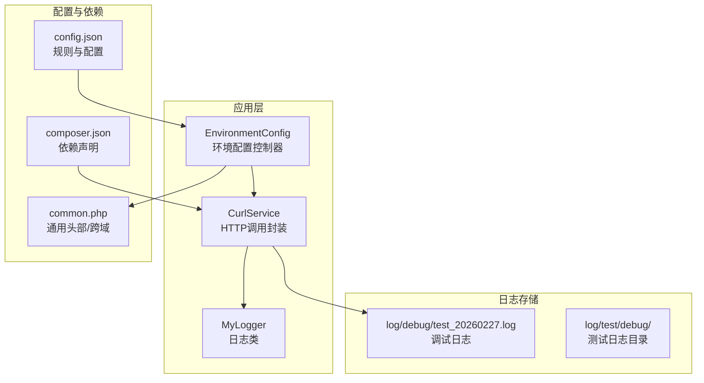
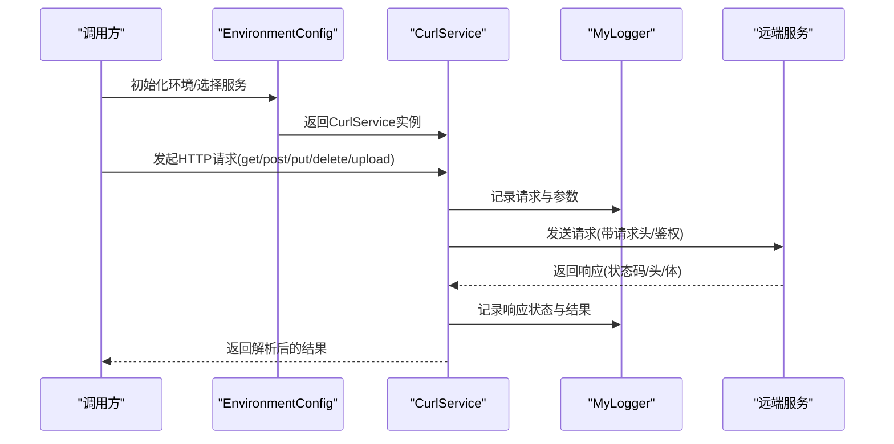
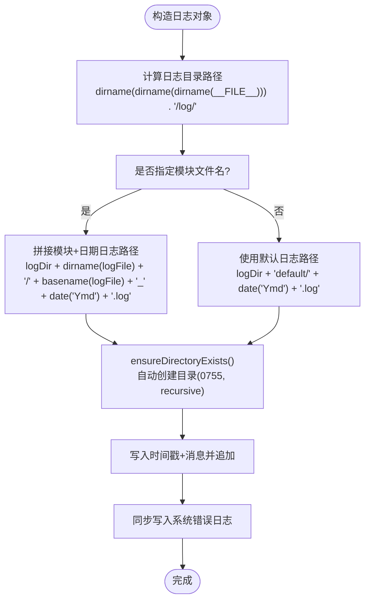
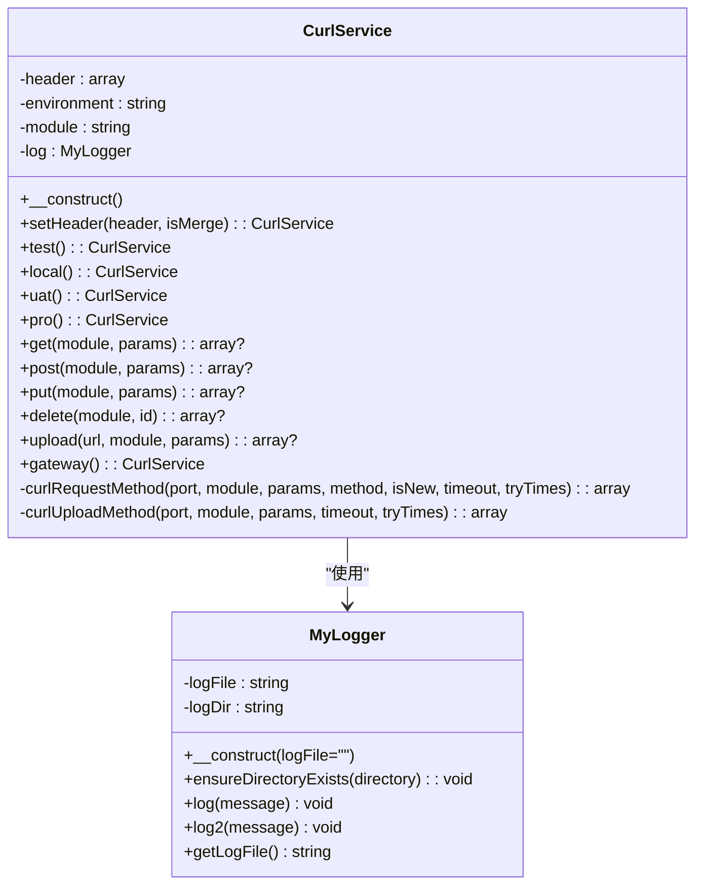
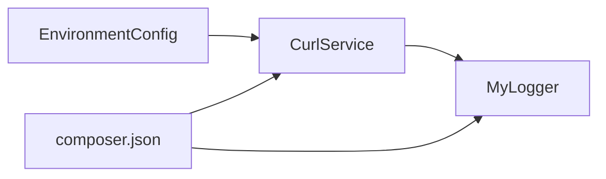

# 监控告警

<cite>
**本文引用的文件**
- [php/class/Logger.php](file://php/class/Logger.php)
- [php/curl/CurlService.php](file://php/curl/CurlService.php)
- [php/controller/EnvironmentConfig.php](file://php/controller/EnvironmentConfig.php)
- [php/json/config.json](file://php/json/config.json)
- [php/common.php](file://php/common.php)
- [composer.json](file://composer.json)
- [log/debug/test_20260227.log](file://log/debug/test_20260227.log)
</cite>

## 目录
1. [简介](#简介)
2. [项目结构](#项目结构)
3. [核心组件](#核心组件)
4. [架构总览](#架构总览)
5. [组件详解](#组件详解)
6. [依赖关系分析](#依赖关系分析)
7. [性能与监控指标](#性能与监控指标)
8. [告警规则与通知集成](#告警规则与通知集成)
9. [监控仪表板与可视化](#监控仪表板与可视化)
10. [APM工具集成与使用](#apm工具集成与使用)
11. [监控数据长期存储与备份](#监控数据长期存储与备份)
12. [常见场景配置示例与最佳实践](#常见场景配置示例与最佳实践)
13. [故障排查指南](#故障排查指南)
14. [结论](#结论)

## 简介
本文件面向PaSystem监控告警体系，围绕日志系统配置与管理、性能指标采集与分析、告警规则与通知集成、监控仪表板搭建、APM工具集成、以及监控数据的长期存储与备份进行系统化说明。文档基于仓库中现有实现（日志类、HTTP调用封装、环境配置、配置文件等）进行梳理，并给出可操作的落地建议与最佳实践。

## 项目结构
PaSystem主要由PHP层的控制器、服务封装、日志与配置组成。与监控告警相关的关键目录与文件如下：
- 日志模块：php/class/Logger.php、log/
- HTTP调用与链路追踪：php/curl/CurlService.php
- 环境与服务选择：php/controller/EnvironmentConfig.php
- 配置中心：php/json/config.json
- 通用头部与跨域：php/common.php
- 依赖声明：composer.json

图表来源
- [php/controller/EnvironmentConfig.php](file://php/controller/EnvironmentConfig.php#L1-L62)
- [php/class/Logger.php](file://php/class/Logger.php#L1-L60)
- [php/curl/CurlService.php](file://php/curl/CurlService.php#L1-L996)
- [php/json/config.json](file://php/json/config.json#L1-L316)
- [composer.json](file://composer.json#L1-L11)
- [php/common.php](file://php/common.php#L1-L9)

章节来源
- [php/controller/EnvironmentConfig.php](file://php/controller/EnvironmentConfig.php#L1-L62)
- [php/class/Logger.php](file://php/class/Logger.php#L1-L60)
- [php/curl/CurlService.php](file://php/curl/CurlService.php#L1-L996)
- [php/json/config.json](file://php/json/config.json#L1-L316)
- [composer.json](file://composer.json#L1-L11)
- [php/common.php](file://php/common.php#L1-L9)

## 核心组件
- 日志类：提供基础日志写入能力，支持自动创建目录结构；默认按日期落盘到log/default/目录；支持以模块命名的子日志（如curl）。
- HTTP调用封装：统一设置请求头、环境切换、模块路由、请求与响应解析，并在请求前后记录日志。
- 环境配置控制器：根据页面名称选择对应的CurlService实例，便于按功能模块隔离调用。
- 配置中心：集中存放业务规则与渠道配置，可用于驱动告警规则或策略。
- 通用头部：统一设置跨域与字符集，便于前端或外部系统对接。

章节来源
- [php/class/Logger.php](file://php/class/Logger.php#L14-L60)
- [php/curl/CurlService.php](file://php/curl/CurlService.php#L1-L996)
- [php/controller/EnvironmentConfig.php](file://php/controller/EnvironmentConfig.php#L1-L62)
- [php/json/config.json](file://php/json/config.json#L1-L316)
- [php/common.php](file://php/common.php#L1-L9)

## 架构总览
下图展示了从控制器到HTTP服务再到日志存储的整体流程，体现监控与告警的数据通路。

图表来源
- [php/controller/EnvironmentConfig.php](file://php/controller/EnvironmentConfig.php#L19-L61)
- [php/curl/CurlService.php](file://php/curl/CurlService.php#L301-L433)
- [php/class/Logger.php](file://php/class/Logger.php#L22-L37)

## 组件详解

### 日志系统：配置与管理
**更新** 日志系统已增强，新增自动目录创建和改进的日志文件路径解析功能

- **日志目录结构**：日志文件位于与php文件夹同级的log/目录下，支持多级子目录结构
- **自动目录创建**：构造函数中会自动检测并创建所需的目录结构，确保日志写入的可靠性
- **日志文件命名**：默认按日期归档，例如default/年月日.log；也可按模块命名（如curl），便于区分来源
- **路径解析优化**：使用dirname(dirname(dirname(__FILE__)))计算日志目录，确保路径解析的准确性
- **写入机制**：采用追加写入方式，同时调用PHP内置错误日志函数，便于统一收集

图表来源
- [php/class/Logger.php](file://php/class/Logger.php#L13-L28)
- [php/class/Logger.php](file://php/class/Logger.php#L34-L38)

章节来源
- [php/class/Logger.php](file://php/class/Logger.php#L14-L60)
- [log/debug/test_20260227.log](file://log/debug/test_20260227.log)

### HTTP调用与链路追踪
- 环境切换：支持local/test/uat/pro四套环境，自动设置目标服务地址。
- 模块路由：通过getModule映射不同业务模块，便于统一管理。
- 请求头与鉴权：统一设置Content-Type、Trace-ID、Authorization等。
- 日志记录：在请求与响应阶段记录URL、参数、状态码与响应体，便于问题定位。
- 错误处理：对非2xx且非特定白名单状态抛出异常并可重试。

图表来源
- [php/curl/CurlService.php](file://php/curl/CurlService.php#L4-L132)
- [php/class/Logger.php](file://php/class/Logger.php#L14-L60)

章节来源
- [php/curl/CurlService.php](file://php/curl/CurlService.php#L1-L996)
- [php/class/Logger.php](file://php/class/Logger.php#L1-L60)

### 环境配置控制器
- 功能：根据页面名称选择对应CurlService实例，支持pro/test等环境切换。
- 适用：在页面入口处初始化，确保后续HTTP调用指向正确的环境与服务。

章节来源
- [php/controller/EnvironmentConfig.php](file://php/controller/EnvironmentConfig.php#L1-L62)

### 配置中心
- 作用：集中存放业务规则、匹配模式、竞价模型与渠道配置等，可用于驱动告警策略或自动化动作。
- 建议：将"阈值""窗口期""触发条件"等监控参数迁移到该配置文件，便于灰度与快速调整。

章节来源
- [php/json/config.json](file://php/json/config.json#L1-L316)

### 通用头部与跨域
- 设置跨域与字符集，便于前端或外部系统访问。
- 建议：在生产环境限制允许的源与方法，避免安全风险。

章节来源
- [php/common.php](file://php/common.php#L1-L9)

## 依赖关系分析
- CurlService依赖MyLogger进行日志记录。
- EnvironmentConfig负责选择CurlService实例，间接影响HTTP调用的目标环境。
- composer.json声明了日志与表格处理等依赖，为扩展监控与可视化提供基础。

图表来源
- [php/controller/EnvironmentConfig.php](file://php/controller/EnvironmentConfig.php#L1-L62)
- [php/curl/CurlService.php](file://php/curl/CurlService.php#L1-L38)
- [composer.json](file://composer.json#L1-L11)

章节来源
- [php/controller/EnvironmentConfig.php](file://php/controller/EnvironmentConfig.php#L1-L62)
- [php/curl/CurlService.php](file://php/curl/CurlService.php#L1-L996)
- [composer.json](file://composer.json#L1-L11)

## 性能与监控指标
以下指标建议结合现有日志与HTTP调用进行采集与统计（无需侵入代码即可落地）：
- 响应时间：从CurlService发起请求到收到响应的时间（可在日志中记录请求开始与结束时间差）。
- 吞吐量：单位时间内成功请求的数量（按日志中的请求条目统计）。
- 错误率：非2xx且不在白名单的状态码占比（当前实现已过滤401/404/429，其余视为异常）。
- 重试次数：失败重试的频率与成功率。
- 状态分布：各HTTP状态码的分布情况，辅助定位服务异常。

采集建议：
- 在CurlService的请求阶段与响应阶段分别打点，形成请求-响应时间序列。
- 将统计结果写入独立的日志文件或指标系统（如Prometheus Pushgateway）。

章节来源
- [php/curl/CurlService.php](file://php/curl/CurlService.php#L664-L740)

## 告警规则与通知集成
基于现有实现，可将"阈值""窗口期""触发条件"等参数迁移至配置中心，结合日志与指标进行告警：
- 规则参数化：将"错误率阈值""平均响应时间上限""吞吐量下限"等放入config.json或独立配置表。
- 触发条件：在定时任务或监控脚本中读取配置，对比实时指标，满足条件即触发。
- 通知通道：邮件、短信、微信推送等可通过外部服务或SDK接入（建议在独立的告警服务中实现，避免与业务耦合）。

注意：当前仓库未发现专门的告警引擎或通知实现，建议新增独立模块或服务承载告警逻辑。

章节来源
- [php/json/config.json](file://php/json/config.json#L1-L316)
- [php/curl/CurlService.php](file://php/curl/CurlService.php#L725-L733)

## 监控仪表板与可视化
- 数据来源：日志文件（按天归档）、指标系统（建议引入Prometheus/Grafana）。
- 可视化建议：使用Grafana构建仪表板，展示响应时间趋势、错误率、吞吐量、重试率等。
- 日志可视化：可结合ELK（Elasticsearch/Filebeat/Logstash/Kibana）对日志进行结构化与检索。

说明：本节为概念性建议，不直接对应具体源文件。

## APM工具集成与使用
- 链路追踪：在CurlService中增强Trace-ID与Span信息，结合OpenTelemetry或Zipkin进行全链路观测。
- 性能分析：对慢请求、高错误率接口进行采样与根因分析。
- 故障诊断：结合日志与链路图，定位异常环节（网络、鉴权、下游服务）。

说明：本节为概念性建议，不直接对应具体源文件。

## 监控数据长期存储与备份
- 日志轮转：按日切分，保留N天历史；超过保留期的日志进行压缩归档。
- 备份策略：本地备份+异地备份，定期校验完整性。
- 清理策略：基于容量阈值与保留期自动清理旧日志。

说明：本节为概念性建议，不直接对应具体源文件。

## 常见场景配置示例与最佳实践
- 场景一：接口错误率告警
  - 配置：在config.json中定义"错误率阈值""统计窗口""告警通道"。
  - 实现：定时任务读取指标，满足阈值即触发通知。
- 场景二：响应时间超限告警
  - 配置：定义"P95/P99响应时间阈值"。
  - 实现：统计最近N分钟的响应时间分布，超限触发。
- 场景三：吞吐量骤降告警
  - 配置：定义"最小请求数""环比阈值"。
  - 实现：对比当前与基线窗口的吞吐量，低于阈值触发。

说明：本节为概念性建议，不直接对应具体源文件。

## 故障排查指南
- 日志定位
  - 查看log/debug/下的调试日志，确认请求URL、参数与响应状态。
  - 对照CurlService的请求阶段与响应阶段日志，定位异常环节。
- 环境问题
  - 确认EnvironmentConfig选择的环境与CurlService.setEnvironment一致。
  - 检查Authorization头与鉴权令牌是否正确。
- 依赖问题
  - 确认composer.json中所需扩展与库已安装。

章节来源
- [php/curl/CurlService.php](file://php/curl/CurlService.php#L664-L740)
- [php/controller/EnvironmentConfig.php](file://php/controller/EnvironmentConfig.php#L19-L61)
- [composer.json](file://composer.json#L1-L11)

## 结论
PaSystem当前具备完善的日志与HTTP调用基础设施，建议在此基础上：
- 将告警阈值与规则参数化并集中管理；
- 引入指标系统与APM工具，完善可观测性；
- 搭建监控仪表板，实现可视化治理；
- 制定日志轮转与数据备份策略，保障长期可用性。