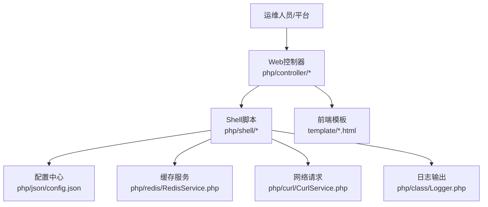
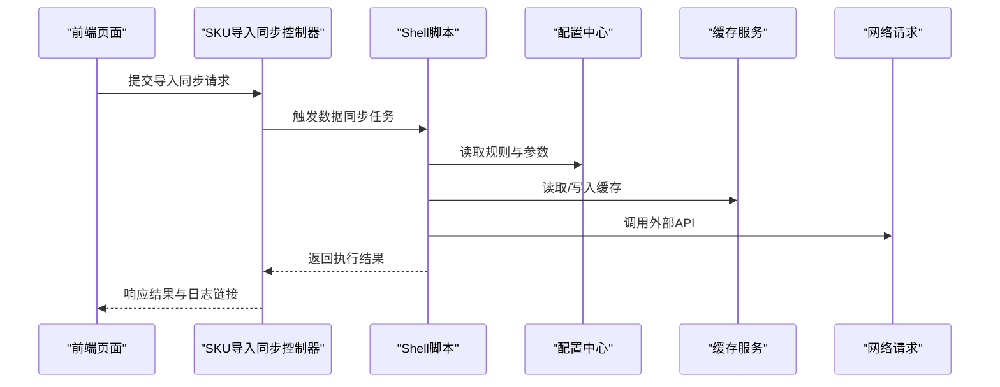
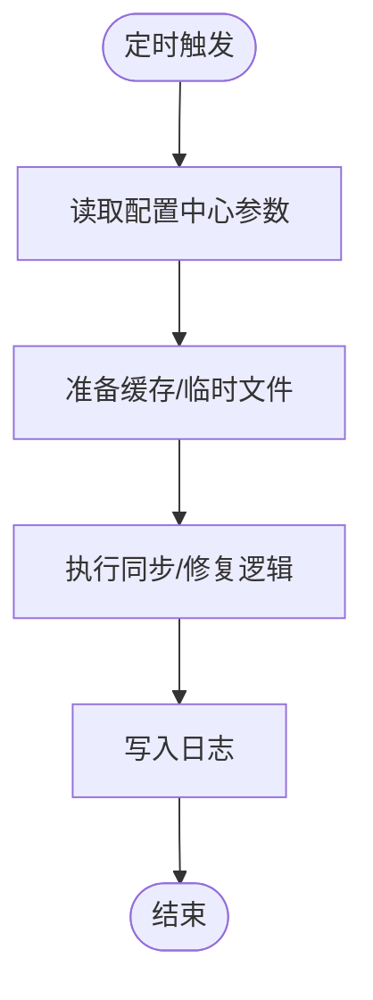
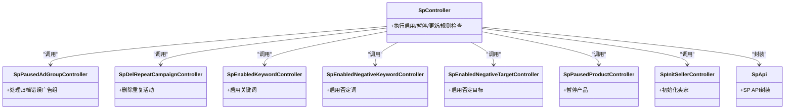
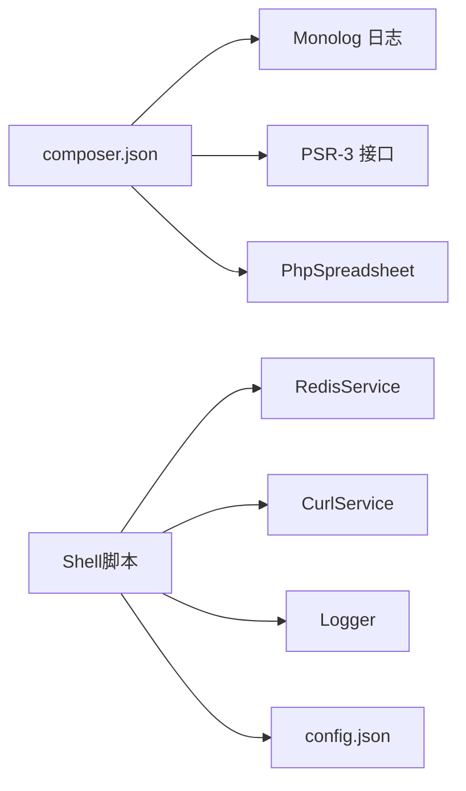

# 自动化运维

<cite>
**本文引用的文件**
- [composer.json](file://composer.json)
- [php/common.php](file://php/common.php)
- [php/json/config.json](file://php/json/config.json)
- [php/class/Logger.php](file://php/class/Logger.php)
- [php/controller/EnvironmentConfig.php](file://php/controller/EnvironmentConfig.php)
- [php/controller/excelUpload.php](file://php/controller/excelUpload.php)
- [php/controller/skuImportSync.php](file://php/controller/skuImportSync.php)
- [php/controller/upload.php](file://php/controller/upload.php)
- [php/controller/uploadChunk.php](file://php/controller/uploadChunk.php)
- [php/controller/update.php](file://php/controller/update.php)
- [php/controller/search.php](file://php/controller/search.php)
- [php/shell/TestController.php](file://php/shell/TestController.php)
- [php/shell/SyncSkuMaterialToAudit.sh](file://php/shell/SyncSkuMaterialToAudit.sh)
- [php/shell/SyncProductSku.php](file://php/shell/SyncProductSku.php)
- [php/shell/SyncCurlController.php](file://php/shell/SyncCurlController.php)
- [php/shell/SyncCurlV2Controller.php](file://php/shell/SyncCurlV2Controller.php)
- [php/shell/SyncJob1Controller.php](file://php/shell/SyncJob1Controller.php)
- [php/shell/OptionConfigController.php](file://php/shell/OptionConfigController.php)
- [php/shell/GatWayRequestController.php](file://php/shell/GatWayRequestController.php)
- [php/shell/ProductSkuController.php](file://php/shell/ProductSkuController.php)
- [php/shell/FixPaSkuMaterialSpDataController.php](file://php/shell/FixPaSkuMaterialSpDataController.php)
- [php/shell/FixCeSkuMaterial.php](file://php/shell/FixCeSkuMaterial.php)
- [php/shell/FixPmoSkuController.php](file://php/shell/FixPmoSkuController.php)
- [php/shell/DelEbayBillRoundController.php](file://php/shell/DelEbayBillRoundController.php)
- [php/shell/SyncAiCategoryRecommand.php](file://php/shell/SyncAiCategoryRecommand.php)
- [php/shell/SyncSkuMaterialToAudit.php](file://php/shell/SyncSkuMaterialToAudit.php)
- [php/shell/SpController.php](file://php/shell/SpController.php)
- [php/shell/SpEnabledController.php](file://php/shell/SpEnabledController.php)
- [php/shell/SpPausedController.php](file://php/shell/SpPausedController.php)
- [php/shell/SpPausedAdGroupController.php](file://php/shell/SpPausedAdGroupController.php)
- [php/shell/SpUpdateAdGroupController.php](file://php/shell/SpUpdateAdGroupController.php)
- [php/shell/SpFindCanNotCreateController.php](file://php/shell/SpFindCanNotCreateController.php)
- [php/shell/SpRuleController.php](file://php/shell/SpRuleController.php)
- [php/shell/SpApi.php](file://php/shell/SpApi.php)
- [php/shell/sp/adgroup/SpArchivedErrorAdGroupController.php](file://php/shell/sp/adgroup/SpArchivedErrorAdGroupController.php)
- [php/shell/sp/campaign/SpDelRepeatCampaignController.php](file://php/shell/sp/campaign/SpDelRepeatCampaignController.php)
- [php/shell/sp/common/SpPausedNKeywordAndNTargetByAdGroupController.php](file://php/shell/sp/common/SpPausedNKeywordAndNTargetByAdGroupController.php)
- [php/shell/sp/common/SpSyncPomsController.php](file://php/shell/sp/common/SpSyncPomsController.php)
- [php/shell/sp/keyword/SpEnabledKeywordController.php](file://php/shell/sp/keyword/SpEnabledKeywordController.php)
- [php/shell/sp/negativeKeyword/SpEnabledNegativeKeywordController.php](file://php/shell/sp/negativeKeyword/SpEnabledNegativeKeywordController.php)
- [php/shell/sp/negativeTarget/SpEnabledNegativeTargetController.php](file://php/shell/sp/negativeTarget/SpEnabledNegativeTargetController.php)
- [php/shell/sp/product/SpPausedProductController.php](file://php/shell/sp/product/SpPausedProductController.php)
- [php/shell/sp/seller/SpInitSellerController.php](file://php/shell/sp/seller/SpInitSellerController.php)
- [php/shell/sp/target/SpApi.php](file://php/shell/sp/target/SpApi.php)
- [php/utils/DataUtils.php](file://php/utils/DataUtils.php)
- [php/utils/ExcelUtils.php](file://php/utils/ExcelUtils.php)
- [php/utils/ProductUtils.php](file://php/utils/ProductUtils.php)
- [php/utils/RequestUtils.php](file://php/utils/RequestUtils.php)
- [php/redis/RedisService.php](file://php/redis/RedisService.php)
- [php/curl/CurlService.php](file://php/curl/CurlService.php)
- [php/requiredfile/requiredfile.php](file://php/requiredfile/requiredfile.php)
- [php/requiredfile/requiredChorm.php](file://php/requiredfile/requiredChorm.php)
- [template/home.html](file://template/home.html)
- [template/fix/skuImportSync.html](file://template/fix/skuImportSync.html)
- [template/fix/uploadOss.html](file://template/fix/uploadOss.html)
- [template/fix/paFixProductLine.html](file://template/fix/paFixProductLine.html)
- [template/fix/consignmentQD.html](file://template/fix/consignmentQD.html)
- [template/fix/fixCeMaterials.html](file://template/fix/fixCeMaterials.html)
- [template/fix/fixCurrency.html](file://template/fix/fixCurrency.html)
- [template/fix/fixTranslationManagements.html](file://template/fix/fixTranslationManagements.html)
- [template/fix/paFbaChannelSellerConfig.html](file://template/fix/paFbaChannelSellerConfig.html)
- [template/fix/paSampleSku.html](file://template/fix/paSampleSku.html)
- [template/fix/registerIp.html](file://template/fix/registerIp.html)
- [template/fix/skuPhotoFix.html](file://template/fix/skuPhotoFix.html)
- [template/excelUpload.html](file://template/excelUpload.html)
- [template/package.json](file://template/package.json)
- [template/package-lock.json](file://template/package-lock.json)
- [template/css_js/css/bootstrap-5.3.0/css/bootstrap.min.css](file://template/css_js/css/bootstrap-5.3.0/css/bootstrap.min.css)
- [template/css_js/js/bootstrap.bundle.min.js](file://template/css_js/js/bootstrap.bundle.min.js)
- [template/css_js/script/jquery-3.7.0.min.js](file://template/css_js/script/jquery-3.7.0.min.js)
- [template/css_js/script/axios.min.js](file://template/css_js/script/axios.min.js)
- [template/css_js/script/qs.min.js](file://template/css_js/script/qs.min.js)
- [template/css_js/script/vue.global.js](file://template/css_js/script/vue.global.js)
- [template/css_js/own/code.js](file://template/css_js/own/code.js)
- [template/css_js/own/lizi.js](file://template/css_js/own/lizi.js)
</cite>

## 目录
1. [简介](#简介)
2. [项目结构](#项目结构)
3. [核心组件](#核心组件)
4. [架构总览](#架构总览)
5. [详细组件分析](#详细组件分析)
6. [依赖关系分析](#依赖关系分析)
7. [性能与可维护性](#性能与可维护性)
8. [故障排查指南](#故障排查指南)
9. [结论](#结论)
10. [附录：运维与自动化最佳实践](#附录运维与自动化最佳实践)

## 简介
本文件面向PaSystem自动化运维工具，系统性梳理其CI/CD流水线配置与使用、Shell脚本编写与调度（含定时任务与批处理）、运维脚本功能与使用方法（数据同步、日志清理、系统维护）、监控与告警脚本编写指南、配置管理自动化与基础设施即代码实践、自动化测试与持续集成流程、以及运维工具链搭建与最佳实践。文档以仓库中现有PHP控制器、Shell脚本、配置文件、前端模板与依赖声明为基础进行分析与总结。

## 项目结构
PaSystem采用前后端分离的结构：前端模板位于template目录，后端逻辑主要在php/controller与php/shell两大模块；配置集中在php/json与composer.json；日志与工具类位于php/class与php/utils；缓存与网络请求通过php/redis与php/curl实现；部分运维修复页面通过template/fix下的HTML页面提供可视化入口。

```mermaid
graph TB
subgraph "前端模板"
T_HOME["template/home.html"]
T_FIX["template/fix/*.html"]
T_UPLOAD["template/excelUpload.html"]
T_PKG["template/package*.json"]
end
subgraph "后端控制器"
C_ENV["php/controller/EnvironmentConfig.php"]
C_EXCEL["php/controller/excelUpload.php"]
C_SYNC["php/controller/skuImportSync.php"]
C_UP["php/controller/upload.php"]
C_UPC["php/controller/uploadChunk.php"]
C_UPDATE["php/controller/update.php"]
C_SEARCH["php/controller/search.php"]
end
subgraph "Shell脚本"
SH_AUDIT["php/shell/SyncSkuMaterialToAudit.*"]
SH_SYNC["php/shell/SyncProductSku.php"]
SH_CURL1["php/shell/SyncCurlController.php"]
SH_CURL2["php/shell/SyncCurlV2Controller.php"]
SH_JOB1["php/shell/SyncJob1Controller.php"]
SH_OPT["php/shell/OptionConfigController.php"]
SH_GATE["php/shell/GatWayRequestController.php"]
SH_PROD["php/shell/ProductSkuController.php"]
SH_FIX1["php/shell/FixPaSkuMaterialSpDataController.php"]
SH_FIX2["php/shell/FixCeSkuMaterial.php"]
SH_FIX3["php/shell/FixPmoSkuController.php"]
SH_FIX4["php/shell/DelEbayBillRoundController.php"]
SH_AI["php/shell/SyncAiCategoryRecommand.php"]
SH_SP["php/shell/SpController.php"]
SH_SPA["php/shell/sp/adgroup/*"]
SH_SPC["php/shell/sp/campaign/*"]
SH_SPCOM["php/shell/sp/common/*"]
SH_SPK["php/shell/sp/keyword/*"]
SH_SPNK["php/shell/sp/negativeKeyword/*"]
SH_SPNT["php/shell/sp/negativeTarget/*"]
SH_SPP["php/shell/sp/product/*"]
SH_SPS["php/shell/sp/seller/*"]
SH_SPT["php/shell/sp/target/*"]
end
subgraph "配置与工具"
CFG_JSON["php/json/config.json"]
COMPOSER["composer.json"]
LOGGER["php/class/Logger.php"]
DATAUTIL["php/utils/DataUtils.php"]
EXCELUTIL["php/utils/ExcelUtils.php"]
REQUTIL["php/utils/RequestUtils.php"]
REDIS["php/redis/RedisService.php"]
CURL["php/curl/CurlService.php"]
end
T_HOME --> C_ENV
T_UPLOAD --> C_EXCEL
T_FIX --> C_SYNC
C_SYNC --> SH_SYNC
C_SYNC --> SH_AUDIT
SH_SYNC --> REDIS
SH_SYNC --> CURL
SH_CURL1 --> CURL
SH_CURL2 --> CURL
SH_GATE --> CURL
SH_SP --> SH_SPA
SH_SP --> SH_SPC
SH_SP --> SH_SPCOM
SH_SP --> SH_SPK
SH_SP --> SH_SPNK
SH_SP --> SH_SPNT
SH_SP --> SH_SPP
SH_SP --> SH_SPS
SH_SP --> SH_SPT
CFG_JSON --> SH_SP
LOGGER --> SH_SYNC
LOGGER --> SH_CURL1
LOGGER --> SH_CURL2
DATAUTIL --> SH_SYNC
EXCELUTIL --> SH_SYNC
REQUTIL --> SH_GATE
```

图示来源
- [php/controller/skuImportSync.php](file://php/controller/skuImportSync.php#L1-L200)
- [php/shell/SyncSkuMaterialToAudit.sh](file://php/shell/SyncSkuMaterialToAudit.sh#L1-L200)
- [php/shell/SyncProductSku.php](file://php/shell/SyncProductSku.php#L1-L200)
- [php/shell/SyncCurlController.php](file://php/shell/SyncCurlController.php#L1-L200)
- [php/shell/SyncCurlV2Controller.php](file://php/shell/SyncCurlV2Controller.php#L1-L200)
- [php/shell/GatWayRequestController.php](file://php/shell/GatWayRequestController.php#L1-L200)
- [php/shell/SpController.php](file://php/shell/SpController.php#L1-L200)
- [php/json/config.json](file://php/json/config.json#L1-L316)
- [php/class/Logger.php](file://php/class/Logger.php#L1-L55)
- [php/redis/RedisService.php](file://php/redis/RedisService.php#L1-L200)
- [php/curl/CurlService.php](file://php/curl/CurlService.php#L1-L200)

章节来源
- [php/common.php](file://php/common.php#L1-L9)
- [composer.json](file://composer.json#L1-L11)

## 核心组件
- 控制器层：负责HTTP接口与业务编排，如环境配置、Excel上传、SKU导入同步、分片上传、更新与查询等。
- Shell脚本层：负责离线或定时执行的数据同步、修复与维护任务，覆盖SP广告域与通用业务域。
- 工具与服务层：日志、Redis缓存、CURL网络请求、Excel与数据处理工具。
- 前端模板层：提供运维修复页面与Excel上传界面，便于人工触发与校验。

章节来源
- [php/controller/EnvironmentConfig.php](file://php/controller/EnvironmentConfig.php#L1-L200)
- [php/controller/excelUpload.php](file://php/controller/excelUpload.php#L1-L200)
- [php/controller/skuImportSync.php](file://php/controller/skuImportSync.php#L1-L200)
- [php/controller/upload.php](file://php/controller/upload.php#L1-L200)
- [php/controller/uploadChunk.php](file://php/controller/uploadChunk.php#L1-L200)
- [php/controller/update.php](file://php/controller/update.php#L1-L200)
- [php/controller/search.php](file://php/controller/search.php#L1-L200)
- [php/shell/SyncSkuMaterialToAudit.sh](file://php/shell/SyncSkuMaterialToAudit.sh#L1-L200)
- [php/shell/SyncProductSku.php](file://php/shell/SyncProductSku.php#L1-L200)
- [php/shell/SyncCurlController.php](file://php/shell/SyncCurlController.php#L1-L200)
- [php/shell/SyncCurlV2Controller.php](file://php/shell/SyncCurlV2Controller.php#L1-L200)
- [php/shell/GatWayRequestController.php](file://php/shell/GatWayRequestController.php#L1-L200)
- [php/shell/SpController.php](file://php/shell/SpController.php#L1-L200)
- [php/class/Logger.php](file://php/class/Logger.php#L1-L55)
- [php/redis/RedisService.php](file://php/redis/RedisService.php#L1-L200)
- [php/curl/CurlService.php](file://php/curl/CurlService.php#L1-L200)
- [php/utils/DataUtils.php](file://php/utils/DataUtils.php#L1-L200)
- [php/utils/ExcelUtils.php](file://php/utils/ExcelUtils.php#L1-L200)
- [php/utils/RequestUtils.php](file://php/utils/RequestUtils.php#L1-L200)

## 架构总览
PaSystem的自动化运维围绕“Web控制器 + Shell脚本 + 配置中心 + 缓存/网络服务”的模式展开。Web控制器接收请求，调用Shell脚本执行具体任务；Shell脚本读取配置中心参数，访问缓存与外部API，完成数据同步与修复；日志组件统一输出运行日志，便于监控与审计。

图示来源
- [php/controller/skuImportSync.php](file://php/controller/skuImportSync.php#L1-L200)
- [php/shell/SpController.php](file://php/shell/SpController.php#L1-L200)
- [php/json/config.json](file://php/json/config.json#L1-L316)
- [php/redis/RedisService.php](file://php/redis/RedisService.php#L1-L200)
- [php/curl/CurlService.php](file://php/curl/CurlService.php#L1-L200)
- [php/class/Logger.php](file://php/class/Logger.php#L1-L55)
- [template/home.html](file://template/home.html#L1-L200)

## 详细组件分析

### Web控制器与前端模板
- 环境配置控制器：用于加载与返回系统环境配置，支撑自动化脚本按环境执行。
- Excel上传与分片上传控制器：支持大文件上传与断点续传，结合后端解析与落库。
- SKU导入同步控制器：协调数据同步流程，触发Shell脚本执行。
- 更新与查询控制器：提供数据更新与检索接口，供前端与自动化脚本调用。
- 前端修复页面：提供SKU导入、图片修复、产品线修正、寄售单据修复等页面，便于人工介入与验证。

图示来源
- [php/controller/skuImportSync.php](file://php/controller/skuImportSync.php#L1-L200)
- [php/shell/SyncSkuMaterialToAudit.sh](file://php/shell/SyncSkuMaterialToAudit.sh#L1-L200)
- [php/json/config.json](file://php/json/config.json#L1-L316)
- [php/redis/RedisService.php](file://php/redis/RedisService.php#L1-L200)
- [php/curl/CurlService.php](file://php/curl/CurlService.php#L1-L200)

章节来源
- [php/controller/EnvironmentConfig.php](file://php/controller/EnvironmentConfig.php#L1-L200)
- [php/controller/excelUpload.php](file://php/controller/excelUpload.php#L1-L200)
- [php/controller/upload.php](file://php/controller/upload.php#L1-L200)
- [php/controller/uploadChunk.php](file://php/controller/uploadChunk.php#L1-L200)
- [php/controller/skuImportSync.php](file://php/controller/skuImportSync.php#L1-L200)
- [php/controller/update.php](file://php/controller/update.php#L1-L200)
- [php/controller/search.php](file://php/controller/search.php#L1-L200)
- [template/fix/skuImportSync.html](file://template/fix/skuImportSync.html#L1-L200)
- [template/fix/skuPhotoFix.html](file://template/fix/skuPhotoFix.html#L1-L200)
- [template/fix/paFixProductLine.html](file://template/fix/paFixProductLine.html#L1-L200)
- [template/fix/consignmentQD.html](file://template/fix/consignmentQD.html#L1-L200)
- [template/excelUpload.html](file://template/excelUpload.html#L1-L200)

### Shell脚本与定时任务
- 数据同步类：包括SKU物料审核同步、产品SKU同步、CURL同步（v1/v2）、网关请求、AI推荐同步等。
- 修复类：包括SP数据修复、CE物料修复、PMO SKU修复、Ebay账单清理等。
- SP广告域：覆盖广告组、活动、关键词、否定词、否定目标、产品、卖家等维度的启用/暂停/更新/规则检查等操作。
- 定时任务建议：通过系统crontab或调度平台（如Airflow/Argo）定期触发Shell脚本，确保数据一致性与规则执行。

图示来源
- [php/shell/SyncSkuMaterialToAudit.sh](file://php/shell/SyncSkuMaterialToAudit.sh#L1-L200)
- [php/shell/SyncProductSku.php](file://php/shell/SyncProductSku.php#L1-L200)
- [php/shell/SyncCurlController.php](file://php/shell/SyncCurlController.php#L1-L200)
- [php/shell/SyncCurlV2Controller.php](file://php/shell/SyncCurlV2Controller.php#L1-L200)
- [php/shell/GatWayRequestController.php](file://php/shell/GatWayRequestController.php#L1-L200)
- [php/shell/SyncAiCategoryRecommand.php](file://php/shell/SyncAiCategoryRecommand.php#L1-L200)
- [php/json/config.json](file://php/json/config.json#L1-L316)

章节来源
- [php/shell/SyncSkuMaterialToAudit.sh](file://php/shell/SyncSkuMaterialToAudit.sh#L1-L200)
- [php/shell/SyncProductSku.php](file://php/shell/SyncProductSku.php#L1-L200)
- [php/shell/SyncCurlController.php](file://php/shell/SyncCurlController.php#L1-L200)
- [php/shell/SyncCurlV2Controller.php](file://php/shell/SyncCurlV2Controller.php#L1-L200)
- [php/shell/GatWayRequestController.php](file://php/shell/GatWayRequestController.php#L1-L200)
- [php/shell/SyncAiCategoryRecommand.php](file://php/shell/SyncAiCategoryRecommand.php#L1-L200)

### SP广告域自动化
- 统一入口控制器：聚合各子域操作，按配置执行启用/暂停/更新/规则检查。
- 子域控制器：广告组归档错误处理、活动去重、关键词/否定词/否定目标启用/暂停、产品暂停、卖家初始化、目标维度API封装等。
- 规则与参数：来源于配置中心，支持多渠道与多匹配模型组合。

图示来源
- [php/shell/SpController.php](file://php/shell/SpController.php#L1-L200)
- [php/shell/sp/adgroup/SpArchivedErrorAdGroupController.php](file://php/shell/sp/adgroup/SpArchivedErrorAdGroupController.php#L1-L200)
- [php/shell/sp/campaign/SpDelRepeatCampaignController.php](file://php/shell/sp/campaign/SpDelRepeatCampaignController.php#L1-L200)
- [php/shell/sp/keyword/SpEnabledKeywordController.php](file://php/shell/sp/keyword/SpEnabledKeywordController.php#L1-L200)
- [php/shell/sp/negativeKeyword/SpEnabledNegativeKeywordController.php](file://php/shell/sp/negativeKeyword/SpEnabledNegativeKeywordController.php#L1-L200)
- [php/shell/sp/negativeTarget/SpEnabledNegativeTargetController.php](file://php/shell/sp/negativeTarget/SpEnabledNegativeTargetController.php#L1-L200)
- [php/shell/sp/product/SpPausedProductController.php](file://php/shell/sp/product/SpPausedProductController.php#L1-L200)
- [php/shell/sp/seller/SpInitSellerController.php](file://php/shell/sp/seller/SpInitSellerController.php#L1-L200)
- [php/shell/SpApi.php](file://php/shell/SpApi.php#L1-L200)

章节来源
- [php/shell/SpController.php](file://php/shell/SpController.php#L1-L200)
- [php/shell/sp/adgroup/SpArchivedErrorAdGroupController.php](file://php/shell/sp/adgroup/SpArchivedErrorAdGroupController.php#L1-L200)
- [php/shell/sp/campaign/SpDelRepeatCampaignController.php](file://php/shell/sp/campaign/SpDelRepeatCampaignController.php#L1-L200)
- [php/shell/sp/common/SpPausedNKeywordAndNTargetByAdGroupController.php](file://php/shell/sp/common/SpPausedNKeywordAndNTargetByAdGroupController.php#L1-L200)
- [php/shell/sp/common/SpSyncPomsController.php](file://php/shell/sp/common/SpSyncPomsController.php#L1-L200)
- [php/shell/sp/keyword/SpEnabledKeywordController.php](file://php/shell/sp/keyword/SpEnabledKeywordController.php#L1-L200)
- [php/shell/sp/negativeKeyword/SpEnabledNegativeKeywordController.php](file://php/shell/sp/negativeKeyword/SpEnabledNegativeKeywordController.php#L1-L200)
- [php/shell/sp/negativeTarget/SpEnabledNegativeTargetController.php](file://php/shell/sp/negativeTarget/SpEnabledNegativeTargetController.php#L1-L200)
- [php/shell/sp/product/SpPausedProductController.php](file://php/shell/sp/product/SpPausedProductController.php#L1-L200)
- [php/shell/sp/seller/SpInitSellerController.php](file://php/shell/sp/seller/SpInitSellerController.php#L1-L200)
- [php/shell/sp/target/SpApi.php](file://php/shell/sp/target/SpApi.php#L1-L200)

### 配置管理与基础设施即代码
- 配置中心：集中存放规则、匹配模型、竞价策略、渠道参数等，Shell脚本按需读取。
- 基础设施即代码：建议将Shell脚本、定时任务、日志轮转、缓存/数据库初始化等纳入版本控制与变更流程，配合CI/CD自动部署。

章节来源
- [php/json/config.json](file://php/json/config.json#L1-L316)

### 日志与监控
- 日志类：统一输出到日期分隔的日志文件，便于按天检索与轮转。
- 监控建议：结合日志与业务指标（成功/失败计数、耗时分布）建立告警阈值，对异常任务及时通知。

章节来源
- [php/class/Logger.php](file://php/class/Logger.php#L1-L55)

## 依赖关系分析
- 外部依赖：通过Composer引入日志、Excel处理等库，确保跨平台兼容与依赖锁定。
- 内部耦合：Shell脚本依赖配置中心、缓存与网络服务；控制器与前端模板通过HTTP交互。

图示来源
- [composer.json](file://composer.json#L1-L11)
- [php/redis/RedisService.php](file://php/redis/RedisService.php#L1-L200)
- [php/curl/CurlService.php](file://php/curl/CurlService.php#L1-L200)
- [php/class/Logger.php](file://php/class/Logger.php#L1-L55)
- [php/json/config.json](file://php/json/config.json#L1-L316)

章节来源
- [composer.json](file://composer.json#L1-L11)

## 性能与可维护性
- 批处理与分片：上传与同步采用分片策略，降低内存占用与失败重试成本。
- 缓存利用：通过Redis缓存热点数据与中间结果，减少重复计算与外部请求。
- 配置驱动：规则与参数集中管理，便于灰度与快速回滚。
- 日志与指标：统一日志格式与关键指标埋点，提升可观测性。

## 故障排查指南
- 日志定位：根据日期分隔日志文件，结合任务ID或关键词检索。
- 网络问题：检查Curl超时与重试策略，必要时增加限流与熔断。
- 缓存异常：核对Redis连接与键空间，清理过期或异常键。
- 配置错误：核对config.json中的渠道、模型与参数是否正确。
- 前端问题：确认跨域与内容类型设置，避免预检失败。

章节来源
- [php/common.php](file://php/common.php#L1-L9)
- [php/class/Logger.php](file://php/class/Logger.php#L1-L55)
- [php/curl/CurlService.php](file://php/curl/CurlService.php#L1-L200)
- [php/redis/RedisService.php](file://php/redis/RedisService.php#L1-L200)
- [php/json/config.json](file://php/json/config.json#L1-L316)

## 结论
PaSystem已具备完善的控制器与Shell脚本体系，结合配置中心、缓存与网络服务，能够支撑数据同步、SP广告域自动化与运维修复等场景。建议进一步完善CI/CD流水线、监控与告警、定时任务调度与基础设施即代码实践，以提升稳定性与可维护性。

## 附录：运维与自动化最佳实践
- CI/CD流水线
  - 代码构建：使用Composer安装依赖，执行静态检查与单元测试。
  - 测试执行：在合并前运行单元与集成测试，失败阻断。
  - 部署自动化：通过Git标签/分支触发部署，结合蓝绿发布与回滚策略。
- Shell脚本
  - 使用参数化与配置驱动，避免硬编码。
  - 添加幂等性与重试机制，保证任务可恢复。
  - 输出结构化日志，便于监控与检索。
- 定时任务与批处理
  - 使用crontab或调度平台，合理设置并发与资源上限。
  - 对长耗时任务拆分批次，避免阻塞。
- 监控与告警
  - 建立成功率、耗时、错误码等指标看板。
  - 设置阈值告警与自动通知，缩短故障响应时间。
- 配置管理与基础设施即代码
  - 将Shell脚本、定时任务、日志轮转、缓存/数据库初始化纳入版本控制。
  - 使用声明式配置（如YAML/JSON）与模板引擎，统一环境差异。
- 自动化测试与持续集成
  - 单元测试：覆盖关键工具函数与控制器逻辑。
  - 集成测试：模拟Shell脚本执行与外部API交互。
  - 回归测试：在每次变更后运行回归集，确保稳定性。
- 运维工具链
  - 前端模板：提供可视化入口，便于人工校验与干预。
  - 日志与审计：统一格式与保留周期，满足合规要求。
  - 文档与知识库：沉淀常见问题与处理步骤，降低学习成本。