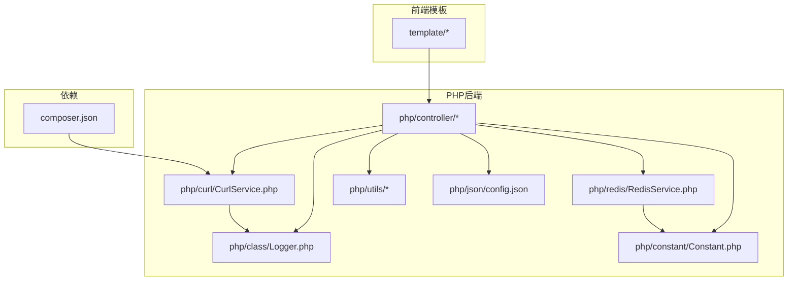
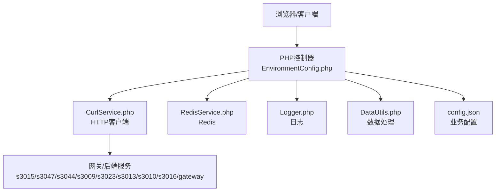
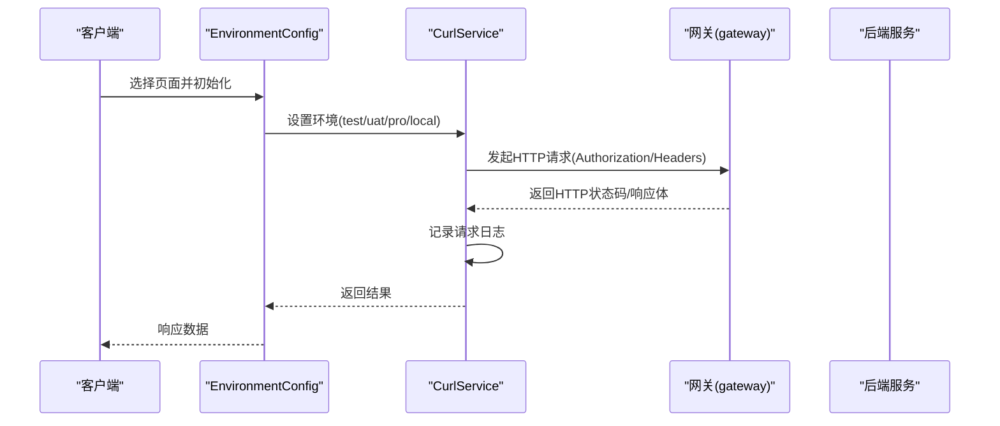
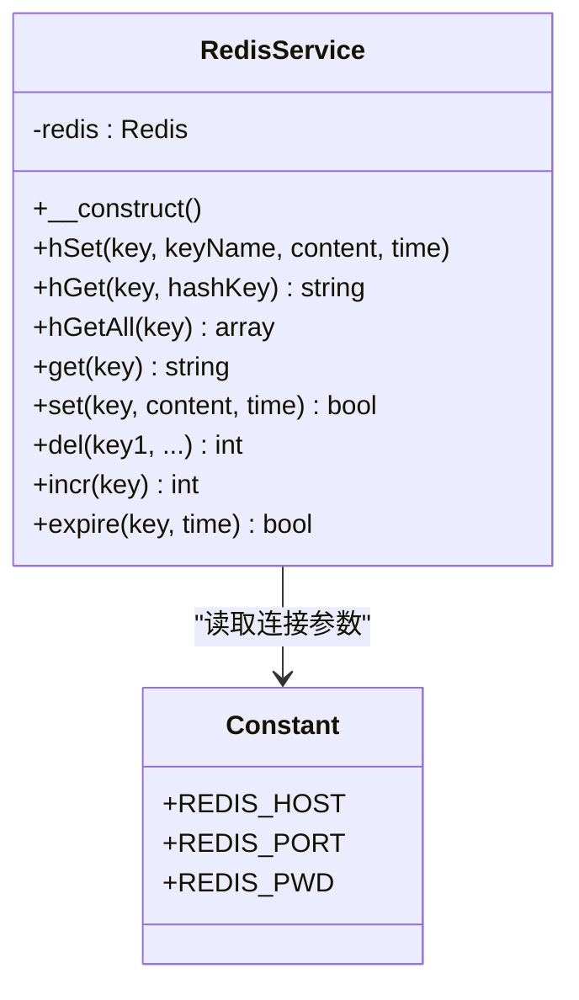
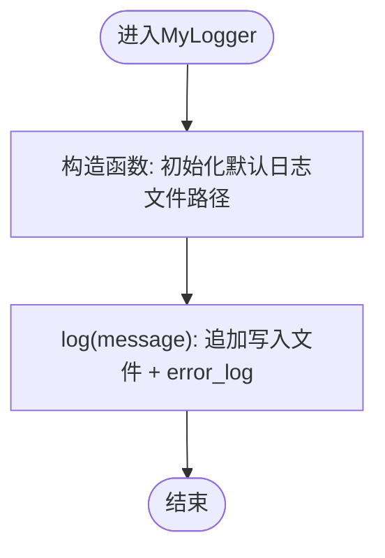
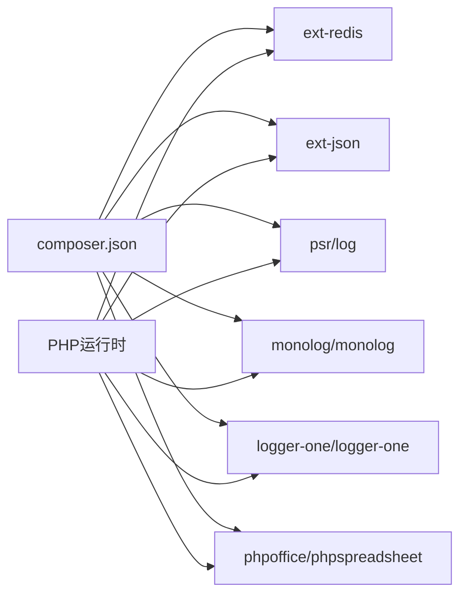

# 部署运维

<cite>
**本文引用的文件**   
- [composer.json](file://composer.json)
- [config.json](file://php/json/config.json)
- [common.php](file://php/common.php)
- [Logger.php](file://php/class/Logger.php)
- [EnvironmentConfig.php](file://php/controller/EnvironmentConfig.php)
- [CurlService.php](file://php/curl/CurlService.php)
- [RedisService.php](file://php/redis/RedisService.php)
- [Constant.php](file://php/constant/Constant.php)
- [requiredChorm.php](file://php/requiredfile/requiredChorm.php)
- [DataUtils.php](file://php/utils/DataUtils.php)
</cite>

## 目录
1. [简介](#简介)
2. [项目结构](#项目结构)
3. [核心组件](#核心组件)
4. [架构总览](#架构总览)
5. [详细组件分析](#详细组件分析)
6. [依赖关系分析](#依赖关系分析)
7. [性能考量](#性能考量)
8. [故障排查指南](#故障排查指南)
9. [结论](#结论)
10. [附录](#附录)

## 简介
本文件面向PaSystem的生产环境部署与运维，目标是提供一套完整、可执行的部署指南，涵盖服务器环境要求、依赖安装与配置、Docker容器化与Kubernetes编排思路、CI/CD流水线建议、监控告警与性能指标、日志管理与分析、备份恢复与灾备策略、安全加固与权限控制、运维脚本与自动化工具使用，以及常见问题排查与解决方案。

## 项目结构
PaSystem由PHP后端、前端模板与静态资源、以及若干运维脚本组成。后端通过CurlService统一访问内部微服务网关与业务模块，日志通过MyLogger落地到php/log目录，Redis用于缓存与状态存储，配置规则集中在json配置文件中。

图表来源
- [CurlService.php](file://php/curl/CurlService.php#L1-L120)
- [RedisService.php](file://php/redis/RedisService.php#L1-L40)
- [Logger.php](file://php/class/Logger.php#L1-L30)
- [config.json](file://php/json/config.json#L1-L40)
- [composer.json](file://composer.json#L1-L11)

章节来源
- [composer.json](file://composer.json#L1-L11)
- [config.json](file://php/json/config.json#L1-L40)

## 核心组件
- 环境配置与入口
  - EnvironmentConfig负责按页面选择加载对应的CurlService环境（test/uat/pro/local），并注入不同网关与认证。
- HTTP客户端与网关
  - CurlService封装HTTP请求、环境切换、模块路由、鉴权头、上传、重试与超时控制，并统一写入curl请求日志。
- 缓存与状态
  - RedisService基于常量中的主机、端口、密码连接Redis，提供常用KV与Hash操作。
- 日志系统
  - MyLogger将日志落盘至php/log，默认按日期分文件，便于运维检索与轮转。
- 数据工具
  - DataUtils提供多种响应数据解析与清洗方法，适配多套后端返回格式。
- 配置中心
  - config.json集中存放业务规则、匹配模型、竞价策略与渠道配置，供业务逻辑读取。

章节来源
- [EnvironmentConfig.php](file://php/controller/EnvironmentConfig.php#L1-L62)
- [CurlService.php](file://php/curl/CurlService.php#L1-L120)
- [RedisService.php](file://php/redis/RedisService.php#L1-L40)
- [Logger.php](file://php/class/Logger.php#L1-L30)
- [DataUtils.php](file://php/utils/DataUtils.php#L1-L60)
- [config.json](file://php/json/config.json#L1-L40)

## 架构总览
PaSystem通过PHP控制器对外提供功能入口，内部通过CurlService访问后端微服务（如listing、big-data、gateway等）。Redis用于缓存与状态管理，日志统一写入本地文件。前端模板通过静态资源与控制器交互。

图表来源
- [EnvironmentConfig.php](file://php/controller/EnvironmentConfig.php#L1-L62)
- [CurlService.php](file://php/curl/CurlService.php#L145-L207)
- [RedisService.php](file://php/redis/RedisService.php#L1-L40)
- [Logger.php](file://php/class/Logger.php#L1-L30)
- [DataUtils.php](file://php/utils/DataUtils.php#L1-L60)
- [config.json](file://php/json/config.json#L1-L40)

## 详细组件分析

### 组件A：环境与网关配置（EnvironmentConfig + CurlService）
- 功能要点
  - EnvironmentConfig根据页面名称选择CurlService的环境（test/uat/pro/local），并设置对应的网关与鉴权头。
  - CurlService支持多模块路由（s3015/s3047/s3044/s3009/s3023/s3013/s3010/s3016/gateway），按环境映射到不同域名或IP端口，内置Authorization头与User-Agent、Referer等请求头。
  - 支持GET/POST/PUT/DELETE/UPLOAD等方法，统一记录请求与参数到日志。
- 关键流程（登录/授权流程示意）

图表来源
- [EnvironmentConfig.php](file://php/controller/EnvironmentConfig.php#L19-L61)
- [CurlService.php](file://php/curl/CurlService.php#L270-L290)
- [CurlService.php](file://php/curl/CurlService.php#L664-L740)

章节来源
- [EnvironmentConfig.php](file://php/controller/EnvironmentConfig.php#L1-L62)
- [CurlService.php](file://php/curl/CurlService.php#L98-L143)
- [CurlService.php](file://php/curl/CurlService.php#L441-L458)
- [CurlService.php](file://php/curl/CurlService.php#L511-L553)
- [CurlService.php](file://php/curl/CurlService.php#L559-L599)
- [CurlService.php](file://php/curl/CurlService.php#L605-L651)

### 组件B：缓存与状态（RedisService）
- 功能要点
  - 基于常量中的REDIS_HOST/REDIS_PORT/REDIS_PWD建立连接。
  - 提供hSet/hGet/hGetAll/get/set/del/incr/expire等常用操作，支持设置过期时间。
- 复杂度与性能
  - 常数时间复杂度的KV与Hash操作，适合高并发场景；注意批量操作与过期策略，避免内存膨胀。

图表来源
- [RedisService.php](file://php/redis/RedisService.php#L1-L77)
- [Constant.php](file://php/constant/Constant.php#L1-L26)

章节来源
- [RedisService.php](file://php/redis/RedisService.php#L1-L77)
- [Constant.php](file://php/constant/Constant.php#L1-L26)

### 组件C：日志与审计（MyLogger）
- 功能要点
  - 默认日志文件按日期分片，写入到php/log/default/年月日.log。
  - 提供log/log2/log3三种写入方式，其中log3使用LoggerOne（需启用相应依赖）。
- 建议
  - 结合系统日志守护进程实现日志轮转与归档，避免磁盘占满。

图表来源
- [Logger.php](file://php/class/Logger.php#L14-L25)

章节来源
- [Logger.php](file://php/class/Logger.php#L1-L55)

### 组件D：数据解析与清洗（DataUtils）
- 功能要点
  - 提供getResultData/getPageList/getQueryList/getPageDocList等方法，适配不同后端返回结构。
  - 提供去重、字段提取、数组查找、首条数据提取等工具方法。
- 性能与复杂度
  - 多数方法为线性扫描与映射，适合中小规模数据；大规模数据建议分页与增量处理。

章节来源
- [DataUtils.php](file://php/utils/DataUtils.php#L18-L65)
- [DataUtils.php](file://php/utils/DataUtils.php#L283-L296)
- [DataUtils.php](file://php/utils/DataUtils.php#L325-L335)

### 组件E：业务配置中心（config.json）
- 功能要点
  - 存放属性规则、匹配模型、竞价策略与多渠道配置，供业务逻辑读取与决策。
- 建议
  - 将此文件纳入版本管理与灰度发布流程，变更前进行兼容性校验。

章节来源
- [config.json](file://php/json/config.json#L1-L316)

## 依赖关系分析
- Composer依赖
  - psr/log、monolog/monolog、logger-one/logger-one、ext-redis、ext-json、phpoffice/phpspreadsheet。
- 运行时依赖
  - PHP扩展：redis、json。
  - Redis：本地或远端实例，由常量配置。
  - 外部服务：多套NodeJS应用与网关（s3015/s3047/s3044/s3009/s3023/s3013/s3010/s3016/gateway）。

图表来源
- [composer.json](file://composer.json#L1-L11)

章节来源
- [composer.json](file://composer.json#L1-L11)
- [Constant.php](file://php/constant/Constant.php#L1-L26)

## 性能考量
- 网络与超时
  - CurlService内置超时与重试机制，建议结合熔断与限流策略，避免雪崩。
- 缓存策略
  - Redis键空间设计需考虑热点与过期策略，避免集中失效。
- 日志与IO
  - 日志文件按天切分，建议配合系统轮转工具；大流量场景建议异步写入或集中采集。
- 数据处理
  - DataUtils的去重与映射为线性复杂度，建议分批处理大数据集。

## 故障排查指南
- 网关鉴权失败
  - 确认EnvironmentConfig是否正确设置环境与Authorization头；检查CurlService的gateway方法是否注入Bearer Token。
- HTTP请求异常
  - 查看CurlService的请求日志与返回状态码；关注401/404/429等错误码。
- Redis连接失败
  - 检查REDIS_HOST/REDIS_PORT/REDIS_PWD是否正确；确认网络连通与密码。
- 日志未落盘
  - 检查php/log目录权限与磁盘空间；确认日志文件路径是否按日期生成。
- 配置不生效
  - 检查config.json是否被正确读取；核对业务逻辑是否命中对应规则分支。

章节来源
- [CurlService.php](file://php/curl/CurlService.php#L270-L290)
- [CurlService.php](file://php/curl/CurlService.php#L664-L740)
- [RedisService.php](file://php/redis/RedisService.php#L15-L19)
- [Logger.php](file://php/class/Logger.php#L18-L25)
- [config.json](file://php/json/config.json#L1-L40)

## 结论
PaSystem的部署运维围绕“环境隔离、统一网关、缓存与日志、配置中心”展开。通过合理的容器化与编排、完善的CI/CD与监控告警、严格的备份与灾备策略、以及标准化的运维脚本与安全加固，可实现稳定、可观测、可恢复的生产环境。

## 附录

### A. 生产环境部署指南（通用步骤）
- 服务器环境要求
  - 操作系统：Linux（推荐CentOS/Ubuntu）。
  - PHP：启用ext-redis与ext-json。
  - Web服务器：Nginx/Apache，开启URL重写。
  - 数据库：Redis（本地或远端）。
- 依赖安装与配置
  - 安装Composer并执行依赖安装。
  - 配置Redis连接参数（host/port/password）。
  - 配置Web根目录指向项目根目录。
- 网站与跨域
  - common.php中已设置跨域头，按需调整白名单。
- 环境与网关
  - 在EnvironmentConfig中选择pro环境，确保网关与后端服务可达。

章节来源
- [composer.json](file://composer.json#L1-L11)
- [Constant.php](file://php/constant/Constant.php#L1-L26)
- [common.php](file://php/common.php#L1-L9)
- [EnvironmentConfig.php](file://php/controller/EnvironmentConfig.php#L19-L61)

### B. Docker容器化部署方案（建议）
- 镜像构建
  - 基础镜像：php-apache或php-fpm + nginx。
  - 安装依赖：redis、json扩展，Composer。
  - 复制项目代码，设置Web根目录。
- 容器编排
  - 使用docker-compose编排：web容器 + redis容器。
  - 环境变量：REDIS_HOST/PORT/PASSWORD通过环境注入。
- 健康检查
  - 提供简单探针检查PHP与Redis连通性。

### C. Kubernetes编排配置（建议）
- Deployment
  - 定义副本数、滚动更新策略、资源限制。
- Service
  - 暴露web服务，供Ingress或LoadBalancer接入。
- ConfigMap
  - 存放config.json与日志级别等配置。
- Secret
  - 存放敏感配置（如Redis密码、网关Token）。
- Ingress
  - 配置TLS与域名路由。

### D. CI/CD流水线（建议）
- 触发条件
  - Git推送/合并请求触发构建。
- 步骤
  - 代码检出 -> 依赖安装 -> 静态检查 -> 单元测试 -> 构建镜像 -> 推送仓库 -> 应用部署 -> 健康检查 -> 回滚策略。
- 发布策略
  - 蓝绿/金丝雀发布，结合Helm或kubectl进行滚动更新。

### E. 监控告警与性能指标
- 指标
  - 响应时间、错误率、吞吐量、Redis命中率、日志量。
- 工具
  - Prometheus + Grafana + Alertmanager。
- 告警
  - 针对HTTP错误、Redis连接失败、日志异常增长等阈值告警。

### F. 日志管理与分析
- 本地日志
  - 使用系统轮转工具（logrotate）定期压缩与清理。
- 集中式日志
  - 采集到ELK/EFK，支持全文检索与聚合分析。
- 关键字段
  - 时间、请求方法、URL、状态码、耗时、Trace ID。

### G. 备份恢复与灾备
- 备份
  - 定期备份Redis快照、数据库、配置文件与日志。
- 恢复
  - 制定RTO/RPO目标，演练恢复流程。
- 灾备
  - 多可用区部署，跨区域复制与自动切换。

### H. 安全加固与权限控制
- 网络
  - 仅暴露必要端口，内网访问后端服务。
- 认证
  - 网关统一鉴权，密钥轮换。
- 文件
  - 严格控制Web目录权限，隐藏敏感文件。
- 审计
  - 开启关键操作审计日志，定期审查。

### I. 运维脚本与自动化工具
- 建议
  - 使用Shell/Python脚本实现部署、巡检、备份、扩容等任务。
  - 将脚本纳入版本管理，配合CI/CD执行。

### J. 常见问题排查清单
- 无法访问后端服务
  - 检查环境配置与网关域名/IP映射。
- Redis连接失败
  - 校验连接参数与网络连通。
- 日志缺失
  - 检查目录权限与磁盘空间。
- 配置不生效
  - 核对config.json路径与读取逻辑。