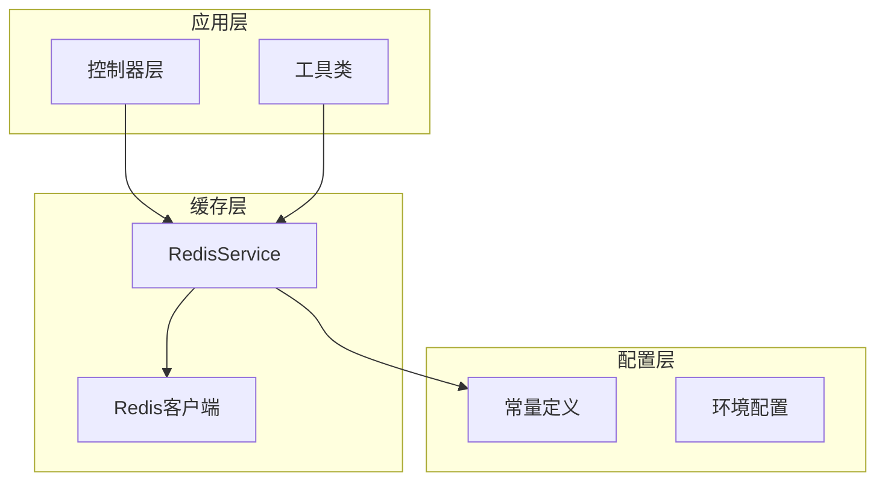
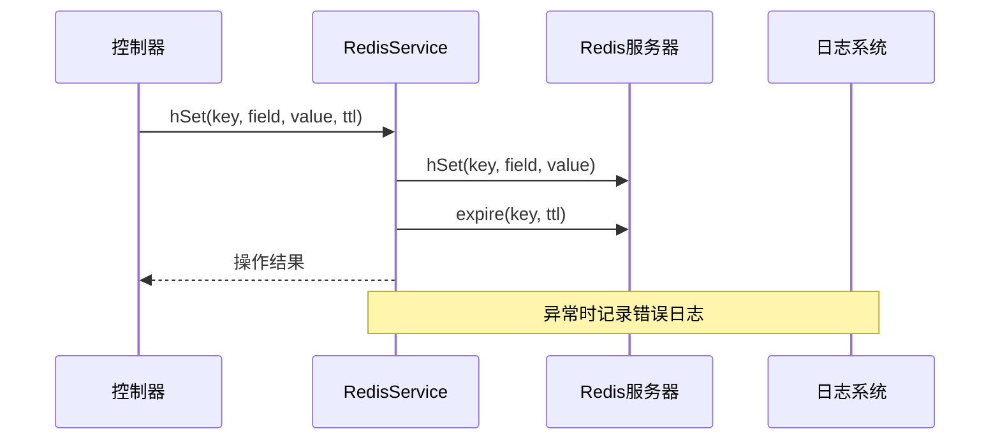
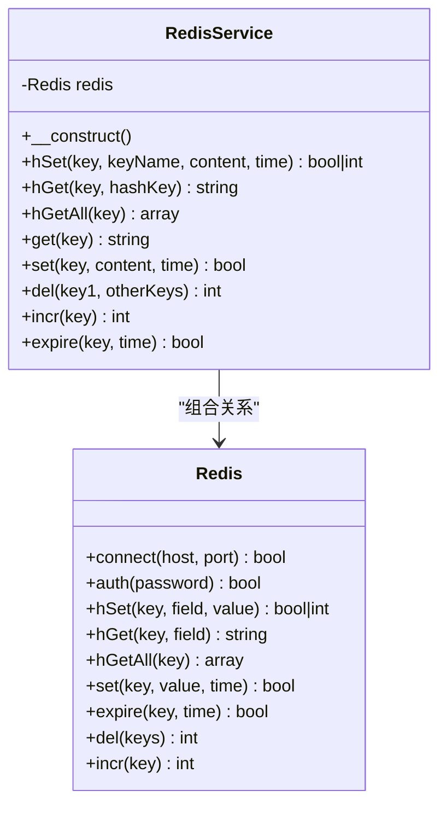
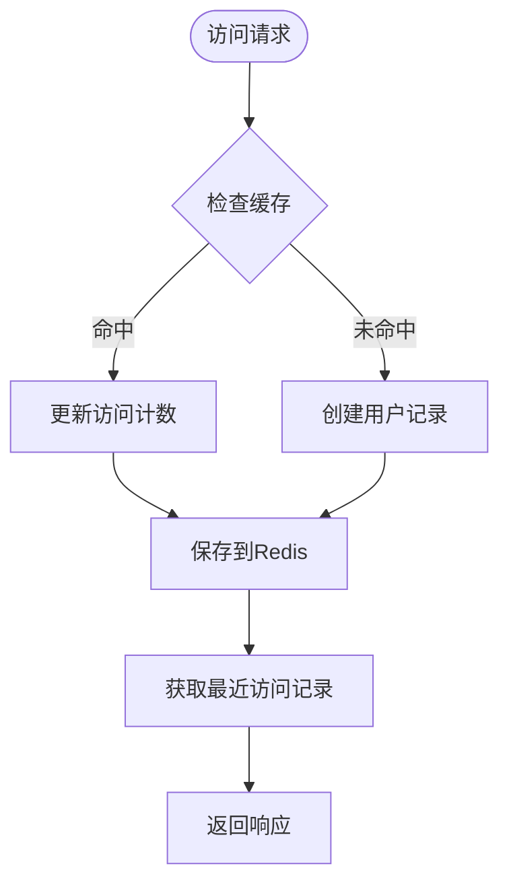
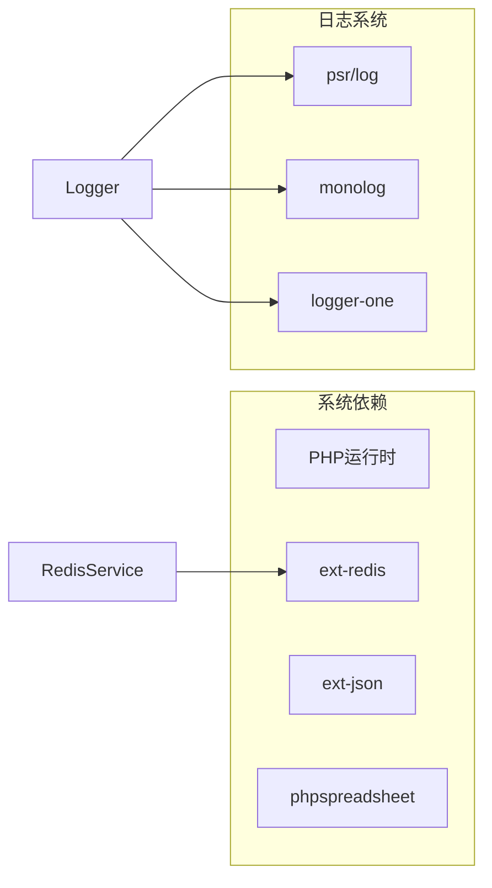
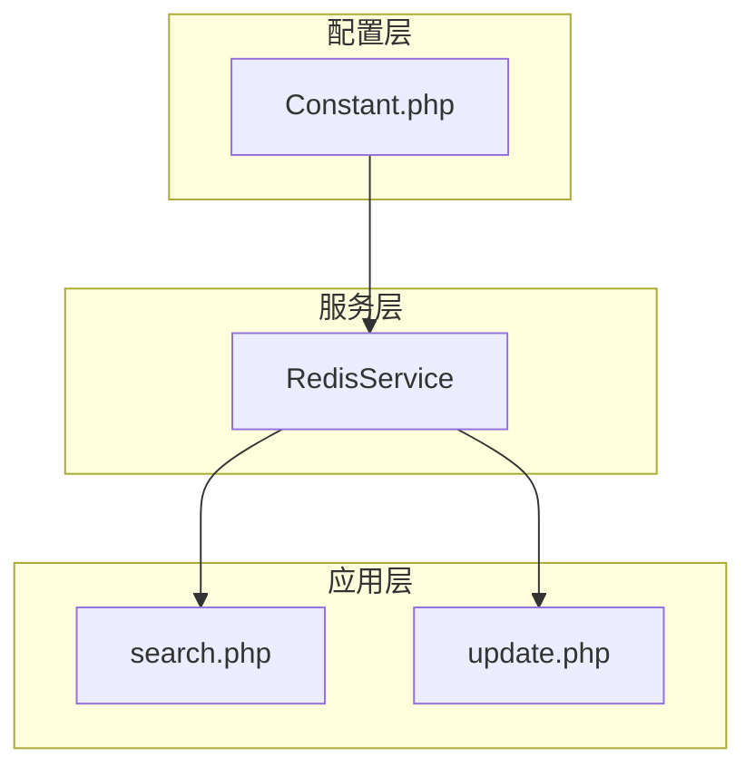
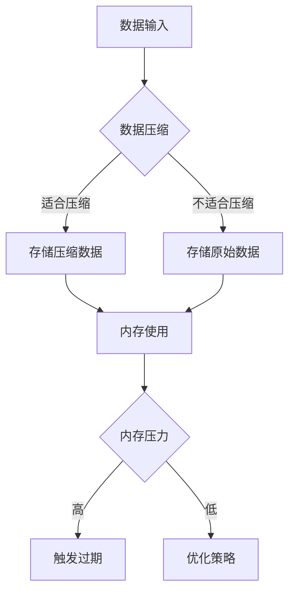
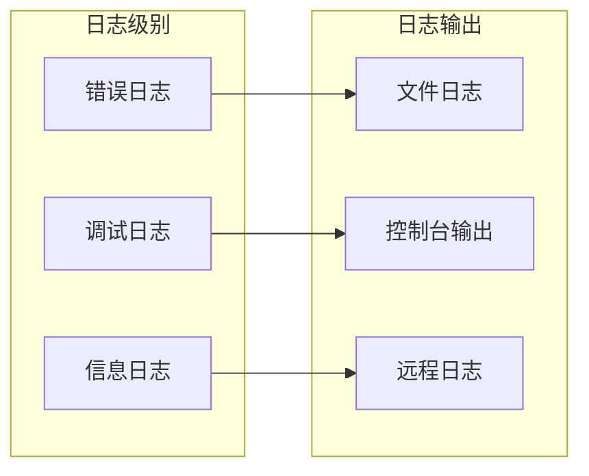

# 性能配置

<cite>
**本文档引用的文件**
- [RedisService.php](file://php/redis/RedisService.php)
- [Constant.php](file://php/constant/Constant.php)
- [search.php](file://php/controller/search.php)
- [update.php](file://php/controller/update.php)
- [Logger.php](file://php/class/Logger.php)
- [composer.json](file://composer.json)
</cite>

## 目录
1. [简介](#简介)
2. [项目结构](#项目结构)
3. [核心组件](#核心组件)
4. [架构概览](#架构概览)
5. [详细组件分析](#详细组件分析)
6. [依赖关系分析](#依赖关系分析)
7. [性能考虑因素](#性能考虑因素)
8. [故障排除指南](#故障排除指南)
9. [结论](#结论)

## 简介

本文档专注于PaSystem项目中RedisService的性能配置和优化。RedisService作为系统的核心缓存组件，负责处理用户访问统计、文件元数据缓存等关键业务场景。本文将深入分析其缓存策略、过期时间管理和内存配置，并提供针对不同负载场景的优化建议。

## 项目结构

PaSystem采用典型的PHP MVC架构，RedisService位于php/redis目录下，通过常量配置文件进行全局参数管理。

**图表来源**
- [RedisService.php](file://php/redis/RedisService.php#L1-L77)
- [Constant.php](file://php/constant/Constant.php#L1-L26)

**章节来源**
- [RedisService.php](file://php/redis/RedisService.php#L1-L77)
- [Constant.php](file://php/constant/Constant.php#L1-L26)

## 核心组件

RedisService是系统中唯一的Redis客户端封装类，提供了简洁的缓存操作接口。

### 主要特性
- **连接管理**: 单例式Redis连接，支持认证
- **数据操作**: 支持字符串和哈希类型的读写操作
- **过期控制**: 提供灵活的TTL设置机制
- **原子操作**: 支持自增等原子计数操作

### 缓存键空间设计

系统使用命名空间化的键设计，确保不同功能模块的数据隔离：

| 功能模块 | 键前缀 | 描述 |
|---------|--------|------|
| 用户访问统计 | `username_ip_{env}_stats` | 用户访问次数和时间统计 |
| 文件元数据 | `oss_file_{env}` | OSS文件上传记录 |
| 用户IP映射 | `username_ip_{env}` | 用户名与IP的关联映射 |

**章节来源**
- [RedisService.php](file://php/redis/RedisService.php#L21-L77)
- [Constant.php](file://php/constant/Constant.php#L8-L26)

## 架构概览

RedisService在整个系统架构中扮演着关键的缓存中介角色，连接应用逻辑与Redis数据库。

**图表来源**
- [RedisService.php](file://php/redis/RedisService.php#L29-L35)
- [search.php](file://php/controller/search.php#L336-L337)

## 详细组件分析

### RedisService类结构

**图表来源**
- [RedisService.php](file://php/redis/RedisService.php#L7-L77)

### 连接配置分析

RedisService使用静态配置参数建立连接：

- **主机地址**: 本地回环地址127.0.0.1
- **端口**: 标准Redis端口6379
- **认证**: 使用强密码进行身份验证

这些配置确保了本地开发和生产环境的一致性。

**章节来源**
- [RedisService.php](file://php/redis/RedisService.php#L15-L19)
- [Constant.php](file://php/constant/Constant.php#L4-L6)

### 缓存策略实现

系统实现了两种主要的缓存策略：

#### 1. 访问统计缓存策略
用于跟踪用户访问行为，采用哈希结构存储用户信息：

**图表来源**
- [search.php](file://php/controller/search.php#L315-L348)

#### 2. 文件元数据缓存策略
用于缓存OSS文件上传信息，支持批量查询和下载链接生成。

**章节来源**
- [search.php](file://php/controller/search.php#L205-L230)
- [update.php](file://php/controller/update.php#L536-L542)

### 过期时间管理

RedisService提供了灵活的TTL（生存时间）管理机制：

| 方法 | TTL参数 | 使用场景 | 默认行为 |
|------|---------|----------|----------|
| hSet | 可选 | 用户访问统计、文件元数据 | 仅在提供时设置过期 |
| set | 可选 | 通用键值存储 | 仅在提供时设置过期 |
| expire | 必需 | 手动设置过期时间 | 立即生效 |

**章节来源**
- [RedisService.php](file://php/redis/RedisService.php#L29-L35)
- [RedisService.php](file://php/redis/RedisService.php#L57-L60)

## 依赖关系分析

### 外部依赖

系统通过Composer管理外部依赖，其中Redis扩展是必需组件：

**图表来源**
- [composer.json](file://composer.json#L1-L10)

### 内部依赖关系

**图表来源**
- [RedisService.php](file://php/redis/RedisService.php#L2)
- [search.php](file://php/controller/search.php#L206)
- [update.php](file://php/controller/update.php#L528)

**章节来源**
- [composer.json](file://composer.json#L1-L10)

## 性能考虑因素

### 缓存命中率优化

系统通过以下策略提高缓存命中率：

1. **键设计优化**: 使用环境变量后缀区分不同环境
2. **数据结构选择**: 根据访问模式选择合适的Redis数据类型
3. **批量操作**: 支持批量读取减少网络往返

### 内存使用优化

### 并发访问处理

系统通过Redis的原子操作保证并发安全性：

- **原子计数**: 使用INCR确保访问计数的准确性
- **原子写入**: HSET保证用户数据的完整性
- **事务支持**: 支持多命令事务执行

**章节来源**
- [RedisService.php](file://php/redis/RedisService.php#L68-L71)

## 故障排除指南

### 常见问题诊断

#### 1. 连接失败问题
**症状**: 应用无法连接到Redis服务器
**诊断步骤**:
1. 检查Redis服务状态
2. 验证网络连通性
3. 确认认证凭据正确性

#### 2. 缓存失效问题
**症状**: 缓存数据过期或丢失
**诊断步骤**:
1. 检查TTL设置是否正确
2. 监控内存使用情况
3. 验证过期策略配置

#### 3. 性能问题
**症状**: 响应时间过长或吞吐量下降
**诊断步骤**:
1. 分析慢查询日志
2. 监控Redis内存使用
3. 检查连接池配置

### 日志记录和监控

系统集成了多层次的日志记录机制：

**图表来源**
- [Logger.php](file://php/class/Logger.php#L22-L37)

**章节来源**
- [Logger.php](file://php/class/Logger.php#L1-L55)

## 结论

RedisService为PaSystem提供了高效、可靠的缓存基础设施。通过合理的键设计、灵活的过期管理和优化的连接策略，系统能够在不同负载场景下保持稳定的性能表现。

### 关键优化建议

1. **监控指标**: 建议添加Redis内存使用率、连接数、命令执行时间等关键指标监控
2. **连接池**: 考虑实现连接池管理以提高连接复用效率
3. **缓存预热**: 对热点数据实施预加载策略
4. **数据分片**: 在高并发场景下考虑数据分片策略

### 最佳实践

- 合理设置TTL值，平衡数据新鲜度和内存占用
- 使用批量操作减少网络开销
- 定期清理过期数据维护Redis性能
- 实施监控告警机制及时发现性能问题

通过持续的性能监控和优化，RedisService将继续为PaSystem提供稳定高效的缓存服务。