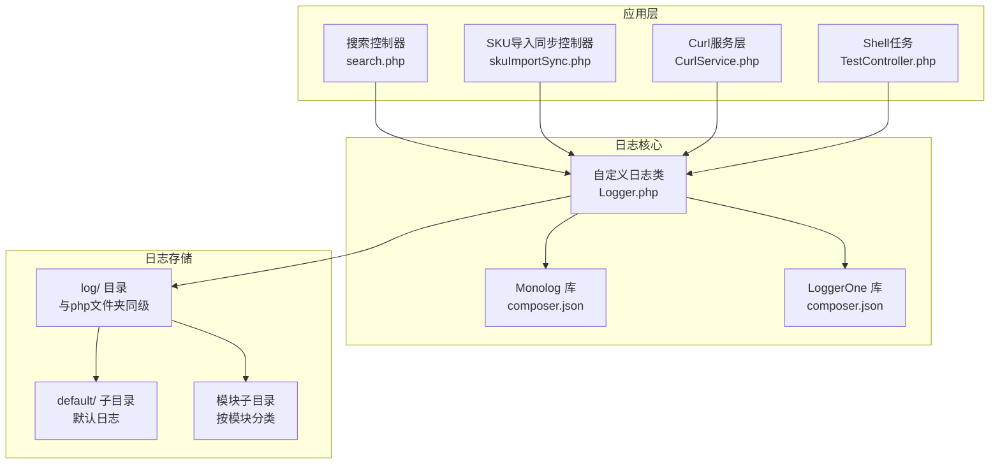
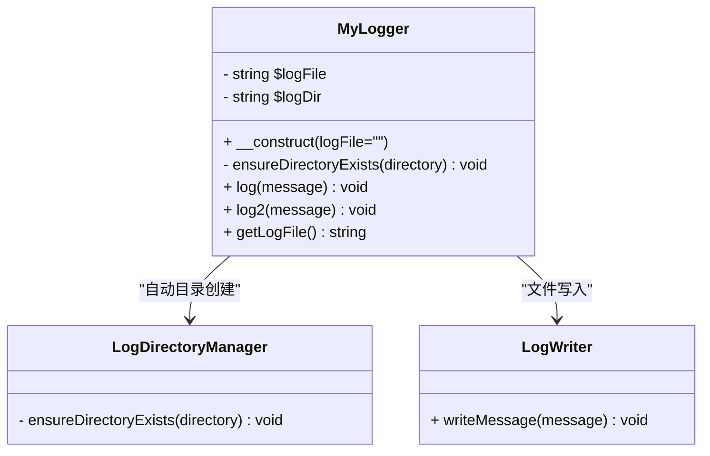
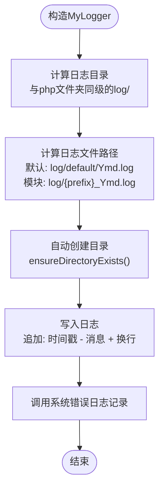
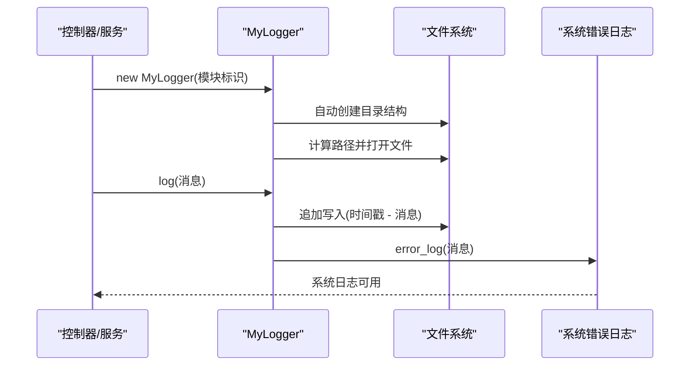
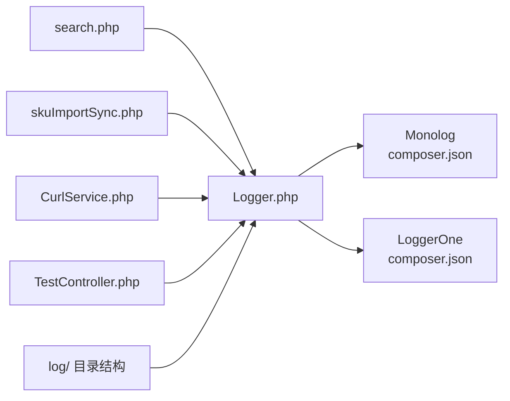

# 日志配置

<cite>
**本文引用的文件**
- [Logger.php](file://php/class/Logger.php)
- [composer.json](file://composer.json)
- [search.php](file://php/controller/search.php)
- [skuImportSync.php](file://php/controller/skuImportSync.php)
- [CurlService.php](file://php/curl/CurlService.php)
- [TestController.php](file://php/shell/TestController.php)
- [log目录结构](file://log/)
- [debug日志文件](file://log/debug/test_20260227.log)
</cite>

## 更新摘要
**所做更改**
- 更新了日志目录结构说明，反映新的与php文件夹同级的log目录设计
- 新增了自动目录创建功能的详细说明
- 补充了getLogFile()方法的使用说明
- 更新了日志文件命名规则和路径计算逻辑
- 增强了日志配置模板和示例

## 目录
1. [简介](#简介)
2. [项目结构](#项目结构)
3. [核心组件](#核心组件)
4. [架构总览](#架构总览)
5. [详细组件分析](#详细组件分析)
6. [依赖关系分析](#依赖关系分析)
7. [性能考量](#性能考量)
8. [故障排查指南](#故障排查指南)
9. [结论](#结论)
10. [附录](#附录)

## 简介
本文件面向PaSystem项目的日志配置与使用，重点围绕Logger.php提供的日志能力进行系统化说明。经过重大改进后，日志系统现在支持自动目录创建、新的目录结构设计、以及增强的文件管理功能。内容涵盖日志级别、日志格式、输出目标、模块差异化配置、自定义选项、文件管理与轮转策略、性能影响与优化建议、日志分析与故障排查方法，并提供可复用的配置模板与示例。

## 项目结构
PaSystem的日志体系以自定义Logger类为核心，结合Composer引入的第三方日志库（Monolog、LoggerOne），在多个业务控制器与服务层中统一使用。日志文件默认落盘于与php文件夹同级的log目录下，按日期切分，便于运维管理与审计追踪。



**图表来源**
- [Logger.php](file://php/class/Logger.php#L13-L28)
- [composer.json](file://composer.json#L1-L16)
- [search.php](file://php/controller/search.php#L21-L24)
- [skuImportSync.php](file://php/controller/skuImportSync.php#L19-L33)
- [CurlService.php](file://php/curl/CurlService.php#L34-L36)
- [TestController.php](file://php/shell/TestController.php#L20-L26)

**章节来源**
- [Logger.php](file://php/class/Logger.php#L13-L28)
- [composer.json](file://composer.json#L1-L16)

## 核心组件
- **自定义日志类**：提供自动目录创建与文件写入能力；支持两种写入方式（log、log2），内置getLogFile()方法获取当前日志文件路径。
- **自动目录管理**：通过ensureDirectoryExists()方法确保日志目录存在，支持递归创建多级目录。
- **Composer依赖**：引入Monolog与LoggerOne，便于未来启用更丰富的日志处理器与格式化器。
- **控制器集成**：多处控制器通过构造函数注入MyLogger实例，按模块命名空间组织日志文件，便于模块隔离与问题定位。

**章节来源**
- [Logger.php](file://php/class/Logger.php#L8-L58)
- [composer.json](file://composer.json#L1-L16)
- [search.php](file://php/controller/search.php#L21-L24)
- [skuImportSync.php](file://php/controller/skuImportSync.php#L19-L33)
- [CurlService.php](file://php/curl/CurlService.php#L34-L36)
- [TestController.php](file://php/shell/TestController.php#L20-L26)

## 架构总览
Logger.php作为统一入口，负责：
- **日志目录计算**：默认目录为与php文件夹同级的log目录，按日期后缀命名；也可按模块传参指定目录与文件名前缀。
- **自动目录创建**：在写入前确保日志目录存在，支持递归创建多级子目录。
- **写入策略**：将消息追加写入指定日志文件；同时调用PHP内置错误日志记录，便于集中采集与告警。
- **文件路径管理**：提供getLogFile()方法获取当前日志文件完整路径。



**图表来源**
- [Logger.php](file://php/class/Logger.php#L13-L58)

## 详细组件分析

### Logger.php 设计与实现
- **构造函数**：根据传入的模块标识生成日志文件路径；若未传参则使用默认目录与日期后缀。新版本采用与php文件夹同级的log目录结构。
- **自动目录创建**：通过ensureDirectoryExists()方法确保日志目录存在，支持递归创建多级子目录。
- **写入方法**：
  - log：标准写入，追加时间戳与消息，换行结尾；同时调用error_log，确保系统级错误日志可用。
  - log2：与log逻辑相同，提供备用写入方法。
- **文件路径获取**：getLogFile()方法返回当前日志文件的完整路径，便于调试和监控。



**图表来源**
- [Logger.php](file://php/class/Logger.php#L13-L28)
- [Logger.php](file://php/class/Logger.php#L40-L50)
- [Logger.php](file://php/class/Logger.php#L52-L58)

**章节来源**
- [Logger.php](file://php/class/Logger.php#L8-L58)

### 模块化日志配置与使用
- **搜索模块**：在构造函数中创建MyLogger("option/searchLog")，日志文件位于log/option/option_searchLog_YYYYMMDD.log。
- **SKU导入同步模块**：构造函数中创建MyLogger('sku_import_sync')，日志文件位于log/sku_import_sync/sku_import_sync_YYYYMMDD.log。
- **Curl服务层**：构造函数中创建MyLogger("curl/request")，日志文件位于log/curl/request_YYYYMMDD.log。
- **Shell任务**：构造函数中创建MyLogger("Test/test")，日志文件位于log/Test/test_YYYYMMDD.log。



**图表来源**
- [search.php](file://php/controller/search.php#L21-L24)
- [skuImportSync.php](file://php/controller/skuImportSync.php#L19-L33)
- [CurlService.php](file://php/curl/CurlService.php#L34-L36)
- [TestController.php](file://php/shell/TestController.php#L20-L26)
- [Logger.php](file://php/class/Logger.php#L13-L28)

**章节来源**
- [search.php](file://php/controller/search.php#L21-L24)
- [skuImportSync.php](file://php/controller/skuImportSync.php#L19-L33)
- [CurlService.php](file://php/curl/CurlService.php#L34-L36)
- [TestController.php](file://php/shell/TestController.php#L20-L26)

### 日志级别与格式
- **当前实现**：所有消息均以"时间戳 - 消息"的简单格式写入，未显式区分日志级别。
- **建议改进**：可在业务层对关键事件进行分级（如info、warn、error），并在Logger.php中增加对应方法或参数，以提升可读性与检索效率。

**章节来源**
- [Logger.php](file://php/class/Logger.php#L40-L50)

### 输出目标与自定义选项
- **文件输出**：默认写入与php文件夹同级的log目录下的模块化子目录，按日期切分，便于归档与轮转。
- **系统日志**：通过error_log同步输出，便于统一采集与告警。
- **文件路径获取**：getLogFile()方法提供当前日志文件路径，便于外部监控和管理。
- **可扩展性**：为未来引入Monolog与LoggerOne提供了基础架构支持。

**章节来源**
- [Logger.php](file://php/class/Logger.php#L40-L58)
- [composer.json](file://composer.json#L1-L16)

### 日志文件管理与轮转策略
- **文件命名**：模块标识 + 日期后缀，例如"sku_import_sync_YYYYMMDD.log"。
- **存放位置**：log/模块目录下，便于按模块隔离与清理。
- **自动管理**：ensureDirectoryExists()方法确保目录存在，避免手动维护。
- **轮转建议**：
  - 基于日志文件大小与时间的双阈值轮转（如每日或每GB轮转一次）。
  - 引入外部工具（如logrotate）或在应用层实现轮转逻辑（备份、压缩、清理）。
  - 对高频模块（如curl/request）建议独立目录与更严格的轮转策略。

**章节来源**
- [Logger.php](file://php/class/Logger.php#L13-L28)
- [Logger.php](file://php/class/Logger.php#L30-L38)
- [CurlService.php](file://php/curl/CurlService.php#L34-L36)

## 依赖关系分析
- **Logger.php与Composer生态**：通过composer.json引入Monolog与LoggerOne，当前代码以注释形式展示使用方式，未强制依赖。
- **控制器与服务层对Logger.php的依赖**：多处控制器在构造阶段创建MyLogger实例，形成松耦合的日志注入模式。
- **目录结构依赖**：Logger.php依赖与php文件夹同级的log目录结构。



**图表来源**
- [Logger.php](file://php/class/Logger.php#L13-L28)
- [composer.json](file://composer.json#L1-L16)
- [search.php](file://php/controller/search.php#L21-L24)
- [skuImportSync.php](file://php/controller/skuImportSync.php#L19-L33)
- [CurlService.php](file://php/curl/CurlService.php#L34-L36)
- [TestController.php](file://php/shell/TestController.php#L20-L26)

**章节来源**
- [composer.json](file://composer.json#L1-L16)
- [Logger.php](file://php/class/Logger.php#L13-L28)

## 性能考量
- **I/O开销**：每次写入均为追加写，简单高效；大量并发写入可能导致磁盘争用。
- **自动目录创建开销**：ensureDirectoryExists()方法在每次写入前检查目录存在性，开销较小。
- **建议优化**：
  - 将高频日志降级为异步写入或缓冲批量写入。
  - 对超大体量日志采用滚动与压缩策略，减少磁盘占用与IO压力。
  - 为不同模块设置不同的日志级别阈值，避免冗余日志影响性能。

## 故障排查指南
- **定位日志文件**：根据模块标识在log/目录下查找对应文件，按日期筛选。
- **常见问题**：
  - 权限不足：确保log及其子目录具备写权限。
  - 目录创建失败：检查父目录权限和磁盘空间。
  - 路径拼接错误：检查构造函数传入的模块标识是否正确。
  - 系统日志未显示：确认error_log配置与Web服务器/CLI环境一致。
- **排查步骤**：
  - 使用getLogFile()方法获取当前日志文件路径进行验证。
  - 在业务入口打印关键参数与环境变量，辅助回溯。
  - 对异常分支增加错误日志，包含堆栈信息（如适用）。
  - 使用grep或正则快速检索关键字，缩小范围。

**章节来源**
- [Logger.php](file://php/class/Logger.php#L13-L28)
- [Logger.php](file://php/class/Logger.php#L52-L58)

## 结论
Logger.php经过重大改进后，提供了更加完善和自动化的日志能力。新的与php文件夹同级的log目录结构、自动目录创建功能、以及getLogFile()方法，使得日志管理更加便捷和可靠。默认按模块与日期组织日志文件，配合error_log实现系统级日志输出。通过Composer引入的Monolog与LoggerOne为未来扩展提供了基础。建议在保持现有简单格式的基础上，逐步引入日志级别、结构化格式与异步写入，以满足更高性能与可维护性的需求。

## 附录

### 日志配置模板与示例
- **模块化日志文件命名模板**
  - 默认：log/default/{YYYYMMDD}.log
  - 模块：log/{模块标识}/{模块标识}_{YYYYMMDD}.log
- **新目录结构示例**
  - 搜索模块：log/option/option_searchLog_YYYYMMDD.log
  - SKU导入同步：log/sku_import_sync/sku_import_sync_YYYYMMDD.log
  - Curl请求：log/curl/request_YYYYMMDD.log
  - Shell任务：log/Test/test_YYYYMMDD.log
- **使用示例**
  ```php
  // 获取当前日志文件路径
  $logger = new MyLogger("example/module");
  $currentLogFile = $logger->getLogFile();
  echo "当前日志文件: " . $currentLogFile;
  ```

**章节来源**
- [Logger.php](file://php/class/Logger.php#L13-L28)
- [Logger.php](file://php/class/Logger.php#L52-L58)
- [search.php](file://php/controller/search.php#L21-L24)
- [skuImportSync.php](file://php/controller/skuImportSync.php#L19-L33)
- [CurlService.php](file://php/curl/CurlService.php#L34-L36)
- [TestController.php](file://php/shell/TestController.php#L20-L26)

### 日志分析与可视化建议
- **关键指标**：请求量、错误率、平均响应时间、异常堆栈出现频率。
- **工具建议**：ELK/EFK、Graylog、Sentry（结合LoggerOne）等。
- **实施要点**：统一时间戳、结构化字段、上下文追踪ID（trace-id）。
- **新功能利用**：使用getLogFile()方法获取实时日志文件路径，便于监控和分析。