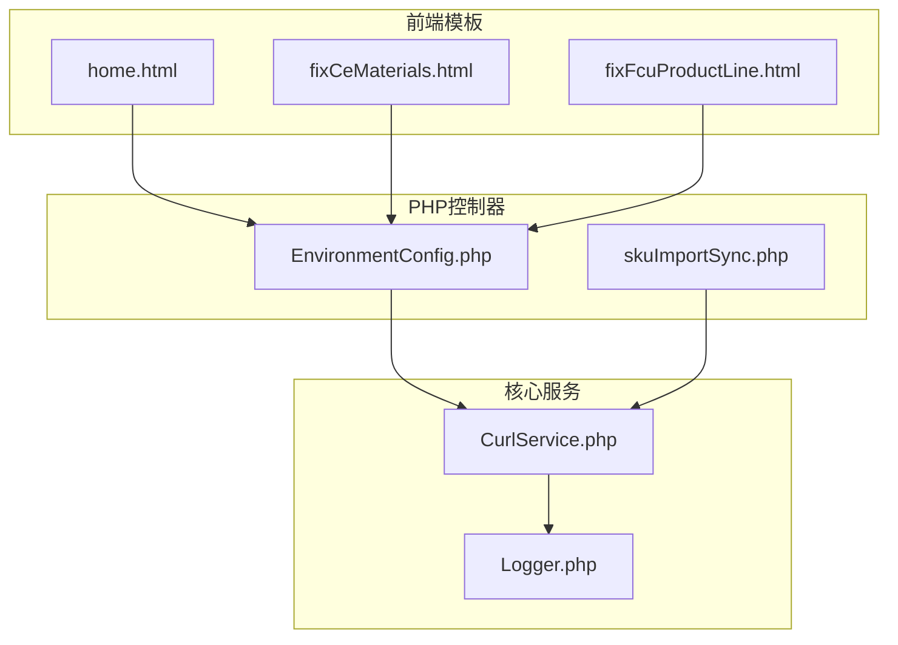
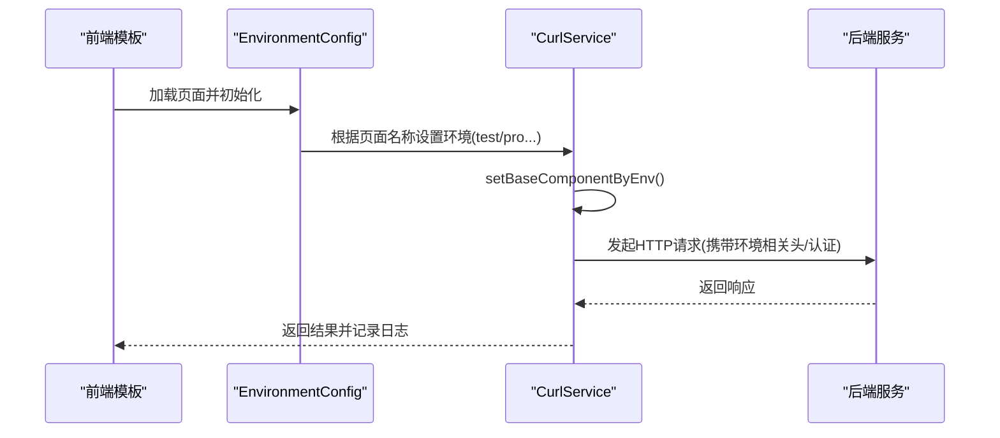
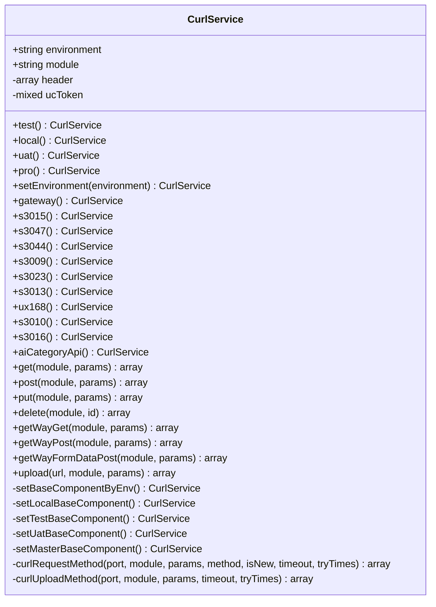
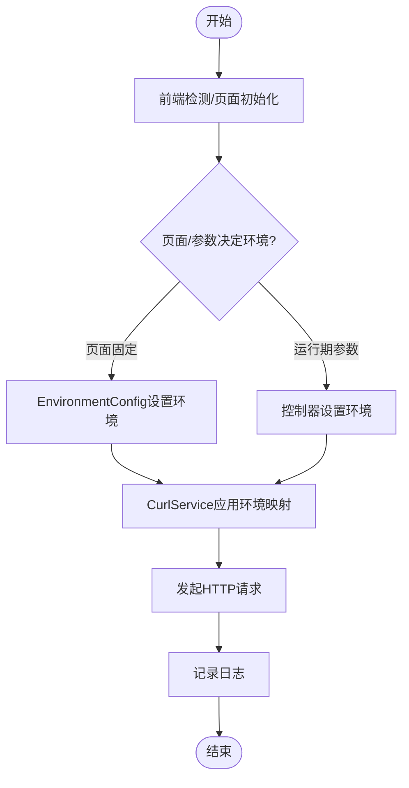
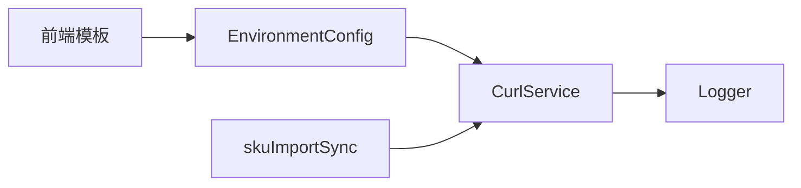

# 环境配置

<cite>
**本文引用的文件**
- [CurlService.php](file://php/curl/CurlService.php)
- [EnvironmentConfig.php](file://php/controller/EnvironmentConfig.php)
- [skuImportSync.php](file://php/controller/skuImportSync.php)
- [Logger.php](file://php/class/Logger.php)
- [home.html](file://template/home.html)
- [fixCeMaterials.html](file://template/fix/fixCeMaterials.html)
- [fixFcuProductLine.html](file://template/fix/fixFcuProductLine.html)
- [dev_bak.js](file://php/json/dev_bak.js)
</cite>

## 目录
1. [简介](#简介)
2. [项目结构](#项目结构)
3. [核心组件](#核心组件)
4. [架构总览](#架构总览)
5. [详细组件分析](#详细组件分析)
6. [依赖关系分析](#依赖关系分析)
7. [性能考量](#性能考量)
8. [故障排查指南](#故障排查指南)
9. [结论](#结论)
10. [附录](#附录)

## 简介
本文件面向PaSystem的PaSystem环境配置，聚焦CurlService中的环境配置机制与多环境支持。内容涵盖生产环境、测试环境、UAT环境与本地环境的配置差异与切换方法；解释环境变量的设置与管理方式；给出最佳实践与安全注意事项；提供环境切换步骤与验证方法，并说明环境配置对API调用与数据同步的影响。

## 项目结构
围绕环境配置的关键代码分布在以下模块：
- CurlService：统一的HTTP客户端封装，负责根据当前环境选择后端服务地址、设置请求头与认证信息。
- EnvironmentConfig：页面级环境配置入口，按页面名称将CurlService绑定到指定环境。
- 控制器层：如skuImportSync等业务控制器在运行期动态设置目标环境。
- 前端模板：通过页面脚本检测或展示当前环境状态。
- 日志：MyLogger用于记录请求与切换过程，便于问题定位。

**图表来源**
- [CurlService.php](file://php/curl/CurlService.php#L1-L996)
- [EnvironmentConfig.php](file://php/controller/EnvironmentConfig.php#L1-L62)
- [skuImportSync.php](file://php/controller/skuImportSync.php#L310-L509)
- [Logger.php](file://php/class/Logger.php#L1-L55)
- [home.html](file://template/home.html#L693-L710)
- [fixCeMaterials.html](file://template/fix/fixCeMaterials.html#L225-L257)
- [fixFcuProductLine.html](file://template/fix/fixFcuProductLine.html#L310-L342)

**章节来源**
- [CurlService.php](file://php/curl/CurlService.php#L1-L996)
- [EnvironmentConfig.php](file://php/controller/EnvironmentConfig.php#L1-L62)
- [skuImportSync.php](file://php/controller/skuImportSync.php#L310-L509)
- [Logger.php](file://php/class/Logger.php#L1-L55)
- [home.html](file://template/home.html#L693-L710)
- [fixCeMaterials.html](file://template/fix/fixCeMaterials.html#L225-L257)
- [fixFcuProductLine.html](file://template/fix/fixFcuProductLine.html#L310-L342)

## 核心组件
- CurlService：提供环境切换方法（test/local/uat/pro），按环境映射不同后端服务地址与认证头；封装GET/POST/PUT/DELETE等HTTP方法与日志记录。
- EnvironmentConfig：根据页面名称将CurlService绑定到对应环境（如某些页面固定使用pro，部分页面使用test）。
- 控制器：在业务流程中动态设置目标环境（如skuImportSync根据参数选择test或uat）。
- 前端模板：通过脚本检测或展示当前环境状态，辅助用户确认所处环境。
- 日志：MyLogger统一记录请求URL、参数与返回结果，便于追踪环境切换与API行为。

**章节来源**
- [CurlService.php](file://php/curl/CurlService.php#L8-L143)
- [EnvironmentConfig.php](file://php/controller/EnvironmentConfig.php#L20-L57)
- [skuImportSync.php](file://php/controller/skuImportSync.php#L314-L322)
- [Logger.php](file://php/class/Logger.php#L14-L25)
- [home.html](file://template/home.html#L693-L710)

## 架构总览
CurlService以“环境”为核心上下文，通过setEnvironment系列方法与端口映射方法（如s3015、gateway等）决定最终请求的目标地址与认证策略。EnvironmentConfig与控制器在运行期注入环境上下文，前端模板则辅助识别当前环境。

**图表来源**
- [EnvironmentConfig.php](file://php/controller/EnvironmentConfig.php#L20-L57)
- [CurlService.php](file://php/curl/CurlService.php#L441-L458)
- [Logger.php](file://php/class/Logger.php#L22-L25)

## 详细组件分析

### CurlService 环境配置机制
- 环境枚举与切换
  - 提供test/local/uat/pro四种环境切换方法，以及自定义setEnvironment方法。
  - 环境状态影响后续端口映射与认证头设置。
- 端口映射与基础组件
  - 通过setBaseComponentByEnv根据当前环境选择具体服务地址。
  - 不同环境映射到不同的服务节点（如s3015、gateway等），并设置对应的协议与主机端口。
- 认证与请求头
  - gateway方法根据环境设置Authorization头（不同环境使用不同令牌），支持通过getUcToken覆盖。
  - 统一设置Content-Type、trace-id等请求头。
- HTTP方法封装
  - 支持GET/POST/PUT/DELETE及上传、新架构请求等方法，统一记录请求日志与响应状态。

**图表来源**
- [CurlService.php](file://php/curl/CurlService.php#L4-L996)

**章节来源**
- [CurlService.php](file://php/curl/CurlService.php#L8-L143)
- [CurlService.php](file://php/curl/CurlService.php#L270-L290)
- [CurlService.php](file://php/curl/CurlService.php#L441-L651)
- [CurlService.php](file://php/curl/CurlService.php#L664-L800)

### 多环境配置差异与切换方法
- 环境差异
  - 测试环境（test）：使用测试集群地址与测试令牌，适合功能验证与联调。
  - UAT环境（uat）：使用UAT集群地址与UAT令牌，适合业务验收与回归测试。
  - 生产环境（pro）：使用生产集群地址与生产令牌，严格限制访问与变更。
  - 本地环境（local）：使用本机或内网地址，便于开发调试。
- 切换方法
  - 页面级：EnvironmentConfig根据页面名称固定绑定到特定环境。
  - 运行期：控制器（如skuImportSync）根据参数动态设置目标环境。
  - 前端：模板脚本通过主机名规则自动识别环境并展示。

**图表来源**
- [EnvironmentConfig.php](file://php/controller/EnvironmentConfig.php#L20-L57)
- [skuImportSync.php](file://php/controller/skuImportSync.php#L314-L322)
- [home.html](file://template/home.html#L693-L710)

**章节来源**
- [EnvironmentConfig.php](file://php/controller/EnvironmentConfig.php#L20-L57)
- [skuImportSync.php](file://php/controller/skuImportSync.php#L314-L322)
- [home.html](file://template/home.html#L693-L710)

### 环境变量的设置与管理
- 环境变量来源
  - 前端模板：通过脚本基于主机名推断环境（如test、uat、local/development、production）。
  - 后端配置：CurlService内部硬编码各环境的服务地址与认证令牌。
  - 构建配置：dev_bak.js中包含若干与后端服务相关的URL与密钥（示例用途）。
- 管理建议
  - 将敏感令牌与地址集中管理，避免硬编码泄露。
  - 使用配置中心或环境注入机制替代硬编码。
  - 对不同环境采用独立的密钥与白名单策略。

**章节来源**
- [home.html](file://template/home.html#L693-L710)
- [CurlService.php](file://php/curl/CurlService.php#L274-L286)
- [dev_bak.js](file://php/json/dev_bak.js#L1-L24)

### 最佳实践与安全考虑
- 最佳实践
  - 明确区分开发、测试、UAT与生产四环境，避免跨环境误操作。
  - 使用统一的环境切换入口（如EnvironmentConfig与控制器参数），减少分散配置。
  - 对关键API调用增加幂等性与重试策略，结合日志进行可观测性追踪。
- 安全考虑
  - 严格控制Authorization令牌的可见范围，仅在必要时注入到请求头。
  - HTTPS优先，生产环境禁用SSL校验仅限于特殊场景并做好审计。
  - 对上传与写操作增加权限校验与输入校验，防止越权与注入风险。

**章节来源**
- [CurlService.php](file://php/curl/CurlService.php#L664-L740)
- [Logger.php](file://php/class/Logger.php#L22-L25)

### 环境切换步骤与验证方法
- 切换步骤
  - 页面级：在EnvironmentConfig中确认页面绑定的默认环境。
  - 运行期：在控制器中根据参数设置目标环境（如test或uat）。
  - 前端：通过模板脚本检测当前环境，或手动选择环境。
- 验证方法
  - 查看日志：检查请求URL与返回状态，确认已命中目标环境。
  - 前端展示：确认页面显示的环境标签与预期一致。
  - 接口返回：对比不同环境下的返回数据量与字段，确保切换生效。

**章节来源**
- [EnvironmentConfig.php](file://php/controller/EnvironmentConfig.php#L20-L57)
- [skuImportSync.php](file://php/controller/skuImportSync.php#L314-L322)
- [Logger.php](file://php/class/Logger.php#L22-L25)
- [fixCeMaterials.html](file://template/fix/fixCeMaterials.html#L239-L257)
- [fixFcuProductLine.html](file://template/fix/fixFcuProductLine.html#L323-L342)

### 环境配置对API调用与数据同步的影响
- API调用
  - 环境直接影响请求的目标地址与认证令牌，从而决定能否成功访问后端服务。
  - 不同环境的超时、重试策略与日志级别可能不同，影响调用稳定性与可观测性。
- 数据同步
  - 在跨环境同步（如从PRO同步到TEST/UAT）时，需明确源环境与目标环境，避免误删或重复创建。
  - 同步流程应包含查询、删除旧数据、创建新数据的完整链路，并记录每一步的日志以便回溯。

**章节来源**
- [CurlService.php](file://php/curl/CurlService.php#L664-L800)
- [skuImportSync.php](file://php/controller/skuImportSync.php#L330-L426)

## 依赖关系分析
- 组件耦合
  - EnvironmentConfig与CurlService强耦合：前者决定后者使用的环境上下文。
  - 控制器与CurlService：控制器在运行期动态设置目标环境，体现高内聚低耦合。
  - 前端模板与控制器：前端通过脚本读取后端返回的环境信息，形成闭环。
- 外部依赖
  - 日志系统：MyLogger提供统一日志输出，便于问题定位。
  - 第三方库：composer.lock中包含monolog等日志库，可选用于增强日志能力。

**图表来源**
- [EnvironmentConfig.php](file://php/controller/EnvironmentConfig.php#L1-L62)
- [skuImportSync.php](file://php/controller/skuImportSync.php#L310-L509)
- [CurlService.php](file://php/curl/CurlService.php#L1-L996)
- [Logger.php](file://php/class/Logger.php#L1-L55)

**章节来源**
- [composer.lock](file://composer.lock#L306-L363)

## 性能考量
- 连接与超时
  - CurlService设置超时时间与重试次数，避免长时间阻塞影响用户体验。
- 日志开销
  - 统一日志输出有助于快速定位问题，但需注意日志量过大带来的IO压力。
- 网络路径
  - 不同环境的网络延迟与可用性不同，建议在测试阶段评估并优化关键路径。

**章节来源**
- [CurlService.php](file://php/curl/CurlService.php#L664-L740)
- [Logger.php](file://php/class/Logger.php#L22-L25)

## 故障排查指南
- 常见问题
  - 环境不匹配：确认前端检测逻辑与后端环境设置是否一致。
  - 认证失败：检查Authorization头是否正确注入，令牌是否过期。
  - 网络不通：核对setTestBaseComponent/setUatBaseComponent/setMasterBaseComponent中的地址是否可达。
- 排查步骤
  - 查看日志：定位请求URL、参数与HTTP状态码。
  - 核对环境：确认EnvironmentConfig与控制器中的环境设置。
  - 验证连通性：使用curl或浏览器直接访问目标地址，确认服务可用。

**章节来源**
- [Logger.php](file://php/class/Logger.php#L22-L25)
- [CurlService.php](file://php/curl/CurlService.php#L274-L286)
- [CurlService.php](file://php/curl/CurlService.php#L511-L551)

## 结论
CurlService提供了完善的多环境支持，通过统一的环境切换与端口映射机制，确保API调用与数据同步在不同环境中稳定运行。配合EnvironmentConfig与控制器的运行期设置，以及前端模板的环境展示，形成了清晰、可控的环境配置体系。建议进一步加强配置集中化与安全管控，提升系统的可维护性与安全性。

## 附录
- 环境映射要点
  - 测试环境：使用测试集群地址与测试令牌。
  - UAT环境：使用UAT集群地址与UAT令牌。
  - 生产环境：使用生产集群地址与生产令牌。
  - 本地环境：使用本机或内网地址，便于开发调试。
- 参考实现位置
  - 环境切换与映射：[CurlService.php](file://php/curl/CurlService.php#L441-L651)
  - 页面级环境绑定：[EnvironmentConfig.php](file://php/controller/EnvironmentConfig.php#L20-L57)
  - 运行期环境设置：[skuImportSync.php](file://php/controller/skuImportSync.php#L314-L322)
  - 前端环境检测：[home.html](file://template/home.html#L693-L710)
  - 日志记录：[Logger.php](file://php/class/Logger.php#L22-L25)