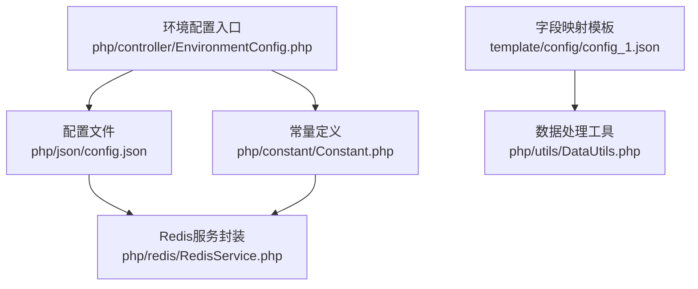
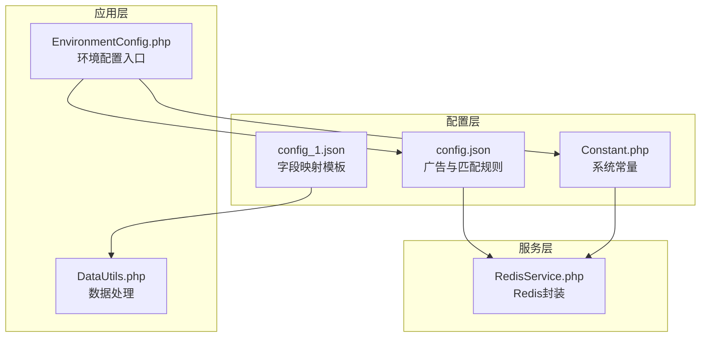
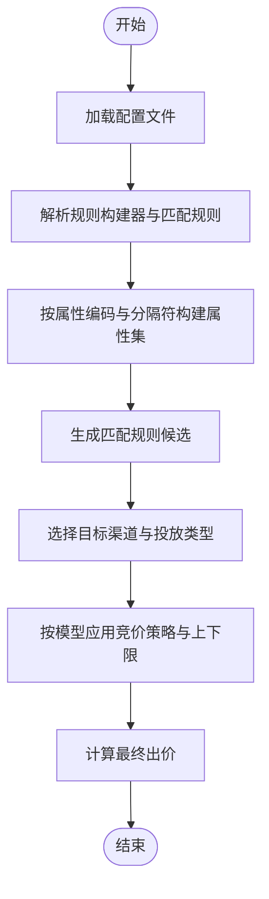
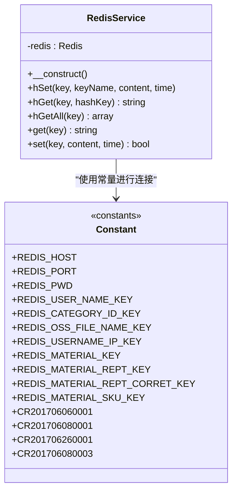
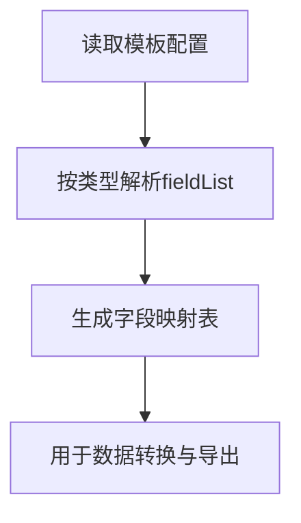
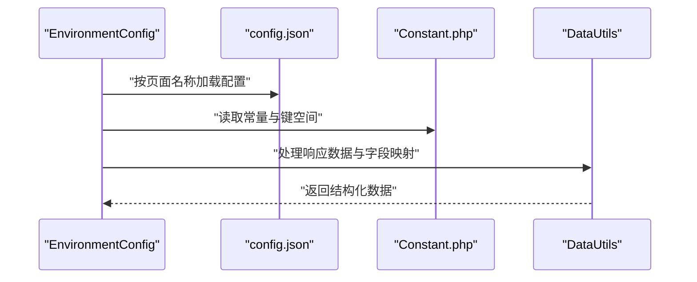
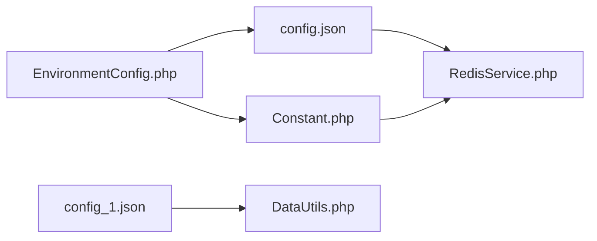

# 系统配置

<cite>
**本文引用的文件**
- [config.json](file://php/json/config.json)
- [Constant.php](file://php/constant/Constant.php)
- [RedisService.php](file://php/redis/RedisService.php)
- [config_1.json](file://template/config/config_1.json)
- [DataUtils.php](file://php/utils/DataUtils.php)
- [EnvironmentConfig.php](file://php/controller/EnvironmentConfig.php)
</cite>

## 目录
1. [简介](#简介)
2. [项目结构](#项目结构)
3. [核心组件](#核心组件)
4. [架构总览](#架构总览)
5. [详细组件分析](#详细组件分析)
6. [依赖关系分析](#依赖关系分析)
7. [性能考量](#性能考量)
8. [故障排查指南](#故障排查指南)
9. [结论](#结论)
10. [附录](#附录)

## 简介
本文件面向PaSystem系统的配置管理，聚焦以下目标：
- 深入解析config.json配置文件的结构与参数含义，涵盖广告配置规则、竞价策略、匹配类型等核心项。
- 说明Constant.php中系统常量的定义与使用场景，尤其是Redis连接与业务键空间。
- 提供配置文件的完整示例与参数说明，并给出配置验证与测试方法。
- 描述配置变更对系统行为的影响及注意事项。

## 项目结构
PaSystem的配置相关文件主要分布在如下位置：
- 广告与匹配规则配置：php/json/config.json
- 系统常量与Redis键空间：php/constant/Constant.php
- Redis服务封装：php/redis/RedisService.php
- 字段映射配置（模板示例）：template/config/config_1.json
- 数据处理工具（辅助理解配置用途）：php/utils/DataUtils.php
- 环境配置入口（演示如何加载不同环境配置）：php/controller/EnvironmentConfig.php

图表来源
- [config.json](file://php/json/config.json#L1-L316)
- [Constant.php](file://php/constant/Constant.php#L1-L26)
- [RedisService.php](file://php/redis/RedisService.php#L1-L60)
- [config_1.json](file://template/config/config_1.json#L1-L166)
- [DataUtils.php](file://php/utils/DataUtils.php#L1-L802)
- [EnvironmentConfig.php](file://php/controller/EnvironmentConfig.php#L1-L62)

章节来源
- [config.json](file://php/json/config.json#L1-L316)
- [Constant.php](file://php/constant/Constant.php#L1-L26)
- [RedisService.php](file://php/redis/RedisService.php#L1-L60)
- [config_1.json](file://template/config/config_1.json#L1-L166)
- [DataUtils.php](file://php/utils/DataUtils.php#L1-L802)
- [EnvironmentConfig.php](file://php/controller/EnvironmentConfig.php#L1-L62)

## 核心组件
- 广告配置与匹配规则（config.json）
  - 规则构建器：定义属性类型、属性编码、分隔符与空值处理策略。
  - 匹配规则：定义不同匹配类型（广泛、精确、短语）与属性组合。
  - 广告渠道设置：按平台（如amazon_us、amazon_uk、amazon_ca）划分，区分自动投放与手动投放，针对不同模型（精确、广泛、短语）设定竞价策略与出价上下限。
- 系统常量（Constant.php）
  - Redis连接参数与认证。
  - Redis键命名规范（用户名、品类、SKU初始化品牌、OSS文件名、物料、物料重复校验、物料SKU等）。
  - 业务规则常量（CR前缀）。
- Redis服务封装（RedisService.php）
  - 提供连接、认证、哈希读写、字符串读写等基础能力，内部依赖常量定义的主机、端口、密码等。
- 字段映射模板（config_1.json）
  - 展示多类型字段映射（如PMO字段映射、CE字段映射、PA SKU信息、产品SKU字段映射、PA CE物料字段映射、查找CE物料字段映射）。
- 数据处理工具（DataUtils.php）
  - 提供统一的响应数据解析、分页列表提取、首条数据提取、数组去重、字段抽取与重组等能力，便于理解配置在数据流转中的作用。
- 环境配置入口（EnvironmentConfig.php）
  - 演示如何按页面名称选择不同的CURL服务实例，体现配置在运行时的环境切换。

章节来源
- [config.json](file://php/json/config.json#L1-L316)
- [Constant.php](file://php/constant/Constant.php#L1-L26)
- [RedisService.php](file://php/redis/RedisService.php#L1-L60)
- [config_1.json](file://template/config/config_1.json#L1-L166)
- [DataUtils.php](file://php/utils/DataUtils.php#L1-L802)
- [EnvironmentConfig.php](file://php/controller/EnvironmentConfig.php#L1-L62)

## 架构总览
下图展示配置在系统中的关键交互：配置文件驱动广告与匹配规则，Redis服务承载键空间数据，工具类与控制器在运行期消费配置并执行业务逻辑。

图表来源
- [config.json](file://php/json/config.json#L1-L316)
- [Constant.php](file://php/constant/Constant.php#L1-L26)
- [config_1.json](file://template/config/config_1.json#L1-L166)
- [RedisService.php](file://php/redis/RedisService.php#L1-L60)
- [DataUtils.php](file://php/utils/DataUtils.php#L1-L802)
- [EnvironmentConfig.php](file://php/controller/EnvironmentConfig.php#L1-L62)

## 详细组件分析

### 组件A：广告配置与匹配规则（config.json）
- 结构概览
  - 规则构建器（fkRuleBuild）：为属性类型（如hotFitment、keywords、oeNumber）定义属性编码与分隔符策略。
  - 匹配规则（rules）：定义不同匹配类型与属性组合，形成多条规则。
  - 广告设置（adSettings）：按渠道划分，包含自动/手动投放类型，每种类型下按模型（精确、广泛、短语）配置竞价策略与出价上限/下限。
- 参数说明
  - 规则构建器
    - attributeType：属性类型标识。
    - attributeCode：属性编码数组。
    - splitConfig.enabled：是否启用分隔符处理。
    - splitConfig.delimiters：分隔符集合（如换行、斜杠）。
    - splitConfig.skipEmpty：是否跳过空值。
  - 匹配规则
    - matchType：匹配类型（broad、exact、phrase）。
    - rule：规则所依赖的属性编码列表。
  - 广告设置
    - channels.name：渠道名称（如amazon_us）。
    - spAdTypes.type：投放类型（auto、manual）。
    - models.model：模型（exact、broad、phrase）。
    - bidStrategy.type：竞价策略类型（percentage、fixed、multiplier）。
    - bidStrategy.value：策略数值（百分比值、固定值、倍数）。
    - bidStrategy.operation：策略运算（add、subtract、multiply）。
    - bidLimits.min/max：出价上下限。
- 处理流程（概念示意）
  - 加载配置文件。
  - 根据属性编码与分隔符策略解析输入文本。
  - 按匹配类型与规则组合生成广告匹配候选。
  - 在指定渠道与投放类型下，依据模型选择对应的竞价策略与上下限，计算最终出价。

图表来源
- [config.json](file://php/json/config.json#L1-L316)

章节来源
- [config.json](file://php/json/config.json#L1-L316)

### 组件B：系统常量与Redis键空间（Constant.php 与 RedisService.php）
- 常量定义
  - Redis连接参数：主机、端口、密码。
  - 键空间命名：用户名、品类、SKU初始化品牌、OSS文件名、用户名IP、物料、物料重复校验、物料SKU等。
  - 业务规则常量：CR前缀的业务规则标识。
- Redis服务封装
  - 连接与认证：基于常量建立连接。
  - 哈希读写：hSet/hGet/hGetAll。
  - 字符串读写：get/set。
- 使用场景
  - 配置与业务数据的持久化与缓存。
  - 键空间隔离与命名规范化，降低冲突风险。

图表来源
- [RedisService.php](file://php/redis/RedisService.php#L1-L60)
- [Constant.php](file://php/constant/Constant.php#L1-L26)

章节来源
- [Constant.php](file://php/constant/Constant.php#L1-L26)
- [RedisService.php](file://php/redis/RedisService.php#L1-L60)

### 组件C：字段映射模板（config_1.json）
- 类型与字段映射
  - pmoFiledMap、ceFiledMap、paSkuInfoField、productSkuFiledMap、paCEMaterialFiledMap、paFindCEMaterialFiledMap。
  - 每个类型包含fieldList，由“源字段:目标字段”或占位符组成。
- 用途
  - 将外部系统或模板中的字段映射到内部数据结构，支撑后续数据处理与导出。

图表来源
- [config_1.json](file://template/config/config_1.json#L1-L166)

章节来源
- [config_1.json](file://template/config/config_1.json#L1-L166)

### 组件D：数据处理与环境配置（DataUtils.php 与 EnvironmentConfig.php）
- 数据处理工具
  - 统一响应解析、分页列表提取、首条数据提取、数组去重、字段抽取与重组等。
  - 为配置在数据流转中的落地提供支撑。
- 环境配置入口
  - 根据页面名称选择不同CURL服务实例，体现配置在运行时的环境切换与加载。

图表来源
- [EnvironmentConfig.php](file://php/controller/EnvironmentConfig.php#L1-L62)
- [config.json](file://php/json/config.json#L1-L316)
- [Constant.php](file://php/constant/Constant.php#L1-L26)
- [DataUtils.php](file://php/utils/DataUtils.php#L1-L802)

章节来源
- [EnvironmentConfig.php](file://php/controller/EnvironmentConfig.php#L1-L62)
- [DataUtils.php](file://php/utils/DataUtils.php#L1-L802)

## 依赖关系分析
- 配置文件依赖Redis服务进行数据持久化与缓存。
- 常量定义被Redis服务封装使用，保证连接参数集中管理。
- 字段映射模板与数据处理工具共同完成数据转换与导出。
- 环境配置入口协调配置与常量，实现运行时环境切换。

图表来源
- [config.json](file://php/json/config.json#L1-L316)
- [Constant.php](file://php/constant/Constant.php#L1-L26)
- [RedisService.php](file://php/redis/RedisService.php#L1-L60)
- [config_1.json](file://template/config/config_1.json#L1-L166)
- [DataUtils.php](file://php/utils/DataUtils.php#L1-L802)
- [EnvironmentConfig.php](file://php/controller/EnvironmentConfig.php#L1-L62)

章节来源
- [config.json](file://php/json/config.json#L1-L316)
- [Constant.php](file://php/constant/Constant.php#L1-L26)
- [RedisService.php](file://php/redis/RedisService.php#L1-L60)
- [config_1.json](file://template/config/config_1.json#L1-L166)
- [DataUtils.php](file://php/utils/DataUtils.php#L1-L802)
- [EnvironmentConfig.php](file://php/controller/EnvironmentConfig.php#L1-L62)

## 性能考量
- 配置加载与解析
  - 建议在应用启动阶段一次性加载并缓存配置，避免频繁I/O。
  - 对于大型配置文件，可考虑分模块拆分与按需加载。
- Redis键空间设计
  - 使用统一前缀与命名规范，减少键冲突与提升检索效率。
  - 合理设置过期时间，避免内存膨胀。
- 竞价策略与出价上下限
  - 在高并发场景下，建议对竞价策略计算进行缓存与批量处理，降低CPU压力。
- 数据处理
  - 对大数据量的字段映射与数组去重操作，优先采用原地处理与流式处理，减少内存占用。

## 故障排查指南
- 配置加载失败
  - 检查配置文件语法与路径是否正确。
  - 确认运行环境具备读取权限。
- Redis连接异常
  - 核对常量中的主机、端口、密码是否与实际一致。
  - 检查网络连通性与防火墙策略。
- 出价策略异常
  - 校验bidStrategy.type与operation是否匹配，value是否在bidLimits范围内。
  - 对percentage/multiplier策略，确认运算方向与边界值。
- 字段映射错误
  - 对照模板中的fieldList，检查源字段与目标字段映射是否一致。
  - 使用数据处理工具的字段抽取功能验证映射结果。

章节来源
- [RedisService.php](file://php/redis/RedisService.php#L1-L60)
- [config.json](file://php/json/config.json#L1-L316)
- [config_1.json](file://template/config/config_1.json#L1-L166)
- [DataUtils.php](file://php/utils/DataUtils.php#L1-L802)

## 结论
- config.json是广告与匹配规则的核心载体，通过规则构建器、匹配规则与渠道/模型维度的竞价策略，形成完整的自动化投放体系。
- Constant.php与RedisService.php提供了稳定的键空间与连接管理，保障配置与数据的可靠落地。
- 字段映射模板与数据处理工具完善了从配置到数据输出的链路。
- 建议在生产环境中实施严格的配置校验与灰度发布策略，确保变更可控、可观测。

## 附录

### 配置文件参数说明（摘要）
- 规则构建器（fkRuleBuild）
  - attributeType：属性类型标识。
  - attributeCode：属性编码数组。
  - splitConfig.enabled：是否启用分隔符处理。
  - splitConfig.delimiters：分隔符集合。
  - splitConfig.skipEmpty：是否跳过空值。
- 匹配规则（rules）
  - matchType：匹配类型（broad、exact、phrase）。
  - rule：规则所依赖的属性编码列表。
- 广告设置（adSettings）
  - channels.name：渠道名称。
  - spAdTypes.type：投放类型（auto、manual）。
  - models.model：模型（exact、broad、phrase）。
  - bidStrategy.type：竞价策略类型（percentage、fixed、multiplier）。
  - bidStrategy.value：策略数值。
  - bidStrategy.operation：策略运算（add、subtract、multiply）。
  - bidLimits.min/max：出价上下限。

章节来源
- [config.json](file://php/json/config.json#L1-L316)

### 配置验证与测试方法
- 验证步骤
  - 语法校验：使用JSON校验工具检查配置文件语法。
  - 逻辑校验：核对属性编码与分隔符策略是否覆盖预期输入。
  - 竞价策略校验：确认策略类型与上下限范围合理。
  - Redis连通性：通过RedisService进行基本读写测试。
- 测试方法
  - 单元测试：针对配置解析与出价计算编写单元测试。
  - 集成测试：模拟环境配置入口，验证配置加载与数据处理链路。
  - 回归测试：在变更后对关键规则与策略进行回归验证。

章节来源
- [config.json](file://php/json/config.json#L1-L316)
- [RedisService.php](file://php/redis/RedisService.php#L1-L60)
- [EnvironmentConfig.php](file://php/controller/EnvironmentConfig.php#L1-L62)
- [DataUtils.php](file://php/utils/DataUtils.php#L1-L802)