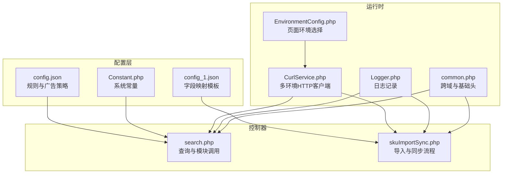
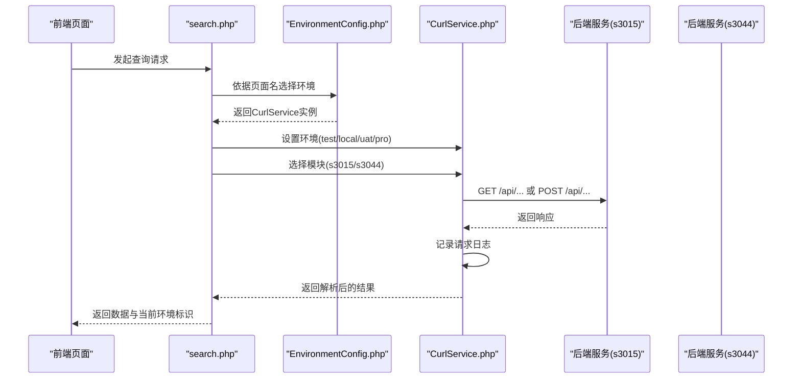
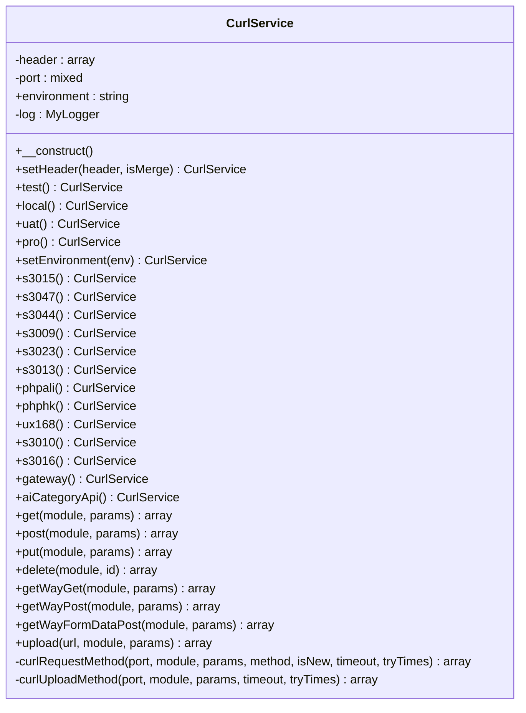
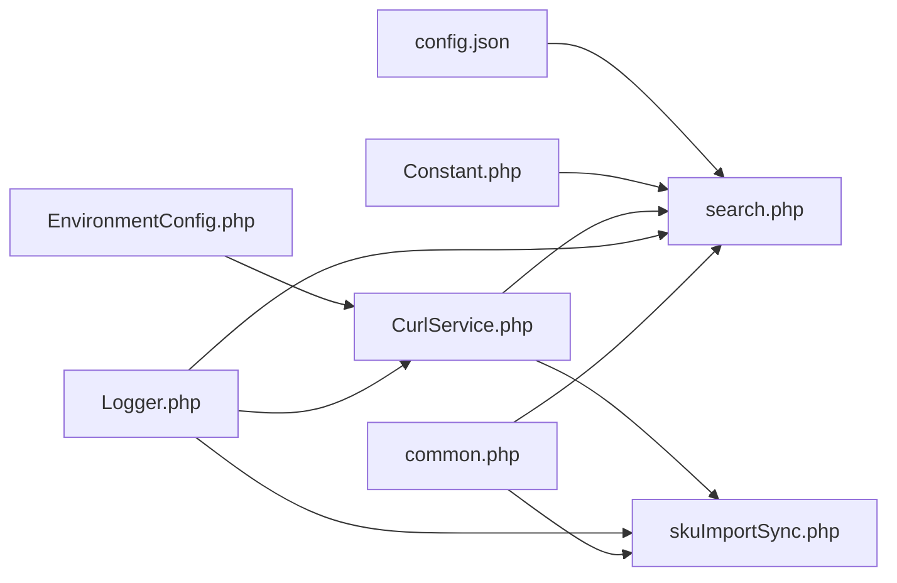

# 配置管理

<cite>
**本文引用的文件**
- [config.json](file://php/json/config.json)
- [Constant.php](file://php/constant/Constant.php)
- [CurlService.php](file://php/curl/CurlService.php)
- [Logger.php](file://php/class/Logger.php)
- [EnvironmentConfig.php](file://php/controller/EnvironmentConfig.php)
- [search.php](file://php/controller/search.php)
- [skuImportSync.php](file://php/controller/skuImportSync.php)
- [config_1.json](file://template/config/config_1.json)
- [composer.json](file://composer.json)
- [common.php](file://php/common.php)
</cite>

## 目录
1. [简介](#简介)
2. [项目结构](#项目结构)
3. [核心组件](#核心组件)
4. [架构总览](#架构总览)
5. [详细组件分析](#详细组件分析)
6. [依赖关系分析](#依赖关系分析)
7. [性能考虑](#性能考虑)
8. [故障排除指南](#故障排除指南)
9. [结论](#结论)
10. [附录](#附录)

## 简介
本文件面向PaSystem配置管理系统，系统性梳理配置的层次结构与管理方式，覆盖以下方面：
- config.json规则与广告策略配置项说明
- Constant.php中系统常量的定义与使用场景
- CurlService的环境配置与多环境支持
- 日志配置与性能调优选项
- 配置模板与示例
- 配置变更最佳实践、热更新机制与重启要求
- 故障排除与验证方法

## 项目结构
PaSystem的配置相关文件主要分布在如下位置：
- 规则与策略配置：php/json/config.json
- 常量定义：php/constant/Constant.php
- 环境与HTTP调用：php/curl/CurlService.php、php/controller/EnvironmentConfig.php
- 日志：php/class/Logger.php
- 配置模板：template/config/config_1.json
- 运行时依赖：composer.json
- 控制器入口与使用示例：php/controller/search.php、php/controller/skuImportSync.php
- 跨域与基础头：php/common.php

图表来源
- [config.json](file://php/json/config.json#L1-L316)
- [Constant.php](file://php/constant/Constant.php#L1-L26)
- [config_1.json](file://template/config/config_1.json#L1-L166)
- [EnvironmentConfig.php](file://php/controller/EnvironmentConfig.php#L1-L62)
- [CurlService.php](file://php/curl/CurlService.php#L1-L996)
- [Logger.php](file://php/class/Logger.php#L1-L55)
- [search.php](file://php/controller/search.php#L1-L719)
- [skuImportSync.php](file://php/controller/skuImportSync.php#L1-L512)
- [common.php](file://php/common.php#L1-L9)

章节来源
- [config.json](file://php/json/config.json#L1-L316)
- [Constant.php](file://php/constant/Constant.php#L1-L26)
- [config_1.json](file://template/config/config_1.json#L1-L166)
- [EnvironmentConfig.php](file://php/controller/EnvironmentConfig.php#L1-L62)
- [CurlService.php](file://php/curl/CurlService.php#L1-L996)
- [Logger.php](file://php/class/Logger.php#L1-L55)
- [search.php](file://php/controller/search.php#L1-L719)
- [skuImportSync.php](file://php/controller/skuImportSync.php#L1-L512)
- [common.php](file://php/common.php#L1-L9)

## 核心组件
- 配置文件config.json：定义属性拆分规则、匹配规则以及多渠道（amazon_us/uk/ca）下的广告类型（auto/manual）、竞价模型（exact/broad/phrase）及竞价策略（百分比/固定/倍数）与上下限。
- Constant.php：集中定义Redis主机、端口、密码及各类业务键名常量，便于全局统一维护。
- CurlService：封装HTTP调用，支持local/test/uat/pro多环境，按模块与端口路由至不同后端服务，并内置日志记录。
- Logger：提供基础日志写入能力，默认落盘至php/log目录，日期分片。
- EnvironmentConfig：根据页面名称选择对应环境的CurlService实例，实现前端页面与后端调用环境的绑定。
- 控制器search.php与skuImportSync.php：在具体业务流程中读取配置、发起HTTP请求、记录日志。

章节来源
- [config.json](file://php/json/config.json#L1-L316)
- [Constant.php](file://php/constant/Constant.php#L1-L26)
- [CurlService.php](file://php/curl/CurlService.php#L1-L996)
- [Logger.php](file://php/class/Logger.php#L1-L55)
- [EnvironmentConfig.php](file://php/controller/EnvironmentConfig.php#L1-L62)
- [search.php](file://php/controller/search.php#L1-L719)
- [skuImportSync.php](file://php/controller/skuImportSync.php#L1-L512)

## 架构总览
下图展示从页面到后端服务的配置驱动调用链路，包括环境选择、HTTP路由与日志记录。

图表来源
- [search.php](file://php/controller/search.php#L1-L719)
- [EnvironmentConfig.php](file://php/controller/EnvironmentConfig.php#L1-L62)
- [CurlService.php](file://php/curl/CurlService.php#L1-L996)

## 详细组件分析

### config.json 配置详解
- 属性规则（fkRuleBuild）
  - hotFitment：启用按换行符拆分，跳过空值
  - keywords：多关键词字段集合
  - oeNumber：启用按“/”与换行拆分，跳过空值
- 匹配规则（rules）
  - broad/exact/phrase：组合属性生成不同匹配度的规则集
- 广告设置（adSettings.channels）
  - 多渠道（amazon_us/uk/ca），每渠道下含auto/manual两类广告
  - 每类广告下有多种模型（exact/broad/phrase），每模型包含：
    - bidStrategy：percentage/fixed/multiplier三类策略及其运算（加/减/乘）
    - bidLimits：最小/最大出价限制
  - 该配置用于指导广告策略生成与优化

章节来源
- [config.json](file://php/json/config.json#L1-L316)

### Constant.php 常量说明
- Redis连接与认证
  - 主机、端口、密码
- 业务键名常量
  - 用户名/IP、品类信息、SKU初始品牌配置、SKU初始品牌ID、OSS文件名、素材、素材重复、素材重复修正等键名
- 版本/规则标识常量
  - 若干CR开头的业务规则ID常量

章节来源
- [Constant.php](file://php/constant/Constant.php#L1-L26)

### CurlService 环境与模块配置
- 环境设置
  - test/local/uat/pro四种环境，分别映射到不同的基础组件与网关地址
- 模块/端口路由
  - s3015/s3047/s3044/s3009/s3023/s3013/phpali/phphk/ux168/s3010/s3016/gateway/aiCategoryApi
- HTTP方法封装
  - get/post/put/delete/getWayGet/getWayPost/getWayFormDataPost/upload
- 日志与安全
  - 统一日志记录；禁用SSL证书校验（开发/测试场景）
- 超时与重试
  - 可配置超时与失败重试次数（内部默认值）

图表来源
- [CurlService.php](file://php/curl/CurlService.php#L1-L996)
- [Logger.php](file://php/class/Logger.php#L1-L55)

章节来源
- [CurlService.php](file://php/curl/CurlService.php#L1-L996)
- [Logger.php](file://php/class/Logger.php#L1-L55)

### EnvironmentConfig 页面环境选择
- 根据页面名称（如fixTranslationManagements、uploadOss等）选择对应环境的CurlService实例
- 用于将前端页面与后端调用环境进行绑定，确保请求指向正确的后端服务

章节来源
- [EnvironmentConfig.php](file://php/controller/EnvironmentConfig.php#L1-L62)

### 控制器使用示例
- search.php
  - 通过EnvironmentConfig获取CurlService，按模块（如s3015/s3044）调用后端接口，返回当前环境标识
- skuImportSync.php
  - 初始化日志记录器，记录导入/同步过程的关键步骤与参数

章节来源
- [search.php](file://php/controller/search.php#L1-L719)
- [skuImportSync.php](file://php/controller/skuImportSync.php#L1-L512)

### 日志配置与性能调优
- 日志落盘
  - Logger默认将日志写入php/log目录，按日期分片命名
- 性能相关
  - CurlService禁用SSL证书校验（开发/测试场景），可减少握手开销
  - 提供超时与重试参数，建议在高延迟网络环境下适当增大超时与重试次数
  - 建议对高频接口开启缓存与限流，避免对后端造成压力

章节来源
- [Logger.php](file://php/class/Logger.php#L1-L55)
- [CurlService.php](file://php/curl/CurlService.php#L664-L740)

### 配置模板与示例
- 字段映射模板（config_1.json）
  - 定义了多类型字段映射（pmoFiledMap、ceFiledMap、paSkuInfoField、productSkuFiledMap、paCEMaterialFiledMap、paFindCEMaterialFiledMap）
  - 每个类型包含fieldList，用于将源字段映射到目标字段或占位符

章节来源
- [config_1.json](file://template/config/config_1.json#L1-L166)

### 运行时依赖
- composer.json声明了日志与Excel处理等扩展需求，确保日志与Excel功能可用

章节来源
- [composer.json](file://composer.json#L1-L11)

### 跨域与基础头
- common.php设置跨域与基础响应头，确保前后端交互顺畅

章节来源
- [common.php](file://php/common.php#L1-L9)

## 依赖关系分析
- config.json被业务控制器（如search.php）读取以决定匹配与广告策略
- Constant.php为Redis相关键名提供统一常量，降低硬编码风险
- CurlService作为HTTP客户端，被EnvironmentConfig选择并注入到控制器中
- Logger贯穿控制器与CurlService，形成统一的日志输出
- 前端页面通过search.php返回的环境标识，了解当前调用所处的环境

图表来源
- [config.json](file://php/json/config.json#L1-L316)
- [Constant.php](file://php/constant/Constant.php#L1-L26)
- [EnvironmentConfig.php](file://php/controller/EnvironmentConfig.php#L1-L62)
- [CurlService.php](file://php/curl/CurlService.php#L1-L996)
- [Logger.php](file://php/class/Logger.php#L1-L55)
- [search.php](file://php/controller/search.php#L1-L719)
- [skuImportSync.php](file://php/controller/skuImportSync.php#L1-L512)
- [common.php](file://php/common.php#L1-L9)

章节来源
- [config.json](file://php/json/config.json#L1-L316)
- [Constant.php](file://php/constant/Constant.php#L1-L26)
- [EnvironmentConfig.php](file://php/controller/EnvironmentConfig.php#L1-L62)
- [CurlService.php](file://php/curl/CurlService.php#L1-L996)
- [Logger.php](file://php/class/Logger.php#L1-L55)
- [search.php](file://php/controller/search.php#L1-L719)
- [skuImportSync.php](file://php/controller/skuImportSync.php#L1-L512)
- [common.php](file://php/common.php#L1-L9)

## 性能考虑
- 网络与超时
  - 在CurlService中可调整超时与重试次数，建议在生产环境适当提高超时时间，避免因瞬时抖动导致失败
- SSL校验
  - 开发/测试环境禁用SSL校验可降低握手成本，但生产环境应启用校验以保障安全
- 日志频率
  - 对高频接口建议降低日志级别或按需记录，避免I/O成为瓶颈
- 缓存与限流
  - 对后端接口可增加本地缓存与限流策略，减少重复请求与后端压力

## 故障排除指南
- 环境选择不正确
  - 检查EnvironmentConfig中页面名对应的环境是否符合预期
- HTTP请求失败
  - 查看CurlService日志，确认URL、Header与返回码；必要时开启更详细的日志记录
- Redis键名错误
  - 确认Constant.php中的键名常量与实际使用一致
- Excel导入/同步异常
  - 检查skuImportSync日志，关注文件上传、模板生成与数据解析阶段的错误提示
- 跨域问题
  - 确认common.php中的跨域与响应头设置是否生效

章节来源
- [EnvironmentConfig.php](file://php/controller/EnvironmentConfig.php#L1-L62)
- [CurlService.php](file://php/curl/CurlService.php#L664-L740)
- [Logger.php](file://php/class/Logger.php#L1-L55)
- [Constant.php](file://php/constant/Constant.php#L1-L26)
- [skuImportSync.php](file://php/controller/skuImportSync.php#L1-L512)
- [common.php](file://php/common.php#L1-L9)

## 结论
PaSystem的配置管理采用“规则配置+环境选择+HTTP客户端”的分层设计：config.json提供业务规则与广告策略，Constant.php统一常量，CurlService负责多环境HTTP调用，Logger贯穿全链路记录。通过EnvironmentConfig将页面与环境绑定，实现灵活的多环境支持。建议在生产环境启用SSL校验与合理超时重试，结合日志与缓存策略提升稳定性与性能。

## 附录

### 配置模板与示例
- 字段映射模板（config_1.json）
  - 类型：pmoFiledMap、ceFiledMap、paSkuInfoField、productSkuFiledMap、paCEMaterialFiledMap、paFindCEMaterialFiledMap
  - 字段列表：每个类型包含fieldList，用于源字段到目标字段的映射或占位符

章节来源
- [config_1.json](file://template/config/config_1.json#L1-L166)

### 配置变更最佳实践
- 分环境发布
  - 先在test/UAT验证，再在pro发布
- 渐进式变更
  - 优先变更非关键路径配置，逐步扩大范围
- 回滚预案
  - 保留上一版本配置快照，出现问题立即回滚
- 文档同步
  - 更新配置说明与字段映射文档，确保团队一致理解

### 热更新机制与重启要求
- 规则与策略配置（config.json）
  - 建议通过控制器读取并缓存，配合定时刷新或手动触发刷新
- 环境配置（CurlService）
  - 通过EnvironmentConfig动态选择，无需重启即可切换环境
- 日志与常量
  - 常量变更需重启PHP进程；日志路径与级别可在运行时调整

### 验证方法
- 功能验证
  - 在不同环境（local/test/uat/pro）下调用search.php相关接口，核对返回数据与环境标识
- 日志验证
  - 检查php/log目录下按日期分片的日志文件，确认请求与响应记录完整
- Excel导入验证
  - 使用skuImportSync的模板下载与解析功能，验证字段映射与数据流转

章节来源
- [search.php](file://php/controller/search.php#L1-L719)
- [skuImportSync.php](file://php/controller/skuImportSync.php#L1-L512)
- [Logger.php](file://php/class/Logger.php#L1-L55)