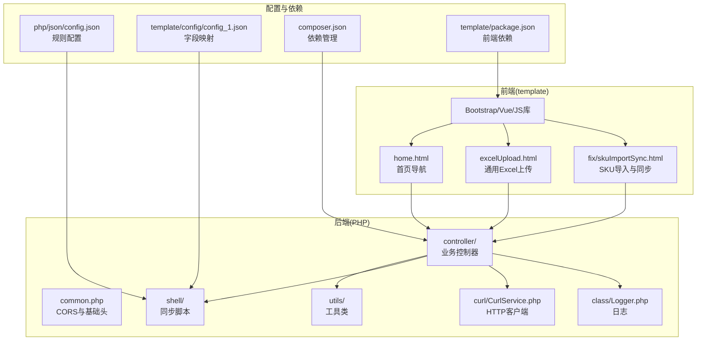
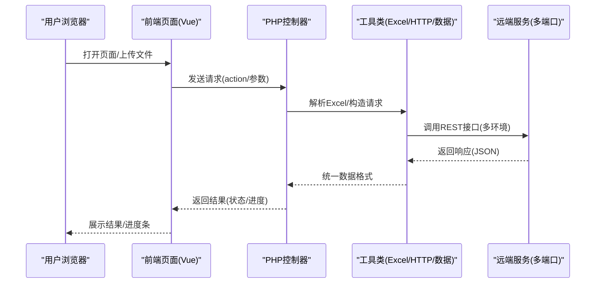
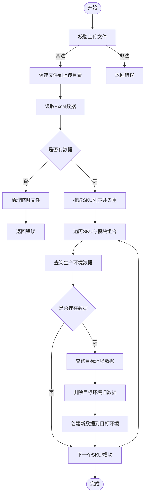
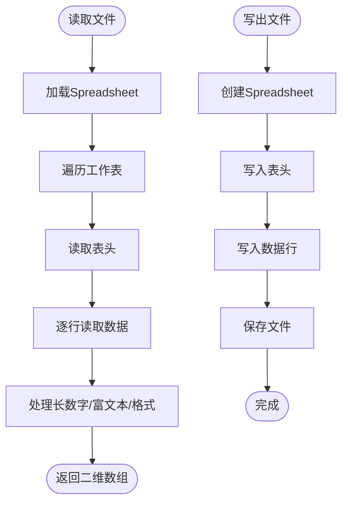
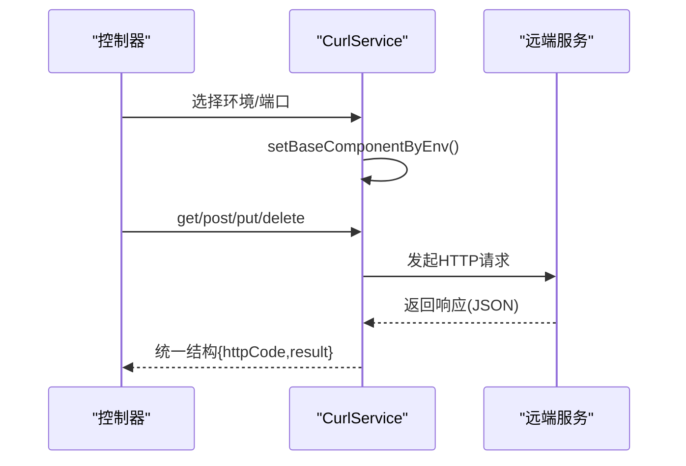
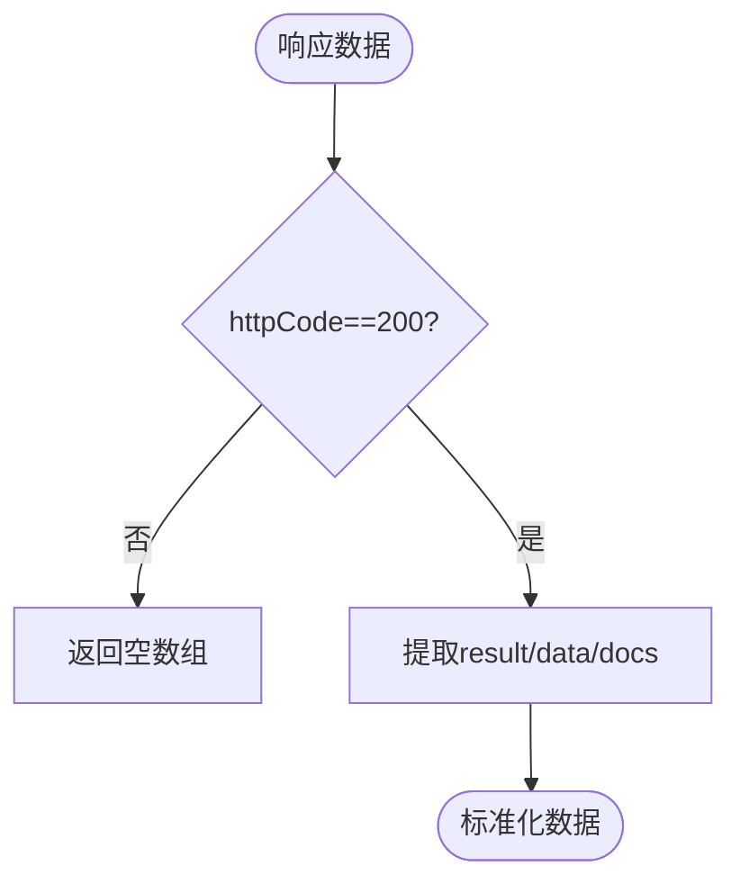
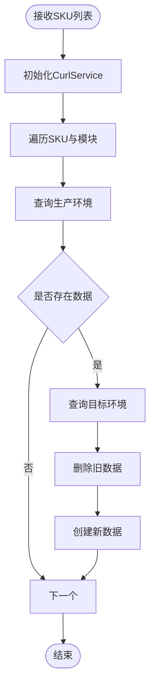
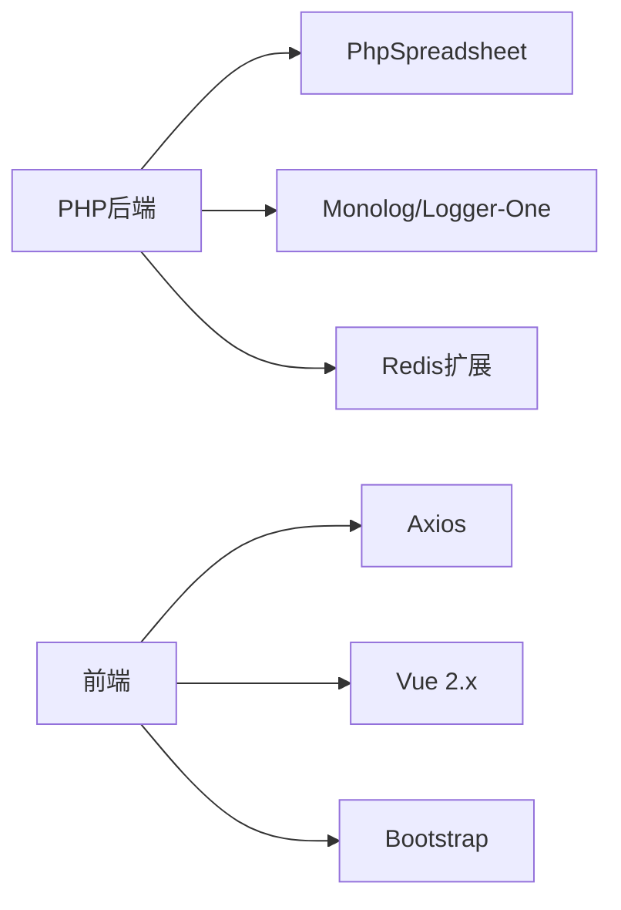

# 项目概述

<cite>
**本文档引用的文件**
- [composer.json](file://composer.json)
- [php/common.php](file://php/common.php)
- [template/home.html](file://template/home.html)
- [php/controller/skuImportSync.php](file://php/controller/skuImportSync.php)
- [php/utils/ExcelUtils.php](file://php/utils/ExcelUtils.php)
- [template/excelUpload.html](file://template/excelUpload.html)
- [php/shell/SyncProductSku.php](file://php/shell/SyncProductSku.php)
- [php/class/Logger.php](file://php/class/Logger.php)
- [template/fix/skuImportSync.html](file://template/fix/skuImportSync.html)
- [php/json/config.json](file://php/json/config.json)
- [template/config/config_1.json](file://template/config/config_1.json)
- [php/curl/CurlService.php](file://php/curl/CurlService.php)
- [php/utils/DataUtils.php](file://php/utils/DataUtils.php)
- [template/package.json](file://template/package.json)
</cite>

## 目录
1. [项目简介](#项目简介)
2. [项目结构](#项目结构)
3. [核心组件](#核心组件)
4. [架构总览](#架构总览)
5. [详细组件分析](#详细组件分析)
6. [依赖关系分析](#依赖关系分析)
7. [性能考虑](#性能考虑)
8. [故障排查指南](#故障排查指南)
9. [结论](#结论)
10. [附录](#附录)

## 项目简介
PaSystem 是一个基于 PHP 的全栈 Web 应用，专注于电商数据管理与 Excel 文件处理。项目提供以下核心能力：
- SKU 数据导入与解析：支持 xlsx/xls 格式，自动提取 SKU 列表并去重
- 跨环境数据同步：从生产环境查询数据，同步至 Test/UAT 环境，覆盖多模块（如广告、价格、图片、销售状态等）
- Excel 文件导入导出：内置模板下载、数据预览、批量处理与导出功能
- 前后端分离设计：前端采用 Vue.js + Bootstrap，后端以 PHP 控制器为核心，通过 RESTful 接口交互

项目目标是为电商运营提供统一的数据修复与同步平台，提升跨环境数据一致性与处理效率。

## 项目结构
项目采用典型的前后端分离架构，前端静态资源与页面位于 template 目录，后端 PHP 逻辑位于 php 目录，第三方依赖通过 Composer 管理。

**图表来源**
- [template/home.html](file://template/home.html#L1-L761)
- [php/controller/skuImportSync.php](file://php/controller/skuImportSync.php#L1-L512)
- [php/utils/ExcelUtils.php](file://php/utils/ExcelUtils.php#L1-L398)
- [php/shell/SyncProductSku.php](file://php/shell/SyncProductSku.php#L1-L213)
- [php/curl/CurlService.php](file://php/curl/CurlService.php#L1-L996)
- [php/class/Logger.php](file://php/class/Logger.php#L1-L55)
- [php/json/config.json](file://php/json/config.json#L1-L316)
- [template/config/config_1.json](file://template/config/config_1.json#L1-L166)
- [composer.json](file://composer.json#L1-L11)
- [template/package.json](file://template/package.json#L1-L15)

**章节来源**
- [template/home.html](file://template/home.html#L1-L761)
- [composer.json](file://composer.json#L1-L11)
- [template/package.json](file://template/package.json#L1-L15)

## 核心组件
- 控制器层：集中处理请求、路由与业务编排
  - SKU 导入与同步控制器：解析 Excel、校验文件、触发跨环境同步
  - Excel 上传控制器：通用文件上传与解析
- 工具层：封装 Excel 读写、HTTP 请求、数据处理与日志
  - ExcelUtils：读取 xlsx/xls/csv，导出文件
  - CurlService：多环境 HTTP 客户端，支持 s3015/s3044/s3047 等端口
  - DataUtils：统一响应数据格式化与提取
  - Logger：本地文件日志记录
- Shell 层：批量同步脚本，面向命令行与定时任务
- 前端页面：Vue 驱动的交互界面，提供模板下载、数据预览与同步进度可视化

**章节来源**
- [php/controller/skuImportSync.php](file://php/controller/skuImportSync.php#L1-L512)
- [php/utils/ExcelUtils.php](file://php/utils/ExcelUtils.php#L1-L398)
- [php/shell/SyncProductSku.php](file://php/shell/SyncProductSku.php#L1-L213)
- [php/curl/CurlService.php](file://php/curl/CurlService.php#L1-L996)
- [php/utils/DataUtils.php](file://php/utils/DataUtils.php#L1-L802)
- [php/class/Logger.php](file://php/class/Logger.php#L1-L55)

## 架构总览
系统采用前后端分离模式，前端负责用户交互与数据展示，后端提供 RESTful 接口与业务逻辑。核心交互链路如下：

**图表来源**
- [template/fix/skuImportSync.html](file://template/fix/skuImportSync.html#L352-L585)
- [php/controller/skuImportSync.php](file://php/controller/skuImportSync.php#L474-L512)
- [php/utils/ExcelUtils.php](file://php/utils/ExcelUtils.php#L147-L181)
- [php/curl/CurlService.php](file://php/curl/CurlService.php#L294-L433)

## 详细组件分析

### SKU 导入与同步组件
- 功能要点
  - 模板下载：自动生成导入模板，包含示例数据与说明
  - 文件解析：校验大小、扩展名，移动上传文件，读取 Excel 数据
  - 同步策略：从生产环境查询，按模块与字段条件同步至 Test/UAT 环境
  - 进度跟踪：前端实时展示同步进度与结果
- 关键流程

**图表来源**
- [php/controller/skuImportSync.php](file://php/controller/skuImportSync.php#L164-L271)
- [php/controller/skuImportSync.php](file://php/controller/skuImportSync.php#L278-L426)

**章节来源**
- [php/controller/skuImportSync.php](file://php/controller/skuImportSync.php#L1-L512)
- [template/fix/skuImportSync.html](file://template/fix/skuImportSync.html#L352-L585)

### Excel 工具组件
- 功能要点
  - 读取：支持 xlsx/xls/csv，自动识别表头与数据行
  - 写出：生成 xlsx/xls 文件，支持自定义表头与数据
  - 长数字处理：避免科学计数法，保持原始格式
- 关键流程

**图表来源**
- [php/utils/ExcelUtils.php](file://php/utils/ExcelUtils.php#L147-L181)
- [php/utils/ExcelUtils.php](file://php/utils/ExcelUtils.php#L98-L138)

**章节来源**
- [php/utils/ExcelUtils.php](file://php/utils/ExcelUtils.php#L1-L398)

### HTTP 客户端组件
- 功能要点
  - 多环境适配：local/test/uat/pro，不同端口与网关
  - 方法封装：get/post/put/delete/upload，支持新旧架构
  - 日志记录：请求 URL、参数与响应状态
- 关键流程

**图表来源**
- [php/curl/CurlService.php](file://php/curl/CurlService.php#L441-L651)
- [php/curl/CurlService.php](file://php/curl/CurlService.php#L664-L740)

**章节来源**
- [php/curl/CurlService.php](file://php/curl/CurlService.php#L1-L996)

### 数据处理工具组件
- 功能要点
  - 统一响应：getPageList/getResultData/getPageDocList 等
  - 数组处理：去重、查找、字段提取、UUID 生成
  - 日志解析：解析并整理 QD 工作流日志
- 关键流程

**图表来源**
- [php/utils/DataUtils.php](file://php/utils/DataUtils.php#L36-L84)

**章节来源**
- [php/utils/DataUtils.php](file://php/utils/DataUtils.php#L1-L802)

### Shell 批量同步组件
- 功能要点
  - 面向命令行的批量 SKU 同步脚本
  - 预定义模块清单与字段映射，支持 s3015/s3044 等端口
  - 日志记录与错误处理
- 关键流程

**图表来源**
- [php/shell/SyncProductSku.php](file://php/shell/SyncProductSku.php#L82-L151)

**章节来源**
- [php/shell/SyncProductSku.php](file://php/shell/SyncProductSku.php#L1-L213)

## 依赖关系分析
- 后端依赖
  - PhpSpreadsheet：Excel 读写
  - Monolog/Logger-One：日志记录
  - Redis 扩展：Redis 服务集成
- 前端依赖
  - Axios：HTTP 请求
  - Vue 2.x：视图框架
  - Bootstrap：UI 组件库

**图表来源**
- [composer.json](file://composer.json#L1-L11)
- [template/package.json](file://template/package.json#L1-L15)

**章节来源**
- [composer.json](file://composer.json#L1-L11)
- [template/package.json](file://template/package.json#L1-L15)

## 性能考虑
- Excel 处理
  - 使用 PhpSpreadsheet 优化内存占用，避免一次性加载大文件
  - 长数字与富文本处理减少格式转换开销
- HTTP 请求
  - 统一请求头与超时设置，避免阻塞
  - 多模块同步采用串行推进，便于监控与重试
- 前端交互
  - 分页与进度条展示，避免一次性渲染大量数据
  - 模板下载与预览分离，降低首屏压力

[本节为通用指导，无需具体文件分析]

## 故障排查指南
- 常见问题
  - 文件上传失败：检查上传目录权限与大小限制
  - Excel 解析异常：确认文件格式与编码，关注长数字处理
  - 跨环境同步失败：核对目标环境配置与授权令牌
  - 日志定位：查看日志文件与请求日志
- 排查步骤
  1. 检查 CORS 头设置与跨域访问
  2. 校验 Excel 文件合法性与表头规范
  3. 查看控制器日志与 HTTP 响应状态
  4. 确认远端服务可用性与端口可达性

**章节来源**
- [php/common.php](file://php/common.php#L1-L9)
- [php/class/Logger.php](file://php/class/Logger.php#L1-L55)
- [php/curl/CurlService.php](file://php/curl/CurlService.php#L664-L740)

## 结论
PaSystem 通过 PHP + Vue.js + Bootstrap + PhpSpreadsheet 的技术栈，构建了面向电商场景的数据导入、解析与跨环境同步平台。其前后端分离设计提升了可维护性与扩展性，结合统一的 HTTP 客户端与数据处理工具，能够稳定支撑大规模数据作业。建议在生产环境中完善自动化测试与监控告警，并持续优化 Excel 处理与同步策略以适应更大规模的数据需求。

[本节为总结性内容，无需具体文件分析]

## 附录

### 快速开始指南
- 环境准备
  - 安装 PHP 与扩展（ext-redis、ext-json）
  - 安装 Composer 与依赖
  - 准备 Web 服务器（Apache/Nginx）
- 启动步骤
  1. 下载/克隆项目至 Web 根目录
  2. 安装依赖：执行 Composer 安装
  3. 配置 Web 服务器指向项目根目录
  4. 访问首页，进入相应功能页面
- 常用功能
  - SKU 导入与同步：下载模板 → 填写 SKU → 上传 → 选择目标环境 → 开始同步
  - Excel 上传：选择文件 → 预览数据 → 导出或继续处理
  - Shell 批量同步：命令行传入 SKU 列表，按模块同步至目标环境

**章节来源**
- [composer.json](file://composer.json#L1-L11)
- [template/home.html](file://template/home.html#L1-L761)
- [template/fix/skuImportSync.html](file://template/fix/skuImportSync.html#L352-L585)
- [template/excelUpload.html](file://template/excelUpload.html#L1-L472)